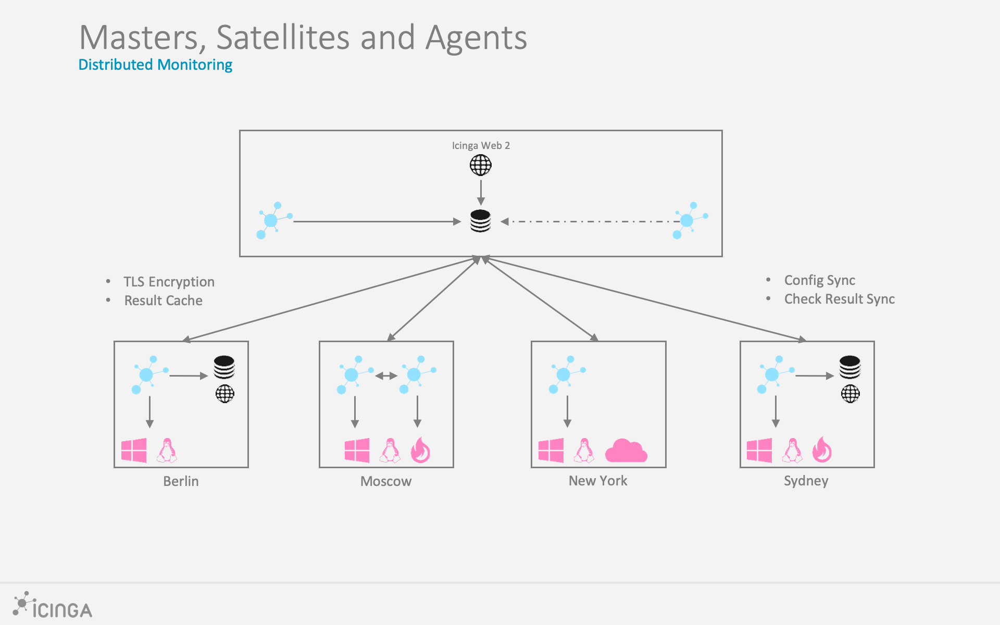

# About Icinga 2 

## What is Icinga 2?  

[Icinga](https://icinga.com/products/) is a monitoring system which checks
the availability of your network resources, notifies users of outages, and generates
performance data for reporting.

Scalable and extensible, Icinga can monitor large, complex environments across
multiple locations. This includes your data center as well as your private, public, or hybrid clouds.

Icinga 2 is the monitoring server and requires [Icinga Web 2](https://icinga.com/products/)
on top in your Icinga Stack. The [configuration](https://icinga.com/products/configuration/)
can be easily managed with either the [Icinga Director](https://icinga.com/docs/director/latest/),
config management tools or plain text within the [Icinga DSL](04-configuration.md#configuration).

## Start with Icinga 

* [Installation](02-installation.md#installation)
* [Monitoring Basics](03-monitoring-basics.md#monitoring-basics)
* [Configuration](04-configuration.md#configuration)
* [Distributed Monitoring](06-distributed-monitoring.md#distributed-monitoring)
* [Addons, Integrations and Features](13-addons.md#addons)
* [Troubleshooting](15-troubleshooting.md#troubleshooting)
* [Upgrading](16-upgrading-icinga-2.md#upgrading-icinga-2)

Once Icinga Server and Web are running in your distributed environment,
make sure to check out the many [Icinga modules](https://icinga.com/docs/)
for even better monitoring.

## What's New 

You can follow the development and release milestones on [GitHub](https://github.com/icinga/icinga2/issues).
Please follow our release announcements on [icinga.com](https://icinga.com/blog/) too.

## Support 

Check the project website at [icinga.com](https://icinga.com) for status updates. Join the
[community channels](https://icinga.com/community/) for questions
or get in touch for [professional support](https://icinga.com/subscription/).

## Contribute  

There are many ways to contribute to Icinga -- whether it be sending patches,
testing, reporting bugs or reviewing and updating the documentation. Every
contribution is appreciated!

Please continue reading in the [Contributing chapter](https://github.com/Icinga/icinga2/blob/master/CONTRIBUTING.md).

### Security Issues 

For reporting security issues please visit [this page](https://icinga.com/contact/security/).

### Icinga 2 Development 

The Git repository is located on [GitHub](https://github.com/Icinga/icinga2).

Icinga 2 is written in C++ and can be built on Linux/Unix and Windows.
Read more about development builds in the [development chapter](21-development.md#development).

## License 

Icinga 2 and the Icinga 2 documentation are licensed under the terms of the GNU
General Public License Version 2. You will find a copy of this license in the
LICENSE file included in the source package.
