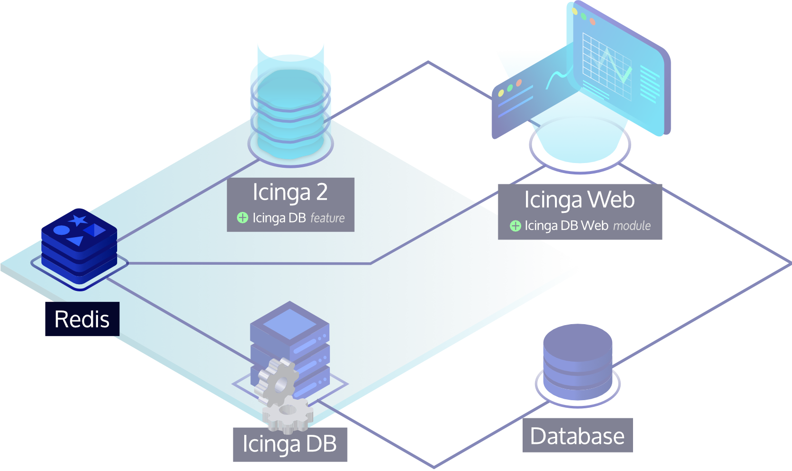
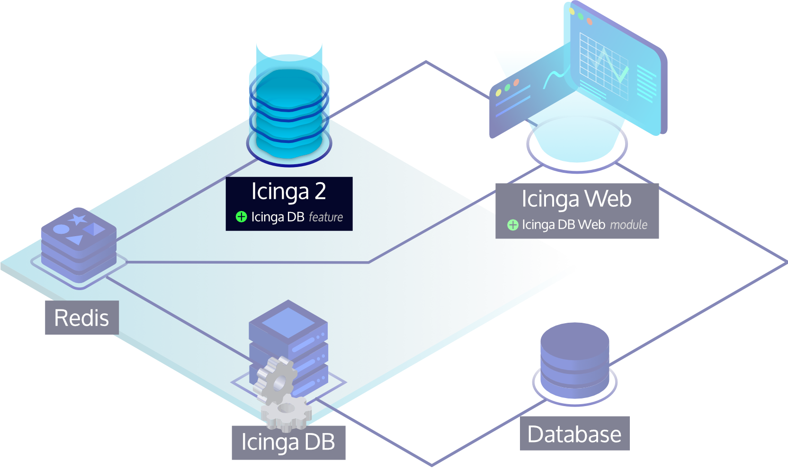
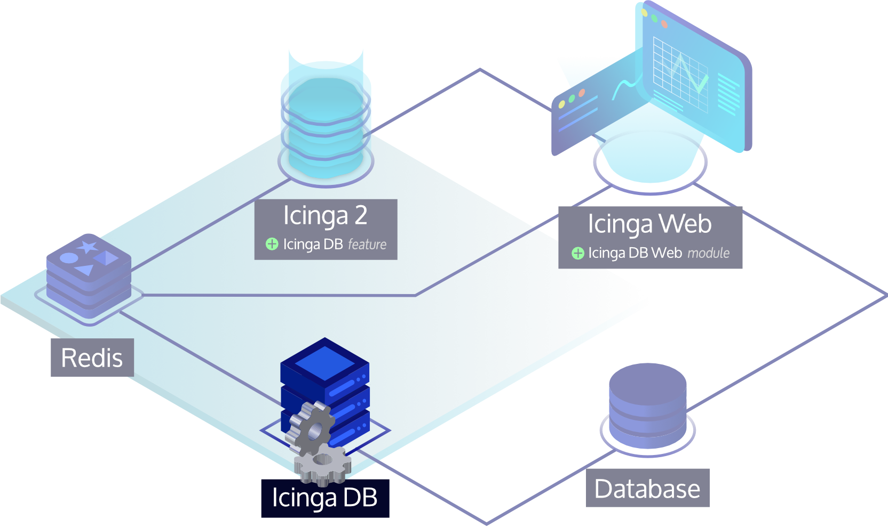

<!--  -->
# Installation <a id="installation"></a>

This tutorial is a step-by-step introduction to install Icinga 2.
It assumes that you are familiar with the operating system you're using to install Icinga 2.

Please follow the steps listed for your operating system. Packages for distributions other than the ones
listed here may also be available. Please refer to [icinga.com/get-started/download](https://icinga.com/get-started/download/#community)
for a full list of available community repositories.

## Upgrade <a id="upgrade"></a>

In case you are upgrading an existing setup, please ensure to
follow the [upgrade documentation](16-upgrading-icinga-2.md#upgrading-icinga-2).
<!--  -->

## Add Icinga Package Repository <a id="add-icinga-package-repository"></a>

We recommend using our official repositories. Here's how to add it to your system:

<!--  -->

### Debian Repository <a id="debian-repository"></a>

```bash
apt-get update
apt-get -y install apt-transport-https wget gnupg

wget -O - https://packages.icinga.com/icinga.key | gpg --dearmor -o /usr/share/keyrings/icinga-archive-keyring.gpg

DIST=$(awk -F"[)(]+" '/VERSION=/ {print $2}' /etc/os-release); \
 echo "deb [signed-by=/usr/share/keyrings/icinga-archive-keyring.gpg] https://packages.icinga.com/debian icinga-${DIST} main" > \
 /etc/apt/sources.list.d/${DIST}-icinga.list
 echo "deb-src [signed-by=/usr/share/keyrings/icinga-archive-keyring.gpg] https://packages.icinga.com/debian icinga-${DIST} main" >> \
 /etc/apt/sources.list.d/${DIST}-icinga.list

apt-get update
```

#### Debian Backports Repository <a id="debian-backports-repository"></a>

This repository is required for Debian Stretch since Icinga v2.11.

Debian Stretch:

```bash
DIST=$(awk -F"[)(]+" '/VERSION=/ {print $2}' /etc/os-release); \
 echo "deb https://deb.debian.org/debian ${DIST}-backports main" > \
 /etc/apt/sources.list.d/${DIST}-backports.list

apt-get update
```

<!--  -->

<!--  -->
### Ubuntu Repository <a id="ubuntu-repository"></a>

```bash
apt-get update
apt-get -y install apt-transport-https wget gnupg

wget -O - https://packages.icinga.com/icinga.key | gpg --dearmor -o /usr/share/keyrings/icinga-archive-keyring.gpg

. /etc/os-release; if [ ! -z ${UBUNTU_CODENAME+x} ]; then DIST="${UBUNTU_CODENAME}"; else DIST="$(lsb_release -c| awk '{print $2}')"; fi; \
 echo "deb [signed-by=/usr/share/keyrings/icinga-archive-keyring.gpg] https://packages.icinga.com/ubuntu icinga-${DIST} main" > \
 /etc/apt/sources.list.d/${DIST}-icinga.list
 echo "deb-src [signed-by=/usr/share/keyrings/icinga-archive-keyring.gpg] https://packages.icinga.com/ubuntu icinga-${DIST} main" >> \
 /etc/apt/sources.list.d/${DIST}-icinga.list

apt-get update
```
<!--  -->

<!--  -->
### Raspbian Repository <a id="raspbian-repository"></a>

```bash
apt-get update
apt-get -y install apt-transport-https wget gnupg

wget -O - https://packages.icinga.com/icinga.key | gpg --dearmor -o /usr/share/keyrings/icinga-archive-keyring.gpg

DIST=$(awk -F"[)(]+" '/VERSION=/ {print $2}' /etc/os-release); \
 echo "deb [signed-by=/usr/share/keyrings/icinga-archive-keyring.gpg] https://packages.icinga.com/raspbian icinga-${DIST} main" > \
 /etc/apt/sources.list.d/icinga.list
 echo "deb-src [signed-by=/usr/share/keyrings/icinga-archive-keyring.gpg] https://packages.icinga.com/raspbian icinga-${DIST} main" >> \
 /etc/apt/sources.list.d/icinga.list

apt-get update
```
<!--  -->

<!--  -->
### CentOS Repository <a id="centos-repository"></a>

```bash
rpm --import https://packages.icinga.com/icinga.key
wget https://packages.icinga.com/centos/ICINGA-release.repo -O /etc/yum.repos.d/ICINGA-release.repo
```

The packages for CentOS depend on other packages which are distributed
as part of the [EPEL repository](https://fedoraproject.org/wiki/EPEL):

```bash
yum install epel-release
```
<!--  -->

<!--  -->
### RHEL Repository <a id="rhel-repository"></a>

!!! info

    A paid repository subscription is required for RHEL repositories. Get more information on
    [icinga.com/subscription](https://icinga.com/subscription)

    Don't forget to fill in the username and password section with your credentials in the local .repo file.

```bash
rpm --import https://packages.icinga.com/icinga.key
wget https://packages.icinga.com/subscription/rhel/ICINGA-release.repo -O /etc/yum.repos.d/ICINGA-release.repo
```

If you are using RHEL you need to additionally enable the `optional` and `codeready-builder`
repository before installing the [EPEL rpm package](https://fedoraproject.org/wiki/EPEL#How_can_I_use_these_extra_packages.3F).

#### RHEL 8

```bash
ARCH=$( /bin/arch )

subscription-manager repos --enable rhel-8-server-optional-rpms
subscription-manager repos --enable "codeready-builder-for-rhel-8-${ARCH}-rpms"

dnf install https://dl.fedoraproject.org/pub/epel/epel-release-latest-8.noarch.rpm
```

#### RHEL 7

```bash
subscription-manager repos --enable rhel-7-server-optional-rpms

yum install https://dl.fedoraproject.org/pub/epel/epel-release-latest-7.noarch.rpm
```
<!--  -->


<!--  -->
### Fedora Repository <a id="fedora-repository"></a>

```bash
rpm --import https://packages.icinga.com/icinga.key
dnf install https://packages.icinga.com/fedora/icinga-rpm-release-$(. /etc/os-release; echo "$VERSION_ID")-latest.noarch.rpm
```
<!--  -->

<!--  -->
### SLES Repository <a id="sles-repository"></a>

!!! info

    A paid repository subscription is required for SLES repositories. Get more information on
    [icinga.com/subscription](https://icinga.com/subscription)

    Don't forget to fill in the username and password section with your credentials in the local .repo file.

```bash
rpm --import https://packages.icinga.com/icinga.key

zypper ar https://packages.icinga.com/subscription/sles/ICINGA-release.repo
zypper ref
```

You need to additionally add the `PackageHub` repository to fulfill dependencies:

```bash
source /etc/os-release

SUSEConnect -p PackageHub/$VERSION_ID/x86_64
```
<!--  -->

<!--  -->
### openSUSE Repository <a id="opensuse-repository"></a>

```bash
rpm --import https://packages.icinga.com/icinga.key

zypper ar https://packages.icinga.com/openSUSE/ICINGA-release.repo
zypper ref
```

You need to additionally add the `server:monitoring` repository to fulfill dependencies:

```bash
zypper ar https://download.opensuse.org/repositories/server:/monitoring/15.3/server:monitoring.repo
```
<!--  -->

<!--  -->
### Amazon Linux 2 Repository <a id="amazon-linux-2-repository"></a>

!!! info

    A paid repository subscription is required for Amazon Linux repositories. Get more information on
    [icinga.com/subscription](https://icinga.com/subscription)

    Don't forget to fill in the username and password section with your credentials in the local .repo file.

```bash
rpm --import https://packages.icinga.com/icinga.key
wget https://packages.icinga.com/subscription/amazon/ICINGA-release.repo -O /etc/yum.repos.d/ICINGA-release.repo
```

The packages for Amazon Linux 2 depend on other packages which are distributed
as part of the [EPEL repository](https://fedoraproject.org/wiki/EPEL).

```bash
yum install epel-release
```
<!--  -->

<!--  -->
### Icinga for Windows Repository <a id="icinga-for-windows-repository"></a>
[Icinga for Windows](https://icinga.com/docs/icinga-for-windows/latest/doc/000-Introduction/) is the recommended
way to install and update Icinga 2 on Windows.

We provide a dedicated repository for Windows to simplify the installation. Please refer to the official
[Icinga for Windows installation docs](https://icinga.com/docs/icinga-for-windows/latest/doc/110-Installation/01-Getting-Started/)
<!--  -->

## Install Icinga 2 <a id="installing-icinga2"></a>

You can install Icinga 2 by using your distribution's package manager
to install the `icinga2` package. The following commands must be executed
with `root` permissions unless noted otherwise.

<!--  -->
!!! tip

    If you have [SELinux](22-selinux.md) enabled, the package `icinga2-selinux` is also required.
<!--  -->

<!--  -->
<!--  -->
#### Debian / Ubuntu / Raspbian
<!--  -->
```bash
apt-get install icinga2
```
<!--  -->

<!--  -->
<!--  -->
#### CentOS
<!--  -->
!!! info

    Note that installing Icinga 2 is only supported on CentOS 7 as CentOS 8 is EOL.

```bash
yum install icinga2
systemctl enable icinga2
systemctl start icinga2
```
<!--  -->

<!--  -->
#### RHEL 8

```bash
dnf install icinga2
systemctl enable icinga2
systemctl start icinga2
```

#### RHEL 7

```bash
yum install icinga2
systemctl enable icinga2
systemctl start icinga2
```
<!--  -->

<!--  -->
<!--  -->
#### Fedora
<!--  -->
```bash
dnf install icinga2
systemctl enable icinga2
systemctl start icinga2
```
<!--  -->

<!--  -->
<!--  -->
#### SLES / openSUSE
<!--  -->
```bash
zypper install icinga2
```
<!--  -->

<!--  -->
<!--  -->
#### Amazon Linux 2
<!--  -->
```bash
yum install icinga2
systemctl enable icinga2
systemctl start icinga2
```
<!--  -->

### Systemd Service <a id="systemd-service"></a>

The majority of supported distributions use systemd. The Icinga 2 packages automatically install the necessary
systemd unit files.

If you're stuck with configuration errors, you can manually invoke the
[configuration validation](11-cli-commands.md#config-validation).

```bash
icinga2 daemon -C
```

!!! tip

    If you are running into fork errors with systemd enabled distributions,
    please check the [troubleshooting chapter](15-troubleshooting.md#check-fork-errors).


## Set up Check Plugins <a id="setting-up-check-plugins"></a>

Without plugins Icinga 2 does not know how to check external services. The
[Monitoring Plugins Project](https://www.monitoring-plugins.org/) provides
an extensive set of plugins which can be used with Icinga 2 to check whether
services are working properly.

These plugins are required to make the [example configuration](04-configuration.md#configuring-icinga2-overview)
work out-of-the-box.

Depending on which directory your plugins are installed into you may need to
update the global `PluginDir` constant in your [Icinga 2 configuration](04-configuration.md#constants-conf).
This constant is used by the check command definitions contained in the Icinga Template Library
to determine where to find the plugin binaries.

!!! tip

    Please refer to the [service monitoring](05-service-monitoring.md#service-monitoring-plugins) chapter for details about how to integrate
    additional check plugins into your Icinga 2 setup.


<!--  -->
<!--  -->
#### Debian / Ubuntu / Raspbian
<!--  -->
```bash
apt-get install monitoring-plugins
```
<!--  -->

<!--  -->
<!--  -->
#### CentOS
<!--  -->
The packages for CentOS depend on other packages which are distributed as part of the EPEL repository.

```bash
yum install nagios-plugins-all
```
<!--  -->

<!--  -->
<!--  -->
#### RHEL
<!--  -->
The packages for RHEL depend on other packages which are distributed as part of the EPEL repository.

#### RHEL 8

```bash
dnf install nagios-plugins-all
```

#### RHEL 7

```bash
yum install nagios-plugins-all
```
<!--  -->

<!--  -->
<!--  -->
#### Fedora
<!--  -->
```bash
dnf install nagios-plugins-all
```
<!--  -->

<!--  -->
<!--  -->
#### SLES / openSUSE
<!--  -->
The packages depend on other packages which are distributed
as part of the [server:monitoring repository](https://build.opensuse.org/project/repositories/server:monitoring).
Please make sure to enable this repository beforehand.

```bash
zypper install monitoring-plugins
```
<!--  -->

<!--  -->
<!--  -->
#### Amazon Linux 2
<!--  -->
The packages for Amazon Linux 2 depend on other packages which are distributed as part of the EPEL repository.

```bash
amazon-linux-extras install epel

yum install nagios-plugins-all
```
<!--  -->

## Set up Icinga 2 API <a id="set-up-icinga2-api"></a>

Almost every Icinga 2 setup requires the Icinga 2 API as Icinga Web connects to it, Icinga DB requires it,
and it enables cluster communication functionality for highly available and distributed setups.

!!! info

    If you set up a highly available and/or distributed Icinga monitoring environment, please read the
    [Distributed Monitoring](06-distributed-monitoring.md#distributed-monitoring) chapter as
    the commands to set up the API are different from setting up a single node setup.

See the [API](12-icinga2-api.md#icinga2-api-setup) chapter for details,
or follow the steps below to set up the API quickly:

Run the following command to:

* enable the `api` feature,
* set up certificates, and
* add the API user `root` with an auto-generated password in the configuration file
  `/etc/icinga2/conf.d/api-users.conf`.

```bash
icinga2 api setup
```

Restart Icinga 2 for these changes to take effect.

```bash
systemctl restart icinga2
```

<!--  -->
## Set up Icinga DB <a id="set-up-icinga-db"></a>

Icinga DB is a set of components for publishing, synchronizing and
visualizing monitoring data in the Icinga ecosystem, consisting of:

* Icinga 2 with its `icingadb` feature enabled,
  responsible for publishing monitoring data to a Redis server, i.e. configuration and its runtime updates,
  check results, state changes, downtimes, acknowledgements, notifications, and other events such as flapping
* The [Icinga DB daemon](https://icinga.com/docs/icinga-db),
  which synchronizes the data between the Redis server and a database
* And Icinga Web with the
  [Icinga DB Web](https://icinga.com/docs/icinga-db-web) module enabled,
  which connects to both Redis and the database to display and work with the most up-to-date data


!!! info

    Setting up Icinga 2's Icinga DB feature is only required for Icinga 2 master nodes or single-node setups.

### Set up Redis Server <a id="set-up-redis-server"></a>

A Redis server from version 6.2 is required.

!!! info

    This guide sets up the `icingadb-redis` package provided by Icinga,
    which ships a current Redis Server version and is preconfigured for the Icinga DB components.
    Using own Redis server setups is supported as long as the version requirements are met.



!!! tip

    Although the Redis server can run anywhere in an Icinga environment,
    we recommend to install it where the corresponding Icinga 2 node is running to
    keep latency between the components low.

#### Install Icinga DB Redis Package <a id="install-icinga-db-redis-package"></a>

Use your distribution's package manager to install the `icingadb-redis` package as follows:

<!--  -->
<!--  -->
##### Amazon Linux 2
<!--  -->
```bash
yum install icingadb-redis
```
<!--  -->

<!--  -->
<!--  -->
##### CentOS
<!--  -->

!!! info

    Note that installing Icinga DB Redis is only supported on CentOS 7 as CentOS 8 is EOL.

```bash
yum install icingadb-redis
```
<!--  -->

<!--  -->
<!--  -->
##### Debian / Ubuntu
<!--  -->
```bash
apt-get install icingadb-redis
```
<!--  -->

<!--  -->
##### RHEL 8 or Later

```bash
dnf install icingadb-redis
```

##### RHEL 7

```bash
yum install icingadb-redis
```
<!--  -->

<!--  -->
<!--  -->
##### SLES
<!--  -->
```bash
zypper install icingadb-redis
```
<!--  -->

#### Run Icinga DB Redis <a id="run-icinga-db-redis"></a>

The `icingadb-redis` package automatically installs the necessary systemd unit files to run Icinga DB Redis.
Please run the following command to enable and start its service:

```bash
systemctl enable --now icingadb-redis
```

#### Enable Remote Redis Connections <a id="enable-remote-redis-connections"></a>

By default, `icingadb-redis` only listens on `127.0.0.1`. If Icinga Web or Icinga 2 is running on another node,
remote access to the Redis server must be allowed. This requires the following directives to be set in
the `/etc/icingadb-redis/icingadb-redis.conf` configuration file:

* Set `protected-mode` to `no`, i.e. `protected-mode no`
* Set `bind` to the desired binding interface or bind all interfaces, e.g. `bind 0.0.0.0`

!!! warning

    By default, Redis has no authentication preventing others from accessing it.
    When opening Redis to an external interface, make sure to set a password, set up appropriate firewall rules,
    or configure TLS with certificate authentication on Redis and its consumers,
    i.e. Icinga 2, Icinga DB and Icinga Web.

Restart Icinga DB Redis for these changes to take effect:

```bash
systemctl restart icingadb-redis
```

### Enable Icinga DB Feature <a id="enable-icinga-db-feature"></a>

With the [Icinga DB feature](14-features.md#icinga-db) enabled,
Icinga 2 publishes all of its monitoring data to the Redis server. This includes configuration and
its runtime updates via the Icinga 2 API, check results, state changes, downtimes, acknowledgments, notifications and
other events such as flapping.



Icinga 2 installs the feature configuration file to `/etc/icinga2/features-available/icingadb.conf`,
pre-configured for a local setup.
Update this file in case Redis is running on a different host or to set credentials.
All available settings are explained in the [Icinga DB object](09-object-types.md#icingadb) chapter.

!!! important

    For single-node and high-availability setups, please read the note about the
    [environment ID](https://icinga.com/docs/icinga-db/latest/doc/05-Distributed-Setups/#environment-id),
    which is common to all Icinga DB components and generated by the Icinga DB feature.

To enable the `icingadb` feature use the following command:

```bash
icinga2 feature enable icingadb
```

Restart Icinga 2 for these changes to take effect:

```bash
systemctl restart icinga2
```

### Install Icinga DB Daemon <a id="install-icinga-db-daemon"></a>

After installing Icinga 2, setting up a Redis server and enabling the `icingadb` feature,
the Icinga DB daemon that synchronizes monitoring data between the Redis server and a database is now set up.



!!! tip

    Although the Icinga DB daemon can run anywhere in an Icinga environment,
    we recommend to install it where the corresponding Icinga 2 node and Redis server is running to
    keep latency between the components low.

The Icinga DB daemon package is also included in the Icinga repository, and since it is already set up,
you have completed the instructions here and can proceed to
<!--  -->
[install the Icinga DB daemon on Amazon Linux](https://icinga.com/docs/icinga-db/latest/doc/02-Installation/01-Amazon-Linux/#installing-icinga-db-package),
<!--  -->
<!--  -->
[install the Icinga DB daemon on CentOS](https://icinga.com/docs/icinga-db/latest/doc/02-Installation/02-CentOS/#installing-icinga-db-package),
<!--  -->
<!--  -->
[install the Icinga DB daemon on Debian](https://icinga.com/docs/icinga-db/latest/doc/02-Installation/03-Debian/#installing-icinga-db-package),
<!--  -->
<!--  -->
[install the Icinga DB daemon on RHEL](https://icinga.com/docs/icinga-db/latest/doc/02-Installation/04-RHEL/#installing-icinga-db-package),
<!--  -->
<!--  -->
[install the Icinga DB daemon on SLES](https://icinga.com/docs/icinga-db/latest/doc/02-Installation/05-SLES/#installing-icinga-db-package),
<!--  -->
<!--  -->
[install the Icinga DB daemon on Ubuntu](https://icinga.com/docs/icinga-db/latest/doc/02-Installation/06-Ubuntu/#installing-icinga-db-package),
<!--  -->
which will also guide you through the setup of the database and Icinga DB Web.
<!--  -->

## Backup <a id="install-backup"></a>

Ensure to include the following in your backups:

* Configuration files in `/etc/icinga2`
* Certificate files in `/var/lib/icinga2/ca` (Master CA key pair) and `/var/lib/icinga2/certs` (node certificates)
* Runtime files in `/var/lib/icinga2`
<!--  --><!-- {# end windows else #} -->
<!--  --><!-- {# end index else #} -->
