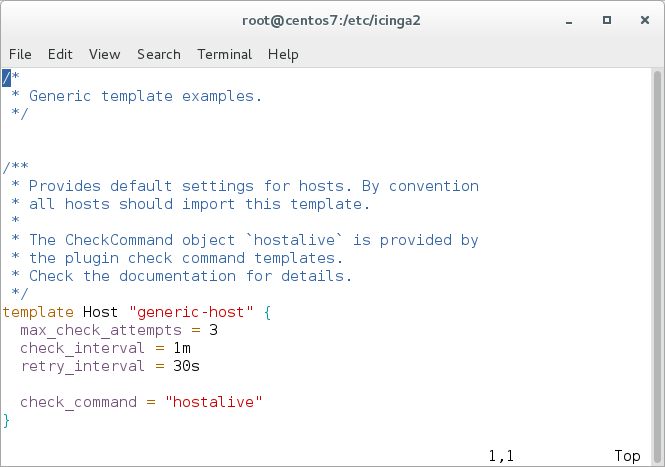
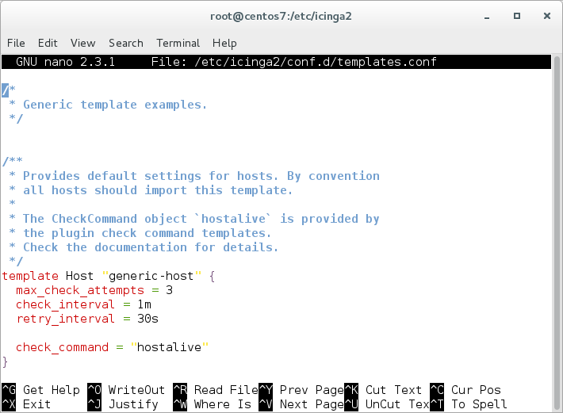

<!--  -->
# Installation <a id="installation"></a>

This tutorial is a step-by-step introduction to install Icinga 2.
It assumes that you are familiar with the operating system you're using to install Icinga 2.

Please follow the steps listed for your operating system. Packages for distributions other than the ones
listed here may also be available. Please refer to [icinga.com/get-started/download](https://icinga.com/get-started/download/#community)
for a full list of available community repositories.

## Upgrade <a id="upgrade"></a>

In case you are upgrading an existing setup, please ensure to
follow the [upgrade documentation](16-upgrading-icinga-2.md#upgrading-icinga-2).
<!--  -->

## Add Icinga Package Repository <a id="add-icinga-package-repository"></a>

We recommend using our official repositories. Here's how to add it to your system:

<!--  -->

### Debian Repository <a id="debian-repository"></a>

```bash
apt-get update
apt-get -y install apt-transport-https wget gnupg

wget -O - https://packages.icinga.com/icinga.key | apt-key add -

DIST=$(awk -F"[)(]+" '/VERSION=/ {print $2}' /etc/os-release); \
 echo "deb https://packages.icinga.com/debian icinga-${DIST} main" > \
 /etc/apt/sources.list.d/${DIST}-icinga.list
 echo "deb-src https://packages.icinga.com/debian icinga-${DIST} main" >> \
 /etc/apt/sources.list.d/${DIST}-icinga.list

apt-get update
```

#### Debian Backports Repository <a id="debian-backports-repository"></a>

This repository is required for Debian Stretch since Icinga v2.11.

Debian Stretch:

```bash
DIST=$(awk -F"[)(]+" '/VERSION=/ {print $2}' /etc/os-release); \
 echo "deb https://deb.debian.org/debian ${DIST}-backports main" > \
 /etc/apt/sources.list.d/${DIST}-backports.list

apt-get update
```

<!--  -->

<!--  -->
### Ubuntu Repository <a id="ubuntu-repository"></a>

```bash
apt-get update
apt-get -y install apt-transport-https wget gnupg

wget -O - https://packages.icinga.com/icinga.key | apt-key add -

. /etc/os-release; if [ ! -z ${UBUNTU_CODENAME+x} ]; then DIST="${UBUNTU_CODENAME}"; else DIST="$(lsb_release -c| awk '{print $2}')"; fi; \
 echo "deb https://packages.icinga.com/ubuntu icinga-${DIST} main" > \
 /etc/apt/sources.list.d/${DIST}-icinga.list
 echo "deb-src https://packages.icinga.com/ubuntu icinga-${DIST} main" >> \
 /etc/apt/sources.list.d/${DIST}-icinga.list

apt-get update
```
<!--  -->

<!--  -->
### Raspbian Repository <a id="raspbian-repository"></a>

```bash
apt-get update
apt-get -y install apt-transport-https wget gnupg

wget -O - https://packages.icinga.com/icinga.key | apt-key add -

DIST=$(awk -F"[)(]+" '/VERSION=/ {print $2}' /etc/os-release); \
 echo "deb https://packages.icinga.com/raspbian icinga-${DIST} main" > \
 /etc/apt/sources.list.d/icinga.list
 echo "deb-src https://packages.icinga.com/raspbian icinga-${DIST} main" >> \
 /etc/apt/sources.list.d/icinga.list

apt-get update
```
<!--  -->

<!--  -->
### CentOS Repository <a id="centos-repository"></a>

```bash
rpm --import https://packages.icinga.com/icinga.key
wget https://packages.icinga.com/centos/ICINGA-release.repo -O /etc/yum.repos.d/ICINGA-release.repo
```

The packages for CentOS depend on other packages which are distributed
as part of the [EPEL repository](https://fedoraproject.org/wiki/EPEL).

CentOS 8 additionally needs the PowerTools repository for EPEL:

```bash
dnf install 'dnf-command(config-manager)'
dnf config-manager --set-enabled powertools

dnf install epel-release
```

For CentOS 7 run:

```bash
yum install epel-release
```
<!--  -->

<!--  -->
### RHEL Repository <a id="rhel-repository"></a>

!!! info

    A paid repository subscription is required for RHEL repositories. Get more information on
    [icinga.com/subscription](https://icinga.com/subscription)

    Don't forget to fill in the username and password section with your credentials in the local .repo file.

```bash
rpm --import https://packages.icinga.com/icinga.key
wget https://packages.icinga.com/subscription/rhel/ICINGA-release.repo -O /etc/yum.repos.d/ICINGA-release.repo
```

If you are using RHEL you need to additionally enable the `optional` and `codeready-builder`
repository before installing the [EPEL rpm package](https://fedoraproject.org/wiki/EPEL#How_can_I_use_these_extra_packages.3F).

#### RHEL 8

```bash
ARCH=$( /bin/arch )

subscription-manager repos --enable rhel-8-server-optional-rpms
subscription-manager repos --enable "codeready-builder-for-rhel-8-${ARCH}-rpms"

dnf install https://dl.fedoraproject.org/pub/epel/epel-release-latest-8.noarch.rpm
```

#### RHEL 7

```bash
subscription-manager repos --enable rhel-7-server-optional-rpms

yum install https://dl.fedoraproject.org/pub/epel/epel-release-latest-7.noarch.rpm
```
<!--  -->


<!--  -->
### Fedora Repository <a id="fedora-repository"></a>

```bash
rpm --import https://packages.icinga.com/icinga.key
dnf install https://packages.icinga.com/fedora/icinga-rpm-release-$(. /etc/os-release; echo "$VERSION_ID")-latest.noarch.rpm
```
<!--  -->

<!--  -->
### SLES Repository <a id="sles-repository"></a>

!!! info

    A paid repository subscription is required for SLES repositories. Get more information on
    [icinga.com/subscription](https://icinga.com/subscription)

    Don't forget to fill in the username and password section with your credentials in the local .repo file.

```bash
rpm --import https://packages.icinga.com/icinga.key

zypper ar https://packages.icinga.com/subscription/sles/ICINGA-release.repo
zypper ref
```

You need to additionally add the `PackageHub` repository to fulfill dependencies:

```bash
source /etc/os-release

SUSEConnect -p PackageHub/$VERSION_ID/x86_64
```
<!--  -->

<!--  -->
### openSUSE Repository <a id="opensuse-repository"></a>

```bash
rpm --import https://packages.icinga.com/icinga.key

zypper ar https://packages.icinga.com/openSUSE/ICINGA-release.repo
zypper ref
```

You need to additionally add the `server:monitoring` repository to fulfill dependencies:

```bash
zypper ar https://download.opensuse.org/repositories/server:/monitoring/15.3/server:monitoring.repo
```
<!--  -->

<!--  -->
### Amazon Linux 2 Repository <a id="amazon-linux-2-repository"></a>

!!! info

    A paid repository subscription is required for Amazon Linux repositories. Get more information on
    [icinga.com/subscription](https://icinga.com/subscription)

    Don't forget to fill in the username and password section with your credentials in the local .repo file.

```bash
rpm --import https://packages.icinga.com/icinga.key
wget https://packages.icinga.com/subscription/amazon/ICINGA-release.repo -O /etc/yum.repos.d/ICINGA-release.repo
```

The packages for Amazon Linux 2 depend on other packages which are distributed
as part of the [EPEL repository](https://fedoraproject.org/wiki/EPEL).

```bash
yum install epel-release
```
<!--  -->

<!--  -->
### Icinga for Windows Repository <a id="icinga-for-windows-repository"></a>
[Icinga for Windows](https://icinga.com/docs/icinga-for-windows/latest/doc/000-Introduction/) is the recommended
way to install and update Icinga 2 on Windows.

We provide a dedicated repository for Windows to simplify the installation. Please refer to the official
[Icinga for Windows installation docs](https://icinga.com/docs/icinga-for-windows/latest/doc/110-Installation/01-Getting-Started/)
<!--  -->

## Install Icinga 2 <a id="installing-icinga2"></a>

You can install Icinga 2 by using your distribution's package manager
to install the `icinga2` package. The following commands must be executed
with `root` permissions unless noted otherwise.

<!--  -->
!!! tip

    If you have [SELinux](22-selinux.md) enabled, the package `icinga2-selinux` is also required.
<!--  -->

<!--  -->
<!--  -->
#### Debian / Ubuntu / Raspbian
<!--  -->
```bash
apt-get install icinga2
```
<!--  -->

<!--  -->
#### CentOS 8

```bash
dnf install icinga2
systemctl enable icinga2
systemctl start icinga2
```

#### CentOS 7

```bash
yum install icinga2
systemctl enable icinga2
systemctl start icinga2
```
<!--  -->

<!--  -->
#### RHEL 8

```bash
dnf install icinga2
systemctl enable icinga2
systemctl start icinga2
```

#### RHEL 7

```bash
yum install icinga2
systemctl enable icinga2
systemctl start icinga2
```
<!--  -->

<!--  -->
<!--  -->
#### Fedora
<!--  -->
```bash
dnf install icinga2
systemctl enable icinga2
systemctl start icinga2
```
<!--  -->

<!--  -->
<!--  -->
#### SLES / openSUSE
<!--  -->
```bash
zypper install icinga2
```
<!--  -->

<!--  -->
<!--  -->
#### Amazon Linux 2
<!--  -->
```bash
yum install icinga2
systemctl enable icinga2
systemctl start icinga2
```
<!--  -->

### Systemd Service <a id="systemd-service"></a>

The majority of supported distributions use systemd. The Icinga 2 packages automatically install the necessary
systemd unit files.

If you're stuck with configuration errors, you can manually invoke the
[configuration validation](11-cli-commands.md#config-validation).

```bash
icinga2 daemon -C
```

!!! tip

    If you are running into fork errors with systemd enabled distributions,
    please check the [troubleshooting chapter](15-troubleshooting.md#check-fork-errors).


## Set up Check Plugins <a id="setting-up-check-plugins"></a>

Without plugins Icinga 2 does not know how to check external services. The
[Monitoring Plugins Project](https://www.monitoring-plugins.org/) provides
an extensive set of plugins which can be used with Icinga 2 to check whether
services are working properly.

These plugins are required to make the [example configuration](04-configuration.md#configuring-icinga2-overview)
work out-of-the-box.

Depending on which directory your plugins are installed into you may need to
update the global `PluginDir` constant in your [Icinga 2 configuration](04-configuration.md#constants-conf).
This constant is used by the check command definitions contained in the Icinga Template Library
to determine where to find the plugin binaries.

!!! tip

    Please refer to the [service monitoring](05-service-monitoring.md#service-monitoring-plugins) chapter for details about how to integrate
    additional check plugins into your Icinga 2 setup.


<!--  -->
<!--  -->
#### Debian / Ubuntu / Raspbian
<!--  -->
```bash
apt-get install monitoring-plugins
```
<!--  -->

<!--  -->
<!--  -->
#### CentOS
<!--  -->
The packages for CentOS depend on other packages which are distributed as part of the EPEL repository.

#### CentOS 8

```bash
dnf install nagios-plugins-all
```

#### CentOS 7

```bash
yum install nagios-plugins-all
```
<!--  -->

<!--  -->
<!--  -->
#### RHEL
<!--  -->
The packages for RHEL depend on other packages which are distributed as part of the EPEL repository.

#### RHEL 8

```bash
dnf install nagios-plugins-all
```

#### RHEL 7

```bash
yum install nagios-plugins-all
```
<!--  -->

<!--  -->
<!--  -->
#### Fedora
<!--  -->
```bash
dnf install nagios-plugins-all
```
<!--  -->

<!--  -->
<!--  -->
#### SLES / openSUSE
<!--  -->
The packages depend on other packages which are distributed
as part of the [server:monitoring repository](https://build.opensuse.org/project/repositories/server:monitoring).
Please make sure to enable this repository beforehand.

```bash
zypper install monitoring-plugins
```
<!--  -->

<!--  -->
<!--  -->
#### Amazon Linux 2
<!--  -->
The packages for Amazon Linux 2 depend on other packages which are distributed as part of the EPEL repository.

```bash
amazon-linux-extras install epel

yum install nagios-plugins-all
```
<!--  -->

## Set up Icinga 2 REST API <a id="setting-up-rest-api"></a>

Icinga Web 2 requires the [REST API](12-icinga2-api.md#icinga2-api-setup) to send actions
(reschedule check, etc.) and query object details.

You can run the CLI command `icinga2 api setup` to enable the
`api` [feature](11-cli-commands.md#enable-features) and set up
certificates as well as a new API user `root` with an auto-generated password in the
`/etc/icinga2/conf.d/api-users.conf` configuration file:

```bash
icinga2 api setup
```

Edit the `api-users.conf` file and add a new ApiUser object. Specify the [permissions](12-icinga2-api.md#icinga2-api-permissions)
attribute with minimal permissions required by Icinga Web 2.

```
object ApiUser "icingaweb2" {
  password = "Wijsn8Z9eRs5E25d"
  permissions = [ "status/query", "actions/*", "objects/modify/*", "objects/query/*" ]
}
```

Restart Icinga 2 to activate the configuration.

```bash
systemctl restart icinga2
```

## Set up Database <a id="set-up-database"></a>

The IDO (Icinga Data Output) feature for Icinga 2 stores all configuration and status information into a database.
Icinga Web 2 connects to the IDO database to visualize the data properly. You can either use a
[MySQL](#ido-with-mysql) or [PostgreSQL](#ido-with-postgresql) database.

We recommend to install and configure the IDO feature before continuing with the installation
of Icinga Web 2.

!!! note

    We're currently working on a new data backend called Icinga DB. If you want to try the latest
    release candidate skip to the [Icinga DB Chapter](#icingadb). Please keep in mind, that this version
    is not ready for use in production and currently only supports MySQL.

### IDO with MySQL <a id="ido-with-mysql"></a>

#### Install MySQL Server <a id="installing-database-mysql-server"></a>

<!--  -->
<!--  -->
#### Debian / Ubuntu
<!--  -->
```bash
apt-get install mariadb-server mariadb-client

mysql_secure_installation
```
<!--  -->

<!--  -->
<!--  -->
#### CentOS
<!--  -->

#### CentOS 8
```bash
dnf install mariadb-server mariadb
systemctl enable mariadb
systemctl start mariadb
mysql_secure_installation
```

#### CentOS 7
```bash
yum install mariadb-server mariadb
systemctl enable mariadb
systemctl start mariadb
mysql_secure_installation
```
<!--  -->

<!--  -->
<!--  -->
#### RHEL
<!--  -->
#### RHEL 8
```bash
dnf install mariadb-server mariadb
systemctl enable mariadb
systemctl start mariadb
mysql_secure_installation
```

#### RHEL 7
```bash
yum install mariadb-server mariadb
systemctl enable mariadb
systemctl start mariadb
mysql_secure_installation
```
<!--  -->

<!--  -->
<!--  -->
#### SLES / openSUSE
<!--  -->
```bash
zypper install mariadb mariadb-client
systemctl enable mariadb
systemctl start mariadb
mysql_secure_installation
```
<!--  -->

<!--  -->
<!--  -->
#### Amazon Linux 2
<!--  -->
```bash
yum install mariadb-server mariadb
systemctl enable mariadb
systemctl start mariadb
mysql_secure_installation
```
<!--  -->

#### Install IDO Feature <a id="installing-database-mysql-modules"></a>

The next step is to install the `icinga2-ido-mysql` package using your
distribution's package manager.

<!--  -->
<!--  -->
#### Debian / Ubuntu
<!--  -->
```bash
apt-get install icinga2-ido-mysql
```

!!! note

    The packages provide a database configuration wizard by
    default. You can skip the automated setup and install/upgrade the
    database manually if you prefer.
<!--  -->

<!--  -->
<!--  -->
#### CentOS
<!--  -->

#### CentOS 8
```bash
dnf install icinga2-ido-mysql
```

#### CentOS 7
```bash
yum install icinga2-ido-mysql
```
<!--  -->

<!--  -->
<!--  -->
#### RHEL
<!--  -->
#### RHEL 8
```bash
dnf install icinga2-ido-mysql
```

#### RHEL 7
```bash
yum install icinga2-ido-mysql
```
<!--  -->

<!--  -->
<!--  -->
#### SLES / openSUSE
<!--  -->
```bash
zypper install icinga2-ido-mysql
```
<!--  -->

<!--  -->
<!--  -->
#### Amazon Linux 2
<!--  -->
```bash
yum install icinga2-ido-mysql
```
<!--  -->

#### Set up MySQL database <a id="setting-up-mysql-db"></a>

Set up a MySQL database for Icinga 2:

```bash
# mysql -u root -p

CREATE DATABASE icinga;
GRANT ALTER, CREATE, SELECT, INSERT, UPDATE, DELETE, DROP, CREATE VIEW, INDEX, EXECUTE ON icinga.* TO 'icinga'@'localhost' IDENTIFIED BY 'icinga';
quit
```

Please note that the example above uses the very simple password 'icinga' (in `IDENTIFIED BY 'icinga'`).
Please choose a better password for your installation.

After creating the database you can import the Icinga 2 IDO schema using the
following command. Enter the icinga password into the prompt when asked.

```bash
mysql -u icinga -p icinga < /usr/share/icinga2-ido-mysql/schema/mysql.sql
```

#### Enable the IDO MySQL feature <a id="enable-ido-mysql"></a>

The package provides a new configuration file that is installed in
`/etc/icinga2/features-available/ido-mysql.conf`. You can update
the database credentials in this file.

All available attributes are explained in the
[IdoMysqlConnection object](09-object-types.md#objecttype-idomysqlconnection)
chapter.

Enable the `ido-mysql` feature configuration file using the `icinga2` command:

```bash
# icinga2 feature enable ido-mysql
Module 'ido-mysql' was enabled.
Make sure to restart Icinga 2 for these changes to take effect.
```

Restart Icinga 2.

```bash
systemctl restart icinga2
```

### IDO with PostgreSQL <a id="ido-with-postgresql"></a>

#### Install PostgreSQL server <a id="installing-database-postgresql-server"></a>

<!--  -->
<!--  -->
#### Debian / Ubuntu
<!--  -->
```bash
apt-get install postgresql
```
<!--  -->

<!--  -->
<!--  -->
#### CentOS
<!--  -->

#### CentOS 8
```bash
dnf install postgresql-server postgresql
postgresql-setup initdb
systemctl enable postgresql
systemctl start postgresql
```

#### CentOS 7
```bash
yum install postgresql-server postgresql
postgresql-setup initdb
systemctl enable postgresql
systemctl start postgresql
```
<!--  -->

<!--  -->
<!--  -->
#### RHEL
<!--  -->
#### RHEL 8
```bash
dnf install postgresql-server postgresql
postgresql-setup initdb
systemctl enable postgresql
systemctl start postgresql
```

#### RHEL 7
```bash
yum install postgresql-server postgresql
postgresql-setup initdb
systemctl enable postgresql
systemctl start postgresql
```
<!--  -->

<!--  -->
<!--  -->
#### SLES / openSUSE
<!--  -->
```bash
zypper install postgresql postgresql-server
chkconfig postgresql on
service postgresql initdb
service postgresql start
```
<!--  -->

<!--  -->
<!--  -->
#### Amazon Linux 2
<!--  -->
```bash
yum install postgresql-server postgresql
postgresql-setup initdb
systemctl enable postgresql
systemctl start postgresql
```
<!--  -->

#### Install IDO Feature <a id="installing-database-postgresql-modules"></a>

The next step is to install the `icinga2-ido-pgsql` package using your
distribution's package manager.

<!--  -->
<!--  -->
#### Debian / Ubuntu
<!--  -->
```bash
apt-get install icinga2-ido-pgsql
```

!!! note

    Upstream Debian packages provide a database configuration wizard by default.
    You can skip the automated setup and install/upgrade the database manually
    if you prefer that.
<!--  -->

<!--  -->
<!--  -->
#### CentOS
<!--  -->

#### CentOS 8
```bash
dnf install icinga2-ido-pgsql
```

#### CentOS 7
```bash
yum install icinga2-ido-pgsql
```
<!--  -->

<!--  -->
<!--  -->
#### RHEL
<!--  -->
#### RHEL 8
```bash
dnf install icinga2-ido-pgsql
```

#### RHEL 7
```bash
yum install icinga2-ido-pgsql
```
<!--  -->

<!--  -->
<!--  -->
#### SLES / openSUSE
<!--  -->
```bash
zypper install icinga2-ido-pgsql
```
<!--  -->

<!--  -->
<!--  -->
#### Amazon Linux 2
<!--  -->
```bash
yum install icinga2-ido-pgsql
```
<!--  -->

#### Set up PostgreSQL database

Set up a PostgreSQL database for Icinga 2:

```bash
cd /tmp
sudo -u postgres psql -c "CREATE ROLE icinga WITH LOGIN PASSWORD 'icinga'"
sudo -u postgres createdb -O icinga -E UTF8 icinga
```

!!! note

    It is assumed here that your locale is set to utf-8, you may run into problems otherwise.

Locate your `pg_hba.conf` configuration file and add the icinga user with `md5` as authentication method
and restart the postgresql server. Common locations for `pg_hba.conf` are either
`/etc/postgresql/*/main/pg_hba.conf` or `/var/lib/pgsql/data/pg_hba.conf`.

```
# icinga
local   icinga      icinga                            md5
host    icinga      icinga      127.0.0.1/32          md5
host    icinga      icinga      ::1/128               md5

# "local" is for Unix domain socket connections only
local   all         all                               ident
# IPv4 local connections:
host    all         all         127.0.0.1/32          ident
# IPv6 local connections:
host    all         all         ::1/128               ident
```

Restart PostgreSQL:

```bash
systemctl restart postgresql
```

After creating the database and permissions you need to import the IDO database
schema using the following command:

```bash
export PGPASSWORD=icinga
psql -U icinga -d icinga < /usr/share/icinga2-ido-pgsql/schema/pgsql.sql
```

#### Enable the IDO PostgreSQL feature <a id="enable-ido-postgresql"></a>

The package provides a new configuration file that is installed in
`/etc/icinga2/features-available/ido-pgsql.conf`. You can update
the database credentials in this file.

All available attributes are explained in the
[IdoPgsqlConnection object](09-object-types.md#objecttype-idopgsqlconnection)
chapter.

Enable the `ido-pgsql` feature configuration file using the `icinga2` command:

```
# icinga2 feature enable ido-pgsql
Module 'ido-pgsql' was enabled.
Make sure to restart Icinga 2 for these changes to take effect.
```

Restart Icinga 2.

```bash
systemctl restart icinga2
```

### Icinga DB <a id="icingadb"></a>

Icinga DB is a new data backend currently in development.
It's purpose is to synchronise data between Icinga 2 (Redis) and Icinga Web 2 (MySQL), some day replacing the IDO.
Don't worry, we won't drop support on the IDO any time soon.

!!! note

    Icinga DB is not ready to be used in production and should only be used for testing purposes.

#### Configue Icinga DB <a id="configuring-icinga-db"></a>

First, make sure to setup Icinga DB itself and its database backends (Redis and MySQL) by following the [installation instructions](https://icinga.com/docs/icingadb/latest/doc/02-Installation/).

#### Enable Icinga DB feature <a id="enabling-icinga-db"></a>

Icinga 2 provides a configuration file that is installed in
`/etc/icinga2/features-available/icingadb.conf`. You can update
the Redis credentials in this file.

All available attributes are explained in the
[IcingaDB object](09-object-types.md#objecttype-icingadb)
chapter.

You can enable the `icingadb` feature configuration file using
`icinga2 feature enable`:

```
# icinga2 feature enable icingadb
Module 'icingadb' was enabled.
Make sure to restart Icinga 2 for these changes to take effect.
```

Restart Icinga 2.

```bash
systemctl restart icinga2
```

## Install Icinga Web 2

You are now ready to start the installation of Icinga Web 2. Please follow the
[Icinga Web 2 installation instructions](https://icinga.com/docs/icinga-web-2/latest/doc/02-Installation/).

!!! note

    If you're using Icinga DB, follow the [installation instructions](https://icinga.com/docs/icinga-db/latest/icinga-db-web/doc/02-Installation/)
    to install and enable the Icinga DB Web module.

## Syntax Highlighting <a id="configuration-syntax-highlighting"></a>

Icinga 2 provides configuration examples for syntax highlighting using the `vim` and `nano` editors.

### Using Vim <a id="configuration-syntax-highlighting-vim"></a>

Install the package `vim-icinga2` with your distribution's package manager.

<!--  -->
<!--  -->
#### Debian / Ubuntu / Raspbian
<!--  -->
```bash
apt-get install vim-icinga2 vim-addon-manager
vim-addon-manager -w install icinga2
Info: installing removed addon 'icinga2' to /var/lib/vim/addons
```
<!--  -->

<!--  -->
<!--  -->
#### CentOS
<!--  -->

#### CentOS 8
```bash
dnf install vim-icinga2
```

#### CentOS 7
```bash
yum install vim-icinga2
```
<!--  -->

<!--  -->
<!--  -->
#### RHEL
<!--  -->
#### RHEL 8
```bash
dnf install vim-icinga2
```

#### RHEL 7
```bash
yum install vim-icinga2
```
<!--  -->

<!--  -->
<!--  -->
#### Fedora
<!--  -->
```bash
dnf install vim-icinga2
```
<!--  -->

<!--  -->
<!--  -->
#### SLES / openSUSE
<!--  -->
```bash
zypper install vim-icinga2
```
<!--  -->

<!--  -->
<!--  -->
#### Amazon Linux 2
<!--  -->
```bash
yum install vim-icinga2
```
<!--  -->

Ensure that syntax highlighting is enabled e.g. by editing the user's `vimrc`
configuration file:

```
# vim ~/.vimrc
syntax on
```

Test it:

```bash
vim /etc/icinga2/conf.d/templates.conf
```




### Using Nano <a id="configuration-syntax-highlighting-nano"></a>

Install the package `nano-icinga2` with your distribution's package manager.

<!--  -->
<!--  -->
#### Debian / Ubuntu / Raspbian
<!--  -->
**Note:** The syntax files are installed with the `icinga2-common` package already.
<!--  -->

<!--  -->
<!--  -->
#### CentOS
<!--  -->

#### CentOS 8
```bash
dnf install nano-icinga2
```

#### CentOS 7
```bash
yum install nano-icinga2
```
<!--  -->

<!--  -->
<!--  -->
#### RHEL
<!--  -->
#### RHEL 8
```bash
dnf install nano-icinga2
```

#### RHEL 7
```bash
yum install nano-icinga2
```
<!--  -->

<!--  -->
<!--  -->
#### Fedora
<!--  -->
```bash
dnf install nano-icinga2
```
<!--  -->

<!--  -->
<!--  -->
#### SLES / openSUSE
<!--  -->
```bash
zypper install nano-icinga2
```
<!--  -->

<!--  -->
<!--  -->
#### Amazon Linux 2
<!--  -->
```bash
yum install nano-icinga2
```
<!--  -->

Copy the `/etc/nanorc` sample file to your home directory.

```bash
cp /etc/nanorc ~/.nanorc
```

Include the `icinga2.nanorc` file.

```
$ vim ~/.nanorc

## Icinga 2
include "/usr/share/nano/icinga2.nanorc"
```

Test it:

```bash
nano /etc/icinga2/conf.d/templates.conf
```



## Installation Overview <a id="installation-overview"></a>

### Enabled Features during Installation <a id="installation-overview-enabled-features"></a>

The default installation will enable three features required for a basic
Icinga 2 installation:

* `checker` for executing checks
* `notification` for sending notifications
* `mainlog` for writing the `icinga2.log` file

You can verify that by calling `icinga2 feature list`
[CLI command](11-cli-commands.md#cli-command-feature) to see which features are
enabled and disabled.

```
# icinga2 feature list
Disabled features: api command compatlog debuglog gelf graphite icingastatus ido-mysql ido-pgsql influxdb livestatus opentsdb perfdata statusdata syslog
Enabled features: checker mainlog notification
```

### Installation Paths <a id="installation-overview-paths"></a>

By default Icinga 2 uses the following files and directories:

  Path                                		| Description
  ----------------------------------------------|------------------------------------
  /etc/icinga2                        		| Contains Icinga 2 configuration files.
  /usr/lib/systemd/system/icinga2.service 	| The Icinga 2 systemd service file on systems using systemd.
  /etc/systemd/system/icinga2.service.d/limits.conf | On distributions with systemd >227, additional service limits are required.
  /etc/init.d/icinga2                 		| The Icinga 2 init script on systems using SysVinit or OpenRC.
  /usr/sbin/icinga2                   		| Shell wrapper for the Icinga 2 binary.
  /usr/lib\*/icinga2				| Libraries and the Icinga 2 binary (use `find /usr -type f -name icinga2` to locate the binary path).
  /usr/share/doc/icinga2              		| Documentation files that come with Icinga 2.
  /usr/share/icinga2/include          		| The Icinga Template Library and plugin command configuration.
  /var/lib/icinga2                    		| Icinga 2 state file, cluster log, master CA, node certificates and configuration files (cluster, api).
  /var/run/icinga2                    		| PID file.
  /var/run/icinga2/cmd                		| Command pipe and Livestatus socket.
  /var/cache/icinga2                  		| status.dat/objects.cache, icinga2.debug files.
  /var/spool/icinga2                  		| Used for performance data spool files.
  /var/log/icinga2                    		| Log file location and compat/ directory for the CompatLogger feature.

## Addons <a id="install-addons"></a>

A number of additional features are available in the form of addons. A list of
popular addons is available in the
[Addons and Plugins](13-addons.md#addons) chapter.

## Backup <a id="install-backup"></a>

Ensure to include the following in your backups:

* Configuration files in `/etc/icinga2`
* Certificate files in `/var/lib/icinga2/ca` (Master CA key pair) and `/var/lib/icinga2/certs` (node certificates)
* Runtime files in `/var/lib/icinga2`
* Optional: IDO database backup

### Database Backup <a id="install-backup-database"></a>

MySQL/MariaDB:

* [Documentation](https://mariadb.com/kb/en/library/backup-and-restore-overview/)

PostgreSQL:

* [Documentation](https://www.postgresql.org/docs/9.3/static/backup.html)
<!--  --><!-- {# end windows else #} -->
<!--  --><!-- {# end index else #} -->
