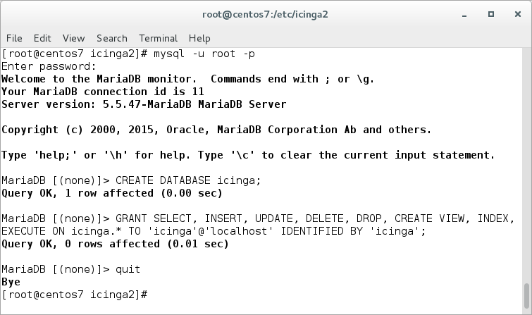
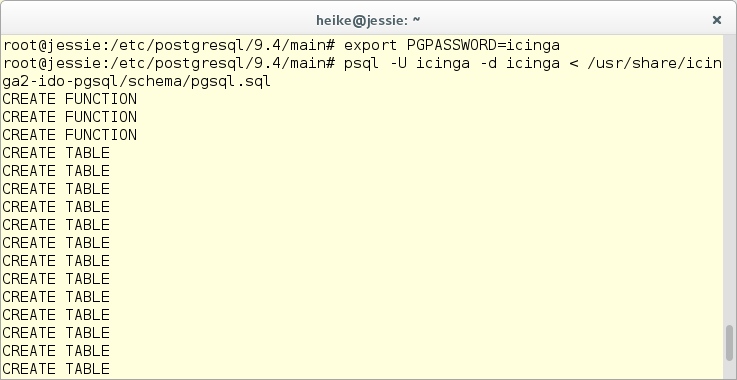

# Installation <a id="installation"></a>

This tutorial is a step-by-step introduction to installing [Icinga 2](02-installation.md#setting-up-icinga2)
and [Icinga Web 2](02-installation.md#setting-up-icingaweb2).
It assumes that you are familiar with the operating system you're using to install Icinga 2.

In case you are upgrading an existing setup, please ensure to
follow the [upgrade documentation](16-upgrading-icinga-2.md#upgrading-icinga-2).

## Setting up Icinga 2 <a id="setting-up-icinga2"></a>

First off you have to install Icinga 2. The preferred way of doing this
is to use the official package repositories depending on which operating system
and distribution you are running.

Official repositories ([support matrix](https://icinga.com/subscription/support-details/)):

  Distribution            | Repository
  ------------------------|---------------------------
  Debian                  | [Icinga Repository](https://packages.icinga.com/debian/)
  Ubuntu                  | [Icinga Repository](https://packages.icinga.com/ubuntu/)
  Raspbian		  | [Icinga Repository](https://packages.icinga.com/raspbian/). Note that **Raspbian `icinga-buster` is required.**
  RHEL/CentOS             | [Icinga Repository](https://packages.icinga.com/epel/)
  openSUSE                | [Icinga Repository](https://packages.icinga.com/openSUSE/)
  SLES                    | [Icinga Repository](https://packages.icinga.com/SUSE/)

Community repositories:

  Distribution            | Repository
  ------------------------|---------------------------
  Gentoo                  | [Upstream](https://packages.gentoo.org/package/net-analyzer/icinga2)
  FreeBSD                 | [Upstream](https://www.freshports.org/net-mgmt/icinga2)
  OpenBSD                 | [Upstream](http://ports.su/net/icinga/core2,-main)
  ArchLinux               | [Upstream](https://aur.archlinux.org/packages/icinga2)
  Alpine Linux            | [Upstream](https://pkgs.alpinelinux.org/package/edge/community/x86_64/icinga2)

Packages for distributions other than the ones listed above may also be
available. Please contact your distribution packagers.

> **Note**
>
> Windows is only supported for agent installations. Please refer
> to the [distributed monitoring chapter](06-distributed-monitoring.md#distributed-monitoring-setup-client-windows).

### Package Repositories <a id="package-repositories"></a>

You need to add the Icinga repository to your package management configuration.
The following commands must be executed with `root` permissions unless noted otherwise.

#### Debian/Ubuntu/Raspbian Repositories <a id="package-repositories-debian-ubuntu-raspbian"></a>

Debian:

```bash
apt-get update
apt-get -y install apt-transport-https wget gnupg

wget -O - https://packages.icinga.com/icinga.key | apt-key add -

DIST=$(awk -F"[)(]+" '/VERSION=/ {print $2}' /etc/os-release); \
 echo "deb https://packages.icinga.com/debian icinga-${DIST} main" > \
 /etc/apt/sources.list.d/${DIST}-icinga.list
 echo "deb-src https://packages.icinga.com/debian icinga-${DIST} main" >> \
 /etc/apt/sources.list.d/${DIST}-icinga.list

apt-get update
```

Ubuntu:

```bash
apt-get update
apt-get -y install apt-transport-https wget gnupg

wget -O - https://packages.icinga.com/icinga.key | apt-key add -

. /etc/os-release; if [ ! -z ${UBUNTU_CODENAME+x} ]; then DIST="${UBUNTU_CODENAME}"; else DIST="$(lsb_release -c| awk '{print $2}')"; fi; \
 echo "deb https://packages.icinga.com/ubuntu icinga-${DIST} main" > \
 /etc/apt/sources.list.d/${DIST}-icinga.list
 echo "deb-src https://packages.icinga.com/ubuntu icinga-${DIST} main" >> \
 /etc/apt/sources.list.d/${DIST}-icinga.list

apt-get update
```

Raspbian Buster:

```bash
apt-get update
apt-get -y install apt-transport-https wget gnupg

wget -O - https://packages.icinga.com/icinga.key | apt-key add -

DIST=$(awk -F"[)(]+" '/VERSION=/ {print $2}' /etc/os-release); \
 echo "deb https://packages.icinga.com/raspbian icinga-${DIST} main" > \
 /etc/apt/sources.list.d/icinga.list
 echo "deb-src https://packages.icinga.com/raspbian icinga-${DIST} main" >> \
 /etc/apt/sources.list.d/icinga.list

apt-get update
```

##### Debian Backports Repository <a id="package-repositories-debian-backports"></a>

> **Note**:
>
> This repository is required for Debian Stretch since v2.11.

Debian Stretch:

```bash
DIST=$(awk -F"[)(]+" '/VERSION=/ {print $2}' /etc/os-release); \
 echo "deb https://deb.debian.org/debian ${DIST}-backports main" > \
 /etc/apt/sources.list.d/${DIST}-backports.list

apt-get update
```

#### RHEL/CentOS/Fedora Repositories <a id="package-repositories-rhel-centos-fedora"></a>

RHEL/CentOS 8:

```bash
dnf install https://packages.icinga.com/epel/icinga-rpm-release-8-latest.noarch.rpm
```

RHEL/CentOS 7:

```bash
yum install https://packages.icinga.com/epel/icinga-rpm-release-7-latest.noarch.rpm
```

RHEL/CentOS 6 x64:

```bash
yum install https://packages.icinga.com/epel/icinga-rpm-release-6-latest.noarch.rpm
```

Fedora 31:

```bash
dnf install https://packages.icinga.com/fedora/icinga-rpm-release-31-latest.noarch.rpm
```

##### RHEL/CentOS EPEL Repository <a id="package-repositories-rhel-epel"></a>

The packages for RHEL/CentOS depend on other packages which are distributed
as part of the [EPEL repository](https://fedoraproject.org/wiki/EPEL).

CentOS 8 additionally needs the PowerTools repository for EPEL:

```bash
dnf install 'dnf-command(config-manager)'
dnf config-manager --set-enabled powertools

dnf install epel-release
```

CentOS 7/6:

```bash
yum install epel-release
```

If you are using RHEL you need to additionally enable the `optional` and `codeready-builder`
repository before installing the [EPEL rpm package](https://fedoraproject.org/wiki/EPEL#How_can_I_use_these_extra_packages.3F).

RHEL 8:

```bash
ARCH=$( /bin/arch )

subscription-manager repos --enable "codeready-builder-for-rhel-8-${ARCH}-rpms"

dnf install https://dl.fedoraproject.org/pub/epel/epel-release-latest-8.noarch.rpm
```

RHEL 7:

```bash
subscription-manager repos --enable rhel-7-server-optional-rpms
yum install https://dl.fedoraproject.org/pub/epel/epel-release-latest-7.noarch.rpm
```

RHEL 6:

```bash
subscription-manager repos --enable rhel-6-server-optional-rpms
yum install https://dl.fedoraproject.org/pub/epel/epel-release-latest-6.noarch.rpm
```

#### SLES/OpenSUSE Repositories <a id="package-repositories-sles-opensuse"></a>

The release repository also provides the required Boost 1.66+ packages
since v2.11.

SLES 15/12:

```bash
rpm --import https://packages.icinga.com/icinga.key

zypper ar https://packages.icinga.com/SUSE/ICINGA-release.repo
zypper ref
```

openSUSE:

```bash
rpm --import https://packages.icinga.com/icinga.key

zypper ar https://packages.icinga.com/openSUSE/ICINGA-release.repo
zypper ref
```

#### Alpine Linux Repositories <a id="package-repositories-alpine"></a>

```bash
echo "http://dl-cdn.alpinelinux.org/alpine/edge/main" >> /etc/apk/repositories
echo "http://dl-cdn.alpinelinux.org/alpine/edge/community" >> /etc/apk/repositories
apk update
```

The example provided assumes that you are running Alpine edge, which is the -dev branch and is a rolling release.
If you are using a stable version please "pin" the edge repository on the latest Icinga 2 package version.
In order to correctly manage your repository, please follow
[these instructions](https://wiki.alpinelinux.org/wiki/Alpine_Linux_package_management)

### Installing Icinga 2 <a id="installing-icinga2"></a>

You can install Icinga 2 by using your distribution's package manager
to install the `icinga2` package. The following commands must be executed
with `root` permissions unless noted otherwise.

Debian/Ubuntu:

```bash
apt-get install icinga2
```

RHEL/CentOS 8 and Fedora:

```bash
dnf install icinga2
systemctl enable icinga2
systemctl start icinga2
```

RHEL/CentOS 7:

```bash
yum install icinga2
systemctl enable icinga2
systemctl start icinga2
```

RHEL/CentOS 6:

```bash
yum install icinga2
chkconfig icinga2 on
service icinga2 start
```

SLES/openSUSE:

```bash
zypper install icinga2
```

FreeBSD:

```bash
pkg install icinga2
```

Alpine Linux:

```bash
apk add icinga2
```

## Setting up Check Plugins <a id="setting-up-check-plugins"></a>

Without plugins Icinga 2 does not know how to check external services. The
[Monitoring Plugins Project](https://www.monitoring-plugins.org/) provides
an extensive set of plugins which can be used with Icinga 2 to check whether
services are working properly.

These plugins are required to make the [example configuration](04-configuration.md#configuring-icinga2-overview)
work out-of-the-box.

For your convenience here is a list of package names for some of the more
popular operating systems/distributions:

OS/Distribution        | Package Name       | Repository                | Installation Path
-----------------------|--------------------|---------------------------|----------------------------
RHEL/CentOS            | nagios-plugins-all | [EPEL](02-installation.md#package-repositories-rhel-epel) | /usr/lib64/nagios/plugins
SLES/OpenSUSE          | monitoring-plugins | [server:monitoring](https://build.opensuse.org/project/repositories/server:monitoring) | /usr/lib/nagios/plugins
Debian/Ubuntu          | monitoring-plugins | -                         | /usr/lib/nagios/plugins
FreeBSD                | monitoring-plugins | -                         | /usr/local/libexec/nagios
Alpine Linux           | monitoring-plugins | -                         | /usr/lib/monitoring-plugins

The recommended way of installing these standard plugins is to use your
distribution's package manager.

Depending on which directory your plugins are installed into you may need to
update the global `PluginDir` constant in your [Icinga 2 configuration](04-configuration.md#constants-conf).
This constant is used by the check command definitions contained in the Icinga Template Library
to determine where to find the plugin binaries.

> **Note**
>
> Please refer to the [service monitoring](05-service-monitoring.md#service-monitoring-plugins) chapter for details about how to integrate
> additional check plugins into your Icinga 2 setup.

### Debian/Ubuntu <a id="setting-up-check-plugins-debian-ubuntu"></a>

```bash
apt-get install monitoring-plugins
```

### RHEL/CentOS/Fedora <a id="setting-up-check-plugins-rhel-centos-fedora"></a>

The packages for RHEL/CentOS depend on other packages which are distributed
as part of the [EPEL repository](02-installation.md#package-repositories-rhel-epel).

RHEL/CentOS 8:

```bash
dnf install nagios-plugins-all
```

RHEL/CentOS 7/6:

```bash
yum install nagios-plugins-all
```

Fedora:

```bash
dnf install nagios-plugins-all
```

### SLES/openSUSE <a id="setting-up-check-plugins-sles-opensuse"></a>

The packages for SLES/OpenSUSE depend on other packages which are distributed
as part of the [server:monitoring repository](https://build.opensuse.org/project/repositories/server:monitoring).
Please make sure to enable this repository beforehand.

```bash
zypper install monitoring-plugins
```

### FreeBSD <a id="setting-up-check-plugins-freebsd"></a>

```bash
pkg install monitoring-plugins
```

### Alpine Linux <a id="setting-up-check-plugins-alpine"></a>

```bash
apk add monitoring-plugins
```

Note: For Alpine you don't need to explicitly add the `monitoring-plugins` package since it is a dependency of
`icinga2` and is pulled automatically.

## Running Icinga 2 <a id="running-icinga2"></a>

### Systemd Service <a id="systemd-service"></a>

The majority of supported distributions use systemd. The
Icinga 2 packages automatically install the necessary systemd unit files.

The Icinga 2 systemd service can be (re-)started, reloaded, stopped and also
queried for its current status.

```
systemctl status icinga2

icinga2.service - Icinga host/service/network monitoring system
   Loaded: loaded (/usr/lib/systemd/system/icinga2.service; disabled)
   Active: active (running) since Mi 2014-07-23 13:39:38 CEST; 15s ago
  Process: 21692 ExecStart=/usr/sbin/icinga2 -c ${ICINGA2_CONFIG_FILE} -d -e ${ICINGA2_ERROR_LOG} -u ${ICINGA2_USER} -g ${ICINGA2_GROUP} (code=exited, status=0/SUCCESS)
  Process: 21674 ExecStartPre=/usr/sbin/icinga2-prepare-dirs /etc/sysconfig/icinga2 (code=exited, status=0/SUCCESS)
 Main PID: 21727 (icinga2)
   CGroup: /system.slice/icinga2.service
           21727 /usr/sbin/icinga2 -c /etc/icinga2/icinga2.conf -d -e /var/log/icinga2/error.log -u icinga -g icinga --no-stack-rlimit

Jul 23 13:39:38 nbmif icinga2[21692]: [2014-07-23 13:39:38 +0200] information/ConfigItem: Checked 309 Service(s).
Jul 23 13:39:38 nbmif icinga2[21692]: [2014-07-23 13:39:38 +0200] information/ConfigItem: Checked 1 User(s).
Jul 23 13:39:38 nbmif icinga2[21692]: [2014-07-23 13:39:38 +0200] information/ConfigItem: Checked 15 Notification(s).
Jul 23 13:39:38 nbmif icinga2[21692]: [2014-07-23 13:39:38 +0200] information/ConfigItem: Checked 4 ScheduledDowntime(s).
Jul 23 13:39:38 nbmif icinga2[21692]: [2014-07-23 13:39:38 +0200] information/ConfigItem: Checked 1 UserGroup(s).
Jul 23 13:39:38 nbmif icinga2[21692]: [2014-07-23 13:39:38 +0200] information/ConfigItem: Checked 1 IcingaApplication(s).
Jul 23 13:39:38 nbmif icinga2[21692]: [2014-07-23 13:39:38 +0200] information/ConfigItem: Checked 8 Dependency(s).
Jul 23 13:39:38 nbmif systemd[1]: Started Icinga host/service/network monitoring system.
```

The `systemctl` command supports the following actions:

  Command             | Description
  --------------------|------------------------
  start               | The `start` action starts the Icinga 2 daemon.
  stop                | The `stop` action stops the Icinga 2 daemon.
  restart             | The `restart` action is a shortcut for running the `stop` action followed by `start`.
  reload              | The `reload` action sends the `HUP` signal to Icinga 2 which causes it to restart. Unlike the `restart` action `reload` does not wait until Icinga 2 has restarted.
  status              | The `status` action checks if Icinga 2 is running.
  enable              | The `enable` action enables the service being started at system boot time (similar to `chkconfig`)

Examples:

```
systemctl enable icinga2

systemctl restart icinga2
Job for icinga2.service failed. See 'systemctl status icinga2.service' and 'journalctl -xn' for details.
```

If you're stuck with configuration errors, you can manually invoke the
[configuration validation](11-cli-commands.md#config-validation).

```bash
icinga2 daemon -C
```

> **Tip**
>
> If you are running into fork errors with systemd enabled distributions,
> please check the [troubleshooting chapter](15-troubleshooting.md#check-fork-errors).

### Init Script <a id="init-script"></a>

Icinga 2's init script is installed in `/etc/init.d/icinga2` (`/usr/local/etc/rc.d/icinga2` on FreeBSD) by default:

```
/etc/init.d/icinga2

Usage: /etc/init.d/icinga2 {start|stop|restart|reload|checkconfig|status}
```

The init script supports the following actions:

  Command             | Description
  --------------------|------------------------
  start               | The `start` action starts the Icinga 2 daemon.
  stop                | The `stop` action stops the Icinga 2 daemon.
  restart             | The `restart` action is a shortcut for running the `stop` action followed by `start`.
  reload              | The `reload` action sends the `HUP` signal to Icinga 2 which causes it to restart. Unlike the `restart` action `reload` does not wait until Icinga 2 has restarted.
  checkconfig         | The `checkconfig` action checks if the `/etc/icinga2/icinga2.conf` configuration file contains any errors.
  status              | The `status` action checks if Icinga 2 is running.

By default, the Icinga 2 daemon is running as `icinga` user and group
using the init script. Using Debian packages the user and group are set to
`nagios` for historical reasons.


### FreeBSD <a id="running-icinga2-freebsd"></a>

On FreeBSD you need to enable icinga2 in your rc.conf

```bash
sysrc icinga2_enable=yes

service icinga2 restart
```

### SELinux <a id="running-icinga2-selinux"></a>

SELinux is a mandatory access control (MAC) system on Linux which adds
a fine-grained permission system for access to all system resources such
as files, devices, networks and inter-process communication.

Icinga 2 provides its own SELinux policy. `icinga2-selinux` is a policy package
for Red Hat Enterprise Linux 7 and derivatives. The package runs the targeted policy
which confines Icinga 2 including enabled features and running commands.

RHEL/CentOS 8 and Fedora:

```bash
dnf install icinga2-selinux
```

RHEL/CentOS 7:

```bash
yum install icinga2-selinux
```

Read more about SELinux in [this chapter](22-selinux.md#selinux).

## Configuration Syntax Highlighting <a id="configuration-syntax-highlighting"></a>

Icinga 2 provides configuration examples for syntax highlighting using the `vim` and `nano` editors.
The RHEL and SUSE package `icinga2-common` installs these files into `/usr/share/doc/icinga2-common-[x.x.x]/syntax`
(where `[x.x.x]` is the version number, e.g. `2.4.3` or `2.4.4`). Sources provide these files in `tools/syntax`.
On Debian systems the `icinga2-common` package provides only the Nano configuration file (`/usr/share/nano/icinga2.nanorc`);
to obtain the Vim configuration, please install the extra package `vim-icinga2`. The files are located in `/usr/share/vim/addons`.

### Configuration Syntax Highlighting using Vim <a id="configuration-syntax-highlighting-vim"></a>

Install the package `vim-icinga2` with your distribution's package manager.

Debian/Ubuntu:

```
apt-get install vim-icinga2 vim-addon-manager
vim-addon-manager -w install icinga2
Info: installing removed addon 'icinga2' to /var/lib/vim/addons
```

RHEL/CentOS 8 and Fedora:

```bash
dnf install vim-icinga2
```

RHEL/CentOS 7/6:

```bash
yum install vim-icinga2
```

SLES/openSUSE:

```bash
zypper install vim-icinga2
```

Alpine Linux:

```bash
apk add icinga2-vim
```

Ensure that syntax highlighting is enabled e.g. by editing the user's `vimrc`
configuration file:

```
# vim ~/.vimrc
syntax on
```

Test it:

```bash
vim /etc/icinga2/conf.d/templates.conf
```


### Configuration Syntax Highlighting using Nano <a id="configuration-syntax-highlighting-nano"></a>

Install the package `nano-icinga2` with your distribution's package manager.

Debian/Ubuntu:

**Note:** The syntax files are installed with the `icinga2-common` package already.

RHEL/CentOS 8 and Fedora:

```bash
dnf install nano-icinga2
```

RHEL/CentOS 7/6:

```bash
yum install nano-icinga2
```

SLES/openSUSE:

```bash
zypper install nano-icinga2
```

Copy the `/etc/nanorc` sample file to your home directory.

```bash
cp /etc/nanorc ~/.nanorc
```

Include the `icinga2.nanorc` file.

```
$ vim ~/.nanorc

## Icinga 2
include "/usr/share/nano/icinga2.nanorc"
```

Test it:

```bash
nano /etc/icinga2/conf.d/templates.conf
```


## Setting up Icinga Web 2 <a id="setting-up-icingaweb2"></a>

Icinga 2 can be used with Icinga Web 2 and a variety of modules.
This chapter explains how to set up Icinga Web 2.

The DB IDO (Database Icinga Data Output) feature for Icinga 2 takes care of
exporting all configuration and status information into a database.

> **Note**
>
> We're currently working on a new data backend called Icinga DB.
> If you want to try the latest release candidate skip to 
> the [Icinga DB Chapter](02-installation.md#icingadb).
> Please keep in mind, that this version is not ready for use in
> production and currently only supports MySQL.

### Configuring DB IDO MySQL <a id="configuring-db-ido-mysql"></a>

#### Installing MySQL database server <a id="installing-database-mysql-server"></a>

Debian/Ubuntu:

```bash
apt-get install mariadb-server mariadb-client

mysql_secure_installation
```

RHEL/CentOS and Fedora:

```bash
yum install mariadb-server mariadb
systemctl enable mariadb
systemctl start mariadb
mysql_secure_installation
```

SUSE:

```bash
zypper install mysql mysql-client
chkconfig mysqld on
service mysqld start
```

FreeBSD:

```bash
pkg install mysql56-server
sysrc mysql_enable=yes
service mysql-server restart
mysql_secure_installation
```

Alpine Linux:

```bash
apk add mariadb
rc-service mariadb setup
rc-update add mariadb default
rc-service mariadb start
```

#### Installing the IDO modules for MySQL <a id="installing-database-mysql-modules"></a>

The next step is to install the `icinga2-ido-mysql` package using your
distribution's package manager.

Debian/Ubuntu:

```bash
apt-get install icinga2-ido-mysql
```

RHEL/CentOS:

```bash
yum install icinga2-ido-mysql
```

SUSE:

```bash
zypper install icinga2-ido-mysql
```

FreeBSD:

On FreeBSD the IDO modules for MySQL are included with the icinga2 package
and located at `/usr/local/share/icinga2-ido-mysql/schema/mysql.sql`.

Alpine Linux:

On Alpine Linux the IDO modules for MySQL are included with the `icinga2` package
and located at `/usr/share/icinga2-ido-mysql/schema/mysql.sql`.

> **Note**
>
> The Debian/Ubuntu packages provide a database configuration wizard by
> default. You can skip the automated setup and install/upgrade the
> database manually if you prefer.

#### Setting up the MySQL database <a id="setting-up-mysql-db"></a>

Set up a MySQL database for Icinga 2:

```
# mysql -u root -p

CREATE DATABASE icinga;
GRANT ALTER, CREATE, SELECT, INSERT, UPDATE, DELETE, DROP, CREATE VIEW, INDEX, EXECUTE ON icinga.* TO 'icinga'@'localhost' IDENTIFIED BY 'icinga';
quit
```

Please note that the example above uses the very simple password 'icinga' (in `IDENTIFIED BY 'icinga'`). 
Please choose a better password for your installation.



After creating the database you can import the Icinga 2 IDO schema using the
following command. Enter the icinga password into the prompt when asked.

```bash
mysql -u icinga -p icinga < /usr/share/icinga2-ido-mysql/schema/mysql.sql
```

#### Enabling the IDO MySQL module <a id="enabling-ido-mysql"></a>

The package provides a new configuration file that is installed in
`/etc/icinga2/features-available/ido-mysql.conf`. You can update
the database credentials in this file.

All available attributes are explained in the
[IdoMysqlConnection object](09-object-types.md#objecttype-idomysqlconnection)
chapter.

You can enable the `ido-mysql` feature configuration file using
`icinga2 feature enable`:

```
# icinga2 feature enable ido-mysql
Module 'ido-mysql' was enabled.
Make sure to restart Icinga 2 for these changes to take effect.
```

Restart Icinga 2.

```bash
systemctl restart icinga2
```

Alpine Linux:

```bash
rc-service icinga2 restart
```

Continue with the [webserver setup](02-installation.md#icinga2-user-interface-webserver).

### Configuring DB IDO PostgreSQL <a id="configuring-db-ido-postgresql"></a>

#### Installing PostgreSQL database server <a id="installing-database-postgresql-server"></a>

Debian/Ubuntu:

```bash
apt-get install postgresql
```

RHEL/CentOS:

```bash
yum install postgresql-server postgresql
postgresql-setup initdb
systemctl enable postgresql
systemctl start postgresql
```

SUSE:

```bash
zypper install postgresql postgresql-server
chkconfig postgresql on
service postgresql initdb
service postgresql start
```

FreeBSD:

```bash
pkg install postgresql93-server
sysrc postgresql_enable=yes
service postgresql initdb
service postgresql start
```

Alpine Linux:

```bash
apk add postgresql
rc-update add postgresql default
rc-service postgresql setup
rc-service postgresql start
```

#### Installing the IDO modules for PostgreSQL <a id="installing-database-postgresql-modules"></a>

The next step is to install the `icinga2-ido-pgsql` package using your
distribution's package manager.

Debian/Ubuntu:

```bash
apt-get install icinga2-ido-pgsql
```

RHEL/CentOS:

```bash
yum install icinga2-ido-pgsql
```

SUSE:

```bash
zypper install icinga2-ido-pgsql
```

FreeBSD:

On FreeBSD the IDO modules for PostgreSQL are included with the icinga2 package
and located at `/usr/local/share/icinga2-ido-pgsql/schema/pgsql.sql`.

Alpine Linux:

On Alpine Linux the IDO modules for PostgreSQL are included with the `icinga2` package
and located at `/usr/share/icinga2-ido-pgsql/schema/pgsql.sql`.

> **Note**
>
> Upstream Debian packages provide a database configuration wizard by default.
> You can skip the automated setup and install/upgrade the database manually
> if you prefer that.

#### Setting up the PostgreSQL database

Set up a PostgreSQL database for Icinga 2:

```bash
cd /tmp
sudo -u postgres psql -c "CREATE ROLE icinga WITH LOGIN PASSWORD 'icinga'"
sudo -u postgres createdb -O icinga -E UTF8 icinga
```

> **Note**
>
> It is assumed here that your locale is set to utf-8, you may run into problems otherwise.

Locate your `pg_hba.conf` configuration file (Debian: `/etc/postgresql/*/main/pg_hba.conf`,
RHEL/SUSE: `/var/lib/pgsql/data/pg_hba.conf`), add the icinga user with `md5`
as authentication method and restart the postgresql server.

```
# icinga
local   icinga      icinga                            md5
host    icinga      icinga      127.0.0.1/32          md5
host    icinga      icinga      ::1/128               md5

# "local" is for Unix domain socket connections only
local   all         all                               ident
# IPv4 local connections:
host    all         all         127.0.0.1/32          ident
# IPv6 local connections:
host    all         all         ::1/128               ident
```

```bash
systemctl restart postgresql
```


After creating the database and permissions you need to import the IDO database
schema using the following command:

```bash
export PGPASSWORD=icinga
psql -U icinga -d icinga < /usr/share/icinga2-ido-pgsql/schema/pgsql.sql
```




#### Enabling the IDO PostgreSQL module <a id="enabling-ido-postgresql"></a>

The package provides a new configuration file that is installed in
`/etc/icinga2/features-available/ido-pgsql.conf`. You can update
the database credentials in this file.

All available attributes are explained in the
[IdoPgsqlConnection object](09-object-types.md#objecttype-idopgsqlconnection)
chapter.

You can enable the `ido-pgsql` feature configuration file using
`icinga2 feature enable`:

```
# icinga2 feature enable ido-pgsql
Module 'ido-pgsql' was enabled.
Make sure to restart Icinga 2 for these changes to take effect.
```

Restart Icinga 2.

```bash
systemctl restart icinga2
```

Alpine Linux:

```bash
rc-service icinga2 restart
```

Continue with the [webserver setup](02-installation.md#icinga2-user-interface-webserver).

### Webserver <a id="icinga2-user-interface-webserver"></a>

The preferred way of installing Icinga Web 2 is to use Apache as webserver
in combination with PHP-FPM. If you prefer Nginx, please refer to the Icinga Web 2
documentation.

> **Note**
>
> These instructions follow HTTP. In order to secure your webserver, please
> use HTTPS and TLS certificates e.g. from [Let's Encrypt](https://letsencrypt.org/).

Debian/Ubuntu:

```bash
apt-get install apache2
```

RHEL/CentOS/Fedora:

```bash
yum install httpd
systemctl enable httpd
systemctl start httpd
```

SUSE:

```bash
zypper install apache2
chkconfig apache2 on
service apache2 start
```

FreeBSD (Nginx, but you could also use the `apache24` package):

```bash
pkg install nginx php56-gettext php56-ldap php56-openssl php56-mysql php56-pdo_mysql php56-pgsql php56-pdo_pgsql php56-sockets php56-gd pecl-imagick pecl-intl
sysrc php_fpm_enable=yes
sysrc nginx_enable=yes
sed -i '' "s/listen\ =\ 127.0.0.1:9000/listen\ =\ \/var\/run\/php5-fpm.sock/" /usr/local/etc/php-fpm.conf
sed -i '' "s/;listen.owner/listen.owner/" /usr/local/etc/php-fpm.conf
sed -i '' "s/;listen.group/listen.group/" /usr/local/etc/php-fpm.conf
sed -i '' "s/;listen.mode/listen.mode/" /usr/local/etc/php-fpm.conf
service php-fpm start
service nginx start
```

Alpine Linux:

```bash
apk add apache2 php7-apache2
sed -i -e "s/^#LoadModule rewrite_module/LoadModule rewrite_module/" /etc/apache2/httpd.conf
rc-update add apache2 default
rc-service apache2 start
```

### Firewall Rules <a id="icinga2-user-interface-firewall-rules"></a>

Enable port 80 (http). Best practice is to only enable port 443 (https) and use TLS certificates.

firewall-cmd:

```bash
firewall-cmd --add-service=http
firewall-cmd --permanent --add-service=http
```

iptables:

```bash
iptables -A INPUT -p tcp -m tcp --dport 80 -j ACCEPT
service iptables save
```

FreeBSD:
Please consult the [FreeBSD Handbook](https://www.freebsd.org/doc/en_US.ISO8859-1/books/handbook/firewalls.html) how to configure one of FreeBSD's firewalls.


### Setting Up Icinga 2 REST API <a id="setting-up-rest-api"></a>

Icinga Web 2 and other web interfaces require the [REST API](12-icinga2-api.md#icinga2-api-setup)
to send actions (reschedule check, etc.) and query object details.

You can run the CLI command `icinga2 api setup` to enable the
`api` [feature](11-cli-commands.md#enable-features) and set up
certificates as well as a new API user `root` with an auto-generated password in the
`/etc/icinga2/conf.d/api-users.conf` configuration file:

```bash
icinga2 api setup
```

Edit the `api-users.conf` file and add a new ApiUser object. Specify the [permissions](12-icinga2-api.md#icinga2-api-permissions)
attribute with minimal permissions required by Icinga Web 2.

```
vim /etc/icinga2/conf.d/api-users.conf

object ApiUser "icingaweb2" {
  password = "Wijsn8Z9eRs5E25d"
  permissions = [ "status/query", "actions/*", "objects/modify/*", "objects/query/*" ]
}
```

Restart Icinga 2 to activate the configuration.

```bash
systemctl restart icinga2
```

Alpine Linux:

```bash
rc-service icinga2 restart
```

### Installing Icinga Web 2 <a id="installing-icingaweb2"></a>

Please consult the [Icinga Web 2 documentation](https://icinga.com/docs/icingaweb2/latest/)
for further instructions on how to install Icinga Web 2.

If you decided on using Icinga DB, consult the [Icinga DB Web documentation](https://icinga.com/docs/icingadb/latest/icingadb-web/doc/01-About/) on how to connect Icinga Web 2 with Icinga DB.

## Addons <a id="install-addons"></a>

A number of additional features are available in the form of addons. A list of
popular addons is available in the
[Addons and Plugins](13-addons.md#addons) chapter.

## Installation Overview <a id="installation-overview"></a>

### Enabled Features during Installation <a id="installation-overview-enabled-features"></a>

The default installation will enable three features required for a basic
Icinga 2 installation:

* `checker` for executing checks
* `notification` for sending notifications
* `mainlog` for writing the `icinga2.log` file

You can verify that by calling `icinga2 feature list`
[CLI command](11-cli-commands.md#cli-command-feature) to see which features are
enabled and disabled.

```
# icinga2 feature list
Disabled features: api command compatlog debuglog gelf graphite icingastatus ido-mysql ido-pgsql influxdb livestatus opentsdb perfdata statusdata syslog
Enabled features: checker mainlog notification
```

### Installation Paths <a id="installation-overview-paths"></a>

By default Icinga 2 uses the following files and directories:

  Path                                		| Description
  ----------------------------------------------|------------------------------------
  /etc/icinga2                        		| Contains Icinga 2 configuration files.
  /usr/lib/systemd/system/icinga2.service 	| The Icinga 2 systemd service file on systems using systemd.
  /etc/systemd/system/icinga2.service.d/limits.conf | On distributions with systemd >227, additional service limits are required.
  /etc/init.d/icinga2                 		| The Icinga 2 init script on systems using SysVinit or OpenRC.
  /usr/sbin/icinga2                   		| Shell wrapper for the Icinga 2 binary.
  /usr/lib\*/icinga2				| Libraries and the Icinga 2 binary (use `find /usr -type f -name icinga2` to locate the binary path).
  /usr/share/doc/icinga2              		| Documentation files that come with Icinga 2.
  /usr/share/icinga2/include          		| The Icinga Template Library and plugin command configuration.
  /var/lib/icinga2                    		| Icinga 2 state file, cluster log, master CA, node certificates and configuration files (cluster, api).
  /var/run/icinga2                    		| PID file.
  /var/run/icinga2/cmd                		| Command pipe and Livestatus socket.
  /var/cache/icinga2                  		| status.dat/objects.cache, icinga2.debug files.
  /var/spool/icinga2                  		| Used for performance data spool files.
  /var/log/icinga2                    		| Log file location and compat/ directory for the CompatLogger feature.

FreeBSD uses slightly different paths:

By default Icinga 2 uses the following files and directories:

  Path                                | Description
  ------------------------------------|------------------------------------
  /usr/local/etc/icinga2              | Contains Icinga 2 configuration files.
  /usr/local/etc/rc.d/icinga2         | The Icinga 2 init script.
  /usr/local/sbin/icinga2             | Shell wrapper for the Icinga 2 binary.
  /usr/local/lib/icinga2              | Libraries and the Icinga 2 binary.
  /usr/local/share/doc/icinga2        | Documentation files that come with Icinga 2.
  /usr/local/share/icinga2/include    | The Icinga Template Library and plugin command configuration.
  /var/lib/icinga2                    | Icinga 2 state file, cluster log, master CA, node certificates and configuration files (cluster, api).
  /var/run/icinga2                    | PID file.
  /var/run/icinga2/cmd                | Command pipe and Livestatus socket.
  /var/cache/icinga2                  | status.dat/objects.cache, icinga2.debug files.
  /var/spool/icinga2                  | Used for performance data spool files.
  /var/log/icinga2                    | Log file location and compat/ directory for the CompatLogger feature.


## Backup <a id="install-backup"></a>

Ensure to include the following in your backups:

* Configuration files in `/etc/icinga2`
* Certificate files in `/var/lib/icinga2/ca` (Master CA key pair) and `/var/lib/icinga2/certs` (node certificates)
* Runtime files in `/var/lib/icinga2`
* Optional: IDO database backup

## Backup: Database <a id="install-backup-database"></a>

MySQL/MariaDB:

* [Documentation](https://mariadb.com/kb/en/library/backup-and-restore-overview/)

PostgreSQL:

* [Documentation](https://www.postgresql.org/docs/9.3/static/backup.html)

## Icinga DB <a id="icingadb"></a>

Icinga DB is a new data backend currently in development.
It's purpose is to synchronise data between Icinga 2 (Redis) and Icinga Web 2 (MySQL), some day replacing the IDO. 
Don't worry, we won't drop support on the IDO any time soon.

> **Note**
> Icinga DB is not ready to be used in production  
> and should only be used for testing purposes.

### Configuring Icinga DB <a id="configuring-icinga-db"></a>

First, make sure to setup Icinga DB itself and its database backends (Redis and MySQL) by following the [installation instructions](https://icinga.com/docs/icingadb/latest/doc/02-Installation/).

#### Enabling the Icinga DB feature <a id="enabling-icinga-db"></a>

Icinga 2 provides a configuration file that is installed in
`/etc/icinga2/features-available/icingadb.conf`. You can update
the Redis credentials in this file.

All available attributes are explained in the
[IcingaDB object](09-object-types.md#objecttype-icingadb)
chapter.

You can enable the `icingadb` feature configuration file using
`icinga2 feature enable`:

```
# icinga2 feature enable icingadb
Module 'icingadb' was enabled.
Make sure to restart Icinga 2 for these changes to take effect.
```

Restart Icinga 2.

```bash
systemctl restart icinga2
```

Alpine Linux:

```bash
rc-service icinga2 restart
```

Continue with the [webserver setup](02-installation.md#icinga2-user-interface-webserver).
