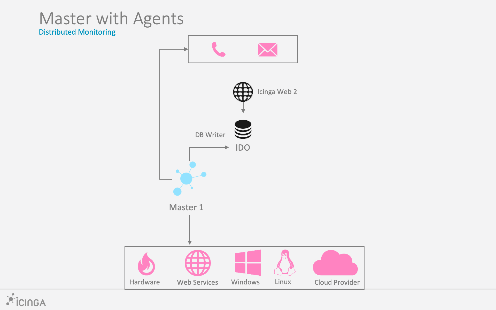

# Agent-based Checks <a id="agent-based-checks-addon"></a>

If the remote services are not directly accessible through the network, a
local agent installation exposing the results to check queries can
become handy.

Prior to installing and configuration an agent service, evaluate possible
options based on these requirements:

* Security (authentication, TLS certificates, secure connection handling, etc.)
* Connection direction
    * Master/satellite can execute commands directly or
    * Agent sends back passive/external check results
* Availability on specific OS types and versions
    * Packages available
* Configuration and initial setup
* Updates and maintenance, compatibility

Available agent types:

* [Icinga Agent](07-agent-based-monitoring.md#agent-based-checks-icinga) on Linux/Unix and Windows
* [SSH](07-agent-based-monitoring.md#agent-based-checks-ssh) on Linux/Unix
* [SNMP](07-agent-based-monitoring.md#agent-based-checks-snmp) on Linux/Unix and hardware
* [SNMP Traps](07-agent-based-monitoring.md#agent-based-checks-snmp-traps) as passive check results
* [REST API](07-agent-based-monitoring.md#agent-based-checks-rest-api) for passive external check results
* [NSClient++](07-agent-based-monitoring.md#agent-based-checks-nsclient) and [WMI](07-agent-based-monitoring.md#agent-based-checks-wmi) on Windows


## Icinga Agent <a id="agent-based-checks-icinga"></a>

For the most common setups on Linux/Unix and Windows, we recommend
to setup the Icinga agent in a [distributed environment](06-distributed-monitoring.md#distributed-monitoring).



Key benefits:

* Directly integrated into the distributed monitoring stack of Icinga
* Works on Linux/Unix and Windows
* Secure communication with TLS
* Connection can be established from both sides. Once connected, command execution and check results are exchanged.
    * Master/satellite connects to agent
    * Agent connects to parent satellite/master
* Same configuration language and binaries
* Troubleshooting docs and community best practices

Follow the setup and configuration instructions [here](06-distributed-monitoring.md#distributed-monitoring-setup-agent-satellite).

On Windows hosts, the Icinga agent can query a local NSClient++ service
for additional checks in case there are no plugins available. The NSCP
installer is bundled with Icinga and can be installed with the setup wizard.


## SSH <a id="agent-based-checks-ssh"></a>

> **Tip**
>
> This is the recommended way for systems where the Icinga agent is not available
> Be it specific hardware architectures, old systems or forbidden to install an additional software.

This method uses the SSH service on the remote host to execute
an arbitrary plugin command line. The output and exit code is
returned and used by the core.

The `check_by_ssh` plugin takes care of this. It is available in the
[Monitoring Plugins](https://www.monitoring-plugins.org/) package.
For your convenience, the Icinga template library provides the [by_ssh](10-icinga-template-library.md#plugin-check-command-by-ssh)
CheckCommand already.

### SSH: Preparations <a id="agent-based-checks-ssh-preparations"></a>

SSH key pair for the Icinga daemon user. In case the user has no shell, temporarily enable this.
When asked for a passphrase, **do not set it** and press enter.

```bash
sudo su - icinga

ssh-keygen -b 4096 -t rsa -C "icinga@$(hostname) user for check_by_ssh" -f $HOME/.ssh/id_rsa
```

On the remote agent, create the icinga user and generate a temporary password.

```bash
useradd -m icinga
passwd icinga
```

Copy the public key from the Icinga server to the remote agent, e.g. with `ssh-copy-id`
or manually into `/home/icinga/.ssh/authorized_keys`.
This will ask for the password once.

```bash
sudo su - icinga

ssh-copy-id -i $HOME/.ssh/id_rsa icinga@ssh-agent1.localdomain
```

After the SSH key is copied, test at the connection **at least once** and
accept the host key verification. If you forget about this step, checks will
become UNKNOWN later.

```bash
ssh -i $HOME/.ssh/id_rsa icinga@ssh-agent1.localdomain
```

After the SSH key login works, disable the previously enabled logins.

* Remote agent user's password with `passwd -l icinga`
* Local icinga user terminal

Also, ensure that the permissions are correct for the `.ssh` directory
as otherwise logins will fail.

* `.ssh` directory: 700
* `.ssh/id_rsa.pub` public key file: 644
* `.ssh/id_rsa` private key file: 600


### SSH: Configuration <a id="agent-based-checks-ssh-config"></a>

First, create a host object which has SSH configured and enabled.
Mark this e.g. with the custom variable `agent_type` to later
use this for service apply rule matches. Best practice is to
store that in a specific template, either in the static configuration
or inside the Director.

```
template Host "ssh-agent" {
  check_command = "hostalive"

  vars.agent_type = "ssh"
  vars.os_type = "linux"
}

object Host "ssh-agent1.localdomain" {
  import "ssh-agent"

  address = "192.168.56.115"
}
```

Example for monitoring the remote users:

```
apply Service "users" {
  check_command = "by_ssh"

  vars.by_ssh_command = [ "/usr/lib/nagios/plugins/check_users" ]

  // Follows the same principle as with command arguments, e.g. for ordering
  vars.by_ssh_arguments = {
    "-w" = {
      value = "$users_wgreater$" // Can reference an existing custom variable defined on the host or service, evaluated at runtime
    }
    "-c" = {
      value = "$users_cgreater$"
    }
  }

  vars.users_wgreater = 3
  vars.users_cgreater = 5

  assign where host.vars.os_type == "linux" && host.vars.agent_type == "ssh"
}
```

A more advanced example with better arguments is shown in [this blogpost](https://www.netways.de/blog/2016/03/21/check_by_ssh-mit-icinga-2/).


## SNMP <a id="agent-based-checks-snmp"></a>

The SNMP daemon runs on the remote system and answers SNMP queries by plugin scripts.
The [Monitoring Plugins](https://www.monitoring-plugins.org/) package provides
the `check_snmp` plugin binary, but there are plenty of [existing plugins](05-service-monitoring.md#service-monitoring-plugins)
for specific use cases already around, for example monitoring Cisco routers.

The following example uses the [SNMP ITL](10-icinga-template-library.md#plugin-check-command-snmp)
CheckCommand and sets the `snmp_oid` custom variable. A service is created for all hosts which
have the `snmp-community` custom variable.

```
template Host "snmp-agent" {
  check_command = "hostalive"

  vars.agent_type = "snmp"

  vars.snmp_community = "public-icinga"
}

object Host "snmp-agent1.localdomain" {
  import "snmp-agent"
}
```

```
apply Service "uptime" {
  import "generic-service"

  check_command = "snmp"
  vars.snmp_oid = "1.3.6.1.2.1.1.3.0"
  vars.snmp_miblist = "DISMAN-EVENT-MIB"

  assign where host.vars.agent_type == "snmp" && host.vars.snmp_community != ""
}
```

If no `snmp_miblist` is specified, the plugin will default to `ALL`. As the number of available MIB files
on the system increases so will the load generated by this plugin if no `MIB` is specified.
As such, it is recommended to always specify at least one `MIB`.

Additional SNMP plugins are available using the [Manubulon SNMP Plugins](10-icinga-template-library.md#snmp-manubulon-plugin-check-commands).

For network monitoring, community members advise to use [nwc_health](05-service-monitoring.md#service-monitoring-network)
for example.


## SNMP Traps and Passive Check Results <a id="agent-based-checks-snmp-traps"></a>

SNMP Traps can be received and filtered by using [SNMPTT](http://snmptt.sourceforge.net/)
and specific trap handlers passing the check results to Icinga 2.

Following the SNMPTT [Format](http://snmptt.sourceforge.net/docs/snmptt.shtml#SNMPTT.CONF-FORMAT)
documentation and the Icinga external command syntax found [here](24-appendix.md#external-commands-list-detail)
we can create generic services that can accommodate any number of hosts for a given scenario.

### Simple SNMP Traps <a id="simple-traps"></a>

A simple example might be monitoring host reboots indicated by an SNMP agent reset.
Building the event to auto reset after dispatching a notification is important.
Setup the manual check parameters to reset the event from an initial unhandled
state or from a missed reset event.

Add a directive in `snmptt.conf`

```
EVENT coldStart .1.3.6.1.6.3.1.1.5.1 "Status Events" Normal
FORMAT Device reinitialized (coldStart)
EXEC echo "[$@] PROCESS_SERVICE_CHECK_RESULT;$A;Coldstart;2;The snmp agent has reinitialized." >> /var/run/icinga2/cmd/icinga2.cmd
SDESC
A coldStart trap signifies that the SNMPv2 entity, acting
in an agent role, is reinitializing itself and that its
configuration may have been altered.
EDESC
```

1. Define the `EVENT` as per your need.
2. Construct the `EXEC` statement with the service name matching your template
applied to your _n_ hosts. The host address inferred by SNMPTT will be the
correlating factor. You can have snmptt provide host names or ip addresses to
match your Icinga convention.

> **Note**
>
> Replace the deprecated command pipe EXEC statement with a curl call
> to the REST API action [process-check-result](12-icinga2-api.md#icinga2-api-actions-process-check-result).

Add an `EventCommand` configuration object for the passive service auto reset event.

```
object EventCommand "coldstart-reset-event" {
  command = [ ConfigDir + "/conf.d/custom/scripts/coldstart_reset_event.sh" ]

  arguments = {
    "-i" = "$service.state_id$"
    "-n" = "$host.name$"
    "-s" = "$service.name$"
  }
}
```

Create the `coldstart_reset_event.sh` shell script to pass the expanded variable
data in. The `$service.state_id$` is important in order to prevent an endless loop
of event firing after the service has been reset.

```bash
#!/bin/bash

SERVICE_STATE_ID=""
HOST_NAME=""
SERVICE_NAME=""

show_help()
{
cat <<-EOF
	Usage: ${0##*/} [-h] -n HOST_NAME -s SERVICE_NAME
	Writes a coldstart reset event to the Icinga command pipe.

	  -h                  Display this help and exit.
	  -i SERVICE_STATE_ID The associated service state id.
	  -n HOST_NAME        The associated host name.
	  -s SERVICE_NAME     The associated service name.
EOF
}

while getopts "hi:n:s:" opt; do
    case "$opt" in
      h)
          show_help
          exit 0
          ;;
      i)
          SERVICE_STATE_ID=$OPTARG
          ;;
      n)
          HOST_NAME=$OPTARG
          ;;
      s)
          SERVICE_NAME=$OPTARG
          ;;
      '?')
          show_help
          exit 0
          ;;
      esac
done

if [ -z "$SERVICE_STATE_ID" ]; then
    show_help
    printf "\n  Error: -i required.\n"
    exit 1
fi

if [ -z "$HOST_NAME" ]; then
    show_help
    printf "\n  Error: -n required.\n"
    exit 1
fi

if [ -z "$SERVICE_NAME" ]; then
    show_help
    printf "\n  Error: -s required.\n"
    exit 1
fi

if [ "$SERVICE_STATE_ID" -gt 0 ]; then
    echo "[`date +%s`] PROCESS_SERVICE_CHECK_RESULT;$HOST_NAME;$SERVICE_NAME;0;Auto-reset (`date +"%m-%d-%Y %T"`)." >> /var/run/icinga2/cmd/icinga2.cmd
fi
```

> **Note**
>
> Replace the deprecated command pipe EXEC statement with a curl call
> to the REST API action [process-check-result](12-icinga2-api.md#icinga2-api-actions-process-check-result).

Finally create the `Service` and assign it:

```
apply Service "Coldstart" {
  import "generic-service-custom"

  check_command         = "dummy"
  event_command         = "coldstart-reset-event"

  enable_notifications  = 1
  enable_active_checks  = 0
  enable_passive_checks = 1
  enable_flapping       = 0
  volatile              = 1
  enable_perfdata       = 0

  vars.dummy_state      = 0
  vars.dummy_text       = "Manual reset."

  vars.sla              = "24x7"

  assign where (host.vars.os == "Linux" || host.vars.os == "Windows")
}
```

### Complex SNMP Traps <a id="complex-traps"></a>

A more complex example might be passing dynamic data from a traps varbind list
for a backup scenario where the backup software dispatches status updates. By
utilizing active and passive checks, the older freshness concept can be leveraged.

By defining the active check as a hard failed state, a missed backup can be reported.
As long as the most recent passive update has occurred, the active check is bypassed.

Add a directive in `snmptt.conf`

```
EVENT enterpriseSpecific <YOUR OID> "Status Events" Normal
FORMAT Enterprise specific trap
EXEC echo "[$@] PROCESS_SERVICE_CHECK_RESULT;$A;$1;$2;$3" >> /var/run/icinga2/cmd/icinga2.cmd
SDESC
An enterprise specific trap.
The varbinds in order denote the Icinga service name, state and text.
EDESC
```

1. Define the `EVENT` as per your need using your actual oid.
2. The service name, state and text are extracted from the first three varbinds.
This has the advantage of accommodating an unlimited set of use cases.

> **Note**
>
> Replace the deprecated command pipe EXEC statement with a curl call
> to the REST API action [process-check-result](12-icinga2-api.md#icinga2-api-actions-process-check-result).

Create a `Service` for the specific use case associated to the host. If the host
matches and the first varbind value is `Backup`, SNMPTT will submit the corresponding
passive update with the state and text from the second and third varbind:

```
object Service "Backup" {
  import "generic-service-custom"

  host_name             = "host.domain.com"
  check_command         = "dummy"

  enable_notifications  = 1
  enable_active_checks  = 1
  enable_passive_checks = 1
  enable_flapping       = 0
  volatile              = 1
  max_check_attempts    = 1
  check_interval        = 87000
  enable_perfdata       = 0

  vars.sla              = "24x7"
  vars.dummy_state      = 2
  vars.dummy_text       = "No passive check result received."
}
```


## Agents sending Check Results via REST API <a id="agent-based-checks-rest-api"></a>

Whenever the remote agent cannot run the Icinga agent, or a backup script
should just send its current state after finishing, you can use the [REST API](12-icinga2-api.md#icinga2-api)
as secure transport and send [passive external check results](08-advanced-topics.md#external-check-results).

Use the [process-check-result](12-icinga2-api.md#icinga2-api-actions-process-check-result) API action to send the external passive check result.
You can either use `curl` or implement the HTTP requests in your preferred programming
language. Examples for API clients are available in [this chapter](12-icinga2-api.md#icinga2-api-clients).

Feeding check results from remote hosts requires the host/service
objects configured on the master/satellite instance.

## NSClient++ on Windows <a id="agent-based-checks-nsclient"></a>

[NSClient++](https://nsclient.org/) works on both Windows and Linux platforms and is well
known for its magnificent Windows support. There are alternatives like the WMI interface,
but using `NSClient++` will allow you to run local scripts similar to check plugins fetching
the required output and performance counters.

> **Tip**
>
> Best practice is to use the Icinga agent as secure execution
> bridge (`check_nt` and `check_nrpe` are considered insecure)
> and query the NSClient++ service [locally](06-distributed-monitoring.md#distributed-monitoring-windows-nscp).

You can use the `check_nt` plugin from the Monitoring Plugins project to query NSClient++.
Icinga 2 provides the [nscp check command](10-icinga-template-library.md#plugin-check-command-nscp) for this:

Example:

```
object Service "disk" {
  import "generic-service"

  host_name = "remote-windows-host"

  check_command = "nscp"

  vars.nscp_variable = "USEDDISKSPACE"
  vars.nscp_params = "c"
  vars.nscp_warn = 70
  vars.nscp_crit = 80
}
```

For details on the `NSClient++` configuration please refer to the [official documentation](https://docs.nsclient.org/).

## WMI on Windows <a id="agent-based-checks-wmi"></a>

The most popular plugin is [check_wmi_plus](https://edcint.co.nz/checkwmiplus/).

> Check WMI Plus uses the Windows Management Interface (WMI) to check for common services (cpu, disk, sevices, eventlog…) on Windows machines. It requires the open source wmi client for Linux.

Community examples:

* [Icinga 2 check_wmi_plus example by 18pct](https://18pct.com/icinga2-check_wmi_plus-example/)
* [Agent-less monitoring with WMI](https://www.devlink.de/linux/icinga2-nagios-agentless-monitoring-von-windows/)
