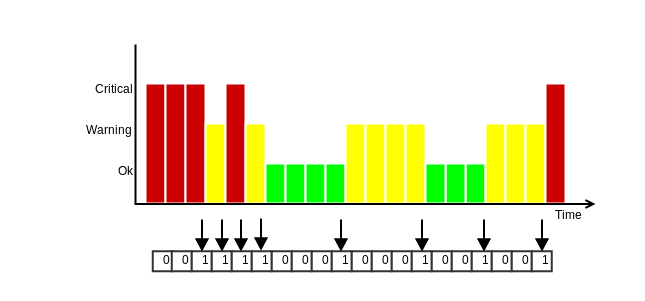

# Advanced Topics <a id="advanced-topics"></a>

This chapter covers a number of advanced topics. If you're new to Icinga, you
can safely skip over things you're not interested in.

## Downtimes <a id="downtimes"></a>

Downtimes can be scheduled for planned server maintenance or
any other targeted service outage you are aware of in advance.

Downtimes suppress notifications and can trigger other
downtimes too. If the downtime was set by accident, or the duration
exceeds the maintenance windows, you can manually cancel the downtime.

### Scheduling a downtime <a id="scheduling-downtime"></a>

The most convenient way to schedule planned downtimes is to create
them in Icinga Web 2 inside the host/service detail view. Select
multiple hosts/services from the listing with the shift key to
schedule multiple downtimes.


In addition to that you can schedule a downtime by using the Icinga 2 API action
[schedule-downtime](12-icinga2-api.md#icinga2-api-actions-schedule-downtime).
This is especially useful to schedule a downtime on-demand inside a (remote) backup
script, or create maintenance downtimes from a cron job for specific dates and intervals.

Multiple downtimes for a single object may overlap. This is useful
when you want to extend your maintenance window taking longer than expected.
If there are multiple downtimes triggered for one object, the overall downtime depth
will be greater than `1`.

If the downtime was scheduled after the problem changed to a critical hard
state triggering a problem notification, and the service recovers during
the downtime window, the recovery notification won't be suppressed.

Planned downtimes are also taken into account for SLA reporting
tools calculating the SLAs based on the state and downtime history.

### Fixed and Flexible Downtimes <a id="fixed-flexible-downtimes"></a>

A `fixed` downtime will be activated at the defined start time, and
removed at the end time. During this time window the service state
will change to `NOT-OK` and then actually trigger the downtime.
Notifications are suppressed and the downtime depth is incremented.

Common scenarios are a planned distribution upgrade on your linux
servers, or database updates in your warehouse. The customer knows
about a fixed downtime window between 23:00 and 24:00. After 24:00
all problems should be alerted again. Solution is simple -
schedule a `fixed` downtime starting at 23:00 and ending at 24:00.

Unlike a `fixed` downtime, a `flexible` downtime will be triggered
by the state change in the time span defined by start and end time,
and then last for the specified duration in minutes.

Imagine the following scenario: Your service is frequently polled
by users trying to grab free deleted domains for immediate registration.
Between 07:30 and 08:00 the impact will hit for 15 minutes and generate
a network outage visible to the monitoring. The service is still alive,
but answering too slow to Icinga 2 service checks.
For that reason, you may want to schedule a downtime between 07:30 and
08:00 with a duration of 15 minutes. The downtime will then last from
its trigger time until the duration is over. After that, the downtime
is removed (may happen before or after the actual end time!).

#### Fixed Downtime <a id="fixed-downtime"></a>

If the host/service changes into a NOT-OK state between the start and
end time window, the downtime will be marked as `in effect` and
increases the downtime depth counter.

```
   |       |         |
start      |        end
       trigger time
```

#### Flexible Downtime <a id="flexible-downtime"></a>

A flexible downtime defines a time window where the downtime may be
triggered from a host/service NOT-OK state change. It will then last
until the specified time duration is reached. That way it can happen
that the downtime end time is already gone, but the downtime ends
at `trigger time + duration`.


```
   |       |         |
start      |        end               actual end time
           |--------------duration--------|
       trigger time
```


### Triggered Downtimes <a id="triggered-downtimes"></a>

This is optional when scheduling a downtime. If there is already a downtime
scheduled for a future maintenance, the current downtime can be triggered by
that downtime. This renders useful if you have scheduled a host downtime and
are now scheduling a child host's downtime getting triggered by the parent
downtime on `NOT-OK` state change.

### Recurring Downtimes <a id="recurring-downtimes"></a>

[ScheduledDowntime objects](09-object-types.md#objecttype-scheduleddowntime) can be used to set up
recurring downtimes for services.

Example:

```
apply ScheduledDowntime "backup-downtime" to Service {
  author = "icingaadmin"
  comment = "Scheduled downtime for backup"

  ranges = {
    monday = "02:00-03:00"
    tuesday = "02:00-03:00"
    wednesday = "02:00-03:00"
    thursday = "02:00-03:00"
    friday = "02:00-03:00"
    saturday = "02:00-03:00"
    sunday = "02:00-03:00"
  }

  assign where "backup" in service.groups
}
```

Icinga 2 attempts to find the next possible segment from a ScheduledDowntime object's
`ranges` attribute, and wont create multiple downtimes in the future. In case you need
all these downtimes planned and visible for the next days, weeks or months, schedule them
manually via the [REST API](12-icinga2-api.md#icinga2-api-actions-schedule-downtime) using
a script or cron job.

> **Note**
>
> If ScheduledDowntime objects are synced in a distributed high-availability setup,
> both will create the next possible downtime on their own. These runtime generated
> downtimes are synced among both zone instances, and you may see sort-of duplicate downtimes
> in Icinga Web 2.


## Comments <a id="comments-intro"></a>

Comments can be added at runtime and are persistent over restarts. You can
add useful information for others on repeating incidents (for example
"last time syslog at 100% cpu on 17.10.2013 due to stale nfs mount") which
is primarily accessible using web interfaces.

You can add a comment either by using the Icinga 2 API action
[add-comment](12-icinga2-api.md#icinga2-api-actions-add-comment) or
by sending an [external command](14-features.md#external-commands).

## Acknowledgements <a id="acknowledgements"></a>

If a problem persists and notifications have been sent, you can
acknowledge the problem. That way other users will get
a notification that you're aware of the issue and probably are
already working on a fix.

Note: Acknowledgements also add a new [comment](08-advanced-topics.md#comments-intro)
which contains the author and text fields.

You can send an acknowledgement either by using the Icinga 2 API action
[acknowledge-problem](12-icinga2-api.md#icinga2-api-actions-acknowledge-problem) or
by sending an [external command](14-features.md#external-commands).


### Sticky Acknowledgements <a id="sticky-acknowledgements"></a>

The acknowledgement is removed if a state change occurs or if the host/service
recovers (OK/Up state).

If you acknowledge a problem once you've received a `Critical` notification,
the acknowledgement will be removed if there is a state transition to `Warning`.
```
OK -> WARNING -> CRITICAL -> WARNING -> OK
```

If you prefer to keep the acknowledgement until the problem is resolved (`OK`
recovery) you need to enable the `sticky` parameter.


### Expiring Acknowledgements <a id="expiring-acknowledgements"></a>

Once a problem is acknowledged it may disappear from your `handled problems`
dashboard and no-one ever looks at it again since it will suppress
notifications too.

This `fire-and-forget` action is quite common. If you're sure that a
current problem should be resolved in the future at a defined time,
you can define an expiration time when acknowledging the problem.

Icinga 2 will clear the acknowledgement when expired and start to
re-notify, if the problem persists.


## Time Periods <a id="timeperiods"></a>

[Time Periods](09-object-types.md#objecttype-timeperiod) define
time ranges in Icinga where event actions are triggered, for
example whether a service check is executed or not within
the `check_period` attribute. Or a notification should be sent to
users or not, filtered by the `period` and `notification_period`
configuration attributes for `Notification` and `User` objects.

The `TimePeriod` attribute `ranges` may contain multiple directives,
including weekdays, days of the month, and calendar dates.
These types may overlap/override other types in your ranges dictionary.

The descending order of precedence is as follows:

* Calendar date (2008-01-01)
* Specific month date (January 1st)
* Generic month date (Day 15)
* Offset weekday of specific month (2nd Tuesday in December)
* Offset weekday (3rd Monday)
* Normal weekday (Tuesday)

If you don't set any `check_period` or `notification_period` attribute
on your configuration objects, Icinga 2 assumes `24x7` as time period
as shown below.

```
object TimePeriod "24x7" {
  display_name = "Icinga 2 24x7 TimePeriod"
  ranges = {
    "monday"    = "00:00-24:00"
    "tuesday"   = "00:00-24:00"
    "wednesday" = "00:00-24:00"
    "thursday"  = "00:00-24:00"
    "friday"    = "00:00-24:00"
    "saturday"  = "00:00-24:00"
    "sunday"    = "00:00-24:00"
  }
}
```

If your operation staff should only be notified during workhours,
create a new timeperiod named `workhours` defining a work day from
09:00 to 17:00.

```
object TimePeriod "workhours" {
  display_name = "Icinga 2 8x5 TimePeriod"
  ranges = {
    "monday"    = "09:00-17:00"
    "tuesday"   = "09:00-17:00"
    "wednesday" = "09:00-17:00"
    "thursday"  = "09:00-17:00"
    "friday"    = "09:00-17:00"
  }
}
```

If you want to specify a notification period across midnight,
you can define it the following way:

```
object Timeperiod "across-midnight" {
  display_name = "Nightly Notification"
  ranges = {
    "saturday" = "22:00-24:00"
    "sunday" = "00:00-03:00"
  }
}
```

Below you can see another example for configuring timeperiods across several
days, weeks or months. This can be useful when taking components offline
for a distinct period of time.

```
object Timeperiod "standby" {
  display_name = "Standby"
  ranges = {
    "2016-09-30 - 2016-10-30" = "00:00-24:00"
  }
}
```

Please note that the spaces before and after the dash are mandatory.

Once your time period is configured you can Use the `period` attribute
to assign time periods to `Notification` and `Dependency` objects:

```
apply Notification "mail-icingaadmin" to Service {
  import "mail-service-notification"
  user_groups = host.vars.notification.mail.groups
  users = host.vars.notification.mail.users

  period = "workhours"

  assign where host.vars.notification.mail
}
```

### Time Periods Inclusion and Exclusion <a id="timeperiods-includes-excludes"></a>

Sometimes it is necessary to exclude certain time ranges from
your default time period definitions, for example, if you don't
want to send out any notification during the holiday season,
or if you only want to allow small time windows for executed checks.

The [TimePeriod object](09-object-types.md#objecttype-timeperiod)
provides the `includes` and `excludes` attributes to solve this issue.
`prefer_includes` defines whether included or excluded time periods are
preferred.

The following example defines a time period called `holidays` where
notifications should be suppressed:

```
object TimePeriod "holidays" {
  ranges = {
    "january 1" = "00:00-24:00"                 //new year's day
    "july 4" = "00:00-24:00"                    //independence day
    "december 25" = "00:00-24:00"               //christmas
    "december 31" = "18:00-24:00"               //new year's eve (6pm+)
    "2017-04-16" = "00:00-24:00"                //easter 2017
    "monday -1 may" = "00:00-24:00"             //memorial day (last monday in may)
    "monday 1 september" = "00:00-24:00"        //labor day (1st monday in september)
    "thursday 4 november" = "00:00-24:00"       //thanksgiving (4th thursday in november)
  }
}
```

In addition to that the time period `weekends` defines an additional
time window which should be excluded from notifications:

```
object TimePeriod "weekends-excluded" {
  ranges = {
    "saturday"  = "00:00-09:00,18:00-24:00"
    "sunday"    = "00:00-09:00,18:00-24:00"
  }
}
```

The time period `prod-notification` defines the default time ranges
and adds the excluded time period names as an array.

```
object TimePeriod "prod-notification" {
  excludes = [ "holidays", "weekends-excluded" ]

  ranges = {
    "monday"    = "00:00-24:00"
    "tuesday"   = "00:00-24:00"
    "wednesday" = "00:00-24:00"
    "thursday"  = "00:00-24:00"
    "friday"    = "00:00-24:00"
    "saturday"  = "00:00-24:00"
    "sunday"    = "00:00-24:00"
  }
}
```

## External Check Results <a id="external-check-results"></a>

Hosts or services which do not actively execute a check plugin to receive
the state and output are called "passive checks" or "external check results".
In this scenario an external client or script is sending in check results.

You can feed check results into Icinga 2 with the following transport methods:

* [process-check-result action](12-icinga2-api.md#icinga2-api-actions-process-check-result) available with the [REST API](12-icinga2-api.md#icinga2-api) (remote and local)
* External command sent via command pipe (local only)

Each time a new check result is received, the next expected check time
is updated. This means that if there are no check result received from
the external source, Icinga 2 will execute [freshness checks](08-advanced-topics.md#check-result-freshness).

> **Note**
>
> The REST API action allows to specify the `check_source` attribute
> which helps identifying the external sender. This is also visible
> in Icinga Web 2 and the REST API queries.

## Check Result Freshness <a id="check-result-freshness"></a>

In Icinga 2 active check freshness is enabled by default. It is determined by the
`check_interval` attribute and no incoming check results in that period of time.

The threshold is calculated based on the last check execution time for actively executed checks:

```
(last check execution time + check interval) > current time
```

If this host/service receives check results from an [external source](08-advanced-topics.md#external-check-results),
the threshold is based on the last time a check result was received:

```
(last check result time + check interval) > current time
```

> **Tip**
>
> The [process-check-result](12-icinga2-api.md#icinga2-api-actions-process-check-result) REST API
> action allows to overrule the pre-defined check interval with a specified TTL in Icinga 2 v2.9+.

If the freshness checks fail, Icinga 2 will execute the defined check command.

Best practice is to define a [dummy](10-icinga-template-library.md#itl-dummy) `check_command` which gets
executed when freshness checks fail.

```
apply Service "external-check" {
  check_command = "dummy"
  check_interval = 1m

  /* Set the state to UNKNOWN (3) if freshness checks fail. */
  vars.dummy_state = 3

  /* Use a runtime function to retrieve the last check time and more details. */
  vars.dummy_text = {{
    var service = get_service(macro("$host.name$"), macro("$service.name$"))
    var lastCheck = DateTime(service.last_check).to_string()

    return "No check results received. Last result time: " + lastCheck
  }}

  assign where "external" in host.vars.services
}
```

References: [get_service](18-library-reference.md#objref-get_service), [macro](18-library-reference.md#scoped-functions-macro), [DateTime](18-library-reference.md#datetime-type).

Example output in Icinga Web 2:


## Check Flapping <a id="check-flapping"></a>

Icinga 2 supports optional detection of hosts and services that are "flapping".

Flapping occurs when a service or host changes state too frequently, which would result in a storm of problem and
recovery notifications. With flapping detection enabled a flapping notification will be sent while other notifications are
suppressed until it calms down after receiving the same status from checks a few times. Flapping detection can help detect
configuration problems (wrong thresholds), troublesome services or network problems.

Flapping detection can be enabled or disabled using the `enable_flapping` attribute.
The `flapping_threshold_high` and `flapping_threshold_low` attributes allows to specify the thresholds that control
when a [host](09-object-types.md#objecttype-host) or [service](09-object-types.md#objecttype-service) is considered to be flapping.

The default thresholds are 30% for high and 25% for low. If the computed flapping value exceeds the high threshold a
host or service is considered flapping until it drops below the low flapping threshold.

`FlappingStart` and `FlappingEnd` notifications will be sent out accordingly, if configured. See the chapter on
[notifications](alert-notifications) for details

> Note: There is no distinctions between hard and soft states with flapping. All state changes count and notifications
> will be sent out regardless of the objects state.

### How it works <a id="check-flapping-how-it-works"></a>

Icinga 2 saves the last 20 state changes for every host and service. See the graphic below:



All the states are weighted, with the most recent one being worth the most (1.15) and the 20th the least (0.8). The
states in between are fairly distributed. The final flapping value are the weighted state changes divided by the total
count of 20.

In the example above, the added states would have a total value of 7.82 (`0.84 + 0.86 + 0.88 + 0.9 + 0.98 + 1.06 + 1.12 + 1.18`).
This yields a flapping percentage of 39.1% (`7.82 / 20 * 100`). As the default upper flapping threshold is 30%, it would be
considered flapping.

If the next seven check results then would not be state changes, the flapping percentage would fall below the lower threshold
of 25% and therefore the host or service would recover from flapping.

## Volatile Services and Hosts <a id="volatile-services-hosts"></a>

The `volatile` option, if enabled for a host or service, makes it treat every [state change](03-monitoring-basics.md#hard-soft-states)
as a `HARD` state change. It is comparable to `max_check_attempts = 1`. With this any `NOT-OK` result will
ignore `max_check_attempts` and trigger notifications etc. It will further cause any additional `NOT-OK`
result to re-send notifications.

It may be reasonable to have a volatile service which stays in a `HARD` state if the service stays in a `NOT-OK`
state. That way each service recheck will automatically trigger a notification unless the service is acknowledged or
in a scheduled downtime.

A common example are security checks where each `NOT-OK` check result should immediately trigger a notification.

The default for this option is `false` and should only be enabled when required.


## Monitoring Icinga 2 <a id="monitoring-icinga"></a>

Why should you do that? Icinga and its components run like any other
service application on your server. There are predictable issues
such as "disk space is running low" and your monitoring suffers from just
that.

You would also like to ensure that features and backends are running
and storing required data. Be it the database backend where Icinga Web 2
presents fancy dashboards, forwarded metrics to Graphite or InfluxDB or
the entire distributed setup.

This list isn't complete but should help with your own setup.
Windows client specific checks are highlighted.

Type		| Description			| Plugins and CheckCommands
----------------|-------------------------------|-----------------------------------------------------
System		| Filesystem			| [disk](10-icinga-template-library.md#plugin-check-command-disk), [disk-windows](10-icinga-template-library.md#windows-plugins) (Windows Client)
System		| Memory, Swap			| [mem](10-icinga-template-library.md#plugin-contrib-command-mem), [swap](10-icinga-template-library.md#plugin-check-command-swap), [memory](10-icinga-template-library.md#windows-plugins) (Windows Client)
System		| Hardware			| [hpasm](10-icinga-template-library.md#plugin-contrib-command-hpasm), [ipmi-sensor](10-icinga-template-library.md#plugin-contrib-command-ipmi-sensor)
System		| Virtualization		| [VMware](10-icinga-template-library.md#plugin-contrib-vmware), [esxi_hardware](10-icinga-template-library.md#plugin-contrib-command-esxi-hardware)
System		| Processes			| [procs](10-icinga-template-library.md#plugin-check-command-processes), [service-windows](10-icinga-template-library.md#windows-plugins) (Windows Client)
System		| System Activity Reports	| [check_sar_perf](https://github.com/dnsmichi/icinga-plugins/blob/master/scripts/check_sar_perf.py)
System		| I/O				| [iostat](10-icinga-template-library.md#plugin-contrib-command-iostat)
System		| Network interfaces		| [nwc_health](10-icinga-template-library.md#plugin-contrib-command-nwc_health), [interfaces](10-icinga-template-library.md#plugin-contrib-command-interfaces)
System		| Users				| [users](10-icinga-template-library.md#plugin-check-command-users), [users-windows](10-icinga-template-library.md#windows-plugins) (Windows Client)
System		| Logs				| Forward them to [Elastic Stack](14-features.md#elastic-stack-integration) or [Graylog](14-features.md#graylog-integration) and add your own alerts.
System		| NTP				| [ntp_time](10-icinga-template-library.md#plugin-check-command-ntp-time)
System		| Updates			| [apt](10-icinga-template-library.md#plugin-check-command-apt), [yum](10-icinga-template-library.md#plugin-contrib-command-yum)
Icinga		| Status & Stats		| [icinga](10-icinga-template-library.md#itl-icinga) (more below)
Icinga		| Cluster & Clients		| [health checks](06-distributed-monitoring.md#distributed-monitoring-health-checks)
Database	| MySQL				| [mysql_health](10-icinga-template-library.md#plugin-contrib-command-mysql_health)
Database	| PostgreSQL			| [postgres](10-icinga-template-library.md#plugin-contrib-command-postgres)
Database	| Housekeeping			| Check the database size and growth and analyse metrics to examine trends.
Database	| DB IDO			| [ido](10-icinga-template-library.md#itl-icinga-ido) (more below)
Webserver	| Apache2, Nginx, etc.		| [http](10-icinga-template-library.md#plugin-check-command-http), [apache-status](10-icinga-template-library.md#plugin-contrib-command-apache-status), [nginx_status](10-icinga-template-library.md#plugin-contrib-command-nginx_status)
Webserver	| Certificates			| [http](10-icinga-template-library.md#plugin-check-command-http)
Webserver	| Authorization			| [http](10-icinga-template-library.md#plugin-check-command-http)
Notifications	| Mail (queue)			| [smtp](10-icinga-template-library.md#plugin-check-command-smtp), [mailq](10-icinga-template-library.md#plugin-check-command-mailq)
Notifications	| SMS (GSM modem)		| [check_sms3_status](https://exchange.icinga.com/netways/check_sms3status)
Notifications	| Messengers, Cloud services	| XMPP, Twitter, IRC, Telegram, PagerDuty, VictorOps, etc.
Metrics		| PNP, RRDTool			| [check_pnp_rrds](https://github.com/lingej/pnp4nagios/tree/master/scripts) checks for stale RRD files.
Metrics		| Graphite			| [graphite](10-icinga-template-library.md#plugin-contrib-command-graphite)
Metrics		| InfluxDB			| [check_influxdb](https://exchange.icinga.com/Mikanoshi/InfluxDB+data+monitoring+plugin)
Metrics		| Elastic Stack			| [elasticsearch](10-icinga-template-library.md#plugin-contrib-command-elasticsearch), [Elastic Stack integration](14-features.md#elastic-stack-integration)
Metrics		| Graylog			| [Graylog integration](14-features.md#graylog-integration)


The [icinga](10-icinga-template-library.md#itl-icinga) CheckCommand provides metrics for the runtime stats of
Icinga 2. You can forward them to your preferred graphing solution.
If you require more metrics you can also query the [REST API](12-icinga2-api.md#icinga2-api) and write
your own custom check plugin. Or you keep using the built-in [object accessor functions](08-advanced-topics.md#access-object-attributes-at-runtime)
to calculate stats in-memory.

There is a built-in [ido](10-icinga-template-library.md#itl-icinga-ido) check available for DB IDO MySQL/PostgreSQL
which provides additional metrics for the IDO database.

```
apply Service "ido-mysql" {
  check_command = "ido"

  vars.ido_type = "IdoMysqlConnection"
  vars.ido_name = "ido-mysql" //the name defined in /etc/icinga2/features-enabled/ido-mysql.conf

  assign where match("master*.localdomain", host.name)
}
```

More specific database queries can be found in the [DB IDO](14-features.md#db-ido) chapter.

Distributed setups should include specific [health checks](06-distributed-monitoring.md#distributed-monitoring-health-checks).
You might also want to add additional checks for SSL certificate expiration.


## Advanced Configuration Hints <a id="advanced-configuration-hints"></a>

### Advanced Use of Apply Rules <a id="advanced-use-of-apply-rules"></a>

[Apply rules](03-monitoring-basics.md#using-apply) can be used to create a rule set which is
entirely based on host objects and their attributes.
In addition to that [apply for and custom attribute override](03-monitoring-basics.md#using-apply-for)
extend the possibilities.

The following example defines a dictionary on the host object which contains
configuration attributes for multiple web servers. This then used to add three checks:

* A `ping4` check using the local IP `address` of the web server.
* A `tcp` check querying the TCP port where the HTTP service is running on.
* If the `url` key is defined, the third apply for rule will create service objects using the `http` CheckCommand.
In addition to that you can optionally define the `ssl` attribute which enables HTTPS checks.

Host definition:

```
object Host "webserver01" {
  import "generic-host"
  address = "192.168.56.200"
  vars.os = "Linux"

  vars.webserver = {
    instance["status"] = {
      address = "192.168.56.201"
      port = "80"
      url = "/status"
    }
    instance["tomcat"] = {
      address = "192.168.56.202"
      port = "8080"
    }
    instance["icingaweb2"] = {
      address = "192.168.56.210"
      port = "443"
      url = "/icingaweb2"
      ssl = true
    }
  }
}
```

Service apply for definitions:

```
apply Service "webserver_ping" for (instance => config in host.vars.webserver.instance) {
  display_name = "webserver_" + instance
  check_command = "ping4"

  vars.ping_address = config.address

  assign where host.vars.webserver.instance
}

apply Service "webserver_port" for (instance => config in host.vars.webserver.instance) {
  display_name = "webserver_" + instance + "_" + config.port
  check_command = "tcp"

  vars.tcp_address = config.address
  vars.tcp_port = config.port

  assign where host.vars.webserver.instance
}

apply Service "webserver_url" for (instance => config in host.vars.webserver.instance) {
  display_name = "webserver_" + instance + "_" + config.url
  check_command = "http"

  vars.http_address = config.address
  vars.http_port = config.port
  vars.http_uri = config.url

  if (config.ssl) {
    vars.http_ssl = config.ssl
  }

  assign where config.url != ""
}
```

The variables defined in the host dictionary are not using the typical custom attribute
prefix recommended for CheckCommand parameters. Instead they are re-used for multiple
service checks in this example.
In addition to defining check parameters this way, you can also enrich the `display_name`
attribute with more details. This will be shown in in Icinga Web 2 for example.

### Use Functions in Object Configuration <a id="use-functions-object-config"></a>

There is a limited scope where functions can be used as object attributes such as:

* As value for [Custom Attributes](03-monitoring-basics.md#custom-attributes-functions)
* Returning boolean expressions for [set_if](08-advanced-topics.md#use-functions-command-arguments-setif) inside command arguments
* Returning a [command](08-advanced-topics.md#use-functions-command-attribute) array inside command objects

The other way around you can create objects dynamically using your own global functions.

> **Note**
>
> Functions called inside command objects share the same global scope as runtime macros.
> Therefore you can access host custom attributes like `host.vars.os`, or any other
> object attribute from inside the function definition used for [set_if](08-advanced-topics.md#use-functions-command-arguments-setif) or [command](08-advanced-topics.md#use-functions-command-attribute).

Tips when implementing functions:

* Use [log()](18-library-reference.md#global-functions-log) to dump variables. You can see the output
inside the `icinga2.log` file depending in your log severity
* Use the `icinga2 console` to test basic functionality (e.g. iterating over a dictionary)
* Build them step-by-step. You can always refactor your code later on.

#### Register and Use Global Functions <a id="use-functions-global-register"></a>

[Functions](17-language-reference.md#functions) can be registered into the global scope. This allows custom functions being available
in objects and other functions. Keep in mind that these functions are not marked
as side-effect-free and as such are not available via the REST API.

Add a new configuration file `functions.conf` and include it into the [icinga2.conf](04-configuring-icinga-2.md#icinga2-conf)
configuration file in the very beginning, e.g. after `constants.conf`. You can also manage global
functions inside `constants.conf` if you prefer.

The following function converts a given state parameter into a returned string value. The important
bits for registering it into the global scope are:

* `globals.<unique_function_name>` adds a new globals entry.
* `function()` specifies that a call to `state_to_string()` executes a function.
* Function parameters are defined inside the `function()` definition.

```
globals.state_to_string = function(state) {
  if (state == 2) {
    return "Critical"
  } else if (state == 1) {
    return "Warning"
  } else if (state == 0) {
    return "OK"
  } else if (state == 3) {
    return "Unknown"
  } else {
    log(LogWarning, "state_to_string", "Unknown state " + state + " provided.")
  }
}
```

The else-condition allows for better error handling. This warning will be shown in the Icinga 2
log file once the function is called.

> **Note**
>
> If these functions are used in a distributed environment, you must ensure to deploy them
> everywhere needed.

In order to test-drive the newly created function, restart Icinga 2 and use the [debug console](11-cli-commands.md#cli-command-console)
to connect to the REST API.

```
$ ICINGA2_API_PASSWORD=icinga icinga2 console --connect 'https://root@localhost:5665/'
Icinga 2 (version: v2.8.1-373-g4bea6d25c)
<1> => globals.state_to_string(1)
"Warning"
<2> => state_to_string(2)
"Critical"
```

You can see that this function is now registered into the [global scope](17-language-reference.md#variable-scopes). The function call
`state_to_string()` can be used in any object at static config compile time or inside runtime
lambda functions.

The following service object example uses the service state and converts it to string output.
The function definition is not optimized and is enrolled for better readability including a log message.

```
object Service "state-test" {
  check_command = "dummy"
  host_name = NodeName

  vars.dummy_state = 2

  vars.dummy_text = {{
    var h = macro("$host.name$")
    var s = macro("$service.name$")

    var state = get_service(h, s).state

    log(LogInformation, "dummy_state", "Host: " + h + " Service: " + s + " State: " + state)

    return state_to_string(state)
  }}
}
```


#### Use Custom Functions as Attribute <a id="custom-functions-as-attribute"></a>

To use custom functions as attributes, the function must be defined in a
slightly unexpected way. The following example shows how to assign values
depending on group membership. All hosts in the `slow-lan` host group use 300
as value for `ping_wrta`, all other hosts use 100.

```
globals.group_specific_value = function(group, group_value, non_group_value) {
    return function() use (group, group_value, non_group_value) {
        if (group in host.groups) {
            return group_value
        } else {
            return non_group_value
        }
    }
}

apply Service "ping4" {
    import "generic-service"
    check_command = "ping4"

    vars.ping_wrta = group_specific_value("slow-lan", 300, 100)
    vars.ping_crta = group_specific_value("slow-lan", 500, 200)

    assign where true
}
```

#### Use Functions in Assign Where Expressions <a id="use-functions-assign-where"></a>

If a simple expression for matching a name or checking if an item
exists in an array or dictionary does not fit, you should consider
writing your own global [functions](17-language-reference.md#functions).
You can call them inside `assign where` and `ignore where` expressions
for [apply rules](03-monitoring-basics.md#using-apply-expressions) or
[group assignments](03-monitoring-basics.md#group-assign-intro) just like
any other global functions for example [match](18-library-reference.md#global-functions-match).

The following example requires the host `myprinter` being added
to the host group `printers-lexmark` but only if the host uses
a template matching the name `lexmark*`.

```
template Host "lexmark-printer-host" {
  vars.printer_type = "Lexmark"
}

object Host "myprinter" {
  import "generic-host"
  import "lexmark-printer-host"

  address = "192.168.1.1"
}

/* register a global function for the assign where call */
globals.check_host_templates = function(host, search) {
  /* iterate over all host templates and check if the search matches */
  for (tmpl in host.templates) {
    if (match(search, tmpl)) {
      return true
    }
  }

  /* nothing matched */
  return false
}

object HostGroup "printers-lexmark" {
  display_name = "Lexmark Printers"
  /* call the global function and pass the arguments */
  assign where check_host_templates(host, "lexmark*")
}
```

Take a different more complex example: All hosts with the
custom attribute `vars_app` as nested dictionary should be
added to the host group `ABAP-app-server`. But only if the
`app_type` for all entries is set to `ABAP`.

It could read as wildcard match for nested dictionaries:

```
    where host.vars.vars_app["*"].app_type == "ABAP"
```

The solution for this problem is to register a global
function which checks the `app_type` for all hosts
with the `vars_app` dictionary.

```
object Host "appserver01" {
  check_command = "dummy"
  vars.vars_app["ABC"] = { app_type = "ABAP" }
}
object Host "appserver02" {
  check_command = "dummy"
  vars.vars_app["DEF"] = { app_type = "ABAP" }
}

globals.check_app_type = function(host, type) {
  /* ensure that other hosts without the custom attribute do not match */
  if (typeof(host.vars.vars_app) != Dictionary) {
    return false
  }

  /* iterate over the vars_app dictionary */
  for (key => val in host.vars.vars_app) {
    /* if the value is a dictionary and if contains the app_type being the requested type */
    if (typeof(val) == Dictionary && val.app_type == type) {
      return true
    }
  }

  /* nothing matched */
  return false
}

object HostGroup "ABAP-app-server" {
  assign where check_app_type(host, "ABAP")
}
```

#### Use Functions in Command Arguments set_if <a id="use-functions-command-arguments-setif"></a>

The `set_if` attribute inside the command arguments definition in the
[CheckCommand object definition](09-object-types.md#objecttype-checkcommand) is primarily used to
evaluate whether the command parameter should be set or not.

By default you can evaluate runtime macros for their existence. If the result is not an empty
string, the command parameter is passed. This becomes fairly complicated when want to evaluate
multiple conditions and attributes.

The following example was found on the community support channels. The user had defined a host
dictionary named `compellent` with the key `disks`. This was then used inside service apply for rules.

```
object Host "dict-host" {
  check_command = "check_compellent"
  vars.compellent["disks"] = {
    file = "/var/lib/check_compellent/san_disks.0.json",
    checks = ["disks"]
  }
}
```

The more significant problem was to only add the command parameter `--disk` to the plugin call
when the dictionary `compellent` contains the key `disks`, and omit it if not found.

By defining `set_if` as [abbreviated lambda function](17-language-reference.md#nullary-lambdas)
and evaluating the host custom attribute `compellent` containing the `disks` this problem was
solved like this:

```
object CheckCommand "check_compellent" {
  command   = [ "/usr/bin/check_compellent" ]
  arguments   = {
    "--disks"  = {
      set_if = {{
        var host_vars = host.vars
        log(host_vars)
        var compel = host_vars.compellent
        log(compel)
        compel.contains("disks")
      }}
    }
  }
}
```

This implementation uses the dictionary type method [contains](18-library-reference.md#dictionary-contains)
and will fail if `host.vars.compellent` is not of the type `Dictionary`.
Therefore you can extend the checks using the [typeof](17-language-reference.md#types) function.

You can test the types using the `icinga2 console`:

```
# icinga2 console
Icinga (version: v2.3.0-193-g3eb55ad)
<1> => srv_vars.compellent["check_a"] = { file="outfile_a.json", checks = [ "disks", "fans" ] }
null
<2> => srv_vars.compellent["check_b"] = { file="outfile_b.json", checks = [ "power", "voltages" ] }
null
<3> => typeof(srv_vars.compellent)
type 'Dictionary'
<4> =>
```

The more programmatic approach for `set_if` could look like this:

```
    "--disks" = {
      set_if = {{
        var srv_vars = service.vars
        if(len(srv_vars) > 0) {
          if (typeof(srv_vars.compellent) == Dictionary) {
            return srv_vars.compellent.contains("disks")
          } else {
            log(LogInformationen, "checkcommand set_if", "custom attribute compellent_checks is not a dictionary, ignoring it.")
            return false
          }
        } else {
          log(LogWarning, "checkcommand set_if", "empty custom attributes")
          return false
        }
      }}
    }
```

#### Use Functions as Command Attribute <a id="use-functions-command-attribute"></a>

This comes in handy for [NotificationCommands](09-object-types.md#objecttype-notificationcommand)
or [EventCommands](09-object-types.md#objecttype-eventcommand) which does not require
a returned checkresult including state/output.

The following example was taken from the community support channels. The requirement was to
specify a custom attribute inside the notification apply rule and decide which notification
script to call based on that.

```
object User "short-dummy" {
}

object UserGroup "short-dummy-group" {
  assign where user.name == "short-dummy"
}

apply Notification "mail-admins-short" to Host {
   import "mail-host-notification"
   command = "mail-host-notification-test"
   user_groups = [ "short-dummy-group" ]
   vars.short = true
   assign where host.vars.notification.mail
}
```

The solution is fairly simple: The `command` attribute is implemented as function returning
an array required by the caller Icinga 2.
The local variable `mailscript` sets the default value for the notification scrip location.
If the notification custom attribute `short` is set, it will override the local variable `mailscript`
with a new value.
The `mailscript` variable is then used to compute the final notification command array being
returned.

You can omit the `log()` calls, they only help debugging.

```
object NotificationCommand "mail-host-notification-test" {
  command = {{
    log("command as function")
    var mailscript = "mail-host-notification-long.sh"
    if (notification.vars.short) {
       mailscript = "mail-host-notification-short.sh"
    }
    log("Running command")
    log(mailscript)

    var cmd = [ ConfigDir + "/scripts/" + mailscript ]
    log(LogCritical, "me", cmd)
    return cmd
  }}

  env = {
  }
}
```

### Access Object Attributes at Runtime <a id="access-object-attributes-at-runtime"></a>

The [Object Accessor Functions](18-library-reference.md#object-accessor-functions)
can be used to retrieve references to other objects by name.

This allows you to access configuration and runtime object attributes. A detailed
list can be found [here](09-object-types.md#object-types).

#### Access Object Attributes at Runtime: Cluster Check <a id="access-object-attributes-at-runtime-cluster-check"></a>

This is a simple cluster example for accessing two host object states and calculating a virtual
cluster state and output:

```
object Host "cluster-host-01" {
  check_command = "dummy"
  vars.dummy_state = 2
  vars.dummy_text = "This host is down."
}

object Host "cluster-host-02" {
  check_command = "dummy"
  vars.dummy_state = 0
  vars.dummy_text = "This host is up."
}

object Host "cluster" {
  check_command = "dummy"
  vars.cluster_nodes = [ "cluster-host-01", "cluster-host-02" ]

  vars.dummy_state = {{
    var up_count = 0
    var down_count = 0
    var cluster_nodes = macro("$cluster_nodes$")

    for (node in cluster_nodes) {
      if (get_host(node).state > 0) {
        down_count += 1
      } else {
        up_count += 1
      }
    }

    if (up_count >= down_count) {
      return 0 //same up as down -> UP
    } else {
      return 2 //something is broken
    }
  }}

  vars.dummy_text = {{
    var output = "Cluster hosts:\n"
    var cluster_nodes = macro("$cluster_nodes$")

    for (node in cluster_nodes) {
      output += node + ": " + get_host(node).last_check_result.output + "\n"
    }

    return output
  }}
}
```

#### Time Dependent Thresholds <a id="access-object-attributes-at-runtime-time-dependent-thresholds"></a>

The following example sets time dependent thresholds for the load check based on the current
time of the day compared to the defined time period.

```
object TimePeriod "backup" {
  ranges = {
    monday = "02:00-03:00"
    tuesday = "02:00-03:00"
    wednesday = "02:00-03:00"
    thursday = "02:00-03:00"
    friday = "02:00-03:00"
    saturday = "02:00-03:00"
    sunday = "02:00-03:00"
  }
}

object Host "webserver-with-backup" {
  check_command = "hostalive"
  address = "127.0.0.1"
}

object Service "webserver-backup-load" {
  check_command = "load"
  host_name = "webserver-with-backup"

  vars.load_wload1 = {{
    if (get_time_period("backup").is_inside) {
      return 20
    } else {
      return 5
    }
  }}
  vars.load_cload1 = {{
    if (get_time_period("backup").is_inside) {
      return 40
    } else {
      return 10
    }
  }}
}
```


## Advanced Value Types <a id="advanced-value-types"></a>

In addition to the default value types Icinga 2 also uses a few other types
to represent its internal state. The following types are exposed via the [API](12-icinga2-api.md#icinga2-api).

### CheckResult <a id="advanced-value-types-checkresult"></a>

  Name                      | Type                  | Description
  --------------------------|-----------------------|----------------------------------
  exit\_status              | Number                | The exit status returned by the check execution.
  output                    | String                | The check output.
  performance\_data         | Array                 | Array of [performance data values](08-advanced-topics.md#advanced-value-types-perfdatavalue).
  check\_source             | String                | Name of the node executing the check.
  state                     | Number                | The current state (0 = OK, 1 = WARNING, 2 = CRITICAL, 3 = UNKNOWN).
  command                   | Value                 | Array of command with shell-escaped arguments or command line string.
  execution\_start          | Timestamp             | Check execution start time (as a UNIX timestamp).
  execution\_end            | Timestamp             | Check execution end time (as a UNIX timestamp).
  schedule\_start           | Timestamp             | Scheduled check execution start time (as a UNIX timestamp).
  schedule\_end             | Timestamp             | Scheduled check execution end time (as a UNIX timestamp).
  active                    | Boolean               | Whether the result is from an active or passive check.
  vars\_before              | Dictionary            | Internal attribute used for calculations.
  vars\_after               | Dictionary            | Internal attribute used for calculations.
  ttl                       | Number                | Time-to-live duration in seconds for this check result. The next expected check result is `now + ttl` where freshness checks are executed.

### PerfdataValue <a id="advanced-value-types-perfdatavalue"></a>

Icinga 2 parses performance data strings returned by check plugins and makes the information available to external interfaces (e.g. [GraphiteWriter](09-object-types.md#objecttype-graphitewriter) or the [Icinga 2 API](12-icinga2-api.md#icinga2-api)).

  Name                      | Type                  | Description
  --------------------------|-----------------------|----------------------------------
  label                     | String                | Performance data label.
  value                     | Number                | Normalized performance data value without unit.
  counter                   | Boolean               | Enabled if the original value contains `c` as unit. Defaults to `false`.
  unit                      | String                | Unit of measurement (`seconds`, `bytes`. `percent`) according to the [plugin API](05-service-monitoring.md#service-monitoring-plugin-api).
  crit                      | Value                 | Critical threshold value.
  warn                      | Value                 | Warning threshold value.
  min                       | Value                 | Minimum value returned by the check.
  max                       | Value                 | Maximum value returned by the check.
