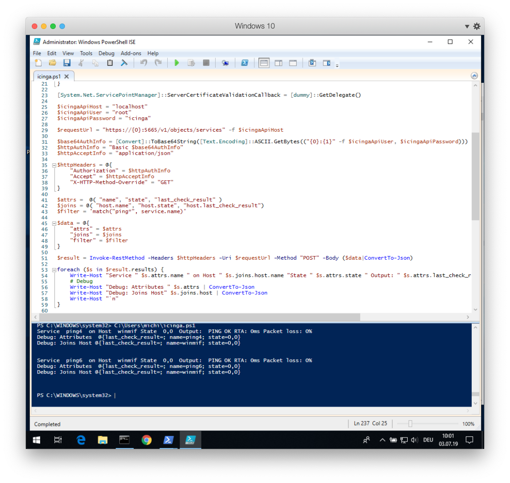

# REST API <a id="icinga2-api"></a>

* [Setup](12-icinga2-api.md#icinga2-api-setup)
* [Introduction](12-icinga2-api.md#icinga2-api-introduction)
* Endpoints
    * [Config Objects](12-icinga2-api.md#icinga2-api-config-objects)
    * [Actions](12-icinga2-api.md#icinga2-api-actions)
    * [Event Streams](12-icinga2-api.md#icinga2-api-event-streams)
    * [Status and Statistics](12-icinga2-api.md#icinga2-api-status)
    * [Config Management](12-icinga2-api.md#icinga2-api-config-management)
    * [Types](12-icinga2-api.md#icinga2-api-types)
    * [Templates](12-icinga2-api.md#icinga2-api-config-templates)
    * [Variables](12-icinga2-api.md#icinga2-api-variables)
    * [Debug Console](12-icinga2-api.md#icinga2-api-console)
* [API Clients](12-icinga2-api.md#icinga2-api-clients)
    * [Programmatic Examples](12-icinga2-api.md#icinga2-api-clients-programmatic-examples)


## Setting up the API <a id="icinga2-api-setup"></a>

You can run the CLI command `icinga2 api setup` to enable the
`api` [feature](11-cli-commands.md#enable-features) and set up
certificates as well as a new API user `root` with an auto-generated password in the
`/etc/icinga2/conf.d/api-users.conf` configuration file:

```bash
icinga2 api setup
```

Make sure to restart Icinga 2 to enable the changes you just made:

```bash
systemctl restart icinga2
```

If you prefer to set up the API manually, you will have to perform the following steps:

* Set up X.509 TLS certificates for Icinga 2
* Enable the `api` feature (`icinga2 feature enable api`)
* Create an `ApiUser` object for authentication

The next chapter provides a quick overview of how you can use the API.

## Introduction <a id="icinga2-api-introduction"></a>

The Icinga 2 API allows you to manage configuration objects
and resources in a simple, programmatic way using HTTP requests.

The URL endpoints are logically separated allowing you to easily
make calls to

* query, create, modify and delete [config objects](12-icinga2-api.md#icinga2-api-config-objects)
* perform [actions](12-icinga2-api.md#icinga2-api-actions) (reschedule checks, etc.)
* subscribe to [event streams](12-icinga2-api.md#icinga2-api-event-streams)
* [manage configuration packages](12-icinga2-api.md#icinga2-api-config-management)
* evaluate [script expressions](12-icinga2-api.md#icinga2-api-console)

### Requests <a id="icinga2-api-requests"></a>

Any tool capable of making HTTP requests can communicate with
the API, for example [curl](https://curl.haxx.se/).

Requests are only allowed to use the HTTPS protocol so that
traffic remains encrypted.

By default the Icinga 2 API listens on port `5665` which is shared with
the cluster stack. The port can be changed by setting the `bind_port` attribute
for the [ApiListener](09-object-types.md#objecttype-apilistener)
object in the `/etc/icinga2/features-available/api.conf`
configuration file.

Supported request methods:

  Method | Usage
  -------|--------
  GET    | Retrieve information about configuration objects. Any request using the GET method is read-only and does not affect any objects.
  POST   | Update attributes of a specified configuration object.
  PUT    | Create a new object. The PUT request must include all attributes required to create a new object.
  DELETE | Remove an object created by the API. The DELETE method is idempotent and does not require any check if the object actually exists.

All requests except `GET` require the following `Accept` header:

```
Accept: application/json
```

Each URL is prefixed with the API version (currently "/v1").

HTTP header size is limited to 8KB per request.

### Responses <a id="icinga2-api-responses"></a>

Successful requests will send back a response body containing a `results`
list. Depending on the number of affected objects in your request, the
`results` list may contain more than one entry.

The output will be sent back as a JSON object:

```json
{
    "results": [
        {
            "code": 200.0,
            "status": "Object was created."
        }
    ]
}
```

> **Tip**
>
> You can use the [pretty](12-icinga2-api.md#icinga2-api-parameters-global) parameter to beautify the JSON response.

You can also use [jq](https://stedolan.github.io/jq/) or `python -m json.tool`
in combination with curl on the CLI.

```bash
curl ... | jq 
curl ... | python -m json.tool
```

jq also has additional filter capabilities, as shown in [this blogpost](https://www.netways.de/blog/2018/08/24/json-in-bequem/).

```bash
curl ... |jq '{name: .results[].name}'
```

For programmatic examples in various languages, check the chapter
[below](12-icinga2-api.md#icinga2-api-clients).

> **Note**
>
> Future versions of Icinga 2 might set additional fields. Your application
> should gracefully handle fields it is not familiar with, for example by
> ignoring them.

### HTTP Statuses <a id="icinga2-api-http-statuses"></a>

The API will return standard [HTTP statuses](https://www.ietf.org/rfc/rfc2616.txt)
including error codes.

When an error occurs, the response body will contain additional information
about the problem and its source. Set `verbose` to true to retrieve more
insights into what may be causing the error.

A status code between 200 and 299 generally means that the request was
successful.

Return codes within the 400 range indicate that there was a problem with the
request. Either you did not authenticate correctly, you are missing the authorization
for your requested action, the requested object does not exist or the request
was malformed.

A status in the range of 500 generally means that there was a server-side problem
and Icinga 2 is unable to process your request.

### Security <a id="icinga2-api-security"></a>

* HTTPS only.
* TLS v1.2+ is required.
* TLS cipher lists are hardened [by default](09-object-types.md#objecttype-apilistener).
* Authentication is [required](12-icinga2-api.md#icinga2-api-authentication).

### Authentication <a id="icinga2-api-authentication"></a>

There are two different ways for authenticating against the Icinga 2 API:

* Username and password using HTTP basic auth
* X.509 client certificate

In order to configure a new API user you'll need to add a new [ApiUser](09-object-types.md#objecttype-apiuser)
configuration object. In this example `root` will be the basic auth username
and the `password` attribute contains the basic auth password.

```
# vim /etc/icinga2/conf.d/api-users.conf

object ApiUser "root" {
  password = "icinga"
}
```

Alternatively you can use X.509 client certificates by specifying the `client_cn`
the API should trust. The X.509 certificate has to be signed by the CA certificate
that is configured in the [ApiListener](09-object-types.md#objecttype-apilistener) object.

```
# vim /etc/icinga2/conf.d/api-users.conf

object ApiUser "root" {
  client_cn = "CertificateCommonName"
}
```

An `ApiUser` object can have both authentication methods configured.

#### Authentication Test <a id="icinga2-api-authentication-test"></a>

You can test authentication by sending a GET request to the API:

```bash
curl -k -s -S -i -u root:icinga 'https://localhost:5665/v1'
```

In case you get an error message make sure to check the API user credentials.

When using client certificates for authentication you'll need to pass your client certificate
and private key to the curl call:

```bash
curl -k --cert example.localdomain.crt --key example.localdomain.key 'https://example.localdomain:5665/v1/status'
```

In case of an error make sure to verify the client certificate and CA.

The curl parameter `-k` disables certificate verification and should therefore
only be used for testing. In order to securely check each connection you'll need to
specify the trusted CA certificate using the curl parameter`--cacert`:

```bash
curl -u root:icinga --cacert ca.crt 'icinga2.node1.localdomain:5665/v1'
```

Read the next chapter on [API permissions](12-icinga2-api.md#icinga2-api-permissions)
in order to configure authorization settings for your newly created API user.

### Permissions <a id="icinga2-api-permissions"></a>

By default an API user does not have any permissions to perform
actions on the URL endpoints.

Permissions for API users must be specified in the `permissions` attribute
as array. The array items can be a list of permission strings with wildcard
matches. Please notice, that the permission system that is used by the API differs from the permission system used by the Icinga Web 2 frontend or other parts of Icinga 2.

The permission system mainly relies on the url scheme of the API endpoints (See listing below).

Example for an API user with all permissions:

```
permissions = [ "*" ]
```

Note that you can use wildcards to include all possible hierarchically lower items. Here's another example that only allows the user
to perform read-only object queries for hosts and services:

```
permissions = [ "objects/query/Host", "objects/query/Service" ]
```

You can also further restrict permissions by specifying a filter expression. The
filter expression has to be a [lambda function](17-language-reference.md#nullary-lambdas)
which must return a boolean value.

The following example allows the API user to query all hosts and services which have a
custom variable `os` that matches the regular expression `^Linux`.
The [regex function](18-library-reference.md#global-functions-regex) is available as global function.

```
permissions = [
  {
    permission = "objects/query/Host"
    filter = {{ regex("^Linux", host.vars.os) }}
  },
  {
    permission = "objects/query/Service"
    filter = {{ regex("^Linux", service.vars.os) }}
  }
]
```

More information about filters can be found in the [filters](12-icinga2-api.md#icinga2-api-filters) chapter.

Prior to setting complex permissions, ensure to always [test](12-icinga2-api.md#icinga2-api-authentication-test)
them step by step.


#### Overview <a id="icinga2-api-permissions-overview"></a>

Permissions are tied to a maximum HTTP request size to prevent abuse, responses sent by Icinga are not limited.
An API user with all permissions ("\*") may send up to 512 MB regardless of the endpoint.

Available permissions for specific URL endpoints:

  Permissions                   | URL Endpoint  | Supports filters  | Max body size in MB
  ------------------------------|---------------|-------------------|---------------------
  actions/&lt;action&gt;        | /v1/actions   | Yes               | 1
  config/query                  | /v1/config    | No                | 1
  config/modify                 | /v1/config    | No                | 512
  console                       | /v1/console   | No                | 1
  events/&lt;type&gt;           | /v1/events    | No                | 1
  objects/query/&lt;type&gt;    | /v1/objects   | Yes               | 1
  objects/create/&lt;type&gt;   | /v1/objects   | No                | 1
  objects/modify/&lt;type&gt;   | /v1/objects   | Yes               | 1
  objects/delete/&lt;type&gt;   | /v1/objects   | Yes               | 1
  status/query                  | /v1/status    | Yes               | 1
  templates/&lt;type&gt;        | /v1/templates | Yes               | 1
  types                         | /v1/types     | Yes               | 1
  variables                     | /v1/variables | Yes               | 1

The required actions or types can be replaced by using a wildcard match ("\*").


### Parameters <a id="icinga2-api-parameters"></a>

Depending on the request method there are two ways of passing parameters to the request:

* JSON object as request body (all request methods other than `GET`)
* Query string as URL parameter (all request methods)

Reserved characters by the HTTP protocol must be [URL-encoded](https://en.wikipedia.org/wiki/Percent-encoding)
as query string, e.g. a space character becomes `%20`.

Example for a URL-encoded query string:

```
/v1/objects/hosts?filter=match(%22example.localdomain*%22,host.name)&attrs=name&attrs=state
```

Here are the exact same query parameters as a JSON object:

```json
{ "filter": "match(\"example.localdomain*\",host.name)", "attrs": [ "host.name", "host.state" ] }
```

The [match function](18-library-reference.md#global-functions-match) is available as global function
in Icinga 2.

Whenever filters and other URL parameters don't work due to encoding issues,
consider passing them in the request body. For GET requests, this method is explained
[here](12-icinga2-api.md#icinga2-api-requests-method-override).

You can use [jo](https://github.com/jpmens/jo) to format JSON strings on the shell. An example
for API actions shown [here](12-icinga2-api.md#icinga2-api-actions-unix-timestamps).


### Global Parameters <a id="icinga2-api-parameters-global"></a>

Name            | Description
----------------|--------------------
pretty          | Pretty-print the JSON response.
verbose         | Add verbose debug information inside the `diagnostic_information` key into the response if available. This helps with troubleshooting failing requests.

Example as URL parameter:

```
/v1/objects/hosts?pretty=1
```

Example as JSON object:

```json
{ "pretty": true }
```

### Request Method Override <a id="icinga2-api-requests-method-override"></a>

`GET` requests do not allow you to send a request body. In case you cannot pass everything as URL
parameters (e.g. complex filters or JSON-encoded dictionaries) you can use the `X-HTTP-Method-Override`
header. This comes in handy when you are using HTTP proxies disallowing `PUT` or `DELETE` requests too.

Query an existing object by sending a `POST` request with `X-HTTP-Method-Override: GET` as request header:

```bash
curl -k -s -S -i -u 'root:icinga' -H 'Accept: application/json' \
 -H 'X-HTTP-Method-Override: GET' -X POST \
 'https://localhost:5665/v1/objects/hosts'
```

Delete an existing object by sending a `POST` request with `X-HTTP-Method-Override: DELETE` as request header:

```bash
curl -k -s -S -i -u 'root:icinga' -H 'Accept: application/json' \
 -H 'X-HTTP-Method-Override: DELETE' -X POST \
 'https://localhost:5665/v1/objects/hosts/example.localdomain'
```

Query objects with complex filters. For a detailed introduction into filter, please
read the [following chapter](12-icinga2-api.md#icinga2-api-filters).

```bash
curl -k -s -S -i -u 'root:icinga' -H 'Accept: application/json' \
 -H 'X-HTTP-Method-Override: GET' -X POST \
 'https://localhost:5665/v1/objects/services' \
 -d '{ "filter": "service.state==2 && match(\"ping*\",service.name)" }'
```

### Filters <a id="icinga2-api-filters"></a>

#### Simple Filters <a id="icinga2-api-simple-filters"></a>

By default actions and queries operate on all objects unless further restricted by the user. For
example, the following query returns all `Host` objects:

```
https://localhost:5665/v1/objects/hosts
```

If you're only interested in a single object, you can limit the output to that object by specifying its name:

```
https://localhost:5665/v1/objects/hosts?host=localhost
```

**The name of the URL parameter is the lower-case version of the type the query applies to.** For
example, for `Host` objects the URL parameter therefore is `host`, for `Service` objects it is
`service` and so on.

You can also specify multiple objects:

```
https://localhost:5665/v1/objects/hosts?hosts=first-host&hosts=second-host
```

Again -- like in the previous example -- the name of the URL parameter is the lower-case version of the type. However, because we're specifying multiple objects here the **plural form** of the type is used.

When specifying names for objects which have composite names like for example services the
full name has to be used:

```
https://localhost:5665/v1/objects/services?service=localhost!ping6
```

The full name of an object can be obtained by looking at the `__name` attribute.

#### Advanced Filters <a id="icinga2-api-advanced-filters"></a>

Most of the information provided in this chapter applies to both permission filters (as used when
configuring `ApiUser` objects) and filters specified in queries.

Advanced filters allow users to filter objects using lambda expressions.
The syntax for these filters is the same like for [apply rule expressions](03-monitoring-basics.md#using-apply-expressions).

The `filter` parameter can only be specified once, complex filters must
be defined once in the provided string value.

> **Note**
>
> Filters used as URL parameter must be URL-encoded. The following examples
> are **not URL-encoded** for better readability.

Example matching all services in NOT-OK state:

```
https://localhost:5665/v1/objects/services?filter=service.state!=ServiceOK
```

Example [matching](18-library-reference.md#global-functions-match) all hosts by a name string pattern:

```
https://localhost:5665/v1/objects/hosts?filter=match("example.localdomain*",host.name)
```

Example for all hosts which are in the host group `linux-servers`:
```
https://localhost:5665/v1/objects/hosts?filter="linux-servers" in host.groups
```

> **Tip**
>
> Best practice for filters is to use [X-HTTP-Method-Override](12-icinga2-api.md#icinga2-api-requests-method-override)
> for GET requests and always pass them in the request body.

User-specified filters are run in a sandbox environment which ensures that filters cannot
modify Icinga's state, for example object attributes or global variables.

When querying objects of a specific type the filter expression is evaluated for each object
of that type. The object is made available to the filter expression as a variable whose name
is the lower-case version of the object's type name.

For example when querying objects of type `Host` the variable in the filter expression is named
`host`. Additionally related objects such as the host's check command are also made available
(e.g., via the `check_command` variable). The variable names are the exact same as for the `joins`
query parameter; see [object query joins](12-icinga2-api.md#icinga2-api-config-objects-query-joins)
for details.

The object is also made available via the `obj` variable. This makes it easier to build
filters which can be used for more than one object type (e.g., for permissions).

Some queries can be performed for more than just one object type. One example is the 'reschedule-check'
action which can be used for both hosts and services. When using advanced filters you will also have to specify the
type using the `type` parameter:

```bash
curl -k -s -S -i -u root:icinga -H 'Accept: application/json' -X POST \
 'https://localhost:5665/v1/actions/reschedule-check' \
 -d '{ "type": "Service", "filter": "service.name==\"ping6\"", "pretty": true }'
```

##### Filter Variables <a id="icinga2-api-advanced-filters-variables"></a>

Filter values need to be escaped in the same way as in the Icinga 2 DSL.

The example below is not valid:

```
-d '{ "type": "Host", "filter": ""linux-servers" in host.groups" }'
```

The double quotes need to be escaped with a preceeding backslash:

```
-d '{ "type": "Host", "filter": "\"linux-servers\" in host.groups" }'
```

You can use the `filter_vars` attribute to avoid additional escaping.
This follows the same principle as with parameter binding known from RDBMS.
Specify a placeholder variable inside the `filter` string, and actually
assign its value inside the `filter_vars` dictionary.

That way you can also keep the `filter` string the same for different
requests with only changing the `filter_vars`.

```bash
curl -k -s -S -i -u 'root:icinga' -H 'Accept: application/json' \
 -H 'X-HTTP-Method-Override: GET' -X POST \
 'https://localhost:5665/v1/objects/hosts' \
 -d '{ "filter": "group in host.groups", "filter_vars": { "group": "linux-servers" }, "pretty": true }'
```

We're using [X-HTTP-Method-Override](12-icinga2-api.md#icinga2-api-requests-method-override) here because
the HTTP specification does not allow message bodies for GET requests.

The `filters_vars` attribute can only be used inside the request body, but not as
a URL parameter because there is no way to specify a dictionary in a URL.

The example from [X-HTTP-Method-Override](12-icinga2-api.md#icinga2-api-requests-method-override)
can be enhanced to avoid additional parameter value escaping.

```bash
curl -k -s -S -i -u 'root:icinga' -H 'Accept: application/json' \
 -H 'X-HTTP-Method-Override: GET' -X POST \
 'https://localhost:5665/v1/objects/services' \
 -d '{ "filter": "service.state==state && match(pattern,service.name)", "filter_vars": { "state": 2, "pattern": "ping*" } }'
```

## Config Objects <a id="icinga2-api-config-objects"></a>

Provides methods to manage configuration objects:

* [creating objects](12-icinga2-api.md#icinga2-api-config-objects-create)
* [querying objects](12-icinga2-api.md#icinga2-api-config-objects-query)
* [modifying objects](12-icinga2-api.md#icinga2-api-config-objects-modify)
* [deleting objects](12-icinga2-api.md#icinga2-api-config-objects-delete)

### API Objects and Cluster Config Sync <a id="icinga2-api-config-objects-cluster-sync"></a>

Newly created or updated objects can be synced throughout your
Icinga 2 cluster. Set the `zone` attribute to the zone this object
belongs to and let the API and cluster handle the rest.

Objects without a zone attribute are only synced in the same zone the Icinga instance belongs to.

> **Note**
>
> Cluster nodes must accept configuration for creating, modifying
> and deleting objects. Ensure that `accept_config` is set to `true`
> in the [ApiListener](09-object-types.md#objecttype-apilistener) object
> on each node.

If you add a new cluster instance, or reconnect an instance which has been offline
for a while, Icinga 2 takes care of the initial object sync for all objects
created by the API.

### Querying Objects <a id="icinga2-api-config-objects-query"></a>

You can request information about configuration objects by sending
a `GET` query to the `/v1/objects/<type>` URL endpoint. `<type` has
to be replaced with the plural name of the object type you are interested
in:

```bash
curl -k -s -S -i -u root:icinga 'https://localhost:5665/v1/objects/hosts'
```

A list of all available configuration types is available in the
[object types](09-object-types.md#object-types) chapter.

The following URL parameters are available:

  Parameters | Type         | Description
  -----------|--------------|----------------------------
  attrs      | Array        | **Optional.** Limited attribute list in the output.
  joins      | Array        | **Optional.** Join related object types and their attributes specified as list (`?joins=host` for the entire set, or selectively by `?joins=host.name`).
  meta       | Array        | **Optional.** Enable meta information using `?meta=used_by` (references from other objects) and/or `?meta=location` (location information) specified as list. Defaults to disabled.

In addition to these parameters a [filter](12-icinga2-api.md#icinga2-api-filters) may be provided.

Instead of using a filter you can optionally specify the object name in the
URL path when querying a single object. For objects with composite names
(e.g. services) the full name (e.g. `example.localdomain!http`) must be specified:

```bash
curl -k -s -S -i -u root:icinga 'https://localhost:5665/v1/objects/services/example.localdomain!http'
```

You can limit the output to specific attributes using the `attrs` URL parameter:

```bash
curl -k -s -S -i -u root:icinga 'https://localhost:5665/v1/objects/hosts/example.localdomain?attrs=name&attrs=address&pretty=1'
```

```json
{
    "results": [
        {
            "attrs": {
                "name": "example.localdomain",
                "address": "192.168.1.1"
            },
            "joins": {},
            "meta": {},
            "name": "example.localdomain",
            "type": "Host"
        }
    ]
}
```

#### Object Queries Result <a id="icinga2-api-config-objects-query-result"></a>

Each response entry in the results array contains the following attributes:

  Attribute  | Type       | Description
  -----------|------------|--------------
  name       | String     | Full object name.
  type       | String     | Object type.
  attrs      | Dictionary | Object attributes (can be filtered using the URL parameter `attrs`).
  joins      | Dictionary | [Joined object types](12-icinga2-api.md#icinga2-api-config-objects-query-joins) as key, attributes as nested dictionary. Disabled by default.
  meta       | Dictionary | Contains `used_by` object references. Disabled by default, enable it using `?meta=used_by` as URL parameter.

#### Object Query Joins <a id="icinga2-api-config-objects-query-joins"></a>

Icinga 2 knows about object relations. For example it can optionally return
information about the host when querying service objects.

The following query retrieves all host attributes:

```
https://localhost:5665/v1/objects/services?joins=host
```

Instead of requesting all host attributes you can also limit the output to specific
attributes:

```
https://localhost:5665/v1/objects/services?joins=host.name&joins=host.address
```

You can request that all available joins are returned in the result set by using
the `all_joins` query parameter.

```
https://localhost:5665/v1/objects/services?all_joins=1
```

> **Note**
>
> For performance reasons you should only request attributes which your application
> requires.

Please note that the object type refers to the URL endpoint with `/v1/objects/<object type>`
where the following joins are available:

  Object Type  | Object Relations (`joins` prefix name)
  -------------|------------------------------------------
  Service      | host, check\_command, check\_period, event\_command, command\_endpoint
  Host         | check\_command, check\_period, event\_command, command\_endpoint
  Notification | host, service, command, period
  Dependency   | child\_host, child\_service, parent\_host, parent\_service, period
  User         | period
  Zones        | parent

Here's an example that retrieves all service objects for hosts which have had their `os`
custom variable set to `Linux`. The result set contains the `display_name` and `check_command`
attributes for the service. The query also returns the host's `name` and `address` attribute
via a join:

```bash
curl -k -s -S -i -u root:icinga 'https://localhost:5665/v1/objects/services?attrs=display_name&attrs=check_command&joins=host.name&joins=host.address&filter=host.vars.os==%22Linux%22&pretty=1'
```

```json
{
    "results": [
        {
            "attrs": {
                "check_command": "ping4",
                "display_name": "ping4"
            },
            "joins": {
                "host": {
                    "address": "192.168.1.1",
                    "name": "example.localdomain"
                }
            },
            "meta": {},
            "name": "example.localdomain!ping4",
            "type": "Service"
        },
        {
            "attrs": {
                "check_command": "ssh",
                "display_name": "ssh"
            },
            "joins": {
                "host": {
                    "address": "192.168.1.1",
                    "name": "example.localdomain"
                }
            },
            "meta": {},
            "name": "example.localdomain!ssh",
            "type": "Service"
        }
    ]
}
```

> **Tip**
>
> Use [X-HTTP-Method-Override](12-icinga2-api.md#icinga2-api-requests-method-override)
> and pass everything in the request body like this:

```bash
curl -k -s -S -i -u 'root:icinga' -H 'Accept: application/json' \
 -H 'X-HTTP-Method-Override: GET' -X POST \
 'https://localhost:5665/v1/objects/services' \
 -d '{ "attrs": [ "display_name", "check_command" ], "joins": [ "host.name", "host.address" ], "filter": "host.vars.os==\"Linux\"", "pretty": true }'
```

In case you want to fetch all [comments](09-object-types.md#objecttype-comment)
for hosts and services, you can use the following query URL (similar example
for downtimes):

```
https://localhost:5665/v1/objects/comments?joins=host&joins=service
```

This is another example for listing all service objects which are unhandled problems (state is not OK
and no downtime or acknowledgement set). We're using [X-HTTP-Method-Override](12-icinga2-api.md#icinga2-api-requests-method-override)
here because we want to pass all query attributes in the request body.

```bash
curl -k -s -S -i -u root:icinga -H 'Accept: application/json' \
 -H 'X-HTTP-Method-Override: GET' -X POST \
 'https://127.0.0.1:5665/v1/objects/services' \
-d '{ "joins": [ "host.name", "host.address" ], "attrs": [ "name", "state", "downtime_depth", "acknowledgement" ], "filter": "service.state != ServiceOK && service.downtime_depth == 0.0 && service.acknowledgement == 0.0", "pretty": true }'
```

```json
{
    "results": [
        {
            "attrs": {
                "acknowledgement": 0.0,
                "downtime_depth": 0.0,
                "name": "10807-service",
                "state": 3.0
            },
            "joins": {
                "host": {
                    "address": "",
                    "name": "10807-host"
                }
            },
            "meta": {},
            "name": "10807-host!10807-service",
            "type": "Service"
        }
    ]
}
```

In order to list all acknowledgements without expire time, you query the `/v1/objects/comments`
URL endpoint with `joins` and `filter` request parameters using the [X-HTTP-Method-Override](12-icinga2-api.md#icinga2-api-requests-method-override)
method:

```bash
curl -k -s -S -i -u root:icinga -H 'Accept: application/json' \
 -H 'X-HTTP-Method-Override: GET' -X POST \
 'https://localhost:5665/v1/objects/comments' \
 -d '{ "joins": [ "service.name", "service.acknowledgement", "service.acknowledgement_expiry" ], "attrs": [ "author", "text" ], "filter": "service.acknowledgement!=0 && service.acknowledgement_expiry==0", "pretty": true }'
```

```json
{
    "results": [
        {
            "attrs": {
                "author": "icingaadmin",
                "text": "maintenance work"
            },
            "joins": {
                "service": {
                    "__name": "example.localdomain!disk /",
                    "acknowledgement": 1.0,
                    "acknowledgement_expiry": 0.0
                }
            },
            "meta": {},
            "name": "example.localdomain!disk /!example.localdomain-1495457222-0",
            "type": "Comment"
        }
    ]
}
```

### Creating Config Objects <a id="icinga2-api-config-objects-create"></a>

New objects must be created by sending a PUT request. The following
parameters need to be passed inside the JSON body:

  Parameters        | Type         | Description
  ------------------|--------------|--------------------------
  templates         | Array        | **Optional.** Import existing configuration templates for this object type. Note: These templates must either be statically configured or provided in [config packages](12-icinga2-api.md#icinga2-api-config-management)-
  attrs             | Dictionary   | **Required.** Set specific object attributes for this [object type](09-object-types.md#object-types).
  ignore\_on\_error | Boolean      | **Optional.** Ignore object creation errors and return an HTTP 200 status instead.

The object name must be specified as part of the URL path. For objects with composite names (e.g. services)
the full name (e.g. `example.localdomain!http`) must be specified.

If attributes are of the Dictionary type, you can also use the indexer format. This might be necessary to only override specific custom variables and keep all other existing custom variables (e.g. from templates):

```
"attrs": { "vars.os": "Linux" }
```

Example for creating the new host object `example.localdomain`:

```bash
curl -k -s -S -i -u root:icinga -H 'Accept: application/json' \
 -X PUT 'https://localhost:5665/v1/objects/hosts/example.localdomain' \
 -d '{ "templates": [ "generic-host" ], "attrs": { "address": "192.168.1.1", "check_command": "hostalive", "vars.os" : "Linux" }, "pretty": true }'
```

```json
{
    "results": [
        {
            "code": 200.0,
            "status": "Object was created."
        }
    ]
}
```

If the configuration validation fails, the new object will not be created and the response body
contains a detailed error message. The following example is missing the `check_command` attribute
which is required for host objects:

```bash
curl -k -s -S -i -u root:icinga -H 'Accept: application/json' \
 -X PUT 'https://localhost:5665/v1/objects/hosts/example.localdomain' \
 -d '{ "attrs": { "address": "192.168.1.1", "vars.os" : "Linux" }, "pretty": true }'
```

```json
{
    "results": [
        {
            "code": 500.0,
            "errors": [
                "Error: Validation failed for object 'example.localdomain' of type 'Host'; Attribute 'check_command': Attribute must not be empty."
            ],
            "status": "Object could not be created."
        }
    ]
}
```

Service objects must be created using their full name ("hostname!servicename") referencing an existing host object:

```bash
curl -k -s -S -i -u root:icinga -H 'Accept: application/json' \
 -X PUT 'https://localhost:5665/v1/objects/services/example.localdomain!realtime-load' \
 -d '{ "templates": [ "generic-service" ], "attrs": { "check_command": "load", "check_interval": 1,"retry_interval": 1 } }'
```

Example for a new CheckCommand object:

```bash
curl -k -s -S -i -u root:icinga -H 'Accept: application/json' \
 -X PUT 'https://localhost:5665/v1/objects/checkcommands/mytest' \
 -d '{ "templates": [ "plugin-check-command" ], "attrs": { "command": [ "/usr/local/sbin/check_http" ], "arguments": { "-I": "$mytest_iparam$" } } }'
```

### Modifying Objects <a id="icinga2-api-config-objects-modify"></a>

Existing objects must be modified by sending a `POST` request. The following
parameters need to be passed inside the JSON body:

| Parameters     | Type       | Description                                                                                                                |
|----------------|------------|----------------------------------------------------------------------------------------------------------------------------|
| attrs          | Dictionary | **Optional.** Set specific object attributes for this [object type](09-object-types.md#object-types).                      |
| restore\_attrs | Array      | **Optional.** Discard modifications of specific object attributes for this [object type](09-object-types.md#object-types). |

One of the above is required.

!!! info

    If a particular attribute is given in both sets,
    it's first restored and then set to the desired new value.

In addition to these parameters a [filter](12-icinga2-api.md#icinga2-api-filters)
parameter should be provided.

> **Note**:
>
> Modified attributes do not trigger a re-evaluation of existing
> static [apply rules](03-monitoring-basics.md#using-apply) and [group assignments](03-monitoring-basics.md#group-assign-intro).
> Delete and re-create the objects if you require such changes or
> consider funding [this feature request](https://github.com/Icinga/icinga2/issues/4084).
>
> Furthermore you cannot modify templates which have already been resolved
> during [object creation](12-icinga2-api.md#icinga2-api-config-objects-create).
> There are attributes which can only be set for [PUT requests](12-icinga2-api.md#icinga2-api-config-objects-create) such as `groups`
> or `zone`. A complete list of `no_user_modify` attributes can be fetched from the [types](12-icinga2-api.md#icinga2-api-types) URL endpoint.

If attributes are of the [Dictionary](17-language-reference.md#dictionary) type, you can also use the indexer format:

```
"attrs": { "vars.os": "Linux" }
```

The following example updates the `address` attribute and the custom variable `os` for the `example.localdomain` host:

```bash
curl -k -s -S -i -u root:icinga -H 'Accept: application/json' \
 -X POST 'https://localhost:5665/v1/objects/hosts/example.localdomain' \
 -d '{ "attrs": { "address": "192.168.1.2", "vars.os" : "Windows" }, "pretty": true }'
```

```json
{
    "results": [
        {
            "code": 200.0,
            "name": "example.localdomain",
            "status": "Attributes updated.",
            "type": "Host"
        }
    ]
}
```

To undo such modifications to specific object attributes,
list the latter in the `restore_attrs` parameter. E.g.:

```bash
curl -k -s -S -i -u root:icinga -H 'Accept: application/json' \
 -X POST 'https://localhost:5665/v1/objects/hosts/example.localdomain' \
 -d '{ "restore_attrs": [ "address", "vars.os" ] }, "pretty": true }'
```

```json
{
    "results": [
        {
            "code": 200.0,
            "name": "example.localdomain",
            "status": "Attributes updated.",
            "type": "Host"
        }
    ]
}
```

Giving `attrs` with the original value would have almost the same effect.
But in this case Icinga would still store that value as a modified attribute,
overriding DSL/Director config (changes). In contrast, `restore_attrs` tells
Icinga to actually forget particular modified attributes, so that changes to
them via Director or plain config are effective again.

### Deleting Objects <a id="icinga2-api-config-objects-delete"></a>

You can delete objects created using the API by sending a `DELETE`
request.

  Parameters | Type    | Description
  -----------|---------|---------------
  cascade    | Boolean |  **Optional.** Delete objects depending on the deleted objects (e.g. services on a host).

In addition to these parameters a [filter](12-icinga2-api.md#icinga2-api-filters) should be provided.

Example for deleting the host object `example.localdomain`:

```bash
curl -k -s -S -i -u root:icinga -H 'Accept: application/json' \
 -X DELETE 'https://localhost:5665/v1/objects/hosts/example.localdomain?cascade=1&pretty=1'
```

```json
{
    "results": [
        {
            "code": 200.0,
            "name": "example.localdomain",
            "status": "Object was deleted.",
            "type": "Host"
        }
    ]
}
```

## Actions <a id="icinga2-api-actions"></a>

There are several actions available for Icinga 2 provided by the `/v1/actions`
URL endpoint. You can run actions by sending a `POST` request.

The following actions are also used by [Icinga Web 2](https://icinga.com/products/icinga-web-2/):

* sending check results to Icinga from scripts, remote agents, etc.
* scheduling downtimes from external scripts or cronjobs
* acknowledging problems
* adding comments

All actions return a 200 `OK` or an appropriate error code for each
action performed on each object matching the supplied filter.

Actions which affect the Icinga Application itself such as disabling
notification on a program-wide basis must be applied by updating the
[IcingaApplication object](12-icinga2-api.md#icinga2-api-config-objects)
called `app`.

```bash
curl -k -s -S -i -u root:icinga -H 'Accept: application/json' \
 -X POST 'https://localhost:5665/v1/objects/icingaapplications/app' \
 -d '{ "attrs": { "enable_notifications": false } }'
```

### Unix Timestamp Handling <a id="icinga2-api-actions-unix-timestamps"></a>

If you don't want to write JSON manually, especially for adding the `start_time`
and `end_time` parameters, you can use [jo](https://github.com/jpmens/jo) to format this.

```bash
jo -p pretty=true type=Service filter="service.name==\"ping4\"" author=icingaadmin comment="IPv4 network maintenance" fixed=true start_time=$(date +%s -d "+0 hour") end_time=$(date +%s -d "+1 hour")
```

```json
{
   "pretty": true,
   "type": "Service",
   "filter": "service.name==\"ping4\"",
   "author": "icingaadmin",
   "comment": "IPv4 network maintenance",
   "fixed": true,
   "start_time": 1557414097,
   "end_time": 1557417697
}
```

Now wrap this into the actual curl command:

```bash
curl -k -s -S -i -u root:icinga -H 'Accept: application/json' \
 -X POST 'https://localhost:5665/v1/actions/schedule-downtime' \
 -d "$(jo -p pretty=true type=Service filter="service.name==\"ping4\"" author=icingaadmin comment="IPv4 network maintanence" fixed=true start_time=$(date +%s -d "+0 hour") end_time=$(date +%s -d "+1 hour"))"
```

Note: This requires GNU date. On macOS, install `coreutils` from Homebrew and use `gdate`.

### process-check-result <a id="icinga2-api-actions-process-check-result"></a>

Process a check result for a host or a service.

Send a `POST` request to the URL endpoint `/v1/actions/process-check-result`.

  Parameter          | Type                           | Description
  ------------------ | --------------                 | --------------
  exit\_status       | Number                         | **Required.** For services: 0=OK, 1=WARNING, 2=CRITICAL, 3=UNKNOWN, for hosts: 0=UP, 1=DOWN.
  plugin\_output     | String                         | **Required.** One or more lines of the plugin main output. Does **not** contain the performance data.
  performance\_data  | Array<code>&#124;</code>String | **Optional.** The performance data as array of strings. The raw performance data string can be used too.
  check\_command     | Array<code>&#124;</code>String | **Optional.** The first entry should be the check commands path, then one entry for each command line option followed by an entry for each of its argument. Alternativly a single string can be used.
  check\_source      | String                         | **Optional.** Usually the name of the `command_endpoint`
  execution\_start   | Timestamp                      | **Optional.** The timestamp where a script/process started its execution.
  execution\_end     | Timestamp                      | **Optional.** The timestamp where a script/process ended its execution. This timestamp is used in features to determine e.g. the metric timestamp.
  ttl                | Number                         | **Optional.** Time-to-live duration in seconds for this check result. The next expected check result is `now + ttl` where freshness checks are executed.

In addition to these parameters a [filter](12-icinga2-api.md#icinga2-api-filters) must be provided. The valid types for this action are `Host` and `Service`.

Example for the service `passive-ping`:

```bash
curl -k -s -S -i -u root:icinga -H 'Accept: application/json' \
 -X POST 'https://localhost:5665/v1/actions/process-check-result' \
-d '{ "type": "Service", "filter": "host.name==\"icinga2-master1.localdomain\" && service.name==\"passive-ping\"", "exit_status": 2, "plugin_output": "PING CRITICAL - Packet loss = 100%", "performance_data": [ "rta=5000.000000ms;3000.000000;5000.000000;0.000000", "pl=100%;80;100;0" ], "check_source": "example.localdomain", "pretty": true }'
```

```json
{
    "results": [
        {
            "code": 200.0,
            "status": "Successfully processed check result for object 'icinga2-master1.localdomain!passive-ping'."
        }
    ]
}
```

You can avoid URL encoding of white spaces in object names by using the `filter` attribute in the request body.

Example for using the `Host` type and filter by the host name:

```bash
curl -k -s -S -i -u root:icinga -H 'Accept: application/json' \
 -X POST 'https://localhost:5665/v1/actions/process-check-result' \
 -d '{ "filter": "host.name==\"example.localdomain\"", "type": "Host", "exit_status": 1, "plugin_output": "Host is not available." }'
```


> **Note**
>
> Multi-line plugin output requires the following format: The first line is treated as `short` plugin output corresponding
> to the first line of the plugin output. Subsequent lines are treated as `long` plugin output. Please note that the
> performance data is separated from the plugin output and has to be passed as `performance_data` attribute.

### reschedule-check <a id="icinga2-api-actions-reschedule-check"></a>

Reschedule a check for hosts and services. The check can be forced if required.

Send a `POST` request to the URL endpoint `/v1/actions/reschedule-check`.

  Parameter    | Type      | Description
  -------------|-----------|--------------
  next\_check  | Timestamp | **Optional.** The next check will be run at this time. If omitted, the current time is used.
  force        | Boolean   | **Optional.** Defaults to `false`. If enabled, the checks are executed regardless of time period restrictions and checks being disabled per object or on a global basis.

In addition to these parameters a [filter](12-icinga2-api.md#icinga2-api-filters) must be provided. The valid types for this action are `Host` and `Service`.

The example reschedules all services with the name "ping6" to immediately perform a check
(`next_check` default), ignoring any time periods or whether active checks are
allowed for the service (`force=true`).

```bash
curl -k -s -S -i -u root:icinga -H 'Accept: application/json' \
 -X POST 'https://localhost:5665/v1/actions/reschedule-check' \
 -d '{ "type": "Service", "filter": "service.name==\"ping6\"", "force": true, "pretty": true }'
```

```json
{
    "results": [
        {
            "code": 200.0,
            "status": "Successfully rescheduled check for object 'icinga2-master1.localdomain!ping6'."
        }
    ]
}
```

### send-custom-notification <a id="icinga2-api-actions-send-custom-notification"></a>

Send a custom notification for hosts and services. This notification
type can be forced being sent to all users.

Send a `POST` request to the URL endpoint `/v1/actions/send-custom-notification`.

  Parameter | Type    | Description
  ----------|---------|--------------
  author    | String  | **Required.** Name of the author, may be empty.
  comment   | String  | **Required.** Comment text, may be empty.
  force     | Boolean | **Optional.** Default: false. If true, the notification is sent regardless of downtimes or whether notifications are enabled or not.

In addition to these parameters a [filter](12-icinga2-api.md#icinga2-api-filters) must be provided. The valid types for this action are `Host` and `Service`.

Example for a custom host notification announcing a global maintenance to
host owners:

```bash
curl -k -s -S -i -u root:icinga -H 'Accept: application/json' \
 -X POST 'https://localhost:5665/v1/actions/send-custom-notification' \
 -d '{ "type": "Host", "author": "icingaadmin", "comment": "System is going down for maintenance", "force": true, "pretty": true }'
```

```json
{
    "results": [
        {
            "code": 200.0,
            "status": "Successfully sent custom notification for object 'host0'."
        },
        {
            "code": 200.0,
            "status": "Successfully sent custom notification for object 'host1'."
        }
    ]
}
```

### delay-notification <a id="icinga2-api-actions-delay-notification"></a>

Delay notifications for a host or a service.
Note that this will only have an effect if the service stays in the same problem
state that it is currently in. If the service changes to another state, a new
notification may go out before the time you specify in the `timestamp` argument.

Send a `POST` request to the URL endpoint `/v1/actions/delay-notification`.

  Parameter | Type      | Description
  ----------|-----------|--------------
  timestamp | Timestamp | **Required.** Delay notifications until this timestamp.

In addition to these parameters a [filter](12-icinga2-api.md#icinga2-api-filters) must be provided. The valid types for this action are `Host` and `Service`.

Example:

```bash
curl -k -s -S -i -u root:icinga -H 'Accept: application/json' \
 -X POST 'https://localhost:5665/v1/actions/delay-notification' \
 -d '{ "type": "Service", "timestamp": 1446389894, "pretty": true }'
```

```json
{
    "results": [
        {
            "code": 200.0,
            "status": "Successfully delayed notifications for object 'host0!service0'."
        },
        {
            "code": 200.0,
            "status": "Successfully delayed notifications for object 'host1!service1'."
        }
    ]
}
```

### acknowledge-problem <a id="icinga2-api-actions-acknowledge-problem"></a>

Allows you to acknowledge the current problem for hosts or services. By
acknowledging the current problem, future notifications (for the same state if `sticky` is set to `false`)
are disabled.

Send a `POST` request to the URL endpoint `/v1/actions/acknowledge-problem`.

  Parameter            | Type      | Description
  ---------------------|-----------|--------------
  author               | String    | **Required.** Name of the author, may be empty.
  comment              | String    | **Required.** Comment text, may be empty.
  expiry               | Timestamp | **Optional.** Whether the acknowledgement will be removed at the timestamp.
  sticky               | Boolean   | **Optional.** Whether the acknowledgement will be set until the service or host fully recovers. Defaults to `false`.
  notify               | Boolean   | **Optional.** Whether a notification of the `Acknowledgement` type will be sent. Defaults to `false`.
  persistent           | Boolean   | **Optional.** When the comment is of type `Acknowledgement` and this is set to `true`, the comment will remain after the acknowledgement recovers or expires. Defaults to `false`.

In addition to these parameters a [filter](12-icinga2-api.md#icinga2-api-filters) must be provided. The valid types for this action are `Host` and `Service`.

The following example acknowledges all services which are in a hard critical state and sends out
a notification for them:

```bash
curl -k -s -S -i -u root:icinga -H 'Accept: application/json' \
 -X POST 'https://localhost:5665/v1/actions/acknowledge-problem' \
 -d '{ "type": "Service", "filter": "service.state==2 && service.state_type==1", "author": "icingaadmin", "comment": "Global outage. Working on it.", "notify": true, "pretty": true }'
```

```json
{
    "results": [
        {
            "code": 200.0,
            "status": "Successfully acknowledged problem for object 'icinga2-satellite1.localdomain!ping4'."
        },
        {
            "code": 200.0,
            "status": "Successfully acknowledged problem for object 'icinga2-satellite2.localdomain!ping4'."
        }
    ]
}
```

### remove-acknowledgement <a id="icinga2-api-actions-remove-acknowledgement"></a>

Removes the acknowledgements for services or hosts. Once the acknowledgement has
been removed the next notification will be sent again.

Send a `POST` request to the URL endpoint `/v1/actions/remove-acknowledgement`.

  Parameter | Type   | Description
  ----------|--------|--------------
  author    | String | **Optional.** Name of the removal requestor.

In addition to these parameters a [filter](12-icinga2-api.md#icinga2-api-filters) must be provided. The valid types for this action are `Host` and `Service`.

The example removes all service acknowledgements:

```bash
curl -k -s -S -i -u root:icinga -H 'Accept: application/json' \
 -X POST 'https://localhost:5665/v1/actions/remove-acknowledgement' \
 -d '{ "type": "Service", "pretty": true }'
```

```json
{
    "results": [
        {
            "code": 200.0,
            "status": "Successfully removed acknowledgement for object 'host0!service0'."
        },
        {
            "code": 200.0,
            "status": "Successfully removed acknowledgement for object 'example2.localdomain!aws-health'."
        }
    ]
}
```

### add-comment <a id="icinga2-api-actions-add-comment"></a>

Adds a `comment` from an `author` to services or hosts.

Send a `POST` request to the URL endpoint `/v1/actions/add-comment`.

  Parameter | Type      | Description
  ----------|-----------|--------------
  author    | string    | **Required.** Name of the author, may be empty.
  comment   | string    | **Required.** Comment text, may be empty.
  expiry    | Timestamp | **Optional.** Comment expiry time.

In addition to these parameters a [filter](12-icinga2-api.md#icinga2-api-filters) must be provided. The valid types for this action are `Host` and `Service`.

The following example adds a comment for all `ping4` services:

```bash
curl -k -s -S -i -u root:icinga -H 'Accept: application/json' \
 -X POST 'https://localhost:5665/v1/actions/add-comment' \
 -d '{ "type": "Service", "filter": "service.name==\"ping4\"", "author": "icingaadmin", "comment": "Troubleticket #123456789 opened.", "pretty": true }'
```

```json
{
    "results": [
        {
            "code": 200.0,
            "legacy_id": 26.0,
            "name": "icinga2-satellite1.localdomain!ping4!7e7861c8-8008-4e8d-9910-2a0bb26921bd",
            "status": "Successfully added comment 'icinga2-satellite1.localdomain!ping4!7e7861c8-8008-4e8d-9910-2a0bb26921bd' for object 'icinga2-satellite1.localdomain!ping4'."
        },
        {
            "code": 200.0,
            "legacy_id": 27.0,
            "name": "icinga2-satellite2.localdomain!ping4!9a4c43f5-9407-a536-18bf-4a6cc4b73a9f",
            "status": "Successfully added comment 'icinga2-satellite2.localdomain!ping4!9a4c43f5-9407-a536-18bf-4a6cc4b73a9f' for object 'icinga2-satellite2.localdomain!ping4'."
        }
    ]
}
```

### remove-comment <a id="icinga2-api-actions-remove-comment"></a>

Remove the comment using its `name` attribute , returns `OK` if the
comment did not exist.
**Note**: This is **not** the legacy ID but the comment name returned by
Icinga 2 when [adding a comment](12-icinga2-api.md#icinga2-api-actions-add-comment).

Send a `POST` request to the URL endpoint `/v1/actions/remove-comment`.

  Parameter | Type   | Description
  ----------|--------|--------------
  author    | String | **Optional.** Name of the removal requestor.

In addition to these parameters a [filter](12-icinga2-api.md#icinga2-api-filters) must be provided. The valid types for this action are `Host`, `Service` and `Comment`.

Example for a simple filter using the `comment` URL parameter:

```bash
curl -k -s -S -i -u root:icinga -H 'Accept: application/json' \
 -X POST 'https://localhost:5665/v1/actions/remove-comment' \
 -d '{ "comment": "icinga2-satellite2.localdomain!ping4!9a4c43f5-9407-a536-18bf-4a6cc4b73a9f", "pretty": true }'
```

```json
{
    "results": [
        {
            "code": 200.0,
            "status": "Successfully removed comment 'icinga2-satellite2.localdomain!ping4!9a4c43f5-9407-a536-18bf-4a6cc4b73a9f'."
        }
    ]
}
```

Example for removing all service comments using a service name filter for `ping4`:

```bash
curl -k -s -S -i -u root:icinga -H 'Accept: application/json' \
 -X POST 'https://localhost:5665/v1/actions/remove-comment'
 -d '{ "type": "Service", "filter": "service.name==\"ping4\"", "pretty": true }'
```

```json
{
    "results": [
        {
            "code": 200.0,
            "status": "Successfully removed all comments for object 'icinga2-satellite1.localdomain!ping4'."
        },
        {
            "code": 200.0,
            "status": "Successfully removed all comments for object 'icinga2-satellite2.localdomain!ping4'."
        }
    ]
}
```

### schedule-downtime <a id="icinga2-api-actions-schedule-downtime"></a>

Schedule a downtime for hosts and services.

Send a `POST` request to the URL endpoint `/v1/actions/schedule-downtime`.

  Parameter     | Type      | Description
  --------------|-----------|--------------
  author        | String    | **Required.** Name of the author.
  comment       | String    | **Required.** Comment text.
  start\_time   | Timestamp | **Required.** Timestamp marking the beginning of the downtime.
  end\_time     | Timestamp | **Required.** Timestamp marking the end of the downtime.
  fixed         | Boolean   | **Optional.** Defaults to `true`. If true, the downtime is `fixed` otherwise `flexible`. See [downtimes](08-advanced-topics.md#downtimes) for more information.
  duration      | Number    | **Required for flexible downtimes.** Duration of the downtime in seconds if `fixed` is set to false.
  all\_services | Boolean   | **Optional for host downtimes.** Sets downtime for [all services](12-icinga2-api.md#icinga2-api-actions-schedule-downtime-host-all-services) for the matched host objects. If `child_options` are set, all child hosts and their services will schedule a downtime too. Defaults to `false`.
  trigger\_name | String    | **Optional.** Sets the trigger for a triggered downtime. See [downtimes](08-advanced-topics.md#downtimes) for more information on triggered downtimes.
  child\_options| String    | **Optional.** Schedule child downtimes. `DowntimeNoChildren` does not do anything, `DowntimeTriggeredChildren` schedules child downtimes triggered by this downtime, `DowntimeNonTriggeredChildren` schedules non-triggered downtimes. Defaults to `DowntimeNoChildren`.

In addition to these parameters a [filter](12-icinga2-api.md#icinga2-api-filters) must be provided. The valid types for this action are `Host` and `Service`.

Example for scheduling a downtime for all `ping4` services:

```bash
curl -k -s -S -i -u root:icinga -H 'Accept: application/json' \
 -X POST 'https://localhost:5665/v1/actions/schedule-downtime' \
 -d '{ "type": "Service", "filter": "service.name==\"ping4\"", "start_time": 1446388806, "end_time": 1446389806, "author": "icingaadmin", "comment": "IPv4 network maintenance", "pretty": true }'
```

```json
{
    "results": [
        {
            "code": 200.0,
            "legacy_id": 2.0,
            "name": "icinga2-satellite1.localdomain!ping4!ecc5fa55-a5b8-4189-a013-a5d4bb47af34",
            "status": "Successfully scheduled downtime 'icinga2-satellite1.localdomain!ping4!ecc5fa55-a5b8-4189-a013-a5d4bb47af34' for object 'icinga2-satellite1.localdomain!ping4'."
        },
        {
            "code": 200.0,
            "legacy_id": 3.0,
            "name": "icinga2-satellite2.localdomain!ping4!abc59032-4589-abcd-4567-ecf67856c347",
            "status": "Successfully scheduled downtime 'icinga2-satellite2.localdomain!ping4!abc59032-4589-abcd-4567-ecf67856c347' for object 'icinga2-satellite2.localdomain!ping4'."
        }
    ]
}
```

In case you want to target just a single service on a host, modify the filter
like this:

```
"filter": "host.name==\"icinga2-satellite1.localdomain\" && service.name==\"ping4\""
```

#### Schedule Host Downtime(s) with all Services <a id="icinga2-api-actions-schedule-downtime-host-all-services"></a>

Schedule a downtime for one (or multiple) hosts and all of their services.
Note the `all_services` attribute.

```bash
curl -k -s -S -i -u root:icinga -H 'Accept: application/json' \
 -X POST 'https://localhost:5665/v1/actions/schedule-downtime' \
 -d "$(jo -p pretty=true type=Host filter="match(\"*satellite*\", host.name)" all_services=true author=icingaadmin comment="Cluster upgrade maintenance" fixed=true start_time=$(date +%s -d "+0 hour") end_time=$(date +%s -d "+1 hour"))"
```

### remove-downtime <a id="icinga2-api-actions-remove-downtime"></a>

Remove the downtime using its `name` attribute , returns `OK` if the
downtime did not exist.
**Note**: This is **not** the legacy ID but the downtime name returned by
Icinga 2 when [scheduling a downtime](12-icinga2-api.md#icinga2-api-actions-schedule-downtime).

Send a `POST` request to the URL endpoint `/v1/actions/remove-downtime`.

  Parameter | Type   | Description
  ----------|--------|--------------
  author    | String | **Optional.** Name of the removal requestor.

In addition to these parameters a [filter](12-icinga2-api.md#icinga2-api-filters) must be provided. The valid types for this action are `Host`, `Service` and `Downtime`.

When removing a host downtime, service downtimes on this host are automatically deleted if they were created using
the `all_services` option. Other downtimes created using the `child_options` option are not affected.

Example for a simple filter using the `downtime` URL parameter:

```bash
curl -k -s -S -i -u root:icinga -H 'Accept: application/json' \
 -X POST 'https://localhost:5665/v1/actions/remove-downtime' \
 -d '{ "downtime": "icinga2-satellite2.localdomain!ping4!abc59032-4589-abcd-4567-ecf67856c347", "pretty": true }'
```

```json
{
    "results": [
        {
            "code": 200.0,
            "status": "Successfully removed downtime 'icinga2-satellite2.localdomain!ping4!abc59032-4589-abcd-4567-ecf67856c347'."
        }
    ]
}
```

Example for removing all host downtimes using a host name filter for `icinga2-satellite2.localdomain`:

```bash
curl -k -s -S -i -u root:icinga -H 'Accept: application/json' \
 -X POST 'https://localhost:5665/v1/actions/remove-downtime' \
 -d '{ "type": "Host", "filter": "host.name==\"icinga2-satellite2.localdomain\"", "pretty": true }'
```

```json
{
    "results": [
        {
            "code": 200.0,
            "status": "Successfully removed all downtimes for object 'icinga2-satellite2.localdomain'."
        }
    ]
}
```

Example for removing a downtime from a host but not the services filtered by the author name. This example uses
filter variables explained in the [advanced filters](12-icinga2-api.md#icinga2-api-advanced-filters) chapter.

```bash
curl -k -s -S -i -u root:icinga -H 'Accept: application/json' \
 -X POST 'https://localhost:5665/v1/actions/remove-downtime' \
 -d $'{
  "type": "Downtime",
  "filter": "host.name == filterHost && !service && downtime.author == filterAuthor",
  "filter_vars": {
    "filterHost": "icinga2-satellite1.localdomain",
    "filterAuthor": "icingaadmin"
  },
  "pretty": true
}'
```

```json
{
    "results": [
        {
            "code": 200.0,
            "status": "Successfully removed downtime 'icinga2-satellite1.localdomain!ecc5fa55-a5b8-ef34-abcd-a5d41234af34'."
        }
    ]
}
```

### shutdown-process <a id="icinga2-api-actions-shutdown-process"></a>

Shuts down Icinga. May or may not return.

Send a `POST` request to the URL endpoint `/v1/actions/shutdown-process`.

This action does not support a target type or filter.

Example:

```bash
curl -k -s -S -i -u root:icinga -H 'Accept: application/json' \
 -X POST 'https://localhost:5665/v1/actions/shutdown-process?pretty=1'
```

```json
{
    "results": [
        {
            "code": 200.0,
            "status": "Shutting down Icinga 2."
        }
    ]
}
```

### restart-process <a id="icinga2-api-actions-restart-process"></a>

Restarts Icinga. May or may not return.

Send a `POST` request to the URL endpoint `/v1/actions/restart-process`.

This action does not support a target type or filter.

Example:

```bash
curl -k -s -S -i -u root:icinga -H 'Accept: application/json' \
 -X POST 'https://localhost:5665/v1/actions/restart-process?pretty=1'
```

```json
{
    "results": [
        {
            "code": 200.0,
            "status": "Restarting Icinga 2."
        }
    ]
}
```

### generate-ticket <a id="icinga2-api-actions-generate-ticket"></a>

Generates a PKI ticket for [CSR auto-signing](06-distributed-monitoring.md#distributed-monitoring-setup-csr-auto-signing).
This can be used in combination with satellite/client setups requesting this ticket number.

> **Note**
>
> This must be used on the local host, or e.g. by a Puppet master.
> Doing so remotely may result in security issues with cluster
> trust relationships.

Send a `POST` request to the URL endpoint `/v1/actions/generate-ticket`.

  Parameter     | Type      | Description
  --------------|-----------|--------------
  cn            | String    | **Required.** The host's common name for which the ticket should be generated.

Example:

```bash
curl -k -s -S -i -u root:icinga -H 'Accept: application/json' \
 -X POST 'https://localhost:5665/v1/actions/generate-ticket' \
 -d '{ "cn": "icinga2-agent1.localdomain", "pretty": true }'
```

```json
{
    "results": [
        {
            "code": 200.0,
            "status": "Generated PKI ticket '4f75d2ecd253575fe9180938ebff7cbca262f96e' for common name 'icinga2-agent1.localdomain'.",
            "ticket": "4f75d2ecd253575fe9180938ebff7cbca262f96e"
        }
    ]
}
```

### execute-command <a id="icinga2-api-actions-execute-command"></a>

Executes a particular check/notification/event-command on a particular
endpoint in the context of a particular checkable. Example use cases:

* Test a check command without actually triggering notifications
* Reboot a node via an event command
* Test a notification command without actually reproducing the notification reason

Send a `POST` request to the URL endpoint `/v1/actions/execute-command`.

  Parameter     | Type       | Description
  --------------|------------|--------------
  ttl           | Number     | **Required.** The time to live of the execution expressed in seconds.
  command_type  | String     | **Optional.** The command type: `CheckCommand` or `EventCommand` or `NotificationCommand`. Default: `EventCommand`
  command       | String     | **Optional.** The command to execute. Its type must the same as `command_type`. It can be a macro string. Default: depending on the `command_type` it's either `$check_command$`, `$event_command$` or `$notification_command$`   
  endpoint      | String     | **Optional.** The endpoint to execute the command on. It can be a macro string. Default: `$command_endpoint$`.
  macros        | Dictionary | **Optional.** Macro overrides. Default: `{}`
  user          | String     | **Optional.** The user used for the notification command. 
  notification  | String     | **Optional.** The notification used for the notification command.
  
Example:
  
```bash
curl -k -s -S -i -u root:icinga -H 'Accept: application/json' \
 -X POST 'https://localhost:5665/v1/actions/execute-command' \
 -d '{"type": "Service", "service": "agent!custom_service", "ttl": 15, "macros": { "command_endpoint": "master", "ls_dir": "/tmp/foo" }, "command": "custom_command", "command_type": "CheckCommand" }'
```

```json
{
    "results": [
        {
            "checkable": "agent!custom_service",
            "code": 202.0,
            "execution": "3541d906-9afe-4c0e-ae6d-f549ee9bb3e7",
            "status": "Accepted"
        }
    ]
}
```

You may poll the state of the execution by [querying](#icinga2-api-config-objects-query) the checkable's attribute `executions`.

## Event Streams <a id="icinga2-api-event-streams"></a>

Event streams can be used to receive check results, downtimes, comments,
acknowledgements, etc. as a "live stream" from Icinga.

You can for example forward these types into your own backend. Process the
metrics and correlate them with notifications and state changes e.g. in Elasticsearch
with the help of [Icingabeat](https://icinga.com/docs/icingabeat/latest/). Another use
case are aligned events and creating/resolving tickets automatically in your ticket system.

You can subscribe to event streams by sending a `POST` request to the URL endpoint `/v1/events`.
The following parameters need to be specified (either as URL parameters or in a JSON-encoded message body):

  Parameter  | Type         | Description
  -----------|--------------|-------------
  types      | Array        | **Required.** Event type(s). Multiple types as URL parameters are supported.
  queue      | String       | **Required.** Unique queue name. Multiple HTTP clients can use the same queue as long as they use the same event types and filter.
  filter     | String       | **Optional.** Filter for specific event attributes using [filter expressions](12-icinga2-api.md#icinga2-api-filters).

### Event Stream Types <a id="icinga2-api-event-streams-types"></a>

The following event stream types are available:

  Type                   | Description
  -----------------------|--------------
  CheckResult            | Check results for hosts and services.
  StateChange            | Host/service state changes.
  Notification           | Notification events including notified users for hosts and services.
  AcknowledgementSet     | Acknowledgement set on hosts and services.
  AcknowledgementCleared | Acknowledgement cleared on hosts and services.
  CommentAdded           | Comment added for hosts and services.
  CommentRemoved         | Comment removed for hosts and services.
  DowntimeAdded          | Downtime added for hosts and services.
  DowntimeRemoved        | Downtime removed for hosts and services.
  DowntimeStarted        | Downtime started for hosts and services.
  DowntimeTriggered      | Downtime triggered for hosts and services.
  ObjectCreated          | Object created for all Icinga 2 objects.
  ObjectDeleted          | Object deleted for all Icinga 2 objects.
  ObjectModified         | Object modified for all Icinga 2 objects.

Note: Each type requires [API permissions](12-icinga2-api.md#icinga2-api-permissions)
being set.

Example for all downtime events:

```
&types=DowntimeAdded&types=DowntimeRemoved&types=DowntimeTriggered

-d '{ "types": ["DowntimeAdded", "DowntimeRemoved", "DowntimeTriggered"] }'
```

Example for all object events:

```
&types=ObjectCreated&types=ObjectDeleted&types=ObjectModified

-d '{ "types": ["ObjectCreated", "ObjectDeleted", "ObjectModified"] }'
```

#### <a id="icinga2-api-event-streams-type-checkresult"></a> Event Stream Type: CheckResult

  Name             | Type          | Description
  -----------------|---------------|--------------------------
  type             | String        | Event type `CheckResult`.
  timestamp        | Timestamp     | Unix timestamp when the event happened.
  host             | String        | [Host](09-object-types.md#objecttype-host) name.
  service          | String        | [Service](09-object-types.md#objecttype-service) name. Optional if this is a host check result.
  check\_result    | CheckResult   | Serialized [CheckResult](08-advanced-topics.md#advanced-value-types-checkresult) value type.
  downtime\_depth  | Number        | Amount of active downtimes on the checkable.
  acknowledgement  | Boolean       | Whether the object is acknowledged.

#### <a id="icinga2-api-event-streams-type-statechange"></a> Event Stream Type: StateChange

  Name             | Type          | Description
  -----------------|---------------|--------------------------
  type             | String        | Event type `StateChange`.
  timestamp        | Timestamp     | Unix timestamp when the event happened.
  host             | String        | [Host](09-object-types.md#objecttype-host) name.
  service          | String        | [Service](09-object-types.md#objecttype-service) name. Optional if this is a host state change.
  state            | Number        | [Host](09-object-types.md#objecttype-host) or [service](09-object-types.md#objecttype-service) state.
  state\_type      | Number        | [Host](09-object-types.md#objecttype-host) or [service](09-object-types.md#objecttype-service) state type.
  check\_result    | CheckResult   | Serialized [CheckResult](08-advanced-topics.md#advanced-value-types-checkresult) value type.
  downtime\_depth  | Number        | Amount of active downtimes on the checkable.
  acknowledgement  | Boolean       | Whether the object is acknowledged.

#### <a id="icinga2-api-event-streams-type-notification"></a> Event Stream Type: Notification

  Name 		| Type          | Description
  --------------|---------------|--------------------------
  type 	        | String        | Event type `Notification`.
  timestamp     | Timestamp     | Unix timestamp when the event happened.
  host	        | String        | [Host](09-object-types.md#objecttype-host) name.
  service       | String        | [Service](09-object-types.md#objecttype-service) name. Optional if this is a host notification.
  command       | String        | [NotificationCommand](09-object-types.md#objecttype-notificationcommand) name.
  users         | Array         | List of notified [user](09-object-types.md#objecttype-user) names.
  notification\_type | String   | [$notification.type$](03-monitoring-basics.md#notification-runtime-macros) runtime macro value.
  author        | String        | [$notification.author$](03-monitoring-basics.md#notification-runtime-macros) runtime macro value.
  text          | String        | [$notification.comment$](03-monitoring-basics.md#notification-runtime-macros) runtime macro value.
  check\_result	| CheckResult   | Serialized [CheckResult](08-advanced-topics.md#advanced-value-types-checkresult) value type.

#### <a id="icinga2-api-event-streams-type-flapping"></a> Event Stream Type: Flapping

  Name              | Type          | Description
  ------------------|---------------|--------------------------
  type              | String        | Event type `Flapping`.
  timestamp         | Timestamp     | Unix timestamp when the event happened.
  host              | String        | [Host](09-object-types.md#objecttype-host) name.
  service           | String        | [Service](09-object-types.md#objecttype-service) name. Optional if this is a host flapping event.
  state             | Number        | [Host](09-object-types.md#objecttype-host) or [service](09-object-types.md#objecttype-service) state.
  state\_type       | Number        | [Host](09-object-types.md#objecttype-host) or [service](09-object-types.md#objecttype-service) state type.
  is\_flapping      | Boolean       | Whether this object is flapping.
  current\_flapping | Number        | Current flapping value in percent (added in 2.8).
  threshold\_low    | Number        | Low threshold in percent (added in 2.8).
  threshold\_high   | Number        | High threshold in percent (added in 2.8).

#### <a id="icinga2-api-event-streams-type-acknowledgementset"></a> Event Stream Type: AcknowledgementSet

  Name 		| Type          | Description
  --------------|---------------|--------------------------
  type 	        | String        | Event type `AcknowledgementSet`.
  timestamp     | Timestamp     | Unix timestamp when the event happened.
  host	        | String        | [Host](09-object-types.md#objecttype-host) name.
  service       | String        | [Service](09-object-types.md#objecttype-service) name. Optional if this is a host acknowledgement.
  state	        | Number        | [Host](09-object-types.md#objecttype-host) or [service](09-object-types.md#objecttype-service) state.
  state\_type   | Number        | [Host](09-object-types.md#objecttype-host) or [service](09-object-types.md#objecttype-service) state type.
  author        | String        | Acknowledgement author set via [acknowledge-problem](12-icinga2-api.md#icinga2-api-actions-acknowledge-problem) action.
  comment       | String        | Acknowledgement comment set via [acknowledge-problem](12-icinga2-api.md#icinga2-api-actions-acknowledge-problem) action.
  acknowledgement\_type | Number | 0 = None, 1 = Normal, 2 = Sticky. `sticky` can be set via [acknowledge-problem](12-icinga2-api.md#icinga2-api-actions-acknowledge-problem) action.
  notify        | Boolean       | Notifications were enabled via [acknowledge-problem](12-icinga2-api.md#icinga2-api-actions-acknowledge-problem) action.
  expiry        | Timestamp     | Acknowledgement expire time set via [acknowledge-problem](12-icinga2-api.md#icinga2-api-actions-acknowledge-problem) action.

#### <a id="icinga2-api-event-streams-type-acknowledgementcleared"></a> Event Stream Type: AcknowledgementCleared

  Name 		| Type          | Description
  --------------|---------------|--------------------------
  type 	        | String        | Event type `AcknowledgementCleared`.
  timestamp     | Timestamp     | Unix timestamp when the event happened.
  host	        | String        | [Host](09-object-types.md#objecttype-host) name.
  service       | String        | [Service](09-object-types.md#objecttype-service) name. Optional if this is a host acknowledgement.
  state	        | Number        | [Host](09-object-types.md#objecttype-host) or [service](09-object-types.md#objecttype-service) state.
  state\_type   | Number        | [Host](09-object-types.md#objecttype-host) or [service](09-object-types.md#objecttype-service) state type.

#### <a id="icinga2-api-event-streams-type-commentadded"></a> Event Stream Type: CommentAdded

  Name 		| Type          | Description
  --------------|---------------|--------------------------
  type 	        | String        | Event type `CommentAdded`.
  timestamp     | Timestamp     | Unix timestamp when the event happened.
  comment       | Dictionary    | Serialized [Comment](09-object-types.md#objecttype-comment) object.

#### <a id="icinga2-api-event-streams-type-commentremoved"></a> Event Stream Type: CommentRemoved

  Name 		| Type          | Description
  --------------|---------------|--------------------------
  type 	        | String        | Event type `CommentRemoved`.
  timestamp     | Timestamp     | Unix timestamp when the event happened.
  comment       | Dictionary    | Serialized [Comment](09-object-types.md#objecttype-comment) object.

#### <a id="icinga2-api-event-streams-type-downtimeadded"></a> Event Stream Type: DowntimeAdded

  Name 		| Type          | Description
  --------------|---------------|--------------------------
  type 	        | String        | Event type `DowntimeAdded`.
  timestamp     | Timestamp     | Unix timestamp when the event happened.
  downtime      | Dictionary    | Serialized [Downtime](09-object-types.md#objecttype-downtime) object.

#### <a id="icinga2-api-event-streams-type-downtimeremoved"></a> Event Stream Type: DowntimeRemoved

  Name 		| Type          | Description
  --------------|---------------|--------------------------
  type 	        | String        | Event type `DowntimeRemoved`.
  timestamp     | Timestamp     | Unix timestamp when the event happened.
  downtime      | Dictionary    | Serialized [Downtime](09-object-types.md#objecttype-downtime) object.


#### <a id="icinga2-api-event-streams-type-downtimestarted"></a> Event Stream Type: DowntimeStarted

  Name 		| Type          | Description
  --------------|---------------|--------------------------
  type 	        | String        | Event type `DowntimeStarted`.
  timestamp     | Timestamp     | Unix timestamp when the event happened.
  downtime      | Dictionary    | Serialized [Downtime](09-object-types.md#objecttype-downtime) object.


#### <a id="icinga2-api-event-streams-type-downtimetriggered"></a> Event Stream Type: DowntimeTriggered

  Name 		| Type          | Description
  --------------|---------------|--------------------------
  type 	        | String        | Event type `DowntimeTriggered`.
  timestamp     | Timestamp     | Unix timestamp when the event happened.
  downtime      | Dictionary    | Serialized [Downtime](09-object-types.md#objecttype-downtime) object.


### Event Stream Filter <a id="icinga2-api-event-streams-filter"></a>

Event streams can be filtered by attributes using the prefix `event.`.

Example for the `CheckResult` type with the `exit_code` set to `2`:

```
&types=CheckResult&filter=event.check_result.exit_status==2

-d '{ "types": [ "CheckResult" ], "filter": "event.check_result.exit_status==2" }'
```

Example for the `CheckResult` type with the service [matching](18-library-reference.md#global-functions-match)
the string pattern "random\*":

```
&types=CheckResult&filter=match%28%22random*%22,event.service%29

-d { "types": [ "CheckResult" ], "filter": "match(\"random*\", event.service)" }
```

### Event Stream Response <a id="icinga2-api-event-streams-response"></a>

The event stream response is separated with new lines. The HTTP client
must support long-polling and HTTP/1.1. HTTP/1.0 is not supported.

Example:

```bash
curl -k -s -S -i -u root:icinga -H 'Accept: application/json' \
 -X POST 'https://localhost:5665/v1/events' \
 -d '{ "queue": "myqueue", "types": [ "CheckResult" ], "filter": "event.check_result.exit_status==2" }'
```

```
{"check_result":{ ... },"host":"example.localdomain","service":"ping4","timestamp":1445421319.7226390839,"type":"CheckResult"}
{"check_result":{ ... },"host":"example.localdomain","service":"ping4","timestamp":1445421324.7226390839,"type":"CheckResult"}
{"check_result":{ ... },"host":"example.localdomain","service":"ping4","timestamp":1445421329.7226390839,"type":"CheckResult"}
```

## Status and Statistics <a id="icinga2-api-status"></a>

Send a `GET` request to the URL endpoint `/v1/status` to retrieve status information and statistics for Icinga 2.

Example:

```bash
curl -k -s -S -i -u root:icinga 'https://localhost:5665/v1/status?pretty=1'
```

```
{
    "results": [
        {
            "name": "ApiListener",
            "perfdata": [ ... ],
            "status": [ ... ]
        },
        ...
        {
            "name": "IcingaAplication",
            "perfdata": [ ... ],
            "status": [ ... ]
        },
        ...
    ]
}
```

You can limit the output by specifying a status type in the URL, e.g. `IcingaApplication`:

```bash
curl -k -s -S -i -u root:icinga 'https://localhost:5665/v1/status/IcingaApplication?pretty=1'
```

```json
{
    "results": [
        {
            "perfdata": [],
            "status": {
                "icingaapplication": {
                    "app": {
                        "enable_event_handlers": true,
                        "enable_flapping": true,
                        "enable_host_checks": true,
                        "enable_notifications": true,
                        "enable_perfdata": true,
                        "enable_service_checks": true,
                        "node_name": "example.localdomain",
                        "pid": 59819.0,
                        "program_start": 1443019345.093372,
                        "version": "v2.3.0-573-g380a131"
                    }
                }
            }
        }
    ]
}
```

## Configuration Management <a id="icinga2-api-config-management"></a>

The main idea behind configuration management is that external applications
can create configuration packages and stages based on configuration files and
directory trees. This replaces any additional SSH connection and whatnot to
dump configuration files to Icinga 2 directly.

In case you are pushing a new configuration stage to a package, Icinga 2 will
validate the configuration asynchronously and populate a status log which
can be fetched in a separated request. Once the validation succeeds,
a reload is triggered by default.

This functionality was primarly developed for the [Icinga Director](https://icinga.com/docs/director/latest/)
but can be used with your own deployments too. It also solves the problem
with certain runtime objects (zones, endpoints) and can be used to
deploy global templates in [global cluster zones](06-distributed-monitoring.md#distributed-monitoring-global-zone-config-sync).


### Create a Config Package <a id="icinga2-api-config-management-create-package"></a>

Send a `POST` request to a new config package called `example-cmdb` in this example. This
creates a new empty configuration package.

```bash
curl -k -s -S -i -u root:icinga -H 'Accept: application/json' \
-X POST 'https://localhost:5665/v1/config/packages/example-cmdb?pretty=1'
```

```json
{
    "results": [
        {
            "code": 200.0,
            "package": "example-cmdb",
            "status": "Created package."
        }
    ]
}
```

Package names with the `_` prefix are reserved for internal packages and must not be used.
You can recognize `_api`, `_etc` and `_cluster` when querying specific objects and packages.

Each configuration object stores the package source in the `package` attribute.

### Create a Stage: Upload Configuration <a id="icinga2-api-config-management-create-config-stage"></a>

Configuration files in packages are managed in stages. Stages provide a way
to maintain multiple configuration versions for a package. Once a new stage
is deployed, the content is validated and set as active stage on success.

On failure, the older stage remains active, and the caller can fetch the `startup.log`
from this stage deployment attempt to see what exactly failed. You can see that
in the Director's deployment log.

Send a `POST` request to the URL endpoint `/v1/config/stages` and add the name of an existing
configuration package to the URL path (e.g. `example-cmdb`).
The request body must contain the `files` attribute with the value being
a dictionary of file targets and their content.

Optional attributes include `reload` (defaults to `true`) and `activate` (defaults to `true`).
The `reload` attribute will tell icinga2 to reload after stage config validation.
The `activate` attribute will tell icinga2 to activate the stage if it validates.
If `activate` is set to `false`, `reload` must also be `false`.

The file path requires one of these two directories inside its path:

  Directory   | Description
  ------------|------------------------------------
  conf.d      | Local configuration directory.
  zones.d     | Configuration directory for cluster zones, each zone must be put into its own zone directory underneath. Supports the [cluster config sync](06-distributed-monitoring.md#distributed-monitoring-top-down-config-sync).

Example for a local configuration in the `conf.d` directory:

```
"files": { "conf.d/host1.conf": "object Host \"local-host\" { address = \"127.0.0.1\", check_command = \"hostalive\" }" }
```

Example for a host configuration inside the `satellite` zone in the `zones.d` directory:

```
"files": { "zones.d/satellite/host2.conf": "object Host \"satellite-host\" { address = \"192.168.1.100\", check_command = \"hostalive\" }" }
```


The example below will create a new file called `test.conf` in the `conf.d`
directory. Note: This example contains an error (`chec_command`). This is
intentional.

```bash
curl -k -s -S -i -u root:icinga -H 'Accept: application/json' -X POST \
-d '{ "files": { "conf.d/test.conf": "object Host \"cmdb-host\" { chec_command = \"dummy\" }" }, "pretty": true }' \
'https://localhost:5665/v1/config/stages/example-cmdb'
```

```json
{
    "results": [
        {
            "code": 200.0,
            "package": "example-cmdb",
            "stage": "7e7861c8-8008-4e8d-9910-2a0bb26921bd",
            "status": "Created stage. Reload triggered."
        }
    ]
}
```

The Icinga 2 API returns the `package` name this stage was created for, and also
generates a unique name for the `stage` attribute you'll need for later requests.

Icinga 2 automatically restarts the daemon in order to activate the new config stage. This
can be disabled by setting `reload` to `false` in the request.
If the validation for the new config stage failed, the old stage
and its configuration objects will remain active.

Activation may be inhibited even for stages that validate correctly by setting
`activate` to `false`. This may be useful for validating the contents of a stage
without making it active, for example in a CI (continuous integration) system.

> **Note**
>
> Old stages are not purged automatically. You can [remove stages](12-icinga2-api.md#icinga2-api-config-management-delete-config-stage) that are no longer in use.

Icinga 2 creates the following files in the configuration package
stage after configuration validation:

  File        | Description
  ------------|--------------
  status      | Contains the [configuration validation](11-cli-commands.md#config-validation) exit code (everything else than 0 indicates an error).
  startup.log | Contains the [configuration validation](11-cli-commands.md#config-validation) output.

You can [fetch these files](12-icinga2-api.md#icinga2-api-config-management-fetch-config-package-stage-files)
in order to verify that the new configuration was deployed successfully. Please follow the chapter below
to learn more about this.


### List Configuration Packages and their Stages <a id="icinga2-api-config-management-list-config-packages"></a>

A list of packages and their stages can be retrieved by sending a `GET` request to the URL endpoint `/v1/config/packages`.

The following example contains one configuration package `example-cmdb`. The package does not currently
have an active stage.

```bash
curl -k -s -S -i -u root:icinga 'https://localhost:5665/v1/config/packages?pretty=1'
```

```json
{
    "results": [
        {
            "active-stage": "",
            "name": "example-cmdb",
            "stages": [
                "7e7861c8-8008-4e8d-9910-2a0bb26921bd"
            ]
        }
    ]
}
```

### List Configuration Package Stage Files <a id="icinga2-api-config-management-list-config-package-stage-files"></a>

In order to retrieve a list of files for a stage you can send a `GET` request to
the URL endpoint `/v1/config/stages`. You need to include
the package name (`example-cmdb`) and stage name (`7e7861c8-8008-4e8d-9910-2a0bb26921bd`) in the URL:

```bash
curl -k -s -S -i -u root:icinga 'https://localhost:5665/v1/config/stages/example-cmdb/7e7861c8-8008-4e8d-9910-2a0bb26921bd?pretty=1'
```

```
{
    "results": [
...
        {
            "name": "startup.log",
            "type": "file"
        },
        {
            "name": "status",
            "type": "file"
        },
        {
            "name": "conf.d",
            "type": "directory"
        },
        {
            "name": "zones.d",
            "type": "directory"
        },
        {
            "name": "conf.d/test.conf",
            "type": "file"
        }
    ]
}
```

### Fetch Configuration Package Stage Files <a id="icinga2-api-config-management-fetch-config-package-stage-files"></a>

Send a `GET` request to the URL endpoint `/v1/config/files` and add
the package name, the stage name and the relative path to the file to the URL path.

> **Note**
>
> The returned files are plain-text instead of JSON-encoded.

The following example fetches the configuration file `conf.d/test.conf`:

```bash
curl -k -s -S -i -u root:icinga 'https://localhost:5665/v1/config/files/example-cmdb/7e7861c8-8008-4e8d-9910-2a0bb26921bd/conf.d/test.conf'
```

```
object Host "cmdb-host" { chec_command = "dummy" }
```

You can fetch a [list of existing files](12-icinga2-api.md#icinga2-api-config-management-list-config-package-stage-files)
in a configuration stage and then specifically request their content.

### Configuration Package Stage Errors <a id="icinga2-api-config-management-config-package-stage-errors"></a>

Now that we don't have an active stage for `example-cmdb` yet seen [here](12-icinga2-api.md#icinga2-api-config-management-list-config-packages),
there must have been an error.

In order to check for validation errors you can fetch the `startup.log` file
by sending a `GET` request to the URL endpoint `/v1/config/files`. You must include
the package name, stage name and the `startup.log` in the URL path.

```bash
curl -k -s -S -i -u root:icinga 'https://localhost:5665/v1/config/files/example-cmdb/7e7861c8-8008-4e8d-9910-2a0bb26921bd/startup.log'
```

```
[...]
critical/config: Error: Attribute 'chec_command' does not exist.
Location:
/var/lib/icinga2/api/packages/example-cmdb/7e7861c8-8008-4e8d-9910-2a0bb26921bd/conf.d/test.conf(1): object Host "cmdb-host" { chec_command = "dummy" }
                                                                                                       ^^^^^^^^^^^^^^^^^^^^^^

critical/config: 1 error
```

The output is the exact as known from [configuration validation](11-cli-commands.md#config-validation).

> **Note**
>
> The returned output is plain-text instead of JSON-encoded.


### Deleting Configuration Package Stage <a id="icinga2-api-config-management-delete-config-stage"></a>

You can send a `DELETE` request to the URL endpoint `/v1/config/stages`
in order to purge a configuration stage. You must include the package and
stage name inside the URL path.

The following example removes the failed configuration stage `7e7861c8-8008-4e8d-9910-2a0bb26921bd`
in the `example-cmdb` configuration package:

```bash
curl -k -s -S -i -u root:icinga -H 'Accept: application/json' \
 -X DELETE 'https://localhost:5665/v1/config/stages/example-cmdb/7e7861c8-8008-4e8d-9910-2a0bb26921bd?pretty=1'
```

```json
{
    "results": [
        {
            "code": 200.0,
            "status": "Stage deleted."
        }
    ]
}
```

### Deleting Configuration Package <a id="icinga2-api-config-management-delete-config-package"></a>

In order to completely purge a configuration package and its stages
you can send a `DELETE` request to the URL endpoint `/v1/config/packages`
with the package name in the URL path.

This example entirely deletes the configuration package `example-cmdb`:

```bash
curl -k -s -S -i -u root:icinga -H 'Accept: application/json' -X DELETE \
'https://localhost:5665/v1/config/packages/example-cmdb?pretty=1'
```

```json
{
    "results": [
        {
            "code": 200.0,
            "package": "example-cmdb",
            "status": "Deleted package."
        }
    ]
}
```

## Types <a id="icinga2-api-types"></a>

You can retrieve the configuration object types by sending a `GET` request to URL
endpoint `/v1/types`.

Each response entry in the results array contains the following attributes:

  Attribute       | Type         | Description
  ----------------|--------------|---------------------
  name            | String       | The type name.
  plural\_name    | String       | The plural type name.
  fields          | Dictionary   | Available fields including details on e.g. the type and attribute accessibility.
  abstract        | Boolean      | Whether objects can be instantiated for this type.
  base            | Boolean      | The base type (e.g. `Service` inherits fields and prototype methods from `Checkable`).
  prototype\_keys | Array        | Available prototype methods.

In order to view a specific configuration object type specify its name inside the URL path:

```bash
curl -k -s -S -i -u root:icinga 'https://localhost:5665/v1/types/Object?pretty=1'
```

```json
{
    "results": [
        {
            "abstract": false,
            "fields": {
                "type": {
                    "array_rank": 0.0,
                    "attributes": {
                        "config": false,
                        "navigation": false,
                        "no_user_modify": false,
                        "no_user_view": false,
                        "required": false,
                        "state": false
                    },
                    "id": 0.0,
                    "type": "String"
                }
            },
            "name": "Object",
            "plural_name": "Objects",
            "prototype_keys": [
                "clone",
                "notify_attribute",
                "to_string"
            ]
        }
    ]
}
```

## Config Templates <a id="icinga2-api-config-templates"></a>

Provides methods to manage configuration templates:

* [querying templates](12-icinga2-api.md#icinga2-api-config-templates-query)

Creation, modification and deletion of templates at runtime is not supported.

### Querying Templates <a id="icinga2-api-config-templates-query"></a>

You can request information about configuration templates by sending
a `GET` query to the `/v1/templates/<type>` URL endpoint. `<type` has
to be replaced with the plural name of the object type you are interested
in:

```bash
curl -k -s -S -i -u root:icinga 'https://localhost:5665/v1/templates/hosts'
```

A list of all available configuration types is available in the
[object types](09-object-types.md#object-types) chapter.

A [filter](12-icinga2-api.md#icinga2-api-filters) may be provided for this query type. The
template object can be accessed in the filter using the `tmpl` variable. In this
example the [match function](18-library-reference.md#global-functions-match) is used to
check a wildcard string pattern against `tmpl.name`.
The `filter` attribute is passed inside the request body thus requiring to use [X-HTTP-Method-Override](12-icinga2-api.md#icinga2-api-requests-method-override)
here.

```bash
curl -k -s -S -i -u root:icinga -H 'Accept: application/json' \
 -H 'X-HTTP-Method-Override: GET' -X POST \
 'https://localhost:5661/v1/templates/hosts' \
 -d '{ "filter": "match(\"g*\", tmpl.name)" }'
```

Instead of using a filter you can optionally specify the template name in the
URL path when querying a single object:

```bash
curl -k -s -S -i -u root:icinga 'https://localhost:5665/v1/templates/hosts/generic-host'
```

The result set contains the type, name as well as the location of the template.

## Variables <a id="icinga2-api-variables"></a>

Provides methods to manage global variables:

* [querying variables](12-icinga2-api.md#icinga2-api-variables-query)

### Querying Variables <a id="icinga2-api-variables-query"></a>

You can request information about global variables by sending
a `GET` query to the `/v1/variables/` URL endpoint:

```bash
curl -k -s -S -i -u root:icinga 'https://localhost:5665/v1/variables'
```

A [filter](12-icinga2-api.md#icinga2-api-filters) may be provided for this query type. The
variable information object can be accessed in the filter using the `variable` variable.
The `filter` attribute is passed inside the request body thus requiring to use [X-HTTP-Method-Override](12-icinga2-api.md#icinga2-api-requests-method-override)
here.

```bash
curl -k -s -S -i -u root:icinga -H 'Accept: application/json' \
 -H 'X-HTTP-Method-Override: GET' -X POST \
 'https://localhost:5661/v1/variables' \
 -d '{ "filter": "variable.type in [ \"String\", \"Number\" ]" }'
```

Instead of using a filter you can optionally specify the variable name in the
URL path when querying a single variable:

```bash
curl -k -s -S -i -u root:icinga 'https://localhost:5665/v1/variables/PrefixDir'
```

The result set contains the type, name and value of the global variable.

## Debug Console <a id="icinga2-api-console"></a>

You can inspect variables and execute other expressions by sending a `POST` request to the URL endpoint `/v1/console/execute-script`.
In order to receive auto-completion suggestions, send a `POST` request to the URL endpoint `/v1/console/auto-complete-script`.

> **Note**
>
> This functionality is used by the [debug console](11-cli-commands.md#cli-command-console). Do not use this in production, unless
> you are aware of the fact that expressions and commands may crash the daemon, or lead into
> unwanted behaviour. Use this URL endpoint **read-only** when needed.

The following parameters need to be specified (either as URL parameters or in a JSON-encoded message body):

  Parameter  | Type         | Description
  -----------|--------------|-------------
  session    | String       | **Optional.** The session ID. Ideally this should be a GUID or some other unique identifier.
  command    | String       | **Required.** Command expression for execution or auto-completion.
  sandboxed  | Number       | **Optional.** Whether runtime changes are allowed or forbidden. Defaults to disabled.

The [API permission](12-icinga2-api.md#icinga2-api-permissions) `console` is required for executing
expressions.

> **Note**
>
> Runtime modifications via `execute-script` calls are not validated and might cause the Icinga 2
> daemon to crash or behave in an unexpected way. Use these runtime changes at your own risk.

If you specify a session identifier, the same script context can be reused for multiple requests. This allows you to, for example, set a local variable in a request and use that local variable in another request. Sessions automatically expire after a set period of inactivity (currently 30 minutes).

Example for fetching the command line from the local host's last check result:

```bash
curl -k -s -S -i -u root:icinga -H 'Accept: application/json' \
 -X POST 'https://localhost:5665/v1/console/execute-script?command=get_host(NodeName).last_check_result.command&sandboxed=0&session=bb75fd7c-c686-407d-9688-582c04227756&pretty=1'
```

```json
{
    "results": [
        {
            "code": 200.0,
            "result": [
                "/usr/local/sbin/check_ping",
                "-H",
                "127.0.0.1",
                "-c",
                "5000,100%",
                "-w",
                "3000,80%"
            ],
            "status": "Executed successfully."
        }
    ]
}
```

Example for fetching auto-completion suggestions for the `Host.` type. This works in a
similar fashion when pressing TAB inside the [console CLI command](11-cli-commands.md#cli-command-console):

```bash
curl -k -s -S -i -u root:icinga -H 'Accept: application/json' \
 -X POST 'https://localhost:5665/v1/console/auto-complete-script?command=Host.&sandboxed=0&session=bb75fd7c-c686-407d-9688-582c04227756&pretty=1'
```

```json
{
    "results": [
        {
            "code": 200.0,
            "status": "Auto-completed successfully.",
            "suggestions": [
                "Host.type",
                "Host.name",
                "Host.prototype",
                "Host.base",
                "Host.register_attribute_handler",
                "Host.clone",
                "Host.notify_attribute",
                "Host.to_string"
            ]
        }
    ]
}
```

## API Clients <a id="icinga2-api-clients"></a>

After its initial release in 2015, community members
and developers have been working hard to add more REST API
clients and integrations into DevOps tools.

* [Libraries](12-icinga2-api.md#icinga2-api-clients-libraries)
* [Status](12-icinga2-api.md#icinga2-api-clients-status)
* [Management](12-icinga2-api.md#icinga2-api-clients-management)
* [Event Streams](12-icinga2-api.md#icinga2-api-clients-event-streams)
* [Actions](12-icinga2-api.md#icinga2-api-clients-actions)
* [REST API Apps](12-icinga2-api.md#icinga2-api-clients-apps)

Additional [programmatic examples](12-icinga2-api.md#icinga2-api-clients-programmatic-examples)
will help you getting started using the Icinga 2 API in your environment.

### Libraries <a id="icinga2-api-clients-libraries"></a>

Name												| Language	| Description
------------------------------------------------------------------------------------------------|---------------|--------------------------------------------------------
[ruby-icinga2](https://github.com/bodsch/ruby-icinga2)                                          | Ruby          | Ruby library
[python-icinga2_api](https://github.com/KevinHonka/Icinga2_Python_API)                          | Python        | Python library
[python-icinga2-api](https://github.com/fmnisme/python-icinga2api)				| Python	| Python bindings for Icinga 2 interaction
[python-icinga2-api-continued](https://github.com/joni1993/icinga2apic)                         | Python        | Python bindings for Icinga 2 interaction forked and continued from fmnisme's python binding
[go-icinga2](https://github.com/xert/go-icinga2)						| Golang	| Golang functions and type definitions
[go-icinga2-api](https://github.com/lrsmith/go-icinga2-api/)					| Golang	| Golang implementation used inside the Terraform provider
[go-icinga2-client](https://github.com/Nexinto/go-icinga2-client)     | Golang  | Golang implementation for the Rancher integration.
[Monitoring::Icinga2::Client::REST](https://metacpan.org/release/THESEAL/Monitoring-Icinga2-Client-REST-2.0.0) | Perl | Perl bindings.
[Icinga 2 API in PHP](https://github.com/uniwue-rz/icinga2-api)					| PHP		| PHP implementation. For other examples, look into Icinga Web 2 and Director.

### Status <a id="icinga2-api-clients-status"></a>

Name												| Language	| Description
------------------------------------------------------------------------------------------------|---------------|--------------------------------------------------------
[Dashing](https://github.com/dnsmichi/dashing-icinga2)						| Ruby, HTML	| Dashboard for Dashing querying the REST API for current host/service/global status
[InfluxDB Telegraf Input](https://github.com/influxdata/telegraf/blob/master/plugins/inputs/icinga2/README.md) | Golang	| [Telegraf](https://github.com/influxdata/telegraf) is an agent written in Go for collecting, processing, aggregating, and writing metrics.
[Icinga Slack Bot](https://github.com/bb-Ricardo/icinga-slack-bot)				| Python	| It can be used to interact with Icinga2 from your Slack client. It uses the Icinga2 API to get Host/Service status details. Simple status filters can be used to narrow down the returned status list.
[Icinga 2 Slack Bot](https://github.com/mlabouardy/icinga2-slack-bot) 				| Golang | Query host/service details from a [Slack](https://slack.com/) channel
[icinga2bot](https://github.com/reikoNeko/icinga2bot)						| Python	| [Errbot](https://errbot.io/en/latest/user_guide/setup.html) plugin to fetch status and event stream information and forward to XMPP, IRC, etc.
[IcingaBusyLightAgent](https://github.com/stdevel/IcingaBusylightAgent) 			| C#		| Notification Agent in Systray
[BitBar for OSX](https://getbitbar.com/plugins/Dev/Icinga2/icinga2.24m.py)			| Python	| macOS tray app for highlighting the host/service status
[Icinga 2 Multistatus](https://chrome.google.com/webstore/detail/icinga-multi-status/khabbhcojgkibdeipanmiphceeoiijal/related)	| - 	| Chrome Extension
[Naglite4](https://github.com/wftech/icinga2-naglite4)						| Python	| Naglite3 rewrite using the Icinga 2 REST API.
[icinga-telegram-bot](https://github.com/joni1993/icinga-telegram-bot)				| Python	| Telegram Bot using the Icinga 2 REST API 

### Manage Objects <a id="icinga2-api-clients-management"></a>

Name												| Language	| Description
------------------------------------------------------------------------------------------------|---------------|--------------------------------------------------------
[Icinga Director](https://icinga.com/docs/director/latest) 					| PHP, JS	| Icinga 2 configuration interface with a nice frontend, and automated imports for nearly any source.
[Terraform Provider](https://github.com/terraform-providers/terraform-provider-icinga2)		| Golang	| Register hosts from Terraform in Icinga 2. [Official docs](https://www.terraform.io/docs/providers/icinga2/index.html).
[Kube Icinga](https://github.com/gyselroth/kube-icinga)			                        | Typescript    | Monitor Kubernetes services / resources using icinga2 (including autodiscovery support)
[Logstash output for Icinga](https://www.icinga.com/products/integrations/elastic/)             | Ruby          | Forward check results and create objects from log events
[Foreman Smart Proxy Monitoring](https://github.com/theforeman/smart_proxy_monitoring)		| Ruby		| Smart Proxy extension for Foreman creating and deleting hosts and services in Icinga 2
[Rancher integration](https://github.com/Nexinto/rancher-icinga)         		        | Golang        | Registers [Rancher](https://rancher.com) resources in Icinga 2 for monitoring.
[AWS/EC2](https://github.com/Icinga/icinga2-api-examples/tree/master/aws-ec2)			| Ruby		| Example script for creating and deleting AWS instances in Icinga 2
[Ansible Host Module](https://docs.ansible.com/ansible/latest/modules/icinga2_host_module.html) | Python 	| In progress, [Ansible Feature](https://docs.ansible.com/ansible/latest/modules/icinga2_feature_module.html#icinga2-feature-module) is also there.
[gocinga](https://gitlab.com/sambadevi/gocinga)							| Golang	| CLI Tool for Icinga, written in go

### Event Streams <a id="icinga2-api-clients-event-streams"></a>

Name												| Language	| Description
------------------------------------------------------------------------------------------------|---------------|--------------------------------------------------------
[Elastic Icingabeat](https://icinga.com/docs/icingabeat/latest/)				| Golang	| Process events and send to Elasticsearch/Logstash outputs
[Request Tracker ticket integration](https://github.com/bytemine/icinga2rt)			| Golang	| Create and update RT tickets
[Logstash input event stream](https://github.com/bobapple/logstash-input-icinga_eventstream)	| Ruby		| Forward events as Logstash input
[Flapjack events](https://github.com/sol1/flapjack-icinga2)					| Golang	| Dumping events into Redis for Flapjack processing
[Stackstorm integration](https://github.com/StackStorm-Exchange/stackstorm-icinga2)		| Python	| Processing events and fetching status information
[NodeJS consumer](https://community.icinga.com/t/consume-api-event-stream/1010/6)		| NodeJS	| Example from our community :)

### Actions <a id="icinga2-api-clients-actions"></a>

Name												| Language	| Description
------------------------------------------------------------------------------------------------|---------------|--------------------------------------------------------
[Icinga Web 2](https://icinga.com/docs/icingaweb2/latest/)                                      | PHP           | Trigger actions via command transport
[Logstash output for Icinga](https://www.icinga.com/products/integrations/elastic/)             | Ruby          | Forward check results and create objects from log events
[OTRS SystemMonitoring](https://github.com/OTRS/SystemMonitoring)                               | Perl          | Acknowledge problems in Icinga 2 from OTRS tickets
[mqttwarn](https://github.com/jpmens/mqttwarn#icinga2)						| Python	| Forward check results from mqttwarn to Icinga 2
[Lita handler](https://github.com/tuxmea/lita-icinga2)						| Ruby		| List, recheck and acknowledge through a #chatops bot called [Lita](https://github.com/litaio/lita)
[Sakuli forwarder](http://sakuli.readthedocs.io/en/latest/forwarder-icinga2api/)		| Java		| Forward check results from tests from [Sakuli](https://github.com/ConSol/sakuli) to Icinga 2
[OpsGenie actions](https://www.opsgenie.com/docs/integrations/icinga2-integration)		| Golang, Java	| Integrate Icinga 2 into OpsGenie


### REST API Apps <a id="icinga2-api-clients-apps"></a>

Name												| Language	| Description
------------------------------------------------------------------------------------------------|---------------|--------------------------------------------------------
Browser plugins											| -		| [Postman for Chrome](https://www.getpostman.com), [RESTED for Firefox](https://addons.mozilla.org/en-US/firefox/addon/rested/)
[Postman](https://www.getpostman.com/)                                                          | -             | App instead of browser plugin
[Cocoa Rest Client](https://mmattozzi.github.io/cocoa-rest-client/)                              | -             | macOS app
[Paw for MacOS](https://paw.cloud)								| (exported)	| Paw is a full-featured HTTP client that lets you test and describe the APIs you build or consume. It has a beautiful native macOS interface to compose requests, inspect server responses, generate client code and export API definitions.


### Programmatic Examples <a id="icinga2-api-clients-programmatic-examples"></a>

The following languages are covered:

* [Python](12-icinga2-api.md#icinga2-api-clients-programmatic-examples-python)
* [Ruby](12-icinga2-api.md#icinga2-api-clients-programmatic-examples-ruby)
* [PHP](12-icinga2-api.md#icinga2-api-clients-programmatic-examples-php)
* [Perl](12-icinga2-api.md#icinga2-api-clients-programmatic-examples-perl)
* [Golang](12-icinga2-api.md#icinga2-api-clients-programmatic-examples-golang)
* [Powershell](12-icinga2-api.md#icinga2-api-clients-programmatic-examples-powershell)

The [request method](icinga2-api-requests) is `POST` using [X-HTTP-Method-Override: GET](12-icinga2-api.md#icinga2-api-requests-method-override)
which allows you to send a JSON request body. The examples request specific service
attributes joined with host attributes. `attrs` and `joins` are therefore specified
as array.
The `filter` attribute [matches](18-library-reference.md#global-functions-match)
on all services with `ping` in their name.

#### Example API Client in Python <a id="icinga2-api-clients-programmatic-examples-python"></a>

The following example uses **Python** and the `requests` and `json` module:

```
# pip install requests
# pip install json

$ vim icinga.py

#!/usr/bin/env python

import requests, json

# Replace 'localhost' with your FQDN and certificate CN
# for TLS verification
request_url = "https://localhost:5665/v1/objects/services"
headers = {
        'Accept': 'application/json',
        'X-HTTP-Method-Override': 'GET'
        }
data = {
        "attrs": [ "name", "state", "last_check_result" ],
        "joins": [ "host.name", "host.state", "host.last_check_result" ],
        "filter": "match(\"ping*\", service.name)",
}

r = requests.post(request_url,
        headers=headers,
        auth=('root', 'icinga'),
        data=json.dumps(data),
        verify="pki/icinga2-ca.crt")

print "Request URL: " + str(r.url)
print "Status code: " + str(r.status_code)

if (r.status_code == 200):
        print "Result: " + json.dumps(r.json())
else:
        print r.text
        r.raise_for_status()

$ python icinga.py
```

#### Example API Client in Ruby <a id="icinga2-api-clients-programmatic-examples-ruby"></a>

The following example uses **Ruby** and the `rest_client` gem:

```
# gem install rest_client

$ vim icinga.rb

#!/usr/bin/ruby

require 'rest_client'

# Replace 'localhost' with your FQDN and certificate CN
# for TLS verification
request_url = "https://localhost:5665/v1/objects/services"
headers = {
        "Accept" => "application/json",
        "X-HTTP-Method-Override" => "GET"
}
data = {
        "attrs" => [ "name", "state", "last_check_result" ],
        "joins" => [ "host.name", "host.state", "host.last_check_result" ],
        "filter" => "match(\"ping*\", service.name)",
}

r = RestClient::Resource.new(
        URI.encode(request_url),
        :headers => headers,
        :user => "root",
        :password => "icinga",
        :ssl_ca_file => "pki/icinga2-ca.crt")

begin
        response = r.post(data.to_json)
rescue => e
        response = e.response
end

puts "Status: " + response.code.to_s
if response.code == 200
        puts "Result: " + (JSON.pretty_generate JSON.parse(response.body))
else
        puts "Error: " + response
end

$ ruby icinga.rb
```

A more detailed example can be found in the [Dashing demo](https://github.com/Icinga/dashing-icinga2).

#### Example API Client in PHP <a id="icinga2-api-clients-programmatic-examples-php"></a>

The following example uses **PHP** and its `curl` library:

```
$ vim icinga.php

#!/usr/bin/env php
<?php
# Replace 'localhost' with your FQDN and certificate CN
# for TLS verification
$request_url = "https://localhost:5665/v1/objects/services";
$username = "root";
$password = "icinga";
$headers = array(
        'Accept: application/json',
        'X-HTTP-Method-Override: GET'
);
$data = array(
        attrs => array('name', 'state', 'last_check_result'),
        joins => array('host.name', 'host.state', 'host.last_check_result'),
        filter => 'match("ping*", service.name)',
);

$ch = curl_init();
curl_setopt_array($ch, array(
        CURLOPT_URL => $request_url,
        CURLOPT_HTTPHEADER => $headers,
        CURLOPT_USERPWD => $username . ":" . $password,
        CURLOPT_RETURNTRANSFER => true,
        CURLOPT_CAINFO => "pki/icinga2-ca.crt",
        CURLOPT_POST => count($data),
        CURLOPT_POSTFIELDS => json_encode($data)
));

$response = curl_exec($ch);
if ($response === false) {
        print "Error: " . curl_error($ch) . "(" . $response . ")\n";
}

$code = curl_getinfo($ch, CURLINFO_HTTP_CODE);
curl_close($ch);
print "Status: " . $code . "\n";

if ($code == 200) {
        $response = json_decode($response, true);
        print_r($response);
}
?>

$ php icinga.php
```

#### Example API Client in Perl <a id="icinga2-api-clients-programmatic-examples-perl"></a>

The following example uses **Perl** and the `Rest::Client` module:

```
# perl -MCPAN -e 'install REST::Client'
# perl -MCPAN -e 'install JSON'
# perl -MCPAN -e 'install MIME::Base64'
# perl -MCPAN -e 'install Data::Dumper'

$ vim icinga.pl

#!/usr/bin/env perl

use strict;
use warnings;
use REST::Client;
use MIME::Base64;
use JSON;
use Data::Dumper;

# Replace 'localhost' with your FQDN and certificate CN
# for TLS verification
my $request_host = "https://localhost:5665";
my $userpass = "root:icinga";

my $client = REST::Client->new();
$client->setHost($request_host);
$client->setCa("pki/icinga2-ca.crt");
$client->addHeader("Accept", "application/json");
$client->addHeader("X-HTTP-Method-Override", "GET");
$client->addHeader("Authorization", "Basic " . encode_base64($userpass));
my %json_data = (
        attrs => ['name', 'state', 'last_check_result'],
        joins => ['host.name', 'host.state', 'host.last_check_result'],
        filter => 'match("ping*", service.name)',
);
my $data = encode_json(\%json_data);
$client->POST("/v1/objects/services", $data);

my $status = $client->responseCode();
print "Status: " . $status . "\n";
my $response = $client->responseContent();
if ($status == 200) {
        print "Result: " . Dumper(decode_json($response)) . "\n";
} else {
        print "Error: " . $response . "\n";
}

$ perl icinga.pl
```


#### Example API Client in Golang <a id="icinga2-api-clients-programmatic-examples-golang"></a>

Requires the Golang build chain.

```
$ vim icinga.go

package main

import (
	"bytes"
	"crypto/tls"
	"log"
	"io/ioutil"
	"net/http"
)

func main() {
	var urlBase= "https://localhost:5665"
	var apiUser= "root"
	var apiPass= "icinga"

	urlEndpoint := urlBase + "/v1/objects/services"

	tr := &http.Transport{
		TLSClientConfig: &tls.Config{InsecureSkipVerify: true},
	}
	httpClient := &http.Client{Transport: tr}

	var requestBody = []byte(`{
		"attrs": [ "name", "state", "last_check_result" ],
		"joins": [ "host.name", "host.state", "host.last_check_result" ],
		"filter": "match(\"ping*\", service.name)"
	}`)

	req, err := http.NewRequest("POST", urlEndpoint, bytes.NewBuffer(requestBody))
	req.Header.Set("Accept", "application/json")
	req.Header.Set("X-HTTP-Method-Override", "GET")

	req.SetBasicAuth(apiUser, apiPass)

	resp, err := httpClient.Do(req)
	if err != nil {
		log.Fatal("Server error:", err)
		return
	}
	defer resp.Body.Close()

	log.Print("Response status:", resp.Status)

	bodyBytes, _ := ioutil.ReadAll(resp.Body)
	bodyString := string(bodyBytes)

	if resp.StatusCode == http.StatusOK {
		log.Print("Result: " + bodyString)
	} else {
		log.Fatal(bodyString)
	}
}
```

Build the binary:

```bash
go build icinga.go
./icinga
```

#### Example API Client in Powershell <a id="icinga2-api-clients-programmatic-examples-powershell"></a>

This example compares the given certificate with the certificate from icinga2 for a trusted connection.
More info: https://stackoverflow.com/a/58494718/9397788

Invoke-RestMethod with PUT is buggy with Powershell 3.0. So we need at least Powershell 4.0.
https://stackoverflow.com/questions/18278977/powershell-v3-invoke-restmethod-headers


```
$icingaApiHost     = "icinga.master.local"
$IcingaApiPort     = 5665
$icingaApiUser     = "root"
$icingaApiPassword = "icinga"

$requestUrl = "https://{0}:{1}/v1/objects/services" -f $icingaApiHost,$IcingaApiPort


# Put the certificate from your master (/etc/icinga2/pki/*.crt) here.
# You will get it with "openssl s_client -connect <master>:5665" too.

$cert64=@"
	-----BEGIN CERTIFICATE-----
	MIIE5TCCAs2gAwIBAgIBAjANBgkqhkiG9w0BAQsFADAUMRIwEAYDVQQDDAlJY2lu
	Z2EgQ0EwHhcNMTYwNzA3MDYxOTM4WhcNMzEwNzA0MDYxOTM4WjAiMSAwHgYDVQQD
	DBdpY2luZ2EuZXh0ZXJuMS56bXQuaW5mbzCCAiIwDQYJKoZIhvcNAQEBBQADggIP
	ADCCAgoCggIBAJ2/ufxCb1m8PbUCxLkZqZNLxZ/vpulOcKmOGYm6VBWbOXQA50on
	IewnMRUDGF9DHajLk1nyUu1TyKxGzBbja+06/kVd/8Muv0MUNF6iC1U3F3h0W9da
	kk5rK1L+A534csHCFcG3dZkbdOMrh5hy4kMf9c2FEpviL54Fo4e+b3ZJFA6rv5D9
	7LzaxfLcsMwXIZ/WRnxjjfnA+RenHeYLlNM8Uk3vqI6tBc1qpFzFeRWMbclFzSLN
	5x+J6cuyFjVi+Vv8c6SU6W3ykw8Vvq1QQUixl9lwxqNJNsWWfGR8ycmFiv1ZYxiu
	HpmuLslExZ2qxdGe/raMBEOGgVsUTDZNyTm/9TxgOa3m9cv3R0YIFUmfoBQ3d51S
	wburJG2eC0ETpnt0TptwMdTfL+HYVWB71djg2Pb8R3vldnhFVpy9vyx3FyHoN7ZQ
	h7+r6HK2jpwWo7/jK9ExpglVoV8vUbNYqXiA/lZGEkT3YLwTyUhqXKei3Xu2CGGR
	UId6fAj6OWk9TLW+OaR9BcS74mpiTWNDlbEP+/LQnUhte8scX5cSqBzy4vpuG1G+
	NGDbYcG4xn6Pc6qt/QddKU/pB/GbJv9SlHU8SjSt09oG9GtuXVjPoZX5msi3NmMy
	DpAcab5Lx4MgOS/GwRLRI3IjZ3ZK+UkLvRgesSH5/JPUIgfTdr/Eg5dVAgMBAAGj
	NDAyMAwGA1UdEwEB/wQCMAAwIgYDVR0RBBswGYIXaWNpbmdhLmV4dGVybjEuem10
	LmluZm8wDQYJKoZIhvcNAQELBQADggIBAEpEJt35KZuvDzU/xrVaVC3ct6CHmXOh
	DDj5PdwkYtO0vw9WE7aVc88Fs6uhW2BxFkLvm7TpJ6g05egtBozHYrhTEir/fPna
	rVAD9wEQU6KuSayeToXlgWhKDRAAv1lrQwU4xAAdJP8faxQGc7nAwN/h0g14UTmU
	LSkyJU4a+1SkEUOs2YCq9vChS3MowO+6I35e98dIA1swHLeQ/QJowspODQvi6pGX
	VH8FaaqfGwhv+gMwDoAW9hB74VZXO8I3mueZUccPiJXlaojx5hpaHRNRvpdBPclA
	HHLRQniEOkai2Wg2cft/wq6/fYLE/yv5ej15MNyt3Wjj41DEK5B/bvmN/chOrZlv
	8rh3ek12ngVtXF+Jcmfsij8+hj/IOM6SeELtW+c0KRaPoVR7oR9o6ce/dyfiw6Hv
	iQsAV6x//kytpRnUY3VAH4QTJzQ5bgz1Cwr6H+cWE2ca4MHCtPYaZnDiOv4b/Yz7
	97Nrc7QPGewMl0hYeykpLP2hBJldw01NXhztuq1j38vYY38lKCN6v1INUujEUZg7
	NwgfHUvJmGIE/fwLAvP7do8gf+1MGPEimsgvias5YtDtrEOz7K/oF3Qgk3sepwAz
	XXlNLnJAY4p0d/sgCCFQnstQMM95X0Y6cfITzkz3HIUcNF2sbvVnn8xHi0TSH/8J
	tPLHO1xOLz7N
	-----END CERTIFICATE-----
"@

# register callback for comparing the certificate
function set-SSLCertificate {
    param(
        $Cert
    )

    if (-not("validateCert" -as [type])) {
        add-type -TypeDefinition @"
            using System.Net.Security;
            using System.Security.Cryptography.X509Certificates;

            public static class ValidateCert {
                static X509Certificate2 MyCert;

                public static bool Validate(object sender,
                    X509Certificate cert,
                    X509Chain chain,
                    SslPolicyErrors sslPolicyErrors) {
                        if (MyCert.Equals(cert)) {
                            return true;
                        } else {
                            return false;
                        }
                }

                public static RemoteCertificateValidationCallback GetDelegate(X509Certificate2 Cert) {
                    MyCert = Cert;
                    return new RemoteCertificateValidationCallback(ValidateCert.Validate);
                }
            }
"@
    }
    [System.Net.ServicePointManager]::ServerCertificateValidationCallback = [validateCert]::GetDelegate($Cert)
}

# convert base64 based certificate to X509 certificate
function get-x509 {
    param(
        [string]
            $Cert64
    )

    $CertBin=[System.Convert]::FromBase64String(($Cert64.Trim(" ") -replace "-.*-",""))

    Write-Host ($Cert64.Trim(" ") -replace "-.*-","")

    [System.Security.Cryptography.X509Certificates.X509Certificate2]$CertBin
}

# Allow TLS 1.2. Old powershell (.net) uses TLS 1.0 only. Icinga2 >2.10 needs TLS 1.2
[System.Net.ServicePointManager]::SecurityProtocol = [System.Net.SecurityProtocolType]'Ssl3,Tls,Tls11,Tls12'

$SecPass = ConvertTo-SecureString $icingaApiPassword -AsPlainText -Force
$Cred = New-Object System.Management.Automation.PSCredential($icingaApiUser, $SecPass)

$Cert = get-x509 $Cert64
set-SSLCertificate $Cert

$httpHeaders = @{
    "X-HTTP-Method-Override" = "GET"
    "accept"                 = "application/json"
}

$attrs =  @( "name", "state", "last_check_result" )
$joins = @( "host.name", "host.state", "host.last_check_result")
$filter = 'match("ping*", service.name)'

$data = @{
    "attrs" = $attrs
    "joins" = $joins
    "filter" = $filter
}

$result = Invoke-RestMethod -Uri $requestUrl -Method "POST" -Body (ConvertTo-Json -InputObject $data)  -Credential $Cred -ContentType "application/json" -Headers $httpHeaders

foreach ($s in $result.results) {
    Write-Host "Service " $s.attrs.name " on Host " $s.joins.host.name "State " $s.attrs.state " Output: " $s.attrs.last_check_result.output
    # Debug
    Write-Host "Debug: Attributes " $s.attrs | ConvertTo-Json
    Write-Host "Debug: Joins Host" $s.joins.host | ConvertTo-Json
    Write-Host "`n"
}
```

Run the Powershell ISE as administrator, and execute the script as you change it.




Alternatively, save the code and run it in Powershell:

```
.\icinga.ps1
```
