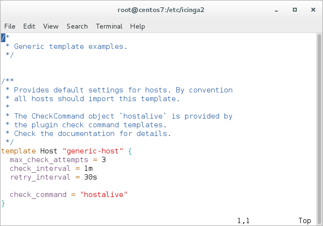
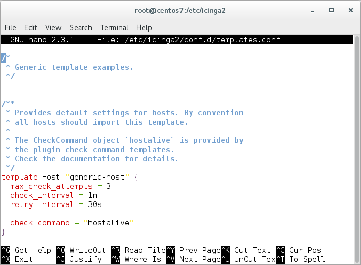
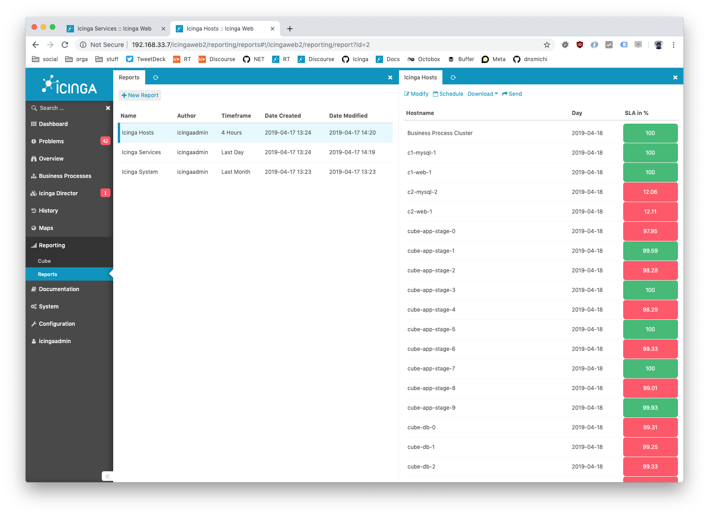
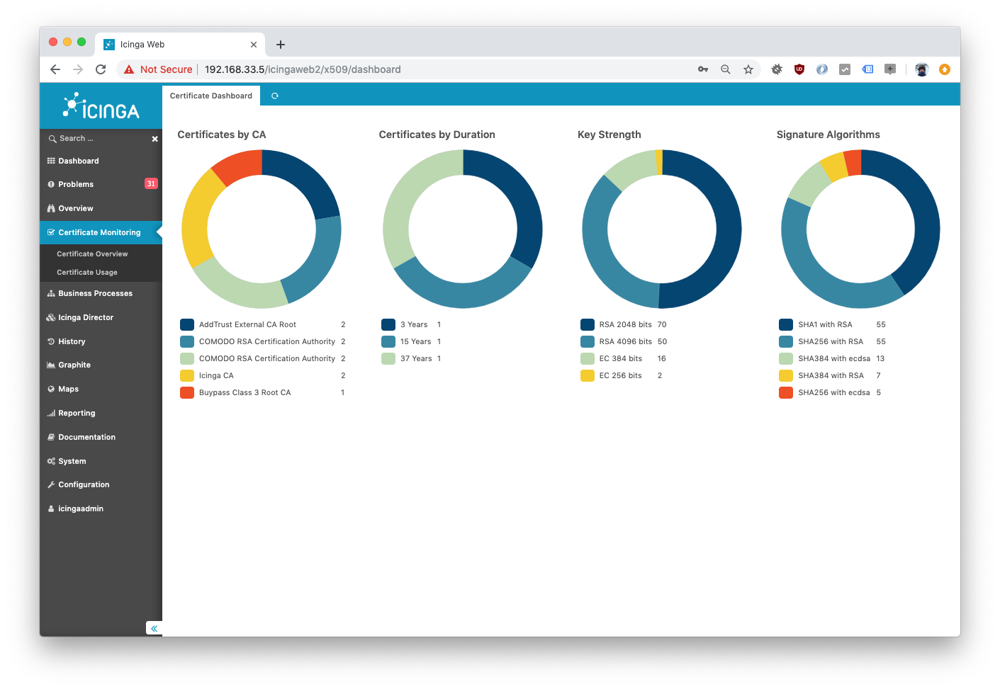

# Icinga 2 Addons and Integrations <a id="addons"></a>

For an uptodate overview of all integrations and modules,
please visit [https://icinga.com/products/](https://icinga.com/products/).

## Syntax Highlighting <a id="configuration-syntax-highlighting"></a>

Icinga 2 provides configuration examples for syntax highlighting using the `vim` and `nano` editors.

### Using Vim <a id="configuration-syntax-highlighting-vim"></a>

Install the package `vim-icinga2` with your distribution's package manager.

Ensure that syntax highlighting is enabled e.g. by editing the user's `vimrc`
configuration file:

```
# vim ~/.vimrc
syntax on
```

Test it:

```bash
vim /etc/icinga2/conf.d/templates.conf
```




### Using Nano <a id="configuration-syntax-highlighting-nano"></a>

Install the package `nano-icinga2` with your distribution's package manager.

**Note:** On Debian, Ubuntu and Raspbian, the syntax files are installed with the `icinga2-common` package already.

Copy the `/etc/nanorc` sample file to your home directory.

```bash
cp /etc/nanorc ~/.nanorc
```

Include the `icinga2.nanorc` file.

```
$ vim ~/.nanorc

## Icinga 2
include "/usr/share/nano/icinga2.nanorc"
```

Test it:

```bash
nano /etc/icinga2/conf.d/templates.conf
```



## Icinga Reporting <a id="addons-reporting"></a>

The [Icinga Reporting Module](https://icinga.com/docs/reporting/latest/)
is the framework and foundation we created to handle data collected
by Icinga 2 and other data providers. By definition Icinga Reporting does not collect
or calculate any data. The framework processes usable data from data providers such as
Icinga’s IDO or Icinga Web 2 modules and makes them available in different formats.

It can display the data directly within the Icinga web interface or export it to PDF,
JSON or CSV format. With scheduled reports you can receive the prepared data periodically
via email.



Follow along in this [hands-on blog post](https://icinga.com/2019/06/17/icinga-reporting-hands-on/).


## Graphs and Metrics <a id="addons-graphs-metrics"></a>

### Graphite <a id="addons-graphing-graphite"></a>

[Graphite](https://graphite.readthedocs.org/en/latest/) is a time-series database
storing collected metrics and making them available through restful apis
and web interfaces.

Graphite consists of 3 software components:

* carbon -- a Twisted daemon that listens for time-series data
* whisper -- a simple database library for storing time-series data (similar in design to RRD)
* graphite webapp -- a Django webapp that renders graphs on-demand using Cairo

You need to install Graphite first, then proceed with configuring it in Icinga 2.

Use the [GraphiteWriter](14-features.md#graphite-carbon-cache-writer) feature
for sending real-time metrics from Icinga 2 to Graphite.

```bash
icinga2 feature enable graphite
```

A popular alternative frontend for Graphite is for example [Grafana](https://grafana.org).

Integration in Icinga Web 2 is possible by installing the official [graphite module](https://icinga.com/docs/graphite/latest/).


### InfluxDB <a id="addons-graphing-influxdb"></a>

[InfluxDB](https://influxdb.com) is a time series, metrics, and analytics database.
It’s written in Go and has no external dependencies.

Use the [InfluxdbWriter](14-features.md#influxdb-writer) feature
for sending real-time metrics from Icinga 2 to InfluxDB v1.

```bash
icinga2 feature enable influxdb
```

Use the [Influxdb2Writer](14-features.md#influxdb-writer) feature
for sending real-time metrics from Icinga 2 to InfluxDB v2.

```bash
icinga2 feature enable influxdb2
```

A popular frontend for InfluxDB is for example [Grafana](https://grafana.org).

Integration in Icinga Web 2 is possible by installing the community [Grafana module](https://github.com/Mikesch-mp/icingaweb2-module-grafana).


### PNP <a id="addons-graphing-pnp"></a>

[PNP](https://www.pnp4nagios.org) is a graphing addon.

[PNP](https://www.pnp4nagios.org) is an addon which adds a graphical representation of the performance data collected
by the monitoring plugins. The data is stored as rrd (round robin database) files.

Use your distribution's package manager to install the `pnp4nagios` package.

If you're planning to use it, configure it to use the
[bulk mode with npcd and npcdmod](https://docs.pnp4nagios.org/pnp-0.6/modes#bulk_mode_with_npcd_and_npcdmod)
in combination with Icinga 2's [PerfdataWriter](14-features.md#writing-performance-data-files). NPCD collects the performance
data files which Icinga 2 generates.

Enable performance data writer in icinga 2

```bash
icinga2 feature enable perfdata
```

Configure npcd to use the performance data created by Icinga 2:

```bash
vim /etc/pnp4nagios/npcd.cfg
```

Set `perfdata_spool_dir = /var/spool/icinga2/perfdata` and restart the `npcd` daemon.

There's also an Icinga Web 2 module for direct PNP graph integration
available at [Icinga Exchange](https://exchange.icinga.com/icinga/PNP).

## Visualization <a id="addons-visualization"></a>

### Maps <a id="addons-visualization-maps"></a>

This community module displays host objects as markers on openstreetmap in Icinga Web 2.
It uses the data provided by the monitoring module and as such the [DB IDO](14-features.md#db-ido)
from Icinga 2.

If you configure multiple hosts with the same coordinates, i.e. servers in a datacenter, a clustered view is rendered.

Check the  [Map module docs](https://github.com/nbuchwitz/icingaweb2-module-map) for more details on
installation, configuration and integration.


### Business Process <a id="addons-business-process"></a>

Create top-level views of your applications in a graphical editor.
Rules express dependencies between existing hosts and services and
let you alert on application level. Business processes are displayed
in a tree or list overview and can be added to any dashboard.


Read more [here](https://icinga.com/products/icinga-business-process-modelling/).

### Certificate Monitoring <a id="addons-visualization-certificate-monitoring"></a>

Monitor your certificates in an efficient and comfortable way. Be aware of required
actions and view all details at a glance.



Read more [here](https://icinga.com/products/icinga-certificate-monitoring/)
and [here](https://icinga.com/2019/06/03/monitoring-automation-with-icinga-certificate-monitoring/).

### Dashing Dashboard <a id="addons-visualization-dashing-dashboard"></a>

The [Icinga 2 dashboard](https://github.com/dnsmichi/dashing-icinga2) is built
on top of Dashing and uses the [REST API](12-icinga2-api.md#icinga2-api) to visualize what's going
on with your monitoring. It combines several popular widgets and provides development
instructions for your own implementation.

The dashboard also allows to embed the [Icinga Web 2](https://icinga.com/products/icinga-web-2/)
host and service problem lists as Iframe.


## Log Monitoring <a id="log-monitoring"></a>

Using [Logstash](https://www.elastic.co/guide/en/logstash/current/introduction.html) or
[Graylog](https://www.graylog.org) in your infrastructure and correlate events with your monitoring
is even simpler these days.

* Use the `GelfWriter` feature to write Icinga 2's check and notification events to Graylog or Logstash.
* Configure the logstash `nagios` output to send passive traps to Icinga 2 using the external command pipe.
* Execute a plugin to check Graylog alert streams.

More details can be found in [this blog post](https://icinga.com/2014/12/02/team-icinga-at-osmc-2014/).

## Notification Scripts and Interfaces <a id="notification-scripts-interfaces"></a>

There's a variety of resources available, for example different notification scripts such as:

* E-Mail ([examples](03-monitoring-basics.md#alert-notifications) provided)
* SMS
* Pager (XMPP, etc.)
* Twitter
* IRC
* Ticket systems
* etc.

Blog posts and howtos:

* [Environmental Monitoring and Alerting](https://icinga.com/2019/09/02/environmental-monitoring-and-alerting-via-text-message/)

Additionally external services can be [integrated with Icinga 2](https://icinga.com/products/integrations/):

* [Pagerduty](https://icinga.com/products/integrations/pagerduty/)
* [VictorOps](https://icinga.com/products/integrations/victorops/)
* [StackStorm](https://icinga.com/products/integrations/stackstorm/)

More information can be found on the [Icinga Website](https://icinga.com/).

## Configuration Management Tools <a id="configuration-tools"></a>

Checkout these specific integrations:

* [Ansible Roles](https://icinga.com/products/integrations/)
* [Puppet Module](https://icinga.com/products/integrations/puppet/)
* [Chef Cookbook](https://icinga.com/products/integrations/chef/)

If you're looking for different config management integrations -- we're happy
to add them upstream, so please get in touch with the [Icinga team](https://icinga.com/community/).
