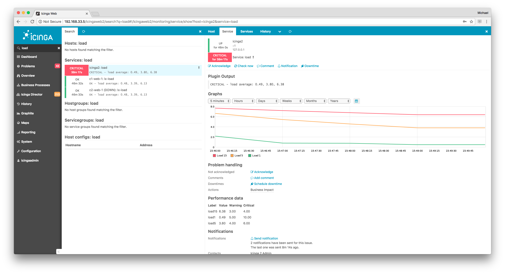
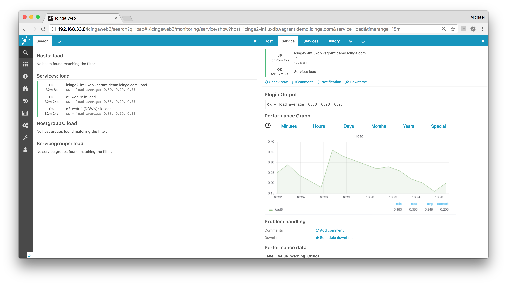
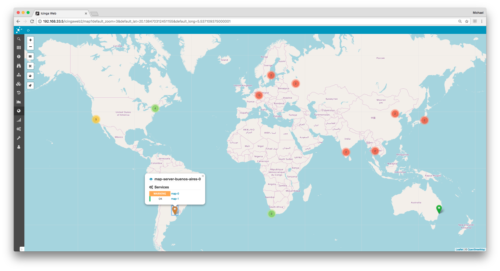
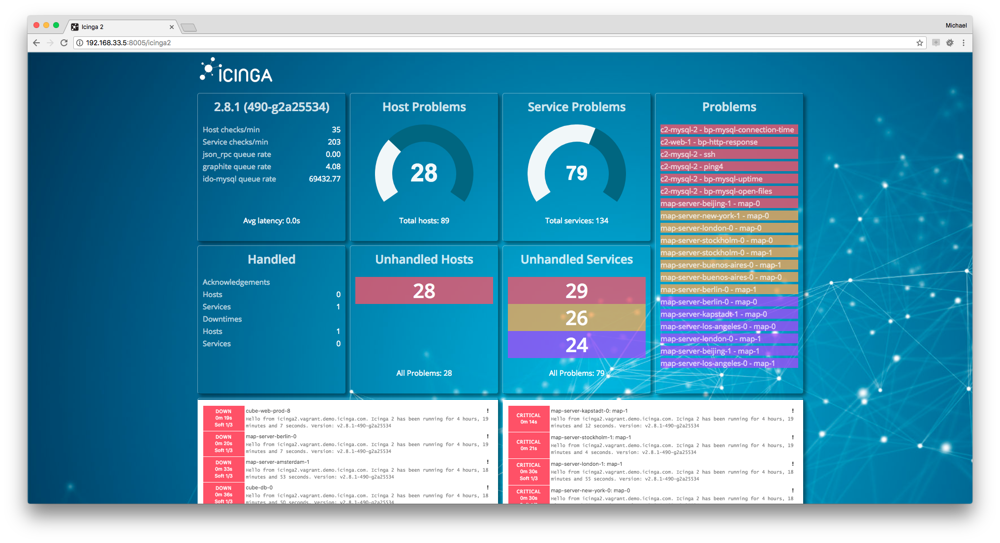
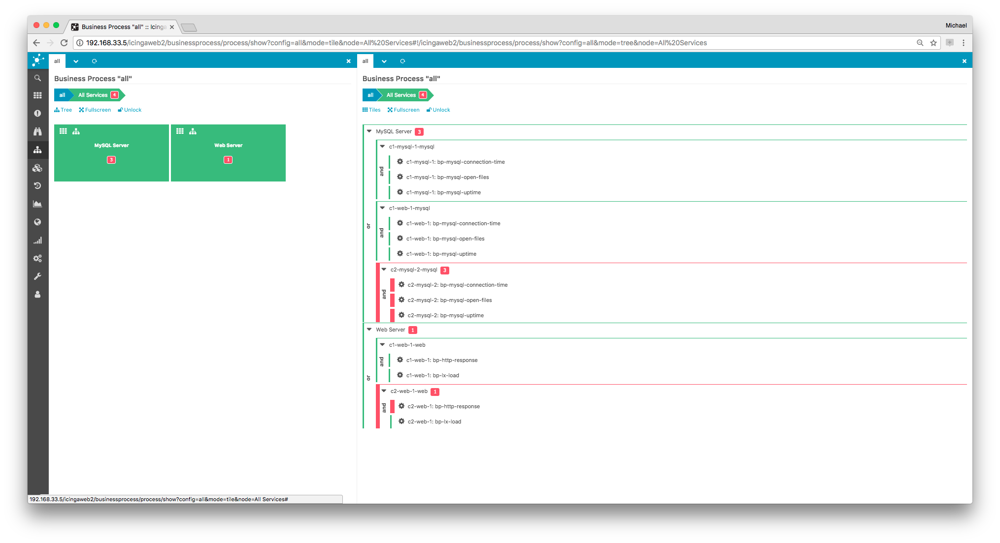

# Icinga 2 Addons <a id="addons"></a>

## Graphing <a id="addons-graphing"></a>

### Graphite <a id="addons-graphing-graphite"></a>

[Graphite](https://graphite.readthedocs.org/en/latest/) is a time-series database
storing collected metrics and making them available through restful apis
and web interfaces.

Graphite consists of 3 software components:

* carbon -- a Twisted daemon that listens for time-series data
* whisper -- a simple database library for storing time-series data (similar in design to RRD)
* graphite webapp -- a Django webapp that renders graphs on-demand using Cairo

You need to install Graphite first, then proceed with configuring it in Icinga 2.

Use the [GraphiteWriter](14-features.md#graphite-carbon-cache-writer) feature
for sending real-time metrics from Icinga 2 to Graphite.

```
# icinga2 feature enable graphite
```

A popular alternative frontend for Graphite is for example [Grafana](https://grafana.org).

Integration in Icinga Web 2 is possible by installing the official [graphite module](https://icinga.com/docs/graphite/latest/).




### InfluxDB <a id="addons-graphing-influxdb"></a>

[InfluxDB](https://influxdb.com) is a time series, metrics, and analytics database.
It’s written in Go and has no external dependencies.

Use the [InfluxdbWriter](14-features.md#influxdb-writer) feature
for sending real-time metrics from Icinga 2 to InfluxDB.

```
# icinga2 feature enable influxdb
```

A popular frontend for InfluxDB is for example [Grafana](https://grafana.org).

Integration in Icinga Web 2 is possible by installing the community [Grafana module](https://github.com/Mikesch-mp/icingaweb2-module-grafana).




### PNP <a id="addons-graphing-pnp"></a>

[PNP](https://www.pnp4nagios.org) is a graphing addon.

[PNP](https://www.pnp4nagios.org) is an addon which adds a graphical representation of the performance data collected
by the monitoring plugins. The data is stored as rrd (round robin database) files.

Use your distribution's package manager to install the `pnp4nagios` package.

If you're planning to use it, configure it to use the
[bulk mode with npcd and npcdmod](https://docs.pnp4nagios.org/pnp-0.6/modes#bulk_mode_with_npcd_and_npcdmod)
in combination with Icinga 2's [PerfdataWriter](14-features.md#performance-data). NPCD collects the performance
data files which Icinga 2 generates.

Enable performance data writer in icinga 2

```
# icinga2 feature enable perfdata
```

Configure npcd to use the performance data created by Icinga 2:

```
vim /etc/pnp4nagios/npcd.cfg
```

Set `perfdata_spool_dir = /var/spool/icinga2/perfdata` and restart the `npcd` daemon.

There's also an Icinga Web 2 module for direct PNP graph integration
available at [Icinga Exchange](https://exchange.icinga.com/icinga/PNP).

More information on [action_url as attribute](13-addons.md#addons-graphing-pnp-action-url)
and [graph template names](13-addons.md#addons-graphing-pnp-custom-templates).


## Visualization <a id="addons-visualization"></a>

### Maps <a id="addons-visualization-maps"></a>

This community module displays host objects as markers on openstreetmap in Icinga Web 2.
It uses the data provided by the monitoring module and as such the [DB IDO](14-features.md#db-ido)
from Icinga 2.

If you configure multiple hosts with the same coordinates, i.e. servers in a datacenter, a clustered view is rendered.

Check the  [Map module docs](https://github.com/nbuchwitz/icingaweb2-module-map) for more details on
installation, configuration and integration.



### Dashing Dashboard <a id="addons-visualization-dashing-dashboard"></a>

The [Icinga 2 dashboard](https://github.com/dnsmichi/dashing-icinga2) is built
on top of Dashing and uses the [REST API](12-icinga2-api.md#icinga2-api) to visualize what's going
on with your monitoring. It combines several popular widgets and provides development
instructions for your own implementation.

The dashboard also allows to embed the [Icinga Web 2](https://icinga.com/products/icinga-web-2/)
host and service problem lists as Iframe.



### Business Process <a id="addons-business-process"></a>

Create top-level views of your applications in a graphical editor.
Rules express dependencies between existing hosts and services and
let you alert on application level. Business processes are displayed
in a tree or list overview and can be added to any dashboard.



### NagVis <a id="addons-visualization-nagvis"></a>

By using the [DB IDO](14-features.md#db-ido) feature
you can create your own network maps
based on your monitoring configuration and status data using [NagVis](https://www.nagvis.org).

The configuration in nagvis.ini.php should look like this for Livestatus for example:

```
[backend_live_1]
backendtype="mklivestatus"
socket="unix:/var/run/icinga2/cmd/livestatus"
```

If you are planning an integration into Icinga Web 2, look at [this module](https://github.com/Icinga/icingaweb2-module-nagvis).

### Icinga Reporting <a id="addons-visualization-reporting"></a>

By enabling the [DB IDO](14-features.md#db-ido) feature you can use the
[Icinga Reporting package](https://icinga.com/docs/icinga1/latest/en/reporting.html).

### Thruk <a id="addons-visualization-thruk"></a>

[Thruk](https://www.thruk.org) is an alternative web interface which can be used with Icinga 2
and the [Livestatus](14-features.md#setting-up-livestatus) feature.

## Log Monitoring <a id="log-monitoring"></a>

Using [Logstash](https://www.elastic.co/guide/en/logstash/current/introduction.html) or
[Graylog](https://www.graylog.org) in your infrastructure and correlate events with your monitoring
is even simpler these days.

* Use the `GelfWriter` feature to write Icinga 2's check and notification events to Graylog or Logstash.
* Configure the logstash `nagios` output to send passive traps to Icinga 2 using the external command pipe.
* Execute a plugin to check Graylog alert streams.

More details can be found in [this blog post](https://icinga.com/2014/12/02/team-icinga-at-osmc-2014/).

## Notification Scripts and Interfaces <a id="notification-scripts-interfaces"></a>

There's a variety of resources available, for example different notification scripts such as:

* E-Mail ([examples](03-monitoring-basics.md#alert-notifications) provided)
* SMS
* Pager (XMPP, etc.)
* Twitter
* IRC
* Ticket systems
* etc.

Additionally external services can be [integrated with Icinga 2](https://icinga.com/products/integrations/):

* [Pagerduty](https://icinga.com/products/integrations/pagerduty/)
* [VictorOps](https://icinga.com/products/integrations/victorops/)
* [StackStorm](https://icinga.com/products/integrations/stackstorm/)

More information can be found on the [Icinga Website](https://icinga.com/).

## Configuration Management Tools <a id="configuration-tools"></a>

If you require your favourite configuration tool to export the Icinga 2 configuration, please get in
touch with their developers. The Icinga project does not provide a configuration web interface
yet. Follow the [Icinga Blog](https://icinga.com/blog/) for updates on this topic.

If you're looking for puppet manifests, chef cookbooks, ansible recipes, etc. -- we're happy
to integrate them upstream, so please get in touch with the [Icinga team](https://icinga.com/community/).

These tools are currently in development and require feedback and tests:

* [Ansible Roles](https://github.com/Icinga/icinga2-ansible)
* [Puppet Module](https://github.com/Icinga/puppet-icinga2)
* [Chef Cookbook](https://github.com/Icinga/chef-icinga2)

## More Addon Integration Hints <a id="addon-integration-hints"></a>

### PNP Action Url <a id="addons-graphing-pnp-action-url"></a>

They work in a similar fashion for Icinga 2 and are used for 1.x web interfaces (Icinga Web 2 doesn't require
the action url attribute in its own module).

```
template Host "pnp-hst" {
  action_url = "/pnp4nagios/graph?host=$HOSTNAME$"
}

template Service "pnp-svc" {
  action_url = "/pnp4nagios/graph?host=$HOSTNAME$&srv=$SERVICEDESC$"
}
```

### PNP Custom Templates with Icinga 2 <a id="addons-graphing-pnp-custom-templates"></a>

PNP automatically determines the graph template from the check command name (or the argument's name).
This behavior changed in Icinga 2 compared to Icinga 1.x. Though there are certain possibilities to
fix this:

* Create a symlink for example from the `templates.dist/check_ping.php` template to the actual check name in Icinga 2 (`templates/ping4.php`)
* Pass the check command name inside the [format template configuration](14-features.md#writing-performance-data-files)

The latter becomes difficult with agent based checks like NRPE or SSH where the first command argument acts as
graph template identifier. There is the possibility to define the pnp template name as custom attribute
and use that inside the formatting templates as `SERVICECHECKCOMMAND` for instance.

Example for services:

```
# vim /etc/icinga2/features-enabled/perfdata.conf

service_format_template = "DATATYPE::SERVICEPERFDATA\tTIMET::$icinga.timet$\tHOSTNAME::$host.name$\tSERVICEDESC::$service.name$\tSERVICEPERFDATA::$service.perfdata$\tSERVICECHECKCOMMAND::$service.check_command$$pnp_check_arg1$\tHOSTSTATE::$host.state$\tHOSTSTATETYPE::$host.state_type$\tSERVICESTATE::$service.state$\tSERVICESTATETYPE::$service.state_type$"

# vim /etc/icinga2/conf.d/services.conf

template Service "pnp-svc" {
  action_url = "/pnp4nagios/graph?host=$HOSTNAME$&srv=$SERVICEDESC$"
  vars.pnp_check_arg1 = ""
}

apply Service "nrpe-check" {
  import "pnp-svc"
  check_command = nrpe
  vars.nrpe_command = "check_disk"

  vars.pnp_check_arg1 = "!$nrpe_command$"
}
```

If there are warnings about unresolved macros, make sure to specify a default value for `vars.pnp_check_arg1` inside the

In PNP, the custom template for nrpe is then defined in `/etc/pnp4nagios/custom/nrpe.cfg`
and the additional command arg string will be seen in the xml too for other templates.
