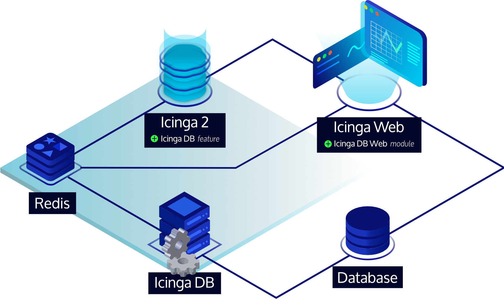

# Icinga 2 Features <a id="icinga2-features"></a>

## Logging <a id="logging"></a>

Icinga 2 supports three different types of logging:

* File logging
* Syslog (on Linux/UNIX)
* Console logging (`STDOUT` on tty)

You can enable additional loggers using the `icinga2 feature enable`
and `icinga2 feature disable` commands to configure loggers:

Feature         | Description
----------------|------------
debuglog        | Debug log (path: `/var/log/icinga2/debug.log`, severity: `debug` or higher)
journald        | Systemd Journal (severity: `warning` or higher)
mainlog         | Main log (path: `/var/log/icinga2/icinga2.log`, severity: `information` or higher)
syslog          | Syslog (severity: `warning` or higher)
windowseventlog | Windows Event Log (severity: `information` or higher)

By default file the `mainlog` feature is enabled. When running Icinga 2
on a terminal log messages with severity `information` or higher are
written to the console.

### Log Rotation <a id="logging-logrotate"></a>

Packages provide a configuration file for [logrotate](https://linux.die.net/man/8/logrotate)
on Linux/Unix. Typically this is installed into `/etc/logrotate.d/icinga2`
and modifications won't be overridden on upgrade.

Instead of sending the reload HUP signal, logrotate
sends the USR1 signal to notify the Icinga daemon
that it has rotate the log file. Icinga reopens the log
files then:

* `/var/log/icinga2/icinga2.log` (requires `mainlog` enabled)
* `/var/log/icinga2/debug.log` (requires `debuglog` enabled)
* `/var/log/icinga2/error.log`

By default, log files will be rotated daily.

## Core Backends <a id="core-backends"></a>

### REST API <a id="core-backends-api"></a>

The REST API is documented [here](12-icinga2-api.md#icinga2-api) as a core feature.

### Icinga DB <a id="core-backends-icingadb"></a>

Icinga DB is a set of components for publishing, synchronizing and
visualizing monitoring data in the Icinga ecosystem, consisting of:

* Icinga 2 with its `icingadb` feature enabled,
  responsible for publishing monitoring data to a Redis server, i.e. configuration and its runtime updates,  
  check results, state changes, downtimes, acknowledgements, notifications, and other events such as flapping
* The [Icinga DB daemon](https://icinga.com/docs/icinga-db),
  which synchronizes the data between the Redis server and a database
* And Icinga Web with the
  [Icinga DB Web](https://icinga.com/docs/icinga-db-web) module enabled,
  which connects to both Redis and the database to display and work with the most up-to-date data



To set up a Redis server and the Icinga DB feature, please follow the steps from the
Icinga 2 [Installation](02-installation.md) guide. For the feature configuration options,
see its [Icinga DB object type](09-object-types.md#icingadb) documentation.

## Metrics <a id="metrics"></a>

Whenever a host or service check is executed, or received via the REST API,
best practice is to provide performance data.

This data is parsed by features sending metrics to time series databases (TSDB):

* [Graphite](14-features.md#graphite-carbon-cache-writer)
* [InfluxDB](14-features.md#influxdb-writer)
* [OpenTSDB](14-features.md#opentsdb-writer)

Metrics, state changes and notifications can be managed with the following integrations:

* [Elastic Stack](14-features.md#elastic-stack-integration)
* [Graylog](14-features.md#graylog-integration)


### Graphite Writer <a id="graphite-carbon-cache-writer"></a>

[Graphite](13-addons.md#addons-graphing-graphite) is a tool stack for storing
metrics and needs to be running prior to enabling the `graphite` feature.

Icinga 2 writes parsed metrics directly to Graphite's Carbon Cache
TCP port, defaulting to `2003`.

You can enable the feature using

```bash
icinga2 feature enable graphite
```

By default the [GraphiteWriter](09-object-types.md#objecttype-graphitewriter) feature
expects the Graphite Carbon Cache to listen at `127.0.0.1` on TCP port `2003`.

#### Graphite Schema <a id="graphite-carbon-cache-writer-schema"></a>

The current naming schema is defined as follows. The [Icinga Web 2 Graphite module](https://icinga.com/products/integrations/graphite/)
depends on this schema.

The default prefix for hosts and services is configured using
[runtime macros](03-monitoring-basics.md#runtime-macros)like this:

```
icinga2.$host.name$.host.$host.check_command$
icinga2.$host.name$.services.$service.name$.$service.check_command$
```

You can customize the prefix name by using the `host_name_template` and
`service_name_template` configuration attributes.

The additional levels will allow fine granular filters and also template
capabilities, e.g. by using the check command `disk` for specific
graph templates in web applications rendering the Graphite data.

The following characters are escaped in prefix labels:

  Character	| Escaped character
  --------------|--------------------------
  whitespace	| _
  .		| _
  \		| _
  /		| _

Metric values are stored like this:

```
<prefix>.perfdata.<perfdata-label>.value
```

The following characters are escaped in performance labels
parsed from plugin output:

  Character	| Escaped character
  --------------|--------------------------
  whitespace	| _
  \		| _
  /		| _
  ::		| .

Note that labels may contain dots (`.`) allowing to
add more subsequent levels inside the Graphite tree.
`::` adds support for [multi performance labels](http://my-plugin.de/wiki/projects/check_multi/configuration/performance)
and is therefore replaced by `.`.

By enabling `enable_send_thresholds` Icinga 2 automatically adds the following threshold metrics:

```
<prefix>.perfdata.<perfdata-label>.min
<prefix>.perfdata.<perfdata-label>.max
<prefix>.perfdata.<perfdata-label>.warn
<prefix>.perfdata.<perfdata-label>.crit
```

By enabling `enable_send_metadata` Icinga 2 automatically adds the following metadata metrics:

```
<prefix>.metadata.current_attempt
<prefix>.metadata.downtime_depth
<prefix>.metadata.acknowledgement
<prefix>.metadata.execution_time
<prefix>.metadata.latency
<prefix>.metadata.max_check_attempts
<prefix>.metadata.reachable
<prefix>.metadata.state
<prefix>.metadata.state_type
```

Metadata metric overview:

  metric             | description
  -------------------|------------------------------------------
  current_attempt    | current check attempt
  max_check_attempts | maximum check attempts until the hard state is reached
  reachable          | checked object is reachable
  downtime_depth     | number of downtimes this object is in
  acknowledgement    | whether the object is acknowledged or not
  execution_time     | check execution time
  latency            | check latency
  state              | current state of the checked object
  state_type         | 0=SOFT, 1=HARD state

The following example illustrates how to configure the storage schemas for Graphite Carbon
Cache.

```
[icinga2_default]
# intervals like PNP4Nagios uses them per default
pattern = ^icinga2\.
retentions = 1m:2d,5m:10d,30m:90d,360m:4y
```

#### Graphite in Cluster HA Zones <a id="graphite-carbon-cache-writer-cluster-ha"></a>

The Graphite feature supports [high availability](06-distributed-monitoring.md#distributed-monitoring-high-availability-features)
in cluster zones since 2.11.

By default, all endpoints in a zone will activate the feature and start
writing metrics to a Carbon Cache socket. In HA enabled scenarios,
it is possible to set `enable_ha = true` in all feature configuration
files. This allows each endpoint to calculate the feature authority,
and only one endpoint actively writes metrics, the other endpoints
pause the feature.

When the cluster connection breaks at some point, the remaining endpoint(s)
in that zone will automatically resume the feature. This built-in failover
mechanism ensures that metrics are written even if the cluster fails.

The recommended way of running Graphite in this scenario is a dedicated server
where Carbon Cache/Relay is running as receiver.


### InfluxDB Writer <a id="influxdb-writer"></a>

Once there are new metrics available, Icinga 2 will directly write them to the
defined InfluxDB v1/v2 HTTP API.

You can enable the feature using

```bash
icinga2 feature enable influxdb
```

or

```bash
icinga2 feature enable influxdb2
```

By default the
[InfluxdbWriter](09-object-types.md#objecttype-influxdbwriter)/[Influxdb2Writer](09-object-types.md#objecttype-influxdb2writer)
features expect the InfluxDB daemon to listen at `127.0.0.1` on port `8086`.

Measurement names and tags are fully configurable by the end user. The Influxdb(2)Writer
object will automatically add a `metric` tag to each data point. This correlates to the
perfdata label. Fields (value, warn, crit, min, max, unit) are created from data if available
and the configuration allows it.  If a value associated with a tag is not able to be
resolved, it will be dropped and not sent to the target host.

Backslashes are allowed in tag keys, tag values and field keys, however they are also
escape characters when followed by a space or comma, but cannot be escaped themselves.
As a result all trailling slashes in these fields are replaced with an underscore.  This
predominantly affects Windows paths e.g. `C:\` becomes `C:_`.

The database/bucket is assumed to exist so this object will make no attempt to create it currently.

If [SELinux](22-selinux.md#selinux) is enabled, it will not allow access for Icinga 2 to InfluxDB until the [boolean](22-selinux.md#selinux-policy-booleans)
`icinga2_can_connect_all` is set to true as InfluxDB is not providing its own policy.

More configuration details can be found [here for v1](09-object-types.md#objecttype-influxdbwriter)
and [here for v2](09-object-types.md#objecttype-influxdb2writer).

#### Instance Tagging <a id="influxdb-writer-instance-tags"></a>

Consider the following service check:

```
apply Service "disk" for (disk => attributes in host.vars.disks) {
  import "generic-service"
  check_command = "disk"
  display_name = "Disk " + disk
  vars.disk_partitions = disk
  assign where host.vars.disks
}
```

This is a typical pattern for checking individual disks, NICs, TLS certificates etc associated
with a host.  What would be useful is to have the data points tagged with the specific instance
for that check.  This would allow you to query time series data for a check on a host and for a
specific instance e.g. /dev/sda.  To do this quite simply add the instance to the service variables:

```
apply Service "disk" for (disk => attributes in host.vars.disks) {
  ...
  vars.instance = disk
  ...
}
```

Then modify your writer configuration to add this tag to your data points if the instance variable
is associated with the service:

```
object InfluxdbWriter "influxdb" {
  ...
  service_template = {
    measurement = "$service.check_command$"
    tags = {
      hostname = "$host.name$"
      service = "$service.name$"
      instance = "$service.vars.instance$"
    }
  }
  ...
}
```

#### InfluxDB in Cluster HA Zones <a id="influxdb-writer-cluster-ha"></a>

The InfluxDB feature supports [high availability](06-distributed-monitoring.md#distributed-monitoring-high-availability-features)
in cluster zones since 2.11.

By default, all endpoints in a zone will activate the feature and start
writing metrics to the InfluxDB HTTP API. In HA enabled scenarios,
it is possible to set `enable_ha = true` in all feature configuration
files. This allows each endpoint to calculate the feature authority,
and only one endpoint actively writes metrics, the other endpoints
pause the feature.

When the cluster connection breaks at some point, the remaining endpoint(s)
in that zone will automatically resume the feature. This built-in failover
mechanism ensures that metrics are written even if the cluster fails.

The recommended way of running InfluxDB in this scenario is a dedicated server
where the InfluxDB HTTP API or Telegraf as Proxy are running.

### Elastic Stack Integration <a id="elastic-stack-integration"></a>

[Icingabeat](https://icinga.com/products/integrations/elastic/) is an Elastic Beat that fetches data
from the Icinga 2 API and sends it either directly to [Elasticsearch](https://www.elastic.co/products/elasticsearch)
or [Logstash](https://www.elastic.co/products/logstash).

More integrations:

* [Logstash output](https://icinga.com/products/integrations/elastic/) for the Icinga 2 API.
* [Logstash Grok Pattern](https://icinga.com/products/integrations/elastic/) for Icinga 2 logs.

#### Elasticsearch Writer <a id="elasticsearch-writer"></a>

This feature forwards check results, state changes and notification events
to an [Elasticsearch](https://www.elastic.co/products/elasticsearch) installation over its HTTP API.

The check results include parsed performance data metrics if enabled.

> **Note**
>
> Elasticsearch 5.x or 6.x are required. This feature has been successfully tested with
> Elasticsearch 5.6.7 and 6.3.1.


Enable the feature and restart Icinga 2.

```bash
icinga2 feature enable elasticsearch
```

The default configuration expects an Elasticsearch instance running on `localhost` on port `9200`
 and writes to an index called `icinga2`.

More configuration details can be found [here](09-object-types.md#objecttype-elasticsearchwriter).

#### Current Elasticsearch Schema <a id="elastic-writer-schema"></a>

The following event types are written to Elasticsearch:

* icinga2.event.checkresult
* icinga2.event.statechange
* icinga2.event.notification

Performance data metrics must be explicitly enabled with the `enable_send_perfdata`
attribute.

Metric values are stored like this:

```
check_result.perfdata.<perfdata-label>.value
```

The following characters are escaped in perfdata labels:

  Character   | Escaped character
  ------------|--------------------------
  whitespace  | _
  \           | _
  /           | _
  ::          | .

Note that perfdata labels may contain dots (`.`) allowing to
add more subsequent levels inside the tree.
`::` adds support for [multi performance labels](http://my-plugin.de/wiki/projects/check_multi/configuration/performance)
and is therefore replaced by `.`.

Icinga 2 automatically adds the following threshold metrics
if existing:

```
check_result.perfdata.<perfdata-label>.min
check_result.perfdata.<perfdata-label>.max
check_result.perfdata.<perfdata-label>.warn
check_result.perfdata.<perfdata-label>.crit
```

#### Elasticsearch in Cluster HA Zones <a id="elasticsearch-writer-cluster-ha"></a>

The Elasticsearch feature supports [high availability](06-distributed-monitoring.md#distributed-monitoring-high-availability-features)
in cluster zones since 2.11.

By default, all endpoints in a zone will activate the feature and start
writing events to the Elasticsearch HTTP API. In HA enabled scenarios,
it is possible to set `enable_ha = true` in all feature configuration
files. This allows each endpoint to calculate the feature authority,
and only one endpoint actively writes events, the other endpoints
pause the feature.

When the cluster connection breaks at some point, the remaining endpoint(s)
in that zone will automatically resume the feature. This built-in failover
mechanism ensures that events are written even if the cluster fails.

The recommended way of running Elasticsearch in this scenario is a dedicated server
where you either have the Elasticsearch HTTP API, or a TLS secured HTTP proxy,
or Logstash for additional filtering.

### Graylog Integration <a id="graylog-integration"></a>

#### GELF Writer <a id="gelfwriter"></a>

The `Graylog Extended Log Format` (short: [GELF](https://docs.graylog.org/en/latest/pages/gelf.html))
can be used to send application logs directly to a TCP socket.

While it has been specified by the [Graylog](https://www.graylog.org) project as their
[input resource standard](https://docs.graylog.org/en/latest/pages/sending_data.html), other tools such as
[Logstash](https://www.elastic.co/products/logstash) also support `GELF` as
[input type](https://www.elastic.co/guide/en/logstash/current/plugins-inputs-gelf.html).

You can enable the feature using

```bash
icinga2 feature enable gelf
```

By default the `GelfWriter` object expects the GELF receiver to listen at `127.0.0.1` on TCP port `12201`.
The default `source`  attribute is set to `icinga2`. You can customize that for your needs if required.

Currently these events are processed:
* Check results
* State changes
* Notifications

#### Graylog/GELF in Cluster HA Zones <a id="gelf-writer-cluster-ha"></a>

The Gelf feature supports [high availability](06-distributed-monitoring.md#distributed-monitoring-high-availability-features)
in cluster zones since 2.11.

By default, all endpoints in a zone will activate the feature and start
writing events to the Graylog HTTP API. In HA enabled scenarios,
it is possible to set `enable_ha = true` in all feature configuration
files. This allows each endpoint to calculate the feature authority,
and only one endpoint actively writes events, the other endpoints
pause the feature.

When the cluster connection breaks at some point, the remaining endpoint(s)
in that zone will automatically resume the feature. This built-in failover
mechanism ensures that events are written even if the cluster fails.

The recommended way of running Graylog in this scenario is a dedicated server
where you have the Graylog HTTP API listening.

### OpenTSDB Writer <a id="opentsdb-writer"></a>

While there are some OpenTSDB collector scripts and daemons like tcollector available for
Icinga 1.x it's more reasonable to directly process the check and plugin performance
in memory in Icinga 2. Once there are new metrics available, Icinga 2 will directly
write them to the defined TSDB TCP socket.

You can enable the feature using

```bash
icinga2 feature enable opentsdb
```

By default the `OpenTsdbWriter` object expects the TSD to listen at
`127.0.0.1` on port `4242`.

The current default naming schema is:

```
icinga.host.<perfdata_metric_label>
icinga.service.<servicename>.<perfdata_metric_label>
```

for host and service checks. The tag `host` is always applied.

Icinga also sends perfdata warning, critical, minimum and maximum threshold values to OpenTSDB.
These are stored as new OpenTSDB metric names appended with `_warn`, `_crit`, `_min`, `_max`.
Values are only stored when the corresponding threshold exists in Icinga's perfdata.

Example:
```
icinga.service.<servicename>.<perfdata_metric_label>
icinga.service.<servicename>.<perfdata_metric_label>._warn
icinga.service.<servicename>.<perfdata_metric_label>._crit
icinga.service.<servicename>.<perfdata_metric_label>._min
icinga.service.<servicename>.<perfdata_metric_label>._max
```

To make sure Icinga 2 writes a valid metric into OpenTSDB some characters are replaced
with `_` in the target name:

```
\ :  (and space)
```

The resulting name in OpenTSDB might look like:

```
www-01 / http-cert / response time
icinga.http_cert.response_time
```

In addition to the performance data retrieved from the check plugin, Icinga 2 sends
internal check statistic data to OpenTSDB:

  metric             | description
  -------------------|------------------------------------------
  current_attempt    | current check attempt
  max_check_attempts | maximum check attempts until the hard state is reached
  reachable          | checked object is reachable
  downtime_depth     | number of downtimes this object is in
  acknowledgement    | whether the object is acknowledged or not
  execution_time     | check execution time
  latency            | check latency
  state              | current state of the checked object
  state_type         | 0=SOFT, 1=HARD state

While reachable, state and state_type are metrics for the host or service the
other metrics follow the current naming schema

```
icinga.check.<metricname>
```

with the following tags

  tag     | description
  --------|------------------------------------------
  type    | the check type, one of [host, service]
  host    | hostname, the check ran on
  service | the service name (if type=service)

> **Note**
>
> You might want to set the tsd.core.auto_create_metrics setting to `true`
> in your opentsdb.conf configuration file.

#### OpenTSDB Metric Prefix <a id="opentsdb-metric-prefix"></a>
Functionality exists to modify the built in OpenTSDB metric names that the plugin
writes to. By default this is `icinga.host` and `icinga.service.<servicename>`.

These prefixes can be modified as necessary to any arbitary string. The prefix
configuration also supports Icinga macros, so if you rather use `<checkcommand>`
or any other variable instead of `<servicename>` you may do so.

To configure OpenTSDB metric name prefixes, create or modify the `host_template` and/or
`service_template` blocks in the `opentsdb.conf` file, to add a `metric` definition.
These modifications go hand in hand with the **OpenTSDB Custom Tag Support** detailed below,
and more information around macro use can be found there.

Additionally, using custom Metric Prefixes or your own macros in the prefix may be
helpful if you are using the **OpenTSDB Generic Metric** functionality detailed below.

An example configuration which includes prefix name modification:

```
object OpenTsdbWriter "opentsdb" {
  host = "127.0.0.1"
  port = 4242
  host_template = {
    metric = "icinga.myhost"
    tags = {
      location = "$host.vars.location$"
      checkcommand = "$host.check_command$"
    }
  }
  service_template = {
    metric = "icinga.service.$service.check_command$"
  }
}
```

The above configuration will output the following naming schema:
```
icinga.myhost.<perfdata_metric_label>
icinga.service.<check_command_name>.<perfdata_metric_label>
```
Note how `<perfdata_metric_label>` is always appended in the default naming schema mode.

#### OpenTSDB Generic Metric Naming Schema <a id="opentsdb-generic-metrics"></a>

An alternate naming schema (`Generic Metrics`) is available where OpenTSDB metric names are more generic
and do not include the Icinga perfdata label in the metric name. Instead,
perfdata labels are stored in a tag `label` which is stored along with each perfdata value.

This ultimately reduces the number of unique OpenTSDB metric names which may make
querying aggregate data easier. This also allows you to store all perfdata values for a
particular check inside one OpenTSDB metric name for each check.

This alternate naming schema can be enabled by setting the following in the OpenTSDBWriter config:
`enable_generic_metrics = true`

> **Tip**
> Consider using `Generic Metrics` along with the **OpenTSDB Metric Prefix** naming options
> described above

An example of this naming schema when compared to the default is:

```
icinga.host
icinga.service.<servicename>
```

> **Note**
> Note how `<perfdata_metric_label>` does not appear in the OpenTSDB metric name
> when using `Generic Metrics`. Instead, a new tag `label` appears on each value written
> to OpenTSDB which contains the perfdata label.

#### Custom Tags <a id="opentsdb-custom-tags"></a>

In addition to the default tags listed above, it is possible to send
your own custom tags with your data to OpenTSDB.

Note that custom tags are sent **in addition** to the default hostname,
type and service name tags. If you do not include this section in the
config file, no custom tags will be included.

Custom tags can be custom attributes or built in attributes.

Consider a host object:

```
object Host "my-server1" {
  address = "10.0.0.1"
  check_command = "hostalive"
  vars.location = "Australia"
}
```

and a service object:

```
object Service "ping" {
  host_name = "localhost"
  check_command = "my-ping"

  vars.ping_packets = 10
}
```

It is possible to send `vars.location` and `vars.ping_packets` along
with performance data. Additionally, any other attribute can be sent
as a tag, such as `check_command`.

You can make use of the `host_template` and `service_template` blocks
in the `opentsdb.conf` configuration file.

An example OpenTSDB configuration file which makes use of custom tags:

```
object OpenTsdbWriter "opentsdb" {
  host = "127.0.0.1"
  port = 4242
  host_template = {
    tags = {
      location = "$host.vars.location$"
      checkcommand = "$host.check_command$"
    }
  }
  service_template = {
    tags = {
      location = "$host.vars.location$"
      pingpackets = "$service.vars.ping_packets$"
      checkcommand = "$service.check_command$"
    }
  }
}
```

Depending on what keyword the macro begins with, will determine what
attributes are available in the macro context. The below table explains
what attributes are available with links to each object type.

  start of macro | description
  ---------------|------------------------------------------
  \$host...$     | Attributes available on a [Host object](09-object-types.md#objecttype-host)
  \$service...$  | Attributes available on a [Service object](09-object-types.md#objecttype-service)
  \$icinga...$   | Attributes available on the [IcingaApplication object](09-object-types.md#objecttype-icingaapplication)

> **Note**
>
> Ensure you do not name your custom attributes with a dot in the name.
> Dots located inside a macro tell the interpreter to expand a
> dictionary.
>
> Do not do this in your object configuration:
>
> `vars["my.attribute"]`
>
> as you will be unable to reference `my.attribute` because it is not a
> dictionary.
>
> Instead, use underscores or another character:
>
> `vars.my_attribute` or `vars["my_attribute"]`


#### OpenTSDB in Cluster HA Zones <a id="opentsdb-writer-cluster-ha"></a>

The OpenTSDB feature supports [high availability](06-distributed-monitoring.md#distributed-monitoring-high-availability-features)
in cluster zones since 2.11.

By default, all endpoints in a zone will activate the feature and start
writing events to the OpenTSDB listener. In HA enabled scenarios,
it is possible to set `enable_ha = true` in all feature configuration
files. This allows each endpoint to calculate the feature authority,
and only one endpoint actively writes metrics, the other endpoints
pause the feature.

When the cluster connection breaks at some point, the remaining endpoint(s)
in that zone will automatically resume the feature. This built-in failover
mechanism ensures that metrics are written even if the cluster fails.

The recommended way of running OpenTSDB in this scenario is a dedicated server
where you have OpenTSDB running.


### Writing Performance Data Files <a id="writing-performance-data-files"></a>

PNP and Graphios use performance data collector daemons to fetch
the current performance files for their backend updates.

Therefore the Icinga 2 [PerfdataWriter](09-object-types.md#objecttype-perfdatawriter)
feature allows you to define the output template format for host and services helped
with Icinga 2 runtime vars.

```
host_format_template = "DATATYPE::HOSTPERFDATA\tTIMET::$icinga.timet$\tHOSTNAME::$host.name$\tHOSTPERFDATA::$host.perfdata$\tHOSTCHECKCOMMAND::$host.check_command$\tHOSTSTATE::$host.state$\tHOSTSTATETYPE::$host.state_type$"
service_format_template = "DATATYPE::SERVICEPERFDATA\tTIMET::$icinga.timet$\tHOSTNAME::$host.name$\tSERVICEDESC::$service.name$\tSERVICEPERFDATA::$service.perfdata$\tSERVICECHECKCOMMAND::$service.check_command$\tHOSTSTATE::$host.state$\tHOSTSTATETYPE::$host.state_type$\tSERVICESTATE::$service.state$\tSERVICESTATETYPE::$service.state_type$"
```

The default templates are already provided with the Icinga 2 feature configuration
which can be enabled using

```bash
icinga2 feature enable perfdata
```

By default all performance data files are rotated in a 15 seconds interval into
the `/var/spool/icinga2/perfdata/` directory as `host-perfdata.<timestamp>` and
`service-perfdata.<timestamp>`.
External collectors need to parse the rotated performance data files and then
remove the processed files.

#### Perfdata Files in Cluster HA Zones <a id="perfdata-writer-cluster-ha"></a>

The Perfdata feature supports [high availability](06-distributed-monitoring.md#distributed-monitoring-high-availability-features)
in cluster zones since 2.11.

By default, all endpoints in a zone will activate the feature and start
writing metrics to the local spool directory. In HA enabled scenarios,
it is possible to set `enable_ha = true` in all feature configuration
files. This allows each endpoint to calculate the feature authority,
and only one endpoint actively writes metrics, the other endpoints
pause the feature.

When the cluster connection breaks at some point, the remaining endpoint(s)
in that zone will automatically resume the feature. This built-in failover
mechanism ensures that metrics are written even if the cluster fails.

The recommended way of running Perfdata is to mount the perfdata spool
directory via NFS on a central server where PNP with the NPCD collector
is running on.


## Deprecated Features <a id="deprecated-features"></a>

### IDO Database (DB IDO) <a id="db-ido"></a>

> **Note**
>
> This feature is DEPRECATED and may be removed in future releases.
> Check the [roadmap](https://github.com/Icinga/icinga2/milestones).

The IDO (Icinga Data Output) feature for Icinga 2 takes care of exporting all
configuration and status information into a database. The IDO database is used
by Icinga Web 2 as data backend. You can either use a
[MySQL](#ido-with-mysql) or [PostgreSQL](#ido-with-postgresql) database.

#### IDO with MySQL <a id="ido-with-mysql"></a>

##### Install IDO Feature <a id="installing-database-mysql-modules"></a>

The next step is to install the `icinga2-ido-mysql` package using your
distribution's package manager.

###### Debian / Ubuntu

```bash
apt-get install icinga2-ido-mysql
```

!!! note

    The packages provide a database configuration wizard by
    default. You can skip the automated setup and install/upgrade the
    database manually if you prefer.

###### CentOS 7

!!! info

    Note that installing `icinga2-ido-mysql` is only supported on CentOS 7 as CentOS 8 is EOL.

```bash
yum install icinga2-ido-mysql
```

###### RHEL 8

```bash
dnf install icinga2-ido-mysql
```

###### RHEL 7

```bash
yum install icinga2-ido-mysql
```

###### SLES

```bash
zypper install icinga2-ido-mysql
```

###### Amazon Linux 2

```bash
yum install icinga2-ido-mysql
```

##### Set up MySQL database <a id="setting-up-mysql-db"></a>

Set up a MySQL database for Icinga 2:

```bash
# mysql -u root -p

CREATE DATABASE icinga;
GRANT ALTER, CREATE, SELECT, INSERT, UPDATE, DELETE, DROP, CREATE VIEW, INDEX, EXECUTE ON icinga.* TO 'icinga'@'localhost' IDENTIFIED BY 'icinga';
quit
```

Please note that the example above uses the very simple password 'icinga' (in `IDENTIFIED BY 'icinga'`).
Please choose a better password for your installation.

After creating the database you can import the Icinga 2 IDO schema using the
following command. Enter the icinga password into the prompt when asked.

```bash
mysql -u icinga -p icinga < /usr/share/icinga2-ido-mysql/schema/mysql.sql
```

##### Enable the IDO MySQL feature <a id="enable-ido-mysql"></a>

The package provides a new configuration file that is installed in
`/etc/icinga2/features-available/ido-mysql.conf`. You can update
the database credentials in this file.

All available attributes are explained in the
[IdoMysqlConnection object](09-object-types.md#objecttype-idomysqlconnection)
chapter.

Enable the `ido-mysql` feature configuration file using the `icinga2` command:

```bash
# icinga2 feature enable ido-mysql
Module 'ido-mysql' was enabled.
Make sure to restart Icinga 2 for these changes to take effect.
```

Restart Icinga 2.

```bash
systemctl restart icinga2
```

#### IDO with PostgreSQL <a id="ido-with-postgresql"></a>

##### Install IDO Feature <a id="installing-database-postgresql-modules"></a>

The next step is to install the `icinga2-ido-pgsql` package using your
distribution's package manager.

###### Debian / Ubuntu

```bash
apt-get install icinga2-ido-pgsql
```

!!! note

    Upstream Debian packages provide a database configuration wizard by default.
    You can skip the automated setup and install/upgrade the database manually
    if you prefer that.

###### CentOS 7

!!! info

    Note that installing `icinga2-ido-pgsql` is only supported on CentOS 7 as CentOS 8 is EOL.

```bash
yum install icinga2-ido-pgsql
```

###### RHEL 8

```bash
dnf install icinga2-ido-pgsql
```

###### RHEL 7

```bash
yum install icinga2-ido-pgsql
```

###### SLES

```bash
zypper install icinga2-ido-pgsql
```

###### Amazon Linux 2

```bash
yum install icinga2-ido-pgsql
```

##### Set up PostgreSQL database

Set up a PostgreSQL database for Icinga 2:

```bash
cd /tmp
sudo -u postgres psql -c "CREATE ROLE icinga WITH LOGIN PASSWORD 'icinga'"
sudo -u postgres createdb -O icinga -E UTF8 icinga
```

!!! note

    It is assumed here that your locale is set to utf-8, you may run into problems otherwise.

Locate your `pg_hba.conf` configuration file and add the icinga user with `md5` as authentication method
and restart the postgresql server. Common locations for `pg_hba.conf` are either
`/etc/postgresql/*/main/pg_hba.conf` or `/var/lib/pgsql/data/pg_hba.conf`.

```
# icinga
local   icinga      icinga                            md5
host    icinga      icinga      127.0.0.1/32          md5
host    icinga      icinga      ::1/128               md5

# "local" is for Unix domain socket connections only
local   all         all                               ident
# IPv4 local connections:
host    all         all         127.0.0.1/32          ident
# IPv6 local connections:
host    all         all         ::1/128               ident
```

Restart PostgreSQL:

```bash
systemctl restart postgresql
```

After creating the database and permissions you need to import the IDO database
schema using the following command:

```bash
export PGPASSWORD=icinga
psql -U icinga -d icinga < /usr/share/icinga2-ido-pgsql/schema/pgsql.sql
```

##### Enable the IDO PostgreSQL feature <a id="enable-ido-postgresql"></a>

The package provides a new configuration file that is installed in
`/etc/icinga2/features-available/ido-pgsql.conf`. You can update
the database credentials in this file.

All available attributes are explained in the
[IdoPgsqlConnection object](09-object-types.md#objecttype-idopgsqlconnection)
chapter.

Enable the `ido-pgsql` feature configuration file using the `icinga2` command:

```
# icinga2 feature enable ido-pgsql
Module 'ido-pgsql' was enabled.
Make sure to restart Icinga 2 for these changes to take effect.
```

Restart Icinga 2.

```bash
systemctl restart icinga2
```

#### Configuration

Details on the configuration can be found in the
[IdoMysqlConnection](09-object-types.md#objecttype-idomysqlconnection) and
[IdoPgsqlConnection](09-object-types.md#objecttype-idopgsqlconnection)
object configuration documentation.

#### DB IDO Health <a id="db-ido-health"></a>

If the monitoring health indicator is critical in Icinga Web 2,
you can use the following queries to manually check whether Icinga 2
is actually updating the IDO database.

Icinga 2 writes its current status to the `icinga_programstatus` table
every 10 seconds. The query below checks 60 seconds into the past which is a reasonable
amount of time -- adjust it for your requirements. If the condition is not met,
the query returns an empty result.

> **Tip**
>
> Use [check plugins](05-service-monitoring.md#service-monitoring-plugins) to monitor the backend.

Replace the `default` string with your instance name if different.

Example for MySQL:

```
# mysql -u root -p icinga -e "SELECT status_update_time FROM icinga_programstatus ps
  JOIN icinga_instances i ON ps.instance_id=i.instance_id
  WHERE (UNIX_TIMESTAMP(ps.status_update_time) > UNIX_TIMESTAMP(NOW())-60)
  AND i.instance_name='default';"

+---------------------+
| status_update_time  |
+---------------------+
| 2014-05-29 14:29:56 |
+---------------------+
```

Example for PostgreSQL:

```
# export PGPASSWORD=icinga; psql -U icinga -d icinga -c "SELECT ps.status_update_time FROM icinga_programstatus AS ps
  JOIN icinga_instances AS i ON ps.instance_id=i.instance_id
  WHERE ((SELECT extract(epoch from status_update_time) FROM icinga_programstatus) > (SELECT extract(epoch from now())-60))
  AND i.instance_name='default'";

status_update_time
------------------------
 2014-05-29 15:11:38+02
(1 Zeile)
```

A detailed list on the available table attributes can be found in the [DB IDO Schema documentation](24-appendix.md#schema-db-ido).

#### DB IDO in Cluster HA Zones <a id="db-ido-cluster-ha"></a>

The DB IDO feature supports [High Availability](06-distributed-monitoring.md#distributed-monitoring-high-availability-db-ido) in
the Icinga 2 cluster.

By default, both endpoints in a zone calculate the
endpoint which activates the feature, the other endpoint
automatically pauses it. If the cluster connection
breaks at some point, the paused IDO feature automatically
does a failover.

You can disable this behaviour by setting `enable_ha = false`
in both feature configuration files.

#### DB IDO Cleanup <a id="db-ido-cleanup"></a>

Objects get deactivated when they are deleted from the configuration.
This is visible with the `is_active` column in the `icinga_objects` table.
Therefore all queries need to join this table and add `WHERE is_active=1` as
condition. Deleted objects preserve their history table entries for later SLA
reporting.

Historical data isn't purged by default. You can enable the least
kept data age inside the `cleanup` configuration attribute for the
IDO features [IdoMysqlConnection](09-object-types.md#objecttype-idomysqlconnection)
and [IdoPgsqlConnection](09-object-types.md#objecttype-idopgsqlconnection).

Example if you prefer to keep notification history for 30 days:

```
  cleanup = {
     notifications_age = 30d
     contactnotifications_age = 30d
  }
```

The historical tables are populated depending on the data `categories` specified.
Some tables are empty by default.

#### DB IDO Tuning <a id="db-ido-tuning"></a>

As with any application database, there are ways to optimize and tune the database performance.

General tips for performance tuning:

* [MariaDB KB](https://mariadb.com/kb/en/library/optimization-and-tuning/)
* [PostgreSQL Wiki](https://wiki.postgresql.org/wiki/Performance_Optimization)

Re-creation of indexes, changed column values, etc. will increase the database size. Ensure to
add health checks for this, and monitor the trend in your Grafana dashboards.

In order to optimize the tables, there are different approaches. Always keep in mind to have a
current backup and schedule maintenance downtime for these kind of tasks!

MySQL:

```
mariadb> OPTIMIZE TABLE icinga_statehistory;
```

> **Important**
>
> Tables might not support optimization at runtime. This can take a **long** time.
>
> `Table does not support optimize, doing recreate + analyze instead`.

If you want to optimize all tables in a specified database, there is a script called `mysqlcheck`.
This also allows to repair broken tables in the case of emergency.

```bash
mysqlcheck --optimize icinga
```

PostgreSQL:

```
icinga=# vacuum;
VACUUM
```

> **Note**
>
> Don't use `VACUUM FULL` as this has a severe impact on performance.

### Status Data Files <a id="status-data"></a>

> **Note**
>
> This feature is DEPRECATED and may be removed in future releases.
> Check the [roadmap](https://github.com/Icinga/icinga2/milestones).

Icinga 1.x writes object configuration data and status data in a cyclic
interval to its `objects.cache` and `status.dat` files. Icinga 2 provides
the `StatusDataWriter` object which dumps all configuration objects and
status updates in a regular interval.

```bash
icinga2 feature enable statusdata
```

If you are not using any web interface or addon which uses these files,
you can safely disable this feature.

### Compat Log Files <a id="compat-logging"></a>

> **Note**
>
> This feature is DEPRECATED and may be removed in future releases.
> Check the [roadmap](https://github.com/Icinga/icinga2/milestones).

The Icinga 1.x log format is considered being the `Compat Log`
in Icinga 2 provided with the `CompatLogger` object.

These logs are used for informational representation in
external web interfaces parsing the logs, but also to generate
SLA reports and trends.
The [Livestatus](14-features.md#setting-up-livestatus) feature uses these logs
for answering queries to historical tables.

The `CompatLogger` object can be enabled with

```bash
icinga2 feature enable compatlog
```

By default, the Icinga 1.x log file called `icinga.log` is located
in `/var/log/icinga2/compat`. Rotated log files are moved into
`var/log/icinga2/compat/archives`.

### External Command Pipe <a id="external-commands"></a>

> **Note**
>
> Please use the [REST API](12-icinga2-api.md#icinga2-api) as modern and secure alternative
> for external actions.

> **Note**
>
> This feature is DEPRECATED and may be removed in future releases.
> Check the [roadmap](https://github.com/Icinga/icinga2/milestones).

Icinga 2 provides an external command pipe for processing commands
triggering specific actions (for example rescheduling a service check
through the web interface).

In order to enable the `ExternalCommandListener` configuration use the
following command and restart Icinga 2 afterwards:

```bash
icinga2 feature enable command
```

Icinga 2 creates the command pipe file as `/var/run/icinga2/cmd/icinga2.cmd`
using the default configuration.

Web interfaces and other Icinga addons are able to send commands to
Icinga 2 through the external command pipe, for example for rescheduling
a forced service check:

```
# /bin/echo "[`date +%s`] SCHEDULE_FORCED_SVC_CHECK;localhost;ping4;`date +%s`" >> /var/run/icinga2/cmd/icinga2.cmd

# tail -f /var/log/messages

Oct 17 15:01:25 icinga-server icinga2: Executing external command: [1382014885] SCHEDULE_FORCED_SVC_CHECK;localhost;ping4;1382014885
Oct 17 15:01:25 icinga-server icinga2: Rescheduling next check for service 'ping4'
```

A list of currently supported external commands can be found [here](24-appendix.md#external-commands-list-detail).

Detailed information on the commands and their required parameters can be found
on the [Icinga 1.x documentation](https://docs.icinga.com/latest/en/extcommands2.html).


### Check Result Files <a id="check-result-files"></a>

> **Note**
>
> This feature is DEPRECATED and may be removed in future releases.
> Check the [roadmap](https://github.com/Icinga/icinga2/milestones).

Icinga 1.x writes its check result files to a temporary spool directory
where they are processed in a regular interval.
While this is extremely inefficient in performance regards it has been
rendered useful for passing passive check results directly into Icinga 1.x
skipping the external command pipe.

Several clustered/distributed environments and check-aggregation addons
use that method. In order to support step-by-step migration of these
environments, Icinga 2 supports the `CheckResultReader` object.

There is no feature configuration available, but it must be defined
on-demand in your Icinga 2 objects configuration.

```
object CheckResultReader "reader" {
  spool_dir = "/data/check-results"
}
```

### Livestatus <a id="setting-up-livestatus"></a>

> **Note**
>
> This feature is DEPRECATED and may be removed in future releases.
> Check the [roadmap](https://github.com/Icinga/icinga2/milestones).

The [MK Livestatus](https://mathias-kettner.de/checkmk_livestatus.html) project
implements a query protocol that lets users query their Icinga instance for
status information. It can also be used to send commands.

The Livestatus component that is distributed as part of Icinga 2 is a
re-implementation of the Livestatus protocol which is compatible with MK
Livestatus.

> **Tip**
>
> Only install the Livestatus feature if your web interface or addon requires
> you to do so.
> [Icinga Web 2](https://icinga.com/docs/icinga-web-2/latest/doc/02-Installation/) does not need
> Livestatus.

Details on the available tables and attributes with Icinga 2 can be found
in the [Livestatus Schema](24-appendix.md#schema-livestatus) section.

You can enable Livestatus using icinga2 feature enable:

```bash
icinga2 feature enable livestatus
```

After that you will have to restart Icinga 2:

```bash
systemctl restart icinga2
```

By default the Livestatus socket is available in `/var/run/icinga2/cmd/livestatus`.

In order for queries and commands to work you will need to add your query user
(e.g. your web server) to the `icingacmd` group:

```bash
usermod -a -G icingacmd www-data
```

The Debian packages use `nagios` as the user and group name. Make sure to change `icingacmd` to
`nagios` if you're using Debian.

Change `www-data` to the user you're using to run queries.

In order to use the historical tables provided by the livestatus feature (for example, the
`log` table) you need to have the `CompatLogger` feature enabled. By default these logs
are expected to be in `/var/log/icinga2/compat`. A different path can be set using the
`compat_log_path` configuration attribute.

```bash
icinga2 feature enable compatlog
```

#### Livestatus Sockets <a id="livestatus-sockets"></a>

Other to the Icinga 1.x Addon, Icinga 2 supports two socket types

* Unix socket (default)
* TCP socket

Details on the configuration can be found in the [LivestatusListener](09-object-types.md#objecttype-livestatuslistener)
object configuration.

#### Livestatus GET Queries <a id="livestatus-get-queries"></a>

> **Note**
>
> All Livestatus queries require an additional empty line as query end identifier.
> The `nc` tool (`netcat`) provides the `-U` parameter to communicate using
> a unix socket.

There also is a Perl module available in CPAN for accessing the Livestatus socket
programmatically: [Monitoring::Livestatus](https://metacpan.org/release/NIERLEIN/Monitoring-Livestatus-0.74)


Example using the unix socket:

```
# echo -e "GET services\n" | /usr/bin/nc -U /var/run/icinga2/cmd/livestatus

Example using the tcp socket listening on port `6558`:

# echo -e 'GET services\n' | netcat 127.0.0.1 6558

# cat servicegroups <<EOF
GET servicegroups

EOF

(cat servicegroups; sleep 1) | netcat 127.0.0.1 6558
```

#### Livestatus COMMAND Queries <a id="livestatus-command-queries"></a>

A list of available external commands and their parameters can be found [here](24-appendix.md#external-commands-list-detail)

```bash
echo -e 'COMMAND <externalcommandstring>' | netcat 127.0.0.1 6558
```

#### Livestatus Filters <a id="livestatus-filters"></a>

and, or, negate

  Operator  | Negate   | Description
  ----------|----------|-------------
   =        | !=       | Equality
   ~        | !~       | Regex match
   =~       | !=~      | Equality ignoring case
   ~~       | !~~      | Regex ignoring case
   <        |          | Less than
   >        |          | Greater than
   <=       |          | Less than or equal
   >=       |          | Greater than or equal


#### Livestatus Stats <a id="livestatus-stats"></a>

Schema: "Stats: aggregatefunction aggregateattribute"

  Aggregate Function | Description
  -------------------|--------------
  sum                | &nbsp;
  min                | &nbsp;
  max                | &nbsp;
  avg                | sum / count
  std                | standard deviation
  suminv             | sum (1 / value)
  avginv             | suminv / count
  count              | ordinary default for any stats query if not aggregate function defined

Example:

```
GET hosts
Filter: has_been_checked = 1
Filter: check_type = 0
Stats: sum execution_time
Stats: sum latency
Stats: sum percent_state_change
Stats: min execution_time
Stats: min latency
Stats: min percent_state_change
Stats: max execution_time
Stats: max latency
Stats: max percent_state_change
OutputFormat: json
ResponseHeader: fixed16
```

#### Livestatus Output <a id="livestatus-output"></a>

* CSV

CSV output uses two levels of array separators: The members array separator
is a comma (1st level) while extra info and host|service relation separator
is a pipe (2nd level).

Separators can be set using ASCII codes like:

```
Separators: 10 59 44 124
```

* JSON

Default separators.

#### Livestatus Error Codes <a id="livestatus-error-codes"></a>

  Code      | Description
  ----------|--------------
  200       | OK
  404       | Table does not exist
  452       | Exception on query

#### Livestatus Tables <a id="livestatus-tables"></a>

  Table         | Join      |Description
  --------------|-----------|----------------------------
  hosts         | &nbsp;    | host config and status attributes, services counter
  hostgroups    | &nbsp;    | hostgroup config, status attributes and host/service counters
  services      | hosts     | service config and status attributes
  servicegroups | &nbsp;    | servicegroup config, status attributes and service counters
  contacts      | &nbsp;    | contact config and status attributes
  contactgroups | &nbsp;    | contact config, members
  commands      | &nbsp;    | command name and line
  status        | &nbsp;    | programstatus, config and stats
  comments      | services  | status attributes
  downtimes     | services  | status attributes
  timeperiods   | &nbsp;    | name and is inside flag
  endpoints     | &nbsp;    | config and status attributes
  log           | services, hosts, contacts, commands | parses [compatlog](09-object-types.md#objecttype-compatlogger) and shows log attributes
  statehist     | hosts, services | parses [compatlog](09-object-types.md#objecttype-compatlogger) and aggregates state change attributes
  hostsbygroup  | hostgroups | host attributes grouped by hostgroup and its attributes
  servicesbygroup | servicegroups | service attributes grouped by servicegroup and its attributes
  servicesbyhostgroup  | hostgroups | service attributes grouped by hostgroup and its attributes

The `commands` table is populated with `CheckCommand`, `EventCommand` and `NotificationCommand` objects.

A detailed list on the available table attributes can be found in the [Livestatus Schema documentation](24-appendix.md#schema-livestatus).
