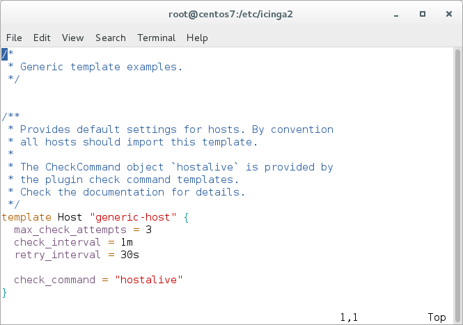
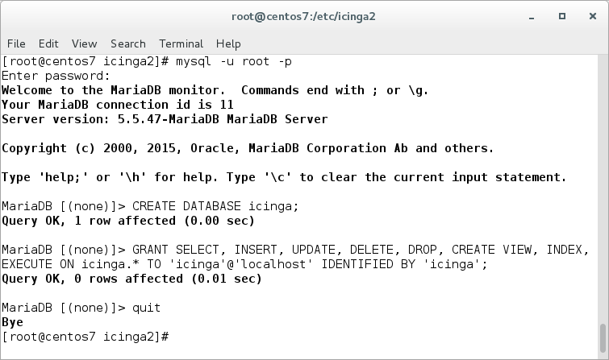

#  Getting Started

This tutorial is a step-by-step introduction to installing [Icinga 2](2-getting-started.md#setting-up-icinga2)
and [Icinga Web 2](2-getting-started.md#setting-up-icingaweb2).
It assumes that you are familiar with the operating system you're using to install Icinga 2.

##  Setting up Icinga 2

First off you will have to install Icinga 2. The preferred way of doing this
is to use the official package repositories depending on which operating system
and distribution you are running.

  Distribution            | Repository
  ------------------------|---------------------------
  Debian                  | [Icinga Repository](http://packages.icinga.com/debian/), [debmon](https://debmon.org/packages/debmon-jessie/icinga2)
  Ubuntu                  | [Icinga Repository](http://packages.icinga.com/ubuntu/), [Icinga PPA](https://launchpad.net/~formorer/+archive/ubuntu/icinga)
  RHEL/CentOS             | [Icinga Repository](http://packages.icinga.com/epel/)
  openSUSE                | [Icinga Repository](http://packages.icinga.com/openSUSE/), [Server Monitoring Repository](https://build.opensuse.org/package/show/server:monitoring/icinga2)
  SLES                    | [Icinga Repository](http://packages.icinga.com/SUSE/)
  Gentoo                  | [Upstream](http://packages.gentoo.org/package/net-analyzer/icinga2)
  FreeBSD                 | [Upstream](http://www.freshports.org/net-mgmt/icinga2)
  ArchLinux               | [Upstream](https://aur.archlinux.org/packages/icinga2)

Packages for distributions other than the ones listed above may also be
available. Please contact your distribution packagers.

###  Package Repositories

You need to add the Icinga repository to your package management configuration.
Below is a list with examples for the various distributions.

Debian:

    # wget -O - http://packages.icinga.com/icinga.key | apt-key add -
    # echo 'deb http://packages.icinga.com/debian icinga-jessie main' >/etc/apt/sources.list.d/icinga.list
    # apt-get update

Ubuntu:

    # wget -O - http://packages.icinga.com/icinga.key | apt-key add -
    # echo 'deb http://packages.icinga.com/ubuntu icinga-xenial main' >/etc/apt/sources.list.d/icinga.list
    # apt-get update

RHEL/CentOS 7:

    yum install https://packages.icinga.com/epel/7/release/noarch/icinga-rpm-release-7-1.el7.centos.noarch.rpm

RHEL/CentOS 6:

    yum install https://packages.icinga.com/epel/6/release/noarch/icinga-rpm-release-6-1.el6.noarch.rpm

RHEL/CentOS 5:

    rpm -i http://packages.icinga.com/epel/5/release/noarch/icinga-rpm-release-5-1.el5.centos.noarch.rpm

Fedora 25:

    dnf install https://packages.icinga.com/fedora/25/release/noarch/icinga-rpm-release-25-1.fc25.noarch.rpm

Fedora 24:

    dnf install https://packages.icinga.com/fedora/24/release/noarch/icinga-rpm-release-24-1.fc24.noarch.rpm

Fedora 23:

    dnf install https://packages.icinga.com/fedora/23/release/noarch/icinga-rpm-release-23-1.fc23.noarch.rpm

SLES 11:

    # zypper ar http://packages.icinga.com/SUSE/ICINGA-release-11.repo
    # zypper ref

SLES 12:

    # zypper ar http://packages.icinga.com/SUSE/ICINGA-release.repo
    # zypper ref

openSUSE:

    # zypper ar http://packages.icinga.com/openSUSE/ICINGA-release.repo
    # zypper ref

####  RHEL/CentOS EPEL Repository

The packages for RHEL/CentOS depend on other packages which are distributed
as part of the [EPEL repository](http://fedoraproject.org/wiki/EPEL).

CentOS 7/6/5:

    yum install epel-release

If you are using RHEL you need enable the `optional` repository and then install
the [EPEL rpm package](http://fedoraproject.org/wiki/EPEL#How_can_I_use_these_extra_packages.3F).

####  SLES Security Repository

The packages for SLES 11 depend on the `openssl1` package which is distributed
as part of the [SLES 11 Security Module](https://www.suse.com/communities/conversations/introducing-the-suse-linux-enterprise-11-security-module/).

####  SLES 12 SDK

Icinga 2 requires the `libboost_chrono1_54_0` package from the `SLES 12 SDK` repository. Refer to the SUSE Enterprise 
Linux documentation for further information.

###  Installing Icinga 2

You can install Icinga 2 by using your distribution's package manager
to install the `icinga2` package.

Debian/Ubuntu:

    # apt-get install icinga2

RHEL/CentOS 5/6:

    # yum install icinga2
    # chkconfig icinga2 on
    # service icinga2 start

RHEL/CentOS 7 and Fedora:

    # yum install icinga2
    # systemctl enable icinga2
    # systemctl start icinga2

SLES/openSUSE:

    # zypper install icinga2

FreeBSD:

    # pkg install icinga2

###  Enabled Features during Installation

The default installation will enable three features required for a basic
Icinga 2 installation:

* `checker` for executing checks
* `notification` for sending notifications
* `mainlog` for writing the `icinga2.log` file

You can verify that by calling `icinga2 feature list`
[CLI command](11-cli-commands.md#cli-command-feature) to see which features are
enabled and disabled.

    # icinga2 feature list
    Disabled features: api command compatlog debuglog gelf graphite icingastatus ido-mysql ido-pgsql influxdb livestatus opentsdb perfdata statusdata syslog
    Enabled features: checker mainlog notification

###  Installation Paths

By default Icinga 2 uses the following files and directories:

  Path                                		| Description
  ----------------------------------------------|------------------------------------
  /etc/icinga2                        		| Contains Icinga 2 configuration files.
  /usr/lib/systemd/system/icinga2.service 	| The Icinga 2 Systemd service file on systems using Systemd.
  /etc/init.d/icinga2                 		| The Icinga 2 init script on systems using SysVinit.
  /usr/sbin/icinga2                   		| Shell wrapper for the Icinga 2 binary.
  /usr/lib\*/icinga2				| Libraries and the Icinga 2 binary (use `find /usr -type f -name icinga2` to locate the binary path).
  /usr/share/doc/icinga2              		| Documentation files that come with Icinga 2.
  /usr/share/icinga2/include          		| The Icinga Template Library and plugin command configuration.
  /var/run/icinga2                    		| PID file.
  /var/run/icinga2/cmd                		| Command pipe and Livestatus socket.
  /var/cache/icinga2                  		| status.dat/objects.cache, icinga2.debug files
  /var/spool/icinga2                  		| Used for performance data spool files.
  /var/lib/icinga2                    		| Icinga 2 state file, cluster log, local CA and configuration files (cluster, api).
  /var/log/icinga2                    		| Log file location and compat/ directory for the CompatLogger feature.

FreeBSD uses slightly different paths:

By default Icinga 2 uses the following files and directories:

  Path                                | Description
  ------------------------------------|------------------------------------
  /usr/local/etc/icinga2              | Contains Icinga 2 configuration files.
  /usr/local/etc/rc.d/icinga2         | The Icinga 2 init script.
  /usr/local/sbin/icinga2             | Shell wrapper for the Icinga 2 binary.
  /usr/local/lib/icinga2              | Libraries and the Icinga 2 binary.
  /usr/local/share/doc/icinga2        | Documentation files that come with Icinga 2.
  /usr/local/share/icinga2/include    | The Icinga Template Library and plugin command configuration.
  /var/run/icinga2                    | PID file.
  /var/run/icinga2/cmd                | Command pipe and Livestatus socket.
  /var/cache/icinga2                  | status.dat/objects.cache, icinga2.debug files
  /var/spool/icinga2                  | Used for performance data spool files.
  /var/lib/icinga2                    | Icinga 2 state file, cluster log, local CA and configuration files (cluster, api).
  /var/log/icinga2                    | Log file location and compat/ directory for the CompatLogger feature.

##  Setting up Check Plugins

Without plugins Icinga 2 does not know how to check external services. The
[Monitoring Plugins Project](https://www.monitoring-plugins.org/) provides
an extensive set of plugins which can be used with Icinga 2 to check whether
services are working properly.

These plugins are required to make the [example configuration](4-configuring-icinga-2.md#configuring-icinga2-overview)
work out-of-the-box.

For your convenience here is a list of package names for some of the more
popular operating systems/distributions:

OS/Distribution        | Package Name       | Repository                | Installation Path
-----------------------|--------------------|---------------------------|----------------------------
RHEL/CentOS            | nagios-plugins-all | [EPEL](http://fedoraproject.org/wiki/EPEL) | /usr/lib/nagios/plugins or /usr/lib64/nagios/plugins
SLES/OpenSUSE          | monitoring-plugins | [server:monitoring](https://build.opensuse.org/project/repositories/server:monitoring) | /usr/lib/nagios/plugins
Debian/Ubuntu          | nagios-plugins     | -                         | /usr/lib/nagios/plugins
FreeBSD                | monitoring-plugins | -                         | /usr/local/libexec/nagios
OS X                   | nagios-plugins     | [MacPorts](http://www.macports.org), [Homebrew](http://brew.sh) | /opt/local/libexec or /usr/local/sbin

The recommended way of installing these standard plugins is to use your
distribution's package manager.

Debian/Ubuntu:

    # apt-get install nagios-plugins

RHEL/CentOS:

    # yum install nagios-plugins-all

The packages for RHEL/CentOS depend on other packages which are distributed
as part of the [EPEL repository](http://fedoraproject.org/wiki/EPEL). Please
make sure to enable this repository by following
[these instructions](http://fedoraproject.org/wiki/EPEL#How_can_I_use_these_extra_packages.3F).

Fedora:

    # dnf install nagios-plugins-all

SLES/openSUSE:

    # zypper install monitoring-plugins

The packages for SLES/OpenSUSE depend on other packages which are distributed
as part of the [server:monitoring repository](https://build.opensuse.org/project/repositories/server:monitoring).
Please make sure to enable this repository beforehand.

FreeBSD:

    # pkg install monitoring-plugins

Depending on which directory your plugins are installed into you may need to
update the global `PluginDir` constant in your [Icinga 2 configuration](4-configuring-icinga-2.md#constants-conf).
This constant is used by the check command definitions contained in the Icinga Template Library
to determine where to find the plugin binaries.

> **Note**
>
> Please refer to the [service monitoring](5-service-monitoring.md#service-monitoring-plugins) chapter for details about how to integrate
> additional check plugins into your Icinga 2 setup.

##  Running Icinga 2

###  Init Script

Icinga 2's init script is installed in `/etc/init.d/icinga2` (`/usr/local/etc/rc.d/icinga2` on FreeBSD) by default:

    # /etc/init.d/icinga2
    Usage: /etc/init.d/icinga2 {start|stop|restart|reload|checkconfig|status}

The init script supports the following actions:

  Command             | Description
  --------------------|------------------------
  start               | The `start` action starts the Icinga 2 daemon.
  stop                | The `stop` action stops the Icinga 2 daemon.
  restart             | The `restart` action is a shortcut for running the `stop` action followed by `start`.
  reload              | The `reload` action sends the `HUP` signal to Icinga 2 which causes it to restart. Unlike the `restart` action `reload` does not wait until Icinga 2 has restarted.
  checkconfig         | The `checkconfig` action checks if the `/etc/icinga2/icinga2.conf` configuration file contains any errors.
  status              | The `status` action checks if Icinga 2 is running.

By default the Icinga 2 daemon is running as `icinga` user and group
using the init script. Using Debian packages the user and group are set to
`nagios` for historical reasons.

###  systemd Service

Some distributions (e.g. Fedora, openSUSE and RHEL/CentOS 7) use systemd. The
Icinga 2 packages automatically install the necessary systemd unit files.

The Icinga 2 systemd service can be (re-)started, reloaded, stopped and also
queried for its current status.

    # systemctl status icinga2
    icinga2.service - Icinga host/service/network monitoring system
       Loaded: loaded (/usr/lib/systemd/system/icinga2.service; disabled)
       Active: active (running) since Mi 2014-07-23 13:39:38 CEST; 15s ago
      Process: 21692 ExecStart=/usr/sbin/icinga2 -c ${ICINGA2_CONFIG_FILE} -d -e ${ICINGA2_ERROR_LOG} -u ${ICINGA2_USER} -g ${ICINGA2_GROUP} (code=exited, status=0/SUCCESS)
      Process: 21674 ExecStartPre=/usr/sbin/icinga2-prepare-dirs /etc/sysconfig/icinga2 (code=exited, status=0/SUCCESS)
     Main PID: 21727 (icinga2)
       CGroup: /system.slice/icinga2.service
               21727 /usr/sbin/icinga2 -c /etc/icinga2/icinga2.conf -d -e /var/log/icinga2/error.log -u icinga -g icinga --no-stack-rlimit

    Jul 23 13:39:38 nbmif icinga2[21692]: [2014-07-23 13:39:38 +0200] information/ConfigItem: Checked 309 Service(s).
    Jul 23 13:39:38 nbmif icinga2[21692]: [2014-07-23 13:39:38 +0200] information/ConfigItem: Checked 1 User(s).
    Jul 23 13:39:38 nbmif icinga2[21692]: [2014-07-23 13:39:38 +0200] information/ConfigItem: Checked 15 Notification(s).
    Jul 23 13:39:38 nbmif icinga2[21692]: [2014-07-23 13:39:38 +0200] information/ConfigItem: Checked 4 ScheduledDowntime(s).
    Jul 23 13:39:38 nbmif icinga2[21692]: [2014-07-23 13:39:38 +0200] information/ConfigItem: Checked 1 UserGroup(s).
    Jul 23 13:39:38 nbmif icinga2[21692]: [2014-07-23 13:39:38 +0200] information/ConfigItem: Checked 1 IcingaApplication(s).
    Jul 23 13:39:38 nbmif icinga2[21692]: [2014-07-23 13:39:38 +0200] information/ConfigItem: Checked 8 Dependency(s).
    Jul 23 13:39:38 nbmif systemd[1]: Started Icinga host/service/network monitoring system.

The `systemctl` command supports the following actions:

  Command             | Description
  --------------------|------------------------
  start               | The `start` action starts the Icinga 2 daemon.
  stop                | The `stop` action stops the Icinga 2 daemon.
  restart             | The `restart` action is a shortcut for running the `stop` action followed by `start`.
  reload              | The `reload` action sends the `HUP` signal to Icinga 2 which causes it to restart. Unlike the `restart` action `reload` does not wait until Icinga 2 has restarted.
  status              | The `status` action checks if Icinga 2 is running.
  enable              | The `enable` action enables the service being started at system boot time (similar to `chkconfig`)

Examples:

    # systemctl enable icinga2

    # systemctl restart icinga2
    Job for icinga2.service failed. See 'systemctl status icinga2.service' and 'journalctl -xn' for details.

If you're stuck with configuration errors, you can manually invoke the
[configuration validation](11-cli-commands.md#config-validation).

### FreeBSD

On FreeBSD you need to enable icinga2 in your rc.conf

    # sysrc icinga2_enable=yes

    # service icinga2 restart

##  Configuration Syntax Highlighting

Icinga 2 ships configuration examples for syntax highlighting using the `vim` and `nano` editors.
The RHEL and SUSE package `icinga2-common` installs these files into `/usr/share/doc/icinga2-common-[x.x.x]/syntax`
(where `[x.x.x]` is the version number, e.g. `2.4.3` or `2.4.4`). Sources provide these files in `tools/syntax`.
On Debian systems the `icinga2-common` package provides only the Nano configuration file (`/usr/share/nano/icinga2.nanorc`);
to obtain the Vim configuration, please install the extra package `vim-icinga2`. The files are located in `/usr/share/vim/addons`.

###  Configuration Syntax Highlighting using Vim

Install the package `vim-icinga2` with your distribution's package manager.

Debian/Ubuntu:

    $ apt-get install vim-icinga2 vim-addon-manager
    $ vim-addon-manager -w install icinga2
    Info: installing removed addon 'icinga2' to /var/lib/vim/addons

RHEL/CentOS/Fedora:

    $ yum install vim-icinga2

SLES/openSUSE:

    $ zypper install vim-icinga2

Ensure that syntax highlighting is enabled e.g. by editing the user's `vimrc`
configuration file:

    $ vim ~/.vimrc
    syntax on

Test it:

    $ vim /etc/icinga2/conf.d/templates.conf

###  Configuration Syntax Highlighting using Nano

Install the package `nano-icinga2` with your distribution's package manager.

Debian/Ubuntu:

**Note:** The syntax files are installed with the `icinga2-common` package already.

RHEL/CentOS/Fedora:

    $ yum install nano-icinga2

SLES/openSUSE:

    $ zypper install nano-icinga2

Copy the `/etc/nanorc` sample file to your home directory.

    $ cp /etc/nanorc ~/.nanorc

Include the `icinga2.nanorc` file.

    $ vim ~/.nanorc

    ## Icinga 2
    include "/usr/share/nano/icinga2.nanorc"

Test it:

    $ nano /etc/icinga2/conf.d/templates.conf

##  Setting up Icinga Web 2

Icinga 2 can be used with Icinga Web 2 and a number of other web interfaces.
This chapter explains how to set up Icinga Web 2.

The DB IDO (Database Icinga Data Output) modules for Icinga 2 take care of
exporting all configuration and status information into a database. The IDO
database is used by a number of projects including
[Icinga Web 2](2-getting-started.md#setting-up-icingaweb2), Icinga Reporting
or Icinga Web 1.x.

There is a separate module for each database backend. At present support for
both MySQL and PostgreSQL is implemented.

###  Configuring DB IDO MySQL

####  Installing MySQL database server

Debian/Ubuntu:

    # apt-get install mysql-server mysql-client

RHEL/CentOS 5/6:

    # yum install mysql-server mysql
    # chkconfig mysqld on
    # service mysqld start
    # mysql_secure_installation

RHEL/CentOS 7 and Fedora:

    # yum install mariadb-server mariadb
    # systemctl enable mariadb
    # systemctl start mariadb
    # mysql_secure_installation

SUSE:

    # zypper install mysql mysql-client
    # chkconfig mysqld on
    # service mysqld start

FreeBSD:

    # pkg install mysql56-server
    # sysrc mysql_enable=yes
    # service mysql-server restart
    # mysql_secure_installation

####  Installing the IDO modules for MySQL

The next step is to install the `icinga2-ido-mysql` package using your
distribution's package manager.

Debian/Ubuntu:

    # apt-get install icinga2-ido-mysql

RHEL/CentOS:

    # yum install icinga2-ido-mysql

SUSE:

    # zypper install icinga2-ido-mysql

FreeBSD:

On FreeBSD the IDO modules for MySQL are included with the icinga2 package
and located at /usr/local/share/icinga2-ido-mysql/schema/mysql.sql

> **Note**
>
> The Debian/Ubuntu packages provide a database configuration wizard by
> default. You can skip the automated setup and install/upgrade the
> database manually if you prefer that.

####  Setting up the MySQL database

Set up a MySQL database for Icinga 2:

    # mysql -u root -p

    mysql>  CREATE DATABASE icinga;
    mysql>  GRANT SELECT, INSERT, UPDATE, DELETE, DROP, CREATE VIEW, INDEX, EXECUTE ON icinga.* TO 'icinga'@'localhost' IDENTIFIED BY 'icinga';
    mysql> quit

After creating the database you can import the Icinga 2 IDO schema using the
following command:

    # mysql -u root -p icinga < /usr/share/icinga2-ido-mysql/schema/mysql.sql

####  Enabling the IDO MySQL module

The package provides a new configuration file that is installed in
`/etc/icinga2/features-available/ido-mysql.conf`. You will need to
update the database credentials in this file.

All available attributes are explained in the
[IdoMysqlConnection object](9-object-types.md#objecttype-idomysqlconnection)
chapter.

You can enable the `ido-mysql` feature configuration file using
`icinga2 feature enable`:

    # icinga2 feature enable ido-mysql
    Module 'ido-mysql' was enabled.
    Make sure to restart Icinga 2 for these changes to take effect.

After enabling the ido-mysql feature you have to restart Icinga 2:

Debian/Ubuntu, RHEL/CentOS 6 and SUSE:

    # service icinga2 restart

RHEL/CentOS 7 and Fedora:

    # systemctl restart icinga2

FreeBSD:

    # service icinga2 restart

###  Configuring DB IDO PostgreSQL

####  Installing PostgreSQL database server

Debian/Ubuntu:

    # apt-get install postgresql

RHEL/CentOS 5/6:

    # yum install postgresql-server postgresql
    # chkconfig postgresql on
    # service postgresql start

RHEL/CentOS 7:

    # yum install postgresql-server postgresql
    # postgresql-setup initdb
    # systemctl enable postgresql
    # systemctl start postgresql

SUSE:

    # zypper install postgresql postgresql-server
    # chkconfig postgresql on
    # service postgresql start

FreeBSD:

    # pkg install postgresql93-server
    # sysrc postgresql_enable=yes
    # service postgresql start

####  Installing the IDO modules for PostgreSQL

The next step is to install the `icinga2-ido-pgsql` package using your
distribution's package manager.

Debian/Ubuntu:

    # apt-get install icinga2-ido-pgsql

RHEL/CentOS:

    # yum install icinga2-ido-pgsql

SUSE:

    # zypper install icinga2-ido-pgsql

FreeBSD:

On FreeBSD the IDO modules for PostgreSQL are included with the icinga2 package
and located at /usr/local/share/icinga2-ido-pgsql/schema/pgsql.sql

> **Note**
>
> Upstream Debian packages provide a database configuration wizard by default.
> You can skip the automated setup and install/upgrade the database manually
> if you prefer that.

#### Setting up the PostgreSQL database

Set up a PostgreSQL database for Icinga 2:

    # cd /tmp
    # sudo -u postgres psql -c "CREATE ROLE icinga WITH LOGIN PASSWORD 'icinga'"
    # sudo -u postgres createdb -O icinga -E UTF8 icinga
    # sudo -u postgres createlang plpgsql icinga

> **Note**
>
> When using PostgreSQL 9.x you can omit the `createlang` command.
> Also it is assumed here that your locale is set to utf-8, you may run into
> problems otherwise.

Locate your pg\_hba.conf (Debian: `/etc/postgresql/*/main/pg_hba.conf`,
RHEL/SUSE: `/var/lib/pgsql/data/pg_hba.conf`), add the icinga user with md5
authentication method and restart the postgresql server.

    # icinga
    local   icinga      icinga                            md5
    host    icinga      icinga      127.0.0.1/32          md5
    host    icinga      icinga      ::1/128               md5

    # "local" is for Unix domain socket connections only
    local   all         all                               ident
    # IPv4 local connections:
    host    all         all         127.0.0.1/32          ident
    # IPv6 local connections:
    host    all         all         ::1/128               ident

    # service postgresql restart

After creating the database and permissions you can import the Icinga 2 IDO
schema using the following command:

    # export PGPASSWORD=icinga
    # psql -U icinga -d icinga < /usr/share/icinga2-ido-pgsql/schema/pgsql.sql

####  Enabling the IDO PostgreSQL module

The package provides a new configuration file that is installed in
`/etc/icinga2/features-available/ido-pgsql.conf`. You will need to update
the database credentials in this file.

All available attributes are explained in the
[IdoPgsqlConnection object](9-object-types.md#objecttype-idopgsqlconnection)
chapter.

You can enable the `ido-pgsql` feature configuration file using
`icinga2 feature enable`:

    # icinga2 feature enable ido-pgsql
    Module 'ido-pgsql' was enabled.
    Make sure to restart Icinga 2 for these changes to take effect.

After enabling the ido-pgsql feature you have to restart Icinga 2:

Debian/Ubuntu, RHEL/CentOS 6, SUSE and FreeBSD:

    # service icinga2 restart

RHEL/CentOS 7 and Fedora:

    # systemctl restart icinga2

###  Webserver

Debian/Ubuntu:

    # apt-get install apache2

RHEL/CentOS 6:

    # yum install httpd
    # chkconfig httpd on
    # service httpd start

RHEL/CentOS 7/Fedora:

    # yum install httpd
    # systemctl enable httpd
    # systemctl start httpd

SUSE:

    # zypper install apache2
    # chkconfig on
    # service apache2 start

FreeBSD (nginx, but you could also use the apache24 package):

    # pkg install nginx php56-gettext php56-ldap php56-openssl php56-mysql php56-pdo_mysql php56-pgsql php56-pdo_pgsql php56-sockets php56-gd pecl-imagick pecl-intl
    # sysrc php_fpm_enable=yes
    # sysrc nginx_enable=yes
    # sed -i '' "s/listen\ =\ 127.0.0.1:9000/listen\ =\ \/var\/run\/php5-fpm.sock/" /usr/local/etc/php-fpm.conf
    # sed -i '' "s/;listen.owner/listen.owner/" /usr/local/etc/php-fpm.conf
    # sed -i '' "s/;listen.group/listen.group/" /usr/local/etc/php-fpm.conf
    # sed -i '' "s/;listen.mode/listen.mode/" /usr/local/etc/php-fpm.conf
    # service php-fpm start
    # service nginx start

###  Firewall Rules

Example:

    # iptables -A INPUT -p tcp -m tcp --dport 80 -j ACCEPT
    # service iptables save

RHEL/CentOS 7 specific:

    # firewall-cmd --add-service=http
    # firewall-cmd --permanent --add-service=http

FreeBSD:
Please consult the [FreeBSD Handbook](https://www.freebsd.org/doc/en_US.ISO8859-1/books/handbook/firewalls.html) how to configure one of FreeBSD's firewalls.

###  Setting Up External Command Pipe

Web interfaces and other Icinga addons are able to send commands to
Icinga 2 through the external command pipe.

You can enable the External Command Pipe using the CLI:

    # icinga2 feature enable command

After that you will have to restart Icinga 2:

Debian/Ubuntu, RHEL/CentOS 6 and SUSE:

    # service icinga2 restart

RHEL/CentOS 7 and Fedora:

    # systemctl restart icinga2

FreeBSD:

    # service icinga2 restart

By default the command pipe file is owned by the group `icingacmd` with
read/write permissions. Add your webserver's user to the group `icingacmd` to
enable sending commands to Icinga 2 through your web interface:

    # usermod -a -G icingacmd www-data

FreeBSD:
On FreeBSD the rw directory is owned by the group `www`. You do not need to add the
user `icinga` to the group `www`.

Debian packages use `nagios` as the default user and group name. Therefore
change `icingacmd` to `nagios`.

The webserver's user is different between distributions so you might have to
change `www-data` to `wwwrun`, `www`, or `apache`.

Change `www-data` to the user you're using to run queries.

You can verify that the user has been successfully added to the `icingacmd`
group using the `id` command:

    $ id <your-webserver-user>

 is a member of the group `icingacmd`.")

###  Installing Icinga Web 2

Please consult the [installation documentation](https://github.com/Icinga/icingaweb2/blob/master/doc/02-Installation.md)
for further instructions on how to install Icinga Web 2.

##  Addons

A number of additional features are available in the form of addons. A list of
popular addons is available in the
[Addons and Plugins](13-addons.md#addons) chapter.

##  Backup

Ensure to include the following in your backups:

* Configuration files in `/etc/icinga2`
* Runtime files in `/var/lib/icinga2` (the master's CA is stored here as well)
* Optional: IDO database backup
