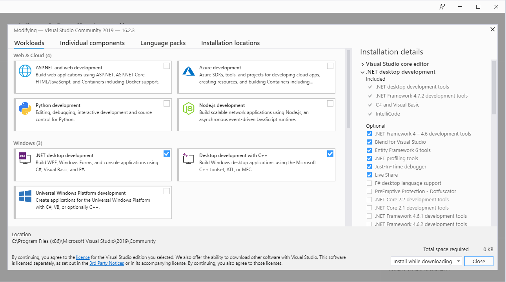

# Development <a id="development"></a>

This chapter provides hints on Icinga 2 debugging,
development, package builds and tests.

* [Debug Icinga 2](21-development.md#development-debug)
    * [GDB Backtrace](21-development.md#development-debug-gdb-backtrace)
    * [Core Dump](21-development.md#development-debug-core-dump)
* [Test Icinga 2](21-development.md#development-tests)
    * [Snapshot Packages (Nightly Builds)](21-development.md#development-tests-snapshot-packages)
* [Develop Icinga 2](21-development.md#development-develop)
    * [Preparations](21-development.md#development-develop-prepare)
    * [Design Patterns](21-development.md#development-develop-design-patterns)
    * [Build Tools](21-development.md#development-develop-builds-tools)
    * [Unit Tests](21-development.md#development-develop-tests)
    * [Style Guide](21-development.md#development-develop-styleguide)
* [Development Environment](21-development.md#development-environment)
    * [Linux Dev Environment](21-development.md#development-linux-dev-env)
    * [macOS Dev Environment](21-development.md#development-macos-dev-env)
    * [Windows Dev Environment](21-development.md#development-windows-dev-env)
* [Package Builds](21-development.md#development-package-builds)
    * [RPM](21-development.md#development-package-builds-rpms)
    * [DEB](21-development.md#development-package-builds-deb)
    * [Windows](21-development.md#development-package-builds-windows)
* [Continuous Integration](21-development.md#development-ci)
* [Advanced Tips](21-development.md#development-advanced)

<!-- mkdocs requires 4 spaces indent for nested lists: https://github.com/Python-Markdown/markdown/issues/3 -->

## Debug Icinga 2 <a id="development-debug"></a>

This chapter targets all users who have been asked by developers to provide
a stack trace or coredump if the application crashed. It is also useful
for developers working with different debuggers.

> **Note:**
>
> This is intentionally mentioned before any development insights
> as debugging is a more frequent and commonly asked question.

### Debug Requirements <a id="debug-requirements"></a>

Make sure that the debug symbols are available for Icinga 2.
The Icinga 2 packages provide a debug package which must be
installed separately for all involved binaries, like `icinga2-bin`
or `icinga2-ido-mysql`.

Distribution       | Command
-------------------|------------------------------------------
Debian/Ubuntu      | `apt-get install icinga2-dbg`
RHEL/CentOS        | `yum install icinga2-debuginfo`
Fedora             | `dnf install icinga2-debuginfo icinga2-bin-debuginfo icinga2-ido-mysql-debuginfo`
SLES/openSUSE      | `zypper install icinga2-bin-debuginfo icinga2-ido-mysql-debuginfo`

Furthermore, you may also have to install debug symbols for Boost and your C++ library.

If you're building your own binaries, you should use the `-DCMAKE_BUILD_TYPE=Debug` cmake
build flag for debug builds.


### GDB as Debugger <a id="development-debug-gdb"></a>

Install GDB in your development environment.

Distribution       | Command
-------------------|------------------------------------------
Debian/Ubuntu      | `apt-get install gdb`
RHEL/CentOS        | `yum install gdb`
Fedora             | `dnf install gdb`
SLES/openSUSE      | `zypper install gdb`

#### GDB Run <a id="development-debug-gdb-run"></a>

Run the icinga2 binary `/usr/lib{,64}/icinga2/sbin/icinga2` with gdb, `/usr/bin/icinga2` is a shell wrapper.

```
gdb --args /usr/lib/icinga2/sbin/icinga2 daemon

(gdb) set follow-fork-mode child
```

When gdb halts on SIGUSR2, press `c` to continue. This signal originates from the umbrella
process and can safely be ignored.


> **Note**
>
> Since v2.11 we would attach to the umbrella process spawned with `/usr/lib/icinga2/sbin/icinga2`,
> therefore rather attach to a running process.
>
```bash
# Typically the order of PIDs is: 1) umbrella 2) spawn helper 3) main process
pidof icinga2

gdb -p $(pidof icinga2 | cut -d ' ' -f3)
```

> **Note**
>
> If gdb tells you it's missing debug symbols, quit gdb and install
> them: `Missing separate debuginfos, use: debuginfo-install ...`

Run/restart the application.

```
(gdb) r
```

Kill the running application.

```
(gdb) k
```

Continue after breakpoint.

```
(gdb) c
```

#### GDB Core Dump <a id="development-debug-gdb-coredump"></a>

Either attach to the running process using `gdb -p PID` or start
a new gdb run.

```
(gdb) r
(gdb) generate-core-file
```

#### GDB Backtrace <a id="development-debug-gdb-backtrace"></a>

If Icinga 2 aborted its operation abnormally, generate a backtrace.

> **Note**
>
> Please install the [required debug symbols](21-development.md#debug-requirements)
> prior to generating a backtrace.

`thread apply all` is important here since this includes all running threads.
We need this information when e.g. debugging dead locks and hanging features.

```
(gdb) bt
(gdb) thread apply all bt full
```

If gdb stops at a SIGPIPE signal please disable the signal before
running Icinga 2. This isn't an error, but we need to workaround it.

```
(gdb) handle SIGPIPE nostop noprint pass
(gdb) r
```

If you create a [new issue](https://github.com/Icinga/icinga2/issues),
make sure to attach as much detail as possible.

#### GDB Backtrace from Running Process <a id="development-debug-gdb-backtrace-running"></a>

If Icinga 2 is still running, generate a full backtrace from the running
process and store it into a new file (e.g. for debugging dead locks).

> **Note**
>
> Please install the [required debug symbols](21-development.md#debug-requirements)
> prior to generating a backtrace.

Icinga 2 runs with 2 processes: main and command executor, therefore generate two backtrace logs
and add them to the GitHub issue.

```bash
for pid in $(pidof icinga2); do gdb -p $pid -batch -ex "thread apply all bt full" -ex "detach" -ex "q" > gdb_bt_${pid}_`date +%s`.log; done
```

#### GDB Thread List from Running Process <a id="development-debug-gdb-thread-list-running"></a>

Instead of a full backtrace, you sometimes just need a list of running threads.

```bash
for pid in $(pidof icinga2); do gdb -p $pid -batch -ex "info threads" -ex "detach" -ex "q" > gdb_threads_${pid}_`date +%s`.log; done
```

#### GDB Backtrace Stepping <a id="development-debug-gdb-backtrace-stepping"></a>

Identifying the problem may require stepping into the backtrace, analysing
the current scope, attributes, and possible unmet requirements. `p` prints
the value of the selected variable or function call result.

```
(gdb) up
(gdb) down
(gdb) p checkable
(gdb) p checkable.px->m_Name
```

#### GDB Breakpoints <a id="development-debug-gdb-breakpoint"></a>

To set a breakpoint to a specific function call, or file specific line.

```
(gdb) b checkable.cpp:125
(gdb) b icinga::Checkable::SetEnablePerfdata
```

GDB will ask about loading the required symbols later, select `yes` instead
of `no`.

Then run Icinga 2 until it reaches the first breakpoint. Continue with `c`
afterwards.

```
(gdb) run
(gdb) c
```

In case you want to step into the next line of code, use `n`. If there is a
function call where you want to step into, use `s`.

```
(gdb) n

(gdb) s
```

If you want to delete all breakpoints, use `d` and select `yes`.

```
(gdb) d
```

> **Tip**
>
> When debugging exceptions, set your breakpoint like this: `b __cxa_throw`.

Breakpoint Example:

```
(gdb) b __cxa_throw
(gdb) r
(gdb) up
....
(gdb) up
#11 0x00007ffff7cbf9ff in icinga::Utility::GlobRecursive(icinga::String const&, icinga::String const&, boost::function<void (icinga::String const&)> const&, int) (path=..., pattern=..., callback=..., type=1)
    at /home/michi/coding/icinga/icinga2/lib/base/utility.cpp:609
609			callback(cpath);
(gdb) l
604
605	#endif /* _WIN32 */
606
607		std::sort(files.begin(), files.end());
608		BOOST_FOREACH(const String& cpath, files) {
609			callback(cpath);
610		}
611
612		std::sort(dirs.begin(), dirs.end());
613		BOOST_FOREACH(const String& cpath, dirs) {
(gdb) p files
$3 = std::vector of length 11, capacity 16 = {{static NPos = 18446744073709551615, m_Data = "/etc/icinga2/conf.d/agent.conf"}, {static NPos = 18446744073709551615,
    m_Data = "/etc/icinga2/conf.d/commands.conf"}, {static NPos = 18446744073709551615, m_Data = "/etc/icinga2/conf.d/downtimes.conf"}, {static NPos = 18446744073709551615,
    m_Data = "/etc/icinga2/conf.d/groups.conf"}, {static NPos = 18446744073709551615, m_Data = "/etc/icinga2/conf.d/notifications.conf"}, {static NPos = 18446744073709551615,
    m_Data = "/etc/icinga2/conf.d/satellite.conf"}, {static NPos = 18446744073709551615, m_Data = "/etc/icinga2/conf.d/services.conf"}, {static NPos = 18446744073709551615,
    m_Data = "/etc/icinga2/conf.d/templates.conf"}, {static NPos = 18446744073709551615, m_Data = "/etc/icinga2/conf.d/test.conf"}, {static NPos = 18446744073709551615,
    m_Data = "/etc/icinga2/conf.d/timeperiods.conf"}, {static NPos = 18446744073709551615, m_Data = "/etc/icinga2/conf.d/users.conf"}}
```


### Core Dump <a id="development-debug-core-dump"></a>

When the Icinga 2 daemon crashes with a `SIGSEGV` signal
a core dump file should be written. This will help
developers to analyze and fix the problem.

#### Core Dump File Size Limit <a id="development-debug-core-dump-limit"></a>

This requires setting the core dump file size to `unlimited`.


##### Systemd

```
systemctl edit icinga2.service

[Service]
...
LimitCORE=infinity

systemctl daemon-reload

systemctl restart icinga2
```

##### Init Script

```
vim /etc/init.d/icinga2
...
ulimit -c unlimited

service icinga2 restart
```

##### Verify

Verify that the Icinga 2 process core file size limit is set to `unlimited`.

```
for pid in $(pidof icinga2); do cat /proc/$pid/limits; done

...
Max core file size        unlimited            unlimited            bytes
```


#### Core Dump Kernel Format <a id="development-debug-core-dump-format"></a>

The Icinga 2 daemon runs with the SUID bit set. Therefore you need
to explicitly enable core dumps for SUID on Linux.

```bash
sysctl -w fs.suid_dumpable=2
```

Adjust the coredump kernel format and file location on Linux:

```bash
sysctl -w kernel.core_pattern=/var/lib/cores/core.%e.%p

install -m 1777 -d /var/lib/cores
```

MacOS:

```bash
sysctl -w kern.corefile=/cores/core.%P

chmod 777 /cores
```

#### Core Dump Analysis <a id="development-debug-core-dump-analysis"></a>

Once Icinga 2 crashes again a new coredump file will be written. Please
attach this file to your bug report in addition to the general details.

Simple test case for a `SIGSEGV` simulation with `sleep`:

```
ulimit -c unlimited
sleep 1800&
[1] <PID>
kill -SEGV <PID>
gdb `which sleep` /var/lib/cores/core.sleep.<PID>
(gdb) bt
rm /var/lib/cores/core.sleep.*
```

Analyzing Icinga 2:

```
gdb /usr/lib64/icinga2/sbin/icinga2 core.icinga2.<PID>
(gdb) bt
```

### LLDB as Debugger <a id="development-debug-lldb"></a>

LLDB is available on macOS with the Xcode command line tools.

```bash
xcode-select --install
```

In order to run Icinga 2 with LLDB you need to pass the binary as argument.
Since v2.11 we would attach to the umbrella process, therefore rather
attach to a running process.

```bash
# Typically the order of PIDs is: 1) umbrella 2) spawn helper 3) main process
pidof icinga2

lldb -p $(pidof icinga2 | cut -d ' ' -f3)
```

In case you'll need to attach to the main process immediately, you can delay
the forked child process and attach to the printed PID.

```
$ icinga2 daemon -DInternal.DebugWorkerDelay=120
Closed FD 6 which we inherited from our parent process.
[2020-01-29 12:22:33 +0100] information/cli: Icinga application loader (version: v2.11.0-477-gfe8701d77; debug)
[2020-01-29 12:22:33 +0100] information/RunWorker: DEBUG: Current PID: 85253. Sleeping for 120 seconds to allow lldb/gdb -p <PID> attachment.
```

```bash
lldb -p 85253
```

When lldb halts on SIGUSR2, press `c` to continue. This signal originates from the umbrella
process and can safely be ignored.


Breakpoint:

```
> b checkable.cpp:57
> b icinga::Checkable::ProcessCheckResult
```

Full backtrace:

```
> bt all
```

Select thread:

```
> thr sel 5
```

Step into:

```
> s
```

Next step:

```
> n
```

Continue:

```
> c
```

Up/down in stacktrace:

```
> up
> down
```


### Debug on Windows <a id="development-debug-windows"></a>


Whenever the application crashes, the Windows error reporting (WER) can be [configured](https://docs.microsoft.com/en-gb/windows/win32/wer/collecting-user-mode-dumps)
to create user-mode dumps.


Tail the log file with Powershell:

```
Get-Content .\icinga2.log -tail 10 -wait
```


#### Debug on Windows: Dependencies <a id="development-debug-windows-dependencies"></a>

Similar to `ldd` or `nm` on Linux/Unix.

Extract the dependent DLLs from a binary with Visual Studio's `dumpbin` tool
in Powershell:

```
C:> &'C:\Program Files (x86)\Microsoft Visual Studio\2019\Community\VC\Tools\MSVC\14.22.27905\bin\Hostx64\x64\dumpbin.exe' /dependents .\debug\Bin\Debug\Debug\boosttest-test-base.exe
DEBUG:    1+  >>>> &'C:\Program Files (x86)\Microsoft Visual Studio\2019\Community\VC\Tools\MSVC\14.22.27905\bin\Hostx64\x64\dumpbin.exe' /dependents .\debug\Bin\Debug\Debug\boosttest-test-base.exe
Microsoft (R) COFF/PE Dumper Version 14.22.27905.0
Copyright (C) Microsoft Corporation.  All rights reserved.


Dump of file .\debug\Bin\Debug\Debug\boosttest-test-base.exe

File Type: EXECUTABLE IMAGE

  Image has the following dependencies:

    boost_coroutine-vc142-mt-gd-x64-1_79.dll
    boost_date_time-vc142-mt-gd-x64-1_79.dll
    boost_filesystem-vc142-mt-gd-x64-1_79.dll
    boost_thread-vc142-mt-gd-x64-1_79.dll
    boost_regex-vc142-mt-gd-x64-1_79.dll
    libssl-1_1-x64.dll
    libcrypto-1_1-x64.dll
    WS2_32.dll
    dbghelp.dll
    SHLWAPI.dll
    msi.dll
    boost_unit_test_framework-vc142-mt-gd-x64-1_79.dll
    KERNEL32.dll
    SHELL32.dll
    ADVAPI32.dll
    MSVCP140D.dll
    MSWSOCK.dll
    bcrypt.dll
    VCRUNTIME140D.dll
    ucrtbased.dll

  Summary

        1000 .00cfg
       68000 .data
        B000 .idata
      148000 .pdata
      69C000 .rdata
       25000 .reloc
        1000 .rsrc
      E7A000 .text
        1000 .tls
```


## Test Icinga 2 <a id="development-tests"></a>

### Snapshot Packages (Nightly Builds) <a id="development-tests-snapshot-packages"></a>

Icinga provides snapshot packages as nightly builds from [Git master](https://github.com/icinga/icinga2).

These packages contain development code which should be considered "work in progress".
While developers ensure that tests are running fine with CI actions on PRs,
things might break, or changes are not yet documented in the changelog.

You can help the developers and test the snapshot packages, e.g. when larger
changes or rewrites are taking place for a new major version. Your feedback
is very much appreciated.

Snapshot packages are available for all supported platforms including
Linux and Windows and can be obtained from [https://packages.icinga.com](https://packages.icinga.com).

The [Vagrant boxes](https://github.com/Icinga/icinga-vagrant) also use
the Icinga snapshot packages to allow easier integration tests. It is also
possible to use Docker with base OS images and installing the snapshot
packages.

If you encounter a problem, please [open a new issue](https://github.com/Icinga/icinga2/issues/new/choose)
on GitHub and mention that you're testing the snapshot packages.

#### RHEL/CentOS <a id="development-tests-snapshot-packages-rhel"></a>

2.11+ requires the EPEL repository for Boost 1.66+.

In addition to that, the `icinga-rpm-release` package already provides the `icinga-snapshot-builds`
repository but it is disabled by default.

```bash
yum -y install https://packages.icinga.com/epel/icinga-rpm-release-7-latest.noarch.rpm
yum -y install epel-release
yum makecache

yum install --enablerepo=icinga-snapshot-builds icinga2
```

#### Debian <a id="development-tests-snapshot-packages-debian"></a>

2.11+ requires Boost 1.66+ which either is provided by the OS, backports or Icinga stable repositories.
It is advised to configure both Icinga repositories, stable and snapshot and selectively
choose the repository with the `-t` flag on `apt-get install`.

```bash
apt-get update
apt-get -y install apt-transport-https wget gnupg

wget -O - https://packages.icinga.com/icinga.key | apt-key add -

DIST=$(awk -F"[)(]+" '/VERSION=/ {print $2}' /etc/os-release); \
 echo "deb https://packages.icinga.com/debian icinga-${DIST} main" > \
 /etc/apt/sources.list.d/${DIST}-icinga.list
 echo "deb-src https://packages.icinga.com/debian icinga-${DIST} main" >> \
 /etc/apt/sources.list.d/${DIST}-icinga.list

DIST=$(awk -F"[)(]+" '/VERSION=/ {print $2}' /etc/os-release); \
 echo "deb http://packages.icinga.com/debian icinga-${DIST}-snapshots main" > \
 /etc/apt/sources.list.d/${DIST}-icinga-snapshots.list
 echo "deb-src http://packages.icinga.com/debian icinga-${DIST}-snapshots main" >> \
 /etc/apt/sources.list.d/${DIST}-icinga-snapshots.list

apt-get update
```

On Debian Stretch, you'll also need to add Debian Backports.

```bash
DIST=$(awk -F"[)(]+" '/VERSION=/ {print $2}' /etc/os-release); \
 echo "deb https://deb.debian.org/debian ${DIST}-backports main" > \
 /etc/apt/sources.list.d/${DIST}-backports.list

apt-get update
```

Then install the snapshot packages.

```bash
DIST=$(awk -F"[)(]+" '/VERSION=/ {print $2}' /etc/os-release); \
apt-get install -t icinga-${DIST}-snapshots icinga2
```

#### Ubuntu <a id="development-tests-snapshot-packages-ubuntu"></a>

```bash
apt-get update
apt-get -y install apt-transport-https wget gnupg

wget -O - https://packages.icinga.com/icinga.key | apt-key add -

. /etc/os-release; if [ ! -z ${UBUNTU_CODENAME+x} ]; then DIST="${UBUNTU_CODENAME}"; else DIST="$(lsb_release -c| awk '{print $2}')"; fi; \
 echo "deb https://packages.icinga.com/ubuntu icinga-${DIST} main" > \
 /etc/apt/sources.list.d/${DIST}-icinga.list
 echo "deb-src https://packages.icinga.com/ubuntu icinga-${DIST} main" >> \
 /etc/apt/sources.list.d/${DIST}-icinga.list

. /etc/os-release; if [ ! -z ${UBUNTU_CODENAME+x} ]; then DIST="${UBUNTU_CODENAME}"; else DIST="$(lsb_release -c| awk '{print $2}')"; fi; \
 echo "deb https://packages.icinga.com/ubuntu icinga-${DIST}-snapshots main" > \
 /etc/apt/sources.list.d/${DIST}-icinga-snapshots.list
 echo "deb-src https://packages.icinga.com/ubuntu icinga-${DIST}-snapshots main" >> \
 /etc/apt/sources.list.d/${DIST}-icinga-snapshots.list

apt-get update
```

Then install the snapshot packages.

```bash
. /etc/os-release; if [ ! -z ${UBUNTU_CODENAME+x} ]; then DIST="${UBUNTU_CODENAME}"; else DIST="$(lsb_release -c| awk '{print $2}')"; fi; \
apt-get install -t icinga-${DIST}-snapshots icinga2
```

#### SLES <a id="development-tests-snapshot-packages-sles"></a>

The required Boost packages are provided with the stable release repository.

```bash
rpm --import https://packages.icinga.com/icinga.key

zypper ar https://packages.icinga.com/SUSE/ICINGA-release.repo
zypper ref

zypper ar https://packages.icinga.com/SUSE/ICINGA-snapshot.repo
zypper ref
```

Selectively install the snapshot packages using the `-r` parameter.

```bash
zypper in -r icinga-snapshot-builds icinga2
```


### Unit Tests <a id="development-tests-unit"></a>

Build the binaries and run the tests.


```bash
make -j4 -C debug
make test -C debug
```

Run a specific boost test:

```bash
debug/Bin/Debug/boosttest-test-base --run_test=remote_url
```


## Develop Icinga 2 <a id="development-develop"></a>

Icinga 2 can be built on many platforms such as Linux, Unix and Windows.
There are limitations in terms of support, e.g. Windows is only supported for agents,
not a full-featured master or satellite.

Before you start with actual development, there is a couple of pre-requisites.

### Preparations <a id="development-develop-prepare"></a>

#### Choose your Editor <a id="development-develop-choose-editor"></a>

Icinga 2 can be developed with your favorite editor. Icinga developers prefer
these tools:

- vim
- CLion (macOS, Linux)
- MS Visual Studio (Windows)
- Atom

Editors differ on the functionality. The more helpers you get for C++ development,
the faster your development workflow will be.

#### Get to know the architecture <a id="development-develop-get-to-know-the-architecture"></a>

Icinga 2 can run standalone or in distributed environments. It contains a whole lot
more than a simple check execution engine.

Read more about it in the [Technical Concepts](19-technical-concepts.md#technical-concepts) chapter.

#### Get to know the code <a id="development-develop-get-to-know-the-code"></a>

First off, you really need to know C++ and portions of C++11 and the boost libraries.
Best is to start with a book or online tutorial to get into the basics.
Icinga developers gained their knowledge through studies, training and self-teaching
code by trying it out and asking senior developers for guidance.

Here's a few books we can recommend:

* [Accelerated C++: Practical Programming by Example](https://www.amazon.com/Accelerated-C-Practical-Programming-Example/dp/020170353X) (Andrew Koenig, Barbara E. Moo)
* [Effective C++](https://www.amazon.com/Effective-Specific-Improve-Programs-Designs/dp/0321334876) (Scott Meyers)
* [Boost C++ Application Development Cookbook - Second Edition: Recipes to simplify your application development](https://www.amazon.com/dp/1787282244/ref=cm_sw_em_r_mt_dp_U_dN1OCbERS00EQ) (Antony Polukhin)
* [Der C++ Programmierer](https://www.amazon.de/Programmierer-lernen-Professionell-anwenden-L%C3%B6sungen/dp/3446416447), German (Ulrich Breymann)
* [C++11 programmieren](https://www.amazon.de/gp/product/3836217325/), German (Torsten T. Will)

In addition, it is a good bet to also know SQL when diving into backend development.

* [SQL Performance Explained](https://www.amazon.de/gp/product/3950307826/) (Markus Winand)

Last but not least, if you are developing on Windows, get to know the internals about services and the Win32 API.

### Design Patterns <a id="development-develop-design-patterns"></a>

Icinga 2 heavily relies on object-oriented programming and encapsulates common
functionality into classes and objects. It also uses modern programming techniques
to e.g. work with shared pointer memory management.

Icinga 2 consists of libraries bundled into the main binary. Therefore you'll
find many code parts in the `lib/` directory wheras the actual application is
built from `icinga-app/`. Accompanied with Icinga 2, there's the Windows plugins
which are standalone and compiled from `plugins/`.

Library        | Description
---------------|------------------------------------
base           | Objects, values, types, streams, tockets, TLS, utilities, etc.
config         | Configuration compiler, expressions, etc.
cli            | CLI (sub) commands and helpers.
icinga         | Icinga specific objects and event handling.
remote         | Cluster and HTTP client/server and REST API related code.
checker        | Checker feature, check scheduler.
notification   | Notification feature, notification scheduler.
methods        | Command execution methods, plugins and built-in checks.
perfdata       | Performance data related, including Graphite, Elastic, etc.
db\_ido        | IDO database abstraction layer.
db\_ido\_mysql | IDO database driver for MySQL.
db\_ido\_pgsql | IDO database driver for PgSQL.
mysql\_shin    | Library stub for linking against the MySQL client libraries.
pgsql\_shim    | Library stub for linking against the PgSQL client libraries.

#### Class Compiler <a id="development-develop-design-patterns-class-compiler"></a>

Another thing you will recognize are the `.ti` files which are compiled
by our own class compiler into actual source code. The meta language allows
developers to easily add object attributes and specify their behaviour.

Some object attributes need to be stored over restarts in the state file
and therefore have the `state` attribute set. Others are treated as `config`
attribute and automatically get configuration validation functions created.
Hidden or read-only REST API attributes are marked with `no_user_view` and
`no_user_modify`.

The most beneficial thing are getters and setters being generated. The actual object
inherits from `ObjectImpl<TYPE>` and therefore gets them "for free".

Example:

```
vim lib/perfdata/gelfwriter.ti

  [config] enable_tls;

vim lib/perfdata/gelfwriter.cpp

    if (GetEnableTls()) {
```

The logic is hidden in `tools/mkclass/` in case you want to learn more about it.
The first steps during CMake & make also tell you about code generation.

### Build Tools <a id="development-develop-builds-tools"></a>

#### CMake <a id="development-develop-builds-cmake"></a>

In its early development stages in 2012, Icinga 2 was built with autoconf/automake
and separate Windows project files. We've found this very fragile, and have changed
this into CMake as our build tool.

The most common benefits:

* Everything is described in CMakeLists.txt in each directory
* CMake only needs to know that a sub directory needs to be included.
* The global CMakeLists.txt acts as main entry point for requirement checks and library/header includes.
* Separate binary build directories, the actual source tree stays clean.
* CMake automatically generates a Visual Studio project file `icinga2.sln` on Windows.

#### Unity Builds <a id="development-develop-builds-unity-builds"></a>

Another thing you should be aware of: Unity builds on and off.

Typically, we already use caching mechanisms to reduce recompile time with ccache.
For release builds, there's always a new build needed as the difference is huge compared
to a previous (major) release.

Therefore we've invented the Unity builds, which basically concatenates all source files
into one big library source code file. The compiler then doesn't need to load the many small
files but compiles and links this huge one.

Unity builds require more memory which is why you should disable them for development
builds in small sized VMs (Linux, Windows) and also Docker containers.

There's a couple of header files which are included everywhere. If you touch/edit them,
the cache is invalidated and you need to recompile a lot more files then. `base/utility.hpp`
and `remote/zone.hpp` are good candidates for this.

### Unit Tests <a id="development-develop-tests"></a>

New functions and classes must implement new unit tests. Whenever
you decide to add new functions, ensure that you don't need a complex
mock or runtime attributes in order to test them. Better isolate
code into function interfaces which can be invoked in the Boost tests
framework.

Look into the existing tests in the [test/](https://github.com/Icinga/icinga2/tree/master/test) directory
and adopt new test cases.

Specific tests require special time windows, they are only
enabled in debug builds for developers. This is the case e.g.
for testing the flapping algorithm with expected state change
detection at a specific point from now.


### Style Guide <a id="development-develop-styleguide"></a>

Overview of project files:

File Type      | File Name/Extension | Description
---------------|---------------------|-----------------------------
Header         | .hpp                | Classes, enums, typedefs inside the icinga Namespace.
Source         | .cpp                | Method implementation for class functions, static/global variables.
CMake          | CMakeLists.txt      | Build configuration, source and header file references.
CMake Source   | .cmake              | Source/Header files generated from CMake placeholders.
ITL/conf.d     | .conf               | Template library and example files as configuration
Class Compiler | .ti                 | Object classes in our own language, generates source code as `<filename>-ti.{c,h}pp`.
Lexer/Parser   | .ll, .yy            | Flex/Bison code generated into source code from CMake builds.
Docs           | .md                 | Markdown docs and READMEs.

Anything else are additional tools and scripts for developers and build systems.

All files must include the copyright header. We don't use the
current year as this implies yearly updates we don't want.

Depending on the file type, this must be a comment.

```cpp
/* Icinga 2 | (c) 2012 Icinga GmbH | GPLv2+ */
```

```bash
# Icinga 2 | (c) 2012 Icinga GmbH | GPLv2+
```

#### Code Formatting <a id="development-develop-code-formatting"></a>

**Tabs instead of spaces.** Inside Visual Studio, choose to keep tabs instead of
spaces. Tabs should use 4 spaces indent by default, depending on your likings.

We follow the clang format, with some exceptions.

- Curly braces for functions and classes always start at a new line.

```cpp
String ConfigObjectUtility::EscapeName(const String& name)
{
//...
}

String ConfigObjectUtility::CreateObjectConfig(const Type::Ptr& type, const String& fullName,
	bool ignoreOnError, const Array::Ptr& templates, const Dictionary::Ptr& attrs)
{
//...
}
```

- Too long lines break at a parameter, the new line needs a tab indent.

```cpp
	static String CreateObjectConfig(const Type::Ptr& type, const String& fullName,
		bool ignoreOnError, const Array::Ptr& templates, const Dictionary::Ptr& attrs);
```

- Conditions require curly braces if it is not a single if with just one line.


```cpp
	if (s == "OK") {
		//...
	} else {
		//...
	}

	if (!n)
		return;
```

- There's a space between `if` and the opening brace `(`. Also after the closing brace `)` and opening curly brace `{`.
- Negation with `!` doesn't need an extra space.
- Else branches always start in the same line after the closing curly brace.


#### Code Comments <a id="development-develop-code-comments"></a>

Add comments wherever you think that another developer will have a hard
time to understand the complex algorithm. Or you might have forgotten
it in a year and struggle again. Also use comments to highlight specific
stages in a function. Generally speaking, make things easier for the
team and external contributors.

Comments can also be used to mark additional references and TODOs.
If there is a specific GitHub issue or discussion going on,
use that information as a summary and link over to it on purpose.

- Single line comments may use `//` or `/* ... */`
- Multi line comments must use this format:

```cpp
/* Ensure to check for XY
 * This relies on the fact that ABC has been set before.
 */
```

#### Function Docs <a id="development-develop-function-docs"></a>

Function header documentation must be added. The current code basis
needs rework, future functions must provide this.

Editors like CLion or Visual Studio allow you to type `/**` followed
by Enter and generate the skeleton from the implemented function.

Add a short summary in the first line about the function's purpose.
Edit the param section with short description on their intention.
The `return` value should describe the value type and additional details.

Example:

```cpp
/**
 * Reads a message from the connected peer.
 *
 * @param stream ASIO TLS Stream
 * @param yc Yield Context for ASIO
 * @param maxMessageLength maximum size of bytes read.
 *
 * @return A JSON string
 */
String JsonRpc::ReadMessage(const std::shared_ptr<AsioTlsStream>& stream, boost::asio::yield_context yc, ssize_t maxMessageLength)
```

While we can generate code docs from it, the main idea behind it is
to provide on-point docs to fully understand all parameters and the
function's purpose in the same spot.


#### Header <a id="development-develop-styleguide-header"></a>

Only include other headers which are mandatory for the header definitions.
If the source file requires additional headers, add them there to avoid
include loops.

The included header order is important.

- First, include the library header `i2-<libraryname>.hpp`, e.g. `i2-base.hpp`.
- Second, include all headers from Icinga itself, e.g. `remote/apilistener.hpp`. `base` before `icinga` before `remote`, etc.
- Third, include third-party and external library headers, e.g. openssl and boost.
- Fourth, include STL headers.

#### Source <a id="development-develop-styleguide-source"></a>

The included header order is important.

- First, include the header whose methods are implemented.
- Second, include all headers from Icinga itself, e.g. `remote/apilistener.hpp`. `base` before `icinga` before `remote`, etc.
- Third, include third-party and external library headers, e.g. openssl and boost.
- Fourth, include STL headers.

Always use an empty line after the header include parts.

#### Namespace <a id="development-develop-styleguide-namespace"></a>

The icinga namespace is used globally, as otherwise we would need to write `icinga::Utility::FormatDateTime()`.

```cpp
using namespace icinga;
```

Other namespaces must be declared in the scope they are used. Typically
this is inside the function where `boost::asio` and variants would
complicate the code.

```cpp
	namespace ssl = boost::asio::ssl;

	auto context (std::make_shared<ssl::context>(ssl::context::sslv23));
```

#### Functions <a id="development-develop-styleguide-functions"></a>

Ensure to pass values and pointers as const reference. By default, all
values will be copied into the function scope, and we want to avoid this
wherever possible.

```cpp
std::vector<EventQueue::Ptr> EventQueue::GetQueuesForType(const String& type)
```

C++ only allows to return a single value. This can be abstracted with
returning a specific class object, or with using a map/set. Array and
Dictionary objects increase the memory footprint, use them only where needed.

A common use case for Icinga value types is where a function can return
different values - an object, an array, a boolean, etc. This happens in the
inner parts of the config compiler expressions, or config validation.

The function caller is responsible to determine the correct value type
and handle possible errors.

Specific algorithms may require to populate a list, which can be passed
by reference to the function. The inner function can then append values.
Do not use a global shared resource here, unless this is locked by the caller.


#### Conditions and Cases <a id="development-develop-styleguide-conditions"></a>

Prefer if-else-if-else branches. When integers are involved,
switch-case statements increase readability. Don't forget about `break` though!

Avoid using ternary operators where possible. Putting a condition
after an assignment complicates reading the source. The compiler
optimizes this anyways.

Wrong:

```cpp
	int res = s == "OK" ? 0 : s == "WARNING" ? 1;

	return res;
```

Better:

```cpp
	int res = 3;

	if (s == "OK") {
		res = 0;
	} else if (s == "WARNING") {
		res = 1;
	}
```

Even better: Create a lookup map instead of if branches. The complexity
is reduced to O(log(n)).

```cpp
	std::map<String, unsigned int> stateMap = {
		{ "OK", 1 },
		{ "WARNING", 2 }
	}

	auto it = stateMap.find(s);

	if (it == stateMap.end()) {
		return 3
	}

	return it.second;
```

The code is not as short as with a ternary operator, but one can re-use
this design pattern for other generic definitions with e.g. moving the
lookup into a utility class.

Once a unit test is written, everything works as expected in the future.

#### Locks and Guards <a id="development-develop-locks-guards"></a>

Lock access to resources where multiple threads can read and write.
Icinga objects can be locked with the `ObjectLock` class.

Object locks and guards must be limited to the scope where they are needed. Otherwise we could create dead locks.

```cpp
	{
		ObjectLock olock(frame.Locals);
		for (const Dictionary::Pair& kv : frame.Locals) {
			AddSuggestion(matches, word, kv.first);
		}
	}
```

#### Objects and Pointers <a id="development-develop-objects-pointers"></a>

Use shared pointers for objects. Icinga objects implement the `Ptr`
typedef returning an `intrusive_ptr` for the class object (object.hpp).
This also ensures reference counting for the object's lifetime.

Use raw pointers with care!

Some methods and classes require specific shared pointers, especially
when interacting with the Boost library.

#### Value Types <a id="development-develop-styleguide-value-types"></a>

Icinga has its own value types. These provide methods to allow
generic serialization into JSON for example, and other type methods
which are made available in the DSL too.

- Always use `String` instead of `std::string`. If you need a C-string, use the `CStr()` method.
- Avoid casts and rather use the `Convert` class methods.

```cpp
	double s = static_cast<double>(v); //Wrong

	double s = Convert::ToDouble(v);   //Correct, ToDouble also provides overloads with different value types
```

- Prefer STL containers for internal non-user interfaces. Icinga value types add a small overhead which may decrease performance if e.g. the function is called 100k times.
- `Array::FromVector` and variants implement conversions, use them.

#### Utilities <a id="development-develop-styleguide-utilities"></a>

Don't re-invent the wheel. The `Utility` class provides
many helper functions which allow you e.g. to format unix timestamps,
search in filesystem paths.

Also inspect the Icinga objects, they also provide helper functions
for formatting, splitting strings, joining arrays into strings, etc.

#### Libraries <a id="development-develop-styleguide-libraries"></a>

2.11 depends on [Boost 1.66](https://www.boost.org/doc/libs/1_66_0/).
Use the existing libraries and header-only includes
for this specific version.

Note: Prefer C++11 features where possible, e.g. std::atomic and lambda functions.

General:

- [exception](https://www.boost.org/doc/libs/1_66_0/libs/exception/doc/boost-exception.html) (header only)
- [algorithm](https://www.boost.org/doc/libs/1_66_0/libs/algorithm/doc/html/index.html) (header only)
- [lexical_cast](https://www.boost.org/doc/libs/1_66_0/doc/html/boost_lexical_cast.html) (header only)
- [regex](https://www.boost.org/doc/libs/1_66_0/libs/regex/doc/html/index.html)
- [uuid](https://www.boost.org/doc/libs/1_66_0/libs/uuid/doc/uuid.html) (header only)
- [range](https://www.boost.org/doc/libs/1_66_0/libs/range/doc/html/index.html) (header only)
- [variant](https://www.boost.org/doc/libs/1_66_0/doc/html/variant.html) (header only)
- [multi_index](https://www.boost.org/doc/libs/1_66_0/libs/multi_index/doc/index.html) (header only)
- [function_types](https://www.boost.org/doc/libs/1_66_0/libs/function_types/doc/html/index.html) (header only)
- [circular_buffer](https://www.boost.org/doc/libs/1_66_0/doc/html/circular_buffer.html) (header only)
- [math](https://www.boost.org/doc/libs/1_66_0/libs/math/doc/html/index.html) (header only)
- [stacktrace](https://www.boost.org/doc/libs/1_66_0/doc/html/stacktrace.html) (header only)

Events and Runtime:

- [system](https://www.boost.org/doc/libs/1_66_0/libs/system/doc/index.html)
- [thread](https://www.boost.org/doc/libs/1_66_0/doc/html/thread.html)
- [signals2](https://www.boost.org/doc/libs/1_66_0/doc/html/signals2.html) (header only)
- [program_options](https://www.boost.org/doc/libs/1_66_0/doc/html/program_options.html)
- [date_time](https://www.boost.org/doc/libs/1_66_0/doc/html/date_time.html)
- [filesystem](https://www.boost.org/doc/libs/1_66_0/libs/filesystem/doc/index.htm)

Network I/O:

- [asio](https://www.boost.org/doc/libs/1_66_0/doc/html/boost_asio.html) (header only)
- [beast](https://www.boost.org/doc/libs/1_66_0/libs/beast/doc/html/index.html) (header only)
- [coroutine](https://www.boost.org/doc/libs/1_66_0/libs/coroutine/doc/html/index.html)
- [context](https://www.boost.org/doc/libs/1_66_0/libs/context/doc/html/index.html)

Consider abstracting their usage into `*utility.{c,h}pp` files with
wrapping existing Icinga types. That also allows later changes without
rewriting large code parts.

> **Note**
>
> A new Boost library should be explained in a PR and discussed with the team.
>
> This requires package dependency changes.

If you consider an external library or code to be included with Icinga, the following
requirements must be fulfilled:

- License is compatible with GPLv2+. Boost license, MIT works, Apache is not.
- C++11 is supported, C++14 or later doesn't work
- Header only implementations are preferred, external libraries require packages on every distribution.
- No additional frameworks, Boost is the only allowed.
- The code is proven to be robust and the GitHub repository is alive, or has 1k+ stars. Good libraries also provide a user list, if e.g. Ceph is using it, this is a good candidate.


#### Log <a id="development-develop-styleguide-log"></a>

Icinga allows the user to configure logging backends, e.g. syslog or file.

Any log message inside the code must use the `Log()` function.

- The first parameter is the severity level, use them with care.
- The second parameter defines the location/scope where the log
happened. Typically we use the class name here, to better analyse
the logs the user provide in GitHub issues and on the community
channels.
- The third parameter takes a log message string

If the message string needs to be computed from existing values,
everything must be converted to the String type beforehand.
This conversion for every value is very expensive which is why
we try to avoid it.

Instead, use Log() with the shift operator where everything is written
on the stream and conversions are explicitly done with templates
in the background.

The trick here is that the Log object is destroyed immediately
after being constructed once. The destructor actually
evaluates the values and sends it to registers loggers.

Since flushing the stream every time a log entry occurs is
very expensive, a timer takes care of flushing the stream
every second.

> **Tip**
>
> If logging stopped, the flush timer thread may be dead.
> Inspect that with gdb/lldb.

Avoid log messages which could irritate the user. During
implementation, developers can change log levels to better
see what's going one, but remember to change this back to `debug`
or remove it entirely.


#### Goto <a id="development-develop-styleguide-goto"></a>

Avoid using `goto` statements. There are rare occasions where
they are allowed:

- The code would become overly complicated within nested loops and conditions.
- Event processing and C interfaces.
- Question/Answer loops within interactive CLI commands.

#### Typedef and Auto Keywords <a id="development-develop-styleguide-typedef-auto"></a>

Typedefs allow developers to use shorter names for specific types,
classes and structs.

```cpp
	typedef std::map<String, std::shared_ptr<NamespaceValue> >::iterator Iterator;
```

These typedefs should be part of the Class definition in the header,
or may be defined in the source scope where they are needed.

Avoid declaring global typedefs, unless necessary.

Using the `auto` keyword allows to ignore a specific value type.
This comes in handy with maps/sets where no specific access
is required.

The following example iterates over a map returned from `GetTypes()`.

```cpp
	for (const auto& kv : GetTypes()) {
		result.insert(kv.second);
	}
```

The long example would require us to define a map iterator, and a slightly
different algorithm.

```cpp
	typedef std::map<String, DbType::Ptr> TypeMap;
	typedef std::map<String, DbType::Ptr>::const_iterator TypeMapIterator;

	TypeMap types = GetTypes();

	for (TypeMapIterator it = types.begin(); it != types.end(); it++) {
		result.insert(it.second);
	}
```

We could also use a pair here, but requiring to know
the specific types of the map keys and values.

```cpp
	typedef std::pair<String, DbType::Ptr> kv_pair;

	for (const kv_pair& kv : GetTypes()) {
		result.insert(kv.second);
	}
```

After all, `auto` shortens the code and one does not always need to know
about the specific types. Function documentation for `GetTypes()` is
required though.


#### Whitespace Cleanup <a id="development-develop-choose-editor-whitespaces"></a>

Patches must be cleaned up and follow the indent style (tabs instead of spaces).
You should also remove any trailing whitespaces.

`git diff` allows to highlight such.

```
vim $HOME/.gitconfig

[color "diff"]
        whitespace = red reverse
[core]
        whitespace=fix,-indent-with-non-tab,trailing-space,cr-at-eol
```

`vim` also can match these and visually alert you to remove them.

```
vim $HOME/.vimrc

highlight ExtraWhitespace ctermbg=red guibg=red
match ExtraWhitespace /\s\+$/
autocmd BufWinEnter * match ExtraWhitespace /\s\+$/
autocmd InsertEnter * match ExtraWhitespace /\s\+\%#\@<!$/
autocmd InsertLeave * match ExtraWhitespace /\s\+$/
autocmd BufWinLeave * call clearmatches()
```


## Development Environment <a id="development-environment"></a>

### Linux Dev Environment <a id="development-linux-dev-env"></a>

Based on CentOS 7, we have an early draft available inside the Icinga Vagrant boxes:
[centos7-dev](https://github.com/Icinga/icinga-vagrant/tree/master/centos7-dev).

If you're compiling Icinga 2 natively without any virtualization layer in between,
this usually is faster. This is also the reason why developers on macOS prefer native builds
over Linux or Windows VMs. Don't forget to test the actual code on Linux later! Socket specific
stuff like `epoll` is not available on Unix kernels.

Depending on your workstation and environment, you may either develop and run locally,
use a container deployment pipeline or put everything in a high end resource remote VM.

Fork https://github.com/Icinga/icinga2 into your own repository, e.g. `https://github.com/dnsmichi/icinga2`.

Create two build directories for different binary builds.

* `debug` contains the debug build binaries. They contain more debug information and run tremendously slower than release builds from packages. Don't use them for benchmarks.
* `release` contains the release build binaries, as you would install them on a live system. This helps comparing specific scenarios for race conditions and more.

```bash
mkdir -p release debug
```

Proceed with the specific distribution examples below. Keep in mind that these instructions
are best effort and sometimes out-of-date. Git Master may contain updates.

* [CentOS 7](21-development.md#development-linux-dev-env-centos)
* [Debian 10 Buster](21-development.md#development-linux-dev-env-debian)
* [Ubuntu 18 Bionic](21-development.md#development-linux-dev-env-ubuntu)


#### CentOS 7 <a id="development-linux-dev-env-centos"></a>

```bash
yum -y install gdb vim git bash-completion htop

yum -y install rpmdevtools ccache \
 cmake make gcc-c++ flex bison \
 openssl-devel boost169-devel systemd-devel \
 mysql-devel postgresql-devel libedit-devel \
 libstdc++-devel

groupadd icinga
groupadd icingacmd
useradd -c "icinga" -s /sbin/nologin -G icingacmd -g icinga icinga

ln -s /bin/ccache /usr/local/bin/gcc
ln -s /bin/ccache /usr/local/bin/g++

git clone https://github.com/icinga/icinga2.git && cd icinga2
```

The debug build binaries contain specific code which runs
slower but allows for better debugging insights.

For benchmarks, change `CMAKE_BUILD_TYPE` to `RelWithDebInfo` and
build inside the `release` directory.

First, off export some generics for Boost.

```bash
export I2_BOOST="-DBoost_NO_BOOST_CMAKE=TRUE -DBoost_NO_SYSTEM_PATHS=TRUE -DBOOST_LIBRARYDIR=/usr/lib64/boost169 -DBOOST_INCLUDEDIR=/usr/include/boost169 -DBoost_ADDITIONAL_VERSIONS='1.69;1.69.0'"
```

Second, add the prefix path to it.

```bash
export I2_GENERIC="$I2_BOOST -DCMAKE_INSTALL_PREFIX=/usr/local/icinga2"
```

Third, define the two build types with their specific CMake variables.

```bash
export I2_DEBUG="-DCMAKE_BUILD_TYPE=Debug -DICINGA2_UNITY_BUILD=OFF $I2_GENERIC"
export I2_RELEASE="-DCMAKE_BUILD_TYPE=RelWithDebInfo -DICINGA2_WITH_TESTS=ON -DICINGA2_UNITY_BUILD=ON $I2_GENERIC"
```

Fourth, depending on your likings, you may add a bash alias for building,
or invoke the commands inside:

```bash
alias i2_debug="cd /root/icinga2; mkdir -p debug; cd debug; cmake $I2_DEBUG ..; make -j2; sudo make -j2 install; cd .."
alias i2_release="cd /root/icinga2; mkdir -p release; cd release; cmake $I2_RELEASE ..; make -j2; sudo make -j2 install; cd .."
```

This is taken from the [centos7-dev](https://github.com/Icinga/icinga-vagrant/tree/master/centos7-dev) Vagrant box.


The source installation doesn't set proper permissions, this is
handled in the package builds which are officially supported.

```bash
chown -R icinga:icinga /usr/local/icinga2/var/

/usr/local/icinga2/lib/icinga2/prepare-dirs /usr/local/icinga2/etc/sysconfig/icinga2
/usr/local/icinga2/sbin/icinga2 api setup
vim /usr/local/icinga2/etc/icinga2/conf.d/api-users.conf

/usr/local/icinga2/lib/icinga2/sbin/icinga2 daemon
```

#### Debian 10 <a id="development-linux-dev-env-debian"></a>

Debian Buster doesn't need updated Boost packages from packages.icinga.com,
the distribution already provides 1.66+. For older versions such as Stretch,
include the release repository for packages.icinga.com as shown in the [setup instructions](02-installation.md).

```bash
docker run -ti debian:buster bash

apt-get update
apt-get -y install apt-transport-https wget gnupg

apt-get -y install gdb vim git cmake make ccache build-essential libssl-dev bison flex default-libmysqlclient-dev libpq-dev libedit-dev monitoring-plugins
apt-get -y install libboost-all-dev
```

```bash
ln -s /usr/bin/ccache /usr/local/bin/gcc
ln -s /usr/bin/ccache /usr/local/bin/g++

groupadd icinga
groupadd icingacmd
useradd -c "icinga" -s /sbin/nologin -G icingacmd -g icinga icinga

git clone https://github.com/icinga/icinga2.git && cd icinga2

mkdir debug release

export I2_DEB="-DBoost_NO_BOOST_CMAKE=TRUE -DBoost_NO_SYSTEM_PATHS=TRUE -DBOOST_LIBRARYDIR=/usr/lib/x86_64-linux-gnu -DBOOST_INCLUDEDIR=/usr/include -DCMAKE_INSTALL_RPATH=/usr/lib/x86_64-linux-gnu"
export I2_GENERIC="-DCMAKE_INSTALL_PREFIX=/usr/local/icinga2 -DICINGA2_PLUGINDIR=/usr/local/sbin"
export I2_DEBUG="$I2_DEB $I2_GENERIC -DCMAKE_BUILD_TYPE=Debug -DICINGA2_UNITY_BUILD=OFF"

cd debug
cmake .. $I2_DEBUG
cd ..

make -j2 install -C debug
```


The source installation doesn't set proper permissions, this is
handled in the package builds which are officially supported.

```bash
chown -R icinga:icinga /usr/local/icinga2/var/

/usr/local/icinga2/lib/icinga2/prepare-dirs /usr/local/icinga2/etc/sysconfig/icinga2
/usr/local/icinga2/sbin/icinga2 api setup
vim /usr/local/icinga2/etc/icinga2/conf.d/api-users.conf

/usr/local/icinga2/lib/icinga2/sbin/icinga2 daemon
```


#### Ubuntu 18 Bionic <a id="development-linux-dev-env-ubuntu"></a>

Requires Boost packages from packages.icinga.com.

```bash
docker run -ti ubuntu:bionic bash

apt-get update
apt-get -y install apt-transport-https wget gnupg

wget -O - https://packages.icinga.com/icinga.key | apt-key add -

. /etc/os-release; if [ ! -z ${UBUNTU_CODENAME+x} ]; then DIST="${UBUNTU_CODENAME}"; else DIST="$(lsb_release -c| awk '{print $2}')"; fi; \
 echo "deb https://packages.icinga.com/ubuntu icinga-${DIST} main" > \
 /etc/apt/sources.list.d/${DIST}-icinga.list
 echo "deb-src https://packages.icinga.com/ubuntu icinga-${DIST} main" >> \
 /etc/apt/sources.list.d/${DIST}-icinga.list

apt-get update
```

```bash
apt-get -y install gdb vim git cmake make ccache build-essential libssl-dev bison flex default-libmysqlclient-dev libpq-dev libedit-dev monitoring-plugins

apt-get install -y libboost1.67-icinga-all-dev

ln -s /usr/bin/ccache /usr/local/bin/gcc
ln -s /usr/bin/ccache /usr/local/bin/g++

groupadd icinga
groupadd icingacmd
useradd -c "icinga" -s /sbin/nologin -G icingacmd -g icinga icinga

git clone https://github.com/icinga/icinga2.git && cd icinga2

mkdir debug release

export I2_DEB="-DBoost_NO_BOOST_CMAKE=TRUE -DBoost_NO_SYSTEM_PATHS=TRUE -DBOOST_LIBRARYDIR=/usr/lib/x86_64-linux-gnu/icinga-boost -DBOOST_INCLUDEDIR=/usr/include/icinga-boost -DCMAKE_INSTALL_RPATH=/usr/lib/x86_64-linux-gnu/icinga-boost"
export I2_GENERIC="-DCMAKE_INSTALL_PREFIX=/usr/local/icinga2 -DICINGA2_PLUGINDIR=/usr/local/sbin"
export I2_DEBUG="$I2_DEB $I2_GENERIC -DCMAKE_BUILD_TYPE=Debug -DICINGA2_UNITY_BUILD=OFF"

cd debug
cmake .. $I2_DEBUG
cd ..
```

```bash
make -j2 install -C debug
```

The source installation doesn't set proper permissions, this is
handled in the package builds which are officially supported.

```bash
chown -R icinga:icinga /usr/local/icinga2/var/

/usr/local/icinga2/lib/icinga2/prepare-dirs /usr/local/icinga2/etc/sysconfig/icinga2
/usr/local/icinga2/sbin/icinga2 api setup
vim /usr/local/icinga2/etc/icinga2/conf.d/api-users.conf

/usr/local/icinga2/lib/icinga2/sbin/icinga2 daemon
```

### macOS Dev Environment <a id="development-macos-dev-env"></a>

It is advised to use Homebrew to install required build dependencies.
Macports have been reported to work as well, typically you'll get more help
with Homebrew from Icinga developers.

The idea is to run Icinga with the current user, avoiding root permissions.
This requires at least v2.11.

> **Note**
>
> This is a pure development setup for Icinga developers reducing the compile
> time in contrast to VMs. There are no packages, startup scripts or dependency management involved.
>
> **macOS agents are not officially supported.**
>
> macOS uses its own TLS implementation, Icinga relies on extra OpenSSL packages
> requiring updates apart from vendor security updates.

#### Requirements

Explicitly use OpenSSL 1.1.x, older versions are out of support.

```bash
brew install ccache boost cmake bison flex openssl@1.1 mysql-connector-c++ postgresql libpq
```

##### ccache

```bash
sudo mkdir /opt/ccache

sudo ln -s `which ccache` /opt/ccache/clang
sudo ln -s `which ccache` /opt/ccache/clang++

vim $HOME/.bash_profile

# ccache is managed with symlinks to avoid collision with cgo
export PATH="/opt/ccache:$PATH"

source $HOME/.bash_profile
```

#### Builds

Icinga is built as release (optimized build for packages) and debug (more symbols and details for debugging). Debug builds
typically run slower than release builds and must not be used for performance benchmarks.

The preferred installation prefix is `/usr/local/icinga/icinga2`. This allows to put e.g. Icinga Web 2 into the `/usr/local/icinga` directory as well.

```bash
mkdir -p release debug

export I2_USER=$(id -u -n)
export I2_GROUP=$(id -g -n)
export I2_GENERIC="-DCMAKE_INSTALL_PREFIX=/usr/local/icinga/icinga2 -DICINGA2_USER=$I2_USER -DICINGA2_GROUP=$I2_GROUP -DOPENSSL_INCLUDE_DIR=/usr/local/opt/openssl@1.1/include -DOPENSSL_SSL_LIBRARY=/usr/local/opt/openssl@1.1/lib/libssl.dylib -DOPENSSL_CRYPTO_LIBRARY=/usr/local/opt/openssl@1.1/lib/libcrypto.dylib -DICINGA2_PLUGINDIR=/usr/local/sbin -DICINGA2_WITH_PGSQL=OFF -DCMAKE_EXPORT_COMPILE_COMMANDS=ON"
export I2_DEBUG="-DCMAKE_BUILD_TYPE=Debug -DICINGA2_UNITY_BUILD=OFF $I2_GENERIC"
export I2_RELEASE="-DCMAKE_BUILD_TYPE=RelWithDebInfo -DICINGA2_WITH_TESTS=ON -DICINGA2_UNITY_BUILD=ON $I2_GENERIC"

cd debug
cmake $I2_DEBUG ..
cd ..

make -j4 -C debug
make -j4 install -C debug
```

In order to run Icinga without any path prefix, and also use Bash completion it is advised to source additional
things into the local dev environment.

```bash
export PATH=/usr/local/icinga/icinga2/sbin/:$PATH

test -f /usr/local/icinga/icinga2/etc/bash_completion.d/icinga2 && source /usr/local/icinga/icinga2/etc/bash_completion.d/icinga2
```

##### Build Aliases

This is derived from [dnsmichi's flavour](https://github.com/dnsmichi/dotfiles) and not generally best practice.

```bash
vim $HOME/.bash_profile

export I2_USER=$(id -u -n)
export I2_GROUP=$(id -g -n)
export I2_GENERIC="-DCMAKE_INSTALL_PREFIX=/usr/local/icinga/icinga2 -DICINGA2_USER=$I2_USER -DICINGA2_GROUP=$I2_GROUP -DOPENSSL_INCLUDE_DIR=/usr/local/opt/openssl@1.1/include -DOPENSSL_SSL_LIBRARY=/usr/local/opt/openssl@1.1/lib/libssl.dylib -DOPENSSL_CRYPTO_LIBRARY=/usr/local/opt/openssl@1.1/lib/libcrypto.dylib -DICINGA2_PLUGINDIR=/usr/local/sbin -DICINGA2_WITH_PGSQL=OFF -DCMAKE_EXPORT_COMPILE_COMMANDS=ON"

export I2_DEBUG="-DCMAKE_BUILD_TYPE=Debug -DICINGA2_UNITY_BUILD=OFF $I2_GENERIC"
export I2_RELEASE="-DCMAKE_BUILD_TYPE=RelWithDebInfo -DICINGA2_WITH_TESTS=ON -DICINGA2_UNITY_BUILD=ON $I2_GENERIC"

alias i2_debug="mkdir -p debug; cd debug; cmake $I2_DEBUG ..; make -j4; make -j4 install; cd .."
alias i2_release="mkdir -p release; cd release; cmake $I2_RELEASE ..; make -j4; make -j4 install; cd .."

export PATH=/usr/local/icinga/icinga2/sbin/:$PATH
test -f /usr/local/icinga/icinga2/etc/bash_completion.d/icinga2 && source /usr/local/icinga/icinga2/etc/bash_completion.d/icinga2


source $HOME/.bash_profile
```

#### Permissions

`make install` doesn't set all required permissions, override this.

```bash
chown -R $I2_USER:$I2_GROUP /usr/local/icinga/icinga2
```

#### Run

Start Icinga in foreground.

```bash
icinga2 daemon
```

Reloads triggered with HUP or cluster syncs just put the process into background.

#### Plugins

```bash
brew install monitoring-plugins

sudo vim /usr/local/icinga/icinga2/etc/icinga2/constants.conf
```

```
const PluginDir = "/usr/local/sbin"
```

#### Backends: Redis

```bash
brew install redis
brew services start redis
```

#### Databases: MariaDB

```bash
brew install mariadb
mkdir -p /usr/local/etc/my.cnf.d
brew services start mariadb

mysql_secure_installation
```

```
vim $HOME/.my.cnf

[client]
user = root
password = supersecurerootpassword

sudo -i
ln -s /Users/michi/.my.cnf $HOME/.my.cnf
exit
```

```bash
mysql -e 'create database icinga;'
mysql -e "grant all on icinga.* to 'icinga'@'localhost' identified by 'icinga';"
mysql icinga < $HOME/dev/icinga/icinga2/lib/db_ido_mysql/schema/mysql.sql
```

#### API

```bash
icinga2 api setup
cd /usr/local/icinga/icinga2/var/lib/icinga2/certs
HOST_NAME=mbpmif.int.netways.de
icinga2 pki new-cert --cn ${HOST_NAME} --csr ${HOST_NAME}.csr --key ${HOST_NAME}.key
icinga2 pki sign-csr --csr ${HOST_NAME}.csr --cert ${HOST_NAME}.crt
echo "const NodeName = \"${HOST_NAME}\"" >> /usr/local/icinga/icinga2/etc/icinga2/constants.conf
```

#### Web

While it is recommended to use Docker or the Icinga Web 2 development VM pointing to the shared IDO database resource/REST API, you can also install it locally on macOS.

The required steps are described in [this script](https://github.com/dnsmichi/dotfiles/blob/master/icingaweb2.sh).


### Windows Dev Environment <a id="development-windows-dev-env"></a>

The following sections explain how to setup the required build tools
and how to run and debug the code.

#### TL;DR

If you're going to setup a dev environment on a fresh Windows machine
and don't care for the details,

1. ensure there are 35 GB free space on C:
2. run the following in an administrative Powershell:
  1. `Enable-WindowsOptionalFeature -FeatureName "NetFx3" -Online`
     (reboot when asked!)
  2. `powershell -NoProfile -ExecutionPolicy Bypass -Command "Invoke-Expression (New-Object Net.WebClient).DownloadString('https://raw.githubusercontent.com/Icinga/icinga2/master/doc/win-dev.ps1')"`
    (will take some time)

This installs everything needed for cloning and building Icinga 2
on the command line (Powershell) as follows:

(Don't forget to open a new Powershell window
to be able to use the newly installed Git.)

```
git clone https://github.com/Icinga/icinga2.git
cd .\icinga2\
mkdir build
cd .\build\

& "C:\Program Files (x86)\Microsoft Visual Studio\2019\Community\Common7\IDE\CommonExtensions\Microsoft\CMake\CMake\bin\cmake.exe" `
  -DBoost_INCLUDE_DIR=C:\local\boost_1_79_0-Win64 `
  -DBISON_EXECUTABLE=C:\ProgramData\chocolatey\lib\winflexbison3\tools\win_bison.exe `
  -DFLEX_EXECUTABLE=C:\ProgramData\chocolatey\lib\winflexbison3\tools\win_flex.exe `
  -DICINGA2_WITH_MYSQL=OFF -DICINGA2_WITH_PGSQL=OFF ..

& "C:\Program Files (x86)\Microsoft Visual Studio\2019\BuildTools\MSBuild\Current\Bin\MSBuild.exe" .\icinga2.sln
```

Building icinga2.sln via Visual Studio itself seems to require a reboot
after installing the build tools.

#### Chocolatey

Open an administrative command prompt (Win key, type cmd, right-click and run as administrator) and paste the following instructions:

```
@powershell -NoProfile -ExecutionPolicy Bypass -Command "iex ((new-object net.webclient).DownloadString('https://chocolatey.org/install.ps1'))" && SET PATH=%PATH%;%ALLUSERSPROFILE%\chocolatey\bin
```

#### Git, Posh and Vim

In case you are used to `vim`, start a new administrative Powershell:

```
choco install -y vim
```

The same applies for Git integration in Powershell:

```
choco install -y poshgit
```


In order to fix the colors for commands like `git status` or `git diff`,
edit `$HOME/.gitconfig` in your Powershell and add the following lines:

```
vim $HOME/.gitconfig

[color "status"]
    changed = cyan bold
    untracked = yellow bold
    added = green bold
    branch = cyan bold
    unmerged = red bold

[color "diff"]
    frag = cyan
    new = green bold
    commit = yellow
    old = red white

[color "branch"]
  current = yellow reverse
  local = yellow
  remote = green bold
  remote = red bold
```

#### Visual Studio

Thanks to Microsoft theyll now provide their Professional Edition of Visual Studio
as community version, free for use for open source projects such as Icinga.
The installation requires ~9GB disk space. [Download](https://www.visualstudio.com/downloads/)
the web installer and start the installation.

Note: Only Visual Studio 2019 is covered here. Older versions are not supported.

You need a free Microsoft account to download and also store your preferences.

Install the following complete workloads:

* C++ Desktop Development
* .NET Desktop Development

In addition also choose these individual components on Visual Studio:

* .NET
    * .NET Framework 4.x targeting packs
    * .NET Framework 4.x.y SDKs
* Code tools
    * Git for Windows
    * GitHub Extension for Visual Studio
    * NuGet package manager
* Compilers, build tools and runtimes
    * C# and Visual Basic Roslyn compilers
    * C++ 2019 Redistributable Update
    * C++ CMake tools for Windows
    * C++/CLI Support for v142 build tools (14.22)
    * MSBuild
    * MSVC v142 - VS 2019 C++ x64/x86 build tools (v14.22)
* Debugging and testing
    * .NET profiling tools
    * C++ profiling tools
    * Just-in-Time debugger
* Development activities
    * C# and Visual Basic
    * C++ core features
    * IntelliCode
    * Live Share
* Games and Graphics
    * Graphics debugger and GPU profiler for DirectX (required by C++ profiling tools)
* SDKs, libraries and frameworks
    * Windows 10 SDK (10.0.18362.0 or later)
    * Windows Universal C Runtime




After a while, Visual Studio will be ready.

##### Style Guide for Visual Studio

Navigate into `Tools > Options > Text Editor` and repeat the following for

- C++
- C#

Navigate into `Tabs` and set:

- Indenting: Smart (default)
- Tab size: 4
- Indent size: 4
- Keep tabs (instead of spaces)


#### Flex and Bison

Install it using [chocolatey](https://www.wireshark.org/docs/wsdg_html_chunked/ChSetupWin32.html):

```
choco install -y winflexbison
```

Chocolatey installs these tools into the hidden directory `C:\ProgramData\chocolatey\lib\winflexbison\tools`.

#### OpenSSL

Icinga 2 requires the OpenSSL library. [Download](https://slproweb.com/products/Win32OpenSSL.html) the Win64 package
and install it into `c:\local\OpenSSL-Win64`.

Once asked for `Copy OpenSSLs DLLs to` select `The Windows system directory`. That way CMake/Visual Studio
will automatically detect them for builds and packaging.

> **Note**
>
> We cannot use the chocolatey package as this one does not provide any development headers.
>
> Choose 1.1.1 LTS from manual downloads for best compatibility.

#### Boost

Icinga needs the development header and library files from the Boost library.

Visual Studio translates into the following compiler versions:

- `msvc-14.2` = Visual Studio 2019

##### Pre-built Binaries

Prefer the pre-built package over self-compiling, if the newest version already exists.

Download the [boost-binaries](https://sourceforge.net/projects/boost/files/boost-binaries/) for

- msvc-14.2 is Visual Studio 2019
- 64 for 64 bit builds

```
https://sourceforge.net/projects/boost/files/boost-binaries/1.79.0/boost_1_79_0-msvc-14.2-64.exe/download
```

Run the installer and leave the default installation path in `C:\local\boost_1_79_0`.


##### Source & Compile

In order to use the boost development header and library files you need to [download](https://www.boost.org/users/download/)
Boost and then extract it to e.g. `C:\local\boost_1_79_0`.

> **Note**
>
> Just use `C:\local`, the zip file already contains the sub folder. Extraction takes a while,
> the archive contains more than 70k files.

In order to integrate Boost into Visual Studio, open the `Developer Command Prompt` from the start menu,
and navigate to `C:\local\boost_1_79_0`.

Execute `bootstrap.bat` first.

```
cd C:\local\boost_1_79_0
bootstrap.bat
```

Once finished, specify the required `toolset` to compile boost against Visual Studio.
This takes quite some time in a Windows VM. Boost Context uses Assembler code,
which isn't treated as exception safe by the VS compiler. Therefore set the
additional compilation flag according to [this entry](https://lists.boost.org/Archives/boost/2015/08/224570.php).

```
b2 --toolset=msvc-14.2 link=static threading=multi runtime-link=static address-model=64 asmflags=\safeseh
```


#### TortoiseGit

TortoiseGit provides a graphical integration into the Windows explorer. This makes it easier to checkout, commit
and whatnot.

[Download](https://tortoisegit.org/download/) TortoiseGit on your system.

In order to clone via Git SSH you also need to create a new directory called `.ssh`
inside your user's home directory.
Therefore open a command prompt (win key, type `cmd`, enter) and run `mkdir .ssh`.
Add your `id_rsa` private key and `id_rsa.pub` public key files into that directory.

Start the setup routine and choose `OpenSSH` as default secure transport when asked.

Open a Windows Explorer window and navigate into

```
cd %HOMEPATH%\source\repos
```

Right click and select `Git Clone` from the context menu.

Use `ssh://git@github.com/icinga/icinga2.git` for SSH clones, `https://github.com/icinga/icinga2.git` otherwise.

#### Packages

CMake uses CPack and NSIS to create the setup executable including all binaries and libraries
in addition to setup dialogues and configuration. Therefore well need to install [NSIS](http://nsis.sourceforge.net/Download)
first.

We also need to install the Windows Installer XML (WIX) toolset. This has .NET 3.5 as a dependency which might need a
reboot of the system which is not handled properly by Chocolatey. Therefore install it first and reboot when asked.

```
Enable-WindowsOptionalFeature -FeatureName "NetFx3" -Online
choco install -y wixtoolset
```

#### CMake

Icinga 2 uses CMake to manage the build environment. You can generate the Visual Studio project files
using CMake. [Download](https://cmake.org/download/) and install CMake. Select to add it to PATH for all users
when asked.

> **Note**
>
> In order to properly detect the Boost libraries and VS 2019, install CMake 3.15.2+.
>
> **Tip**
>
> Cheatsheet: https://www.brianlheim.com/2018/04/09/cmake-cheat-sheet.html

Once setup is completed, open a command prompt and navigate to

```
cd %HOMEPATH%\source\repos
```

Build Icinga with specific CMake variables. This generates a new Visual Studio project file called `icinga2.sln`.

Visual Studio translates into the following:

- `msvc-14.2` = Visual Studio 2019

You need to specify the previously installed component paths.

Variable              | Value                                                                | Description
----------------------|----------------------------------------------------------------------|-------------------------------------------------------
`BOOST_ROOT`          | `C:\local\boost_1_79_0`                                                    | Root path where you've extracted and compiled Boost.
`BOOST_LIBRARYDIR`    | Binary: `C:\local\boost_1_79_0\lib64-msvc-14.2`, Source: `C:\local\boost_1_79_0\stage` | Path to the static compiled Boost libraries, directory must contain `lib`.
`BISON_EXECUTABLE`    | `C:\ProgramData\chocolatey\lib\winflexbison\tools\win_bison.exe`     | Path to the Bison executable.
`FLEX_EXECUTABLE`     | `C:\ProgramData\chocolatey\lib\winflexbison\tools\win_flex.exe`      | Path to the Flex executable.
`ICINGA2_WITH_MYSQL`  | OFF                                                                  | Requires extra setup for MySQL if set to `ON`. Not supported for client setups.
`ICINGA2_WITH_PGSQL`  | OFF                                                                  | Requires extra setup for PgSQL if set to `ON`. Not supported for client setups.
`ICINGA2_UNITY_BUILD` | OFF                                                                  | Disable unity builds for development environments.

Tip: If you have previously opened a terminal, run `refreshenv` to re-read updated PATH variables.

##### Build Scripts

Icinga provides the build scripts inside the Git repository.

Open a new Powershell and navigate into the cloned Git repository. Set
specific environment variables and run the build scripts.

```
cd %HOMEPATH%\source\repos\icinga2

.\tools\win32\configure-dev.ps1
.\tools\win32\build.ps1
.\tools\win32\test.ps1
```

The debug MSI package is located in the `debug` directory.

If you did not follow the above steps with Boost binaries and OpenSSL
paths, you can still modify the environment variables.

```
$env:CMAKE_GENERATOR='Visual Studio 16 2019'
$env:CMAKE_GENERATOR_PLATFORM='x64'

$env:ICINGA2_INSTALLPATH = 'C:\Program Files\Icinga2-debug'
$env:ICINGA2_BUILDPATH='debug'
$env:CMAKE_BUILD_TYPE='Debug'
$env:OPENSSL_ROOT_DIR='C:\OpenSSL-Win64'
$env:BOOST_ROOT='C:\local\boost_1_79_0'
$env:BOOST_LIBRARYDIR='C:\local\boost_1_79_0\lib64-msvc-14.2'
```

#### Icinga 2 in Visual Studio

This requires running the configure script once.

Navigate to

```
cd %HOMEPATH%\source\repos\icinga2\debug
```

Open `icinga2.sln`. Log into Visual Studio when asked.

On the right panel, select to build the `Bin/icinga-app` solution.

The executable binaries are located in `Bin\Release\Debug` in your `icinga2`
project directory.

Navigate there and run `icinga2.exe --version`.

```
cd %HOMEPATH%\source\repos\icinga2\Bin\Release\Debug
icinga2.exe --version
```


#### Release Package

This is part of the build process script. Override the build type and pick a different
build directory.

```
cd %HOMEPATH%\source\repos\icinga2

$env:ICINGA2_BUILDPATH='release'
$env:CMAKE_BUILD_TYPE='RelWithDebInfo'

.\tools\win32\configure-dev.ps1
.\tools\win32\build.ps1
.\tools\win32\test.ps1
```

The release MSI package is located in the `release` directory.


### Embedded Dev Env: Pi <a id="development-embedded-dev-env"></a>

> **Note**
>
> This isn't officially supported yet, just a few hints how you can do it yourself.

The following examples source from armhf on Raspberry Pi.

#### ccache

```bash
apt install -y ccache

/usr/sbin/update-ccache-symlinks

echo 'export PATH="/usr/lib/ccache:$PATH"' | tee -a ~/.bashrc

source ~/.bashrc && echo $PATH
```

#### Build

Copy the icinga2 source code into `$HOME/icinga2`. Clone the `deb-icinga2` repository into `debian/`.

```bash
git clone https://github.com/Icinga/icinga2 $HOME/icinga2
git clone https://github.com/Icinga/deb-icinga2 $HOME/icinga2/debian
```

Then build a Debian package and install it like normal.

```bash
dpkg-buildpackage -uc -us
```

## Package Builds <a id="development-package-builds"></a>

This documentation is explicitly meant for packagers and the Icinga
build infrastructure.

The following requirements need to be fulfilled in order to build the
Icinga application using a dist tarball (including notes for distributions):

* cmake >= 2.6
* GNU make (make) or ninja-build
* C++ compiler which supports C++11
    * RHEL/Fedora/SUSE: gcc-c++ >= 4.7 (extra Developer Tools on RHEL5/6 see below)
    * Debian/Ubuntu: build-essential
    * Alpine: build-base
    * you can also use clang++
* pkg-config
* OpenSSL library and header files >= 1.0.1
    * RHEL/Fedora: openssl-devel
    * SUSE: libopenssl-devel
    * Debian/Ubuntu: libssl-dev
    * Alpine: libressl-dev
* Boost library and header files >= 1.66.0
    * RHEL/Fedora: boost166-devel
    * Debian/Ubuntu: libboost-all-dev
    * Alpine: boost-dev
* GNU bison (bison)
* GNU flex (flex) >= 2.5.35
* systemd headers
    * Only required when using systemd
    * Debian/Ubuntu: libsystemd-dev
    * RHEL/Fedora: systemd-devel

### Optional features <a id="development-package-builds-optional-features"></a>

* MySQL (disable with CMake variable `ICINGA2_WITH_MYSQL` to `OFF`)
    * RHEL/Fedora: mysql-devel
    * SUSE: libmysqlclient-devel
    * Debian/Ubuntu: default-libmysqlclient-dev | libmysqlclient-dev
    * Alpine: mariadb-dev
* PostgreSQL (disable with CMake variable `ICINGA2_WITH_PGSQL` to `OFF`)
    * RHEL/Fedora: postgresql-devel
    * Debian/Ubuntu: libpq-dev
    * postgresql-dev on Alpine
* libedit (CLI console)
    * RHEL/Fedora: libedit-devel on CentOS (RHEL requires rhel-7-server-optional-rpms)
    * Debian/Ubuntu/Alpine: libedit-dev
* Termcap (only required if libedit doesn't already link against termcap/ncurses)
    * RHEL/Fedora: libtermcap-devel
    * Debian/Ubuntu: (not necessary)

### Special requirements <a id="development-package-builds-special-requirements"></a>

**FreeBSD**: libexecinfo (automatically used when Icinga 2 is installed via port or package)

**RHEL6**: Requires a newer boost version which is available on packages.icinga.com
with a version suffixed name.

### Runtime user environment <a id="development-package-builds-runtime-user-env"></a>

By default Icinga will run as user `icinga` and group `icinga`. Additionally the
external command pipe and livestatus features require a dedicated command group
`icingacmd`. You can choose your own user/group names and pass them to CMake
using the `ICINGA2_USER`, `ICINGA2_GROUP` and `ICINGA2_COMMAND_GROUP` variables.

```bash
groupadd icinga
groupadd icingacmd
useradd -c "icinga" -s /sbin/nologin -G icingacmd -g icinga icinga
```

On Alpine (which uses ash busybox) you can run:

```bash
addgroup -S icinga
addgroup -S icingacmd
adduser -S -D -H -h /var/spool/icinga2 -s /sbin/nologin -G icinga -g icinga icinga
adduser icinga icingacmd
```

Add the web server user to the icingacmd group in order to grant it write
permissions to the external command pipe and livestatus socket:

```bash
usermod -a -G icingacmd www-data
```

Make sure to replace "www-data" with the name of the user your web server
is running as.

### Building Icinga 2: Example <a id="development-package-builds-example"></a>

Once you have installed all the necessary build requirements you can build
Icinga 2 using the following commands:

```bash
mkdir release && cd release
cmake ..
cd ..
make -C release
make install -C release
```

You can specify an alternative installation prefix using `-DCMAKE_INSTALL_PREFIX`:

```bash
cmake .. -DCMAKE_INSTALL_PREFIX=/tmp/icinga2
```

### CMake Variables <a id="development-package-builds-cmake-variables"></a>

In addition to `CMAKE_INSTALL_PREFIX` here are most of the supported Icinga-specific cmake variables.

For all variables regarding defaults paths on in CMake, see
[GNUInstallDirs](https://cmake.org/cmake/help/latest/module/GNUInstallDirs.html).

Also see `CMakeLists.txt` for details.

#### System Environment

* `CMAKE_INSTALL_SYSCONFDIR`: The configuration directory; defaults to `CMAKE_INSTALL_PREFIX/etc`
* `CMAKE_INSTALL_LOCALSTATEDIR`: The state directory; defaults to `CMAKE_INSTALL_PREFIX/var`
* `ICINGA2_CONFIGDIR`: Main config directory; defaults to `CMAKE_INSTALL_SYSCONFDIR/icinga2` usually `/etc/icinga2`
* `ICINGA2_CACHEDIR`: Directory for cache files; defaults to `CMAKE_INSTALL_LOCALSTATEDIR/cache/icinga2` usually `/var/cache/icinga2`
* `ICINGA2_DATADIR`: Data directory  for the daemon; defaults to `CMAKE_INSTALL_LOCALSTATEDIR/lib/icinga2` usually `/var/lib/icinga2`
* `ICINGA2_LOGDIR`: Logfiles of the daemon; defaults to `CMAKE_INSTALL_LOCALSTATEDIR/log/icinga2 usually `/var/log/icinga2`
* `ICINGA2_SPOOLDIR`: Spooling directory ; defaults to `CMAKE_INSTALL_LOCALSTATEDIR/spool/icinga2` usually `/var/spool/icinga2`
* `ICINGA2_INITRUNDIR`: Runtime data for the init system; defaults to `CMAKE_INSTALL_LOCALSTATEDIR/run/icinga2` usually `/run/icinga2`
* `ICINGA2_GIT_VERSION_INFO`: Whether to use Git to determine the version number; defaults to `ON`
* `ICINGA2_USER`: The user Icinga 2 should run as; defaults to `icinga`
* `ICINGA2_GROUP`: The group Icinga 2 should run as; defaults to `icinga`
* `ICINGA2_COMMAND_GROUP`: The command group Icinga 2 should use; defaults to `icingacmd`
* `ICINGA2_SYSCONFIGFILE`: Where to put the config file the initscript/systemd pulls it's dirs from;
* defaults to `CMAKE_INSTALL_PREFIX/etc/sysconfig/icinga2`
* `ICINGA2_PLUGINDIR`: The path for the Monitoring Plugins project binaries; defaults to `/usr/lib/nagios/plugins`

#### Build Optimization

* `ICINGA2_UNITY_BUILD`: Whether to perform a unity build; defaults to `ON`. Note: This requires additional memory and is not advised for building VMs, Docker for Mac and embedded hardware.
* `ICINGA2_LTO_BUILD`: Whether to use link time optimization (LTO); defaults to `OFF`

#### Init System

* `USE_SYSTEMD=ON|OFF`: Use systemd or a classic SysV initscript; defaults to `OFF`
* `INSTALL_SYSTEMD_SERVICE_AND_INITSCRIPT=ON|OFF` Force install both the systemd service definition file
  and the SysV initscript in parallel, regardless of how `USE_SYSTEMD` is set.
  Only use this for special packaging purposes and if you know what you are doing.
  Defaults to `OFF`.

#### Features

* `ICINGA2_WITH_CHECKER`: Determines whether the checker module is built; defaults to `ON`
* `ICINGA2_WITH_COMPAT`: Determines whether the compat module is built; defaults to `ON`
* `ICINGA2_WITH_LIVESTATUS`: Determines whether the Livestatus module is built; defaults to `ON`
* `ICINGA2_WITH_NOTIFICATION`: Determines whether the notification module is built; defaults to `ON`
* `ICINGA2_WITH_PERFDATA`: Determines whether the perfdata module is built; defaults to `ON`
* `ICINGA2_WITH_TESTS`: Determines whether the unit tests are built; defaults to `ON`

#### MySQL or MariaDB

The following settings can be tuned for the MySQL / MariaDB IDO feature.

* `ICINGA2_WITH_MYSQL`: Determines whether the MySQL IDO module is built; defaults to `ON`
* `MYSQL_CLIENT_LIBS`: Client implementation used (mysqlclient / mariadbclient); defaults searches for `mysqlclient` and `mariadbclient`
* `MYSQL_INCLUDE_DIR`: Directory containing include files for the mysqlclient; default empty -
  checking multiple paths like `/usr/include/mysql`

See [FindMySQL.cmake](https://github.com/Icinga/icinga2/blob/master/third-party/cmake/FindMySQL.cmake)
for implementation details.

#### PostgreSQL

The following settings can be tuned for the PostgreSQL IDO feature.

* `ICINGA2_WITH_PGSQL`: Determines whether the PostgreSQL IDO module is built; defaults to `ON`
* `PostgreSQL_INCLUDE_DIR`: Top-level directory containing the PostgreSQL include directories
* `PostgreSQL_LIBRARY`: File path to PostgreSQL library : libpq.so (or libpq.so.[ver] file)

See [FindPostgreSQL.cmake](https://github.com/Icinga/icinga2/blob/master/third-party/cmake/FindPostgreSQL.cmake)
for implementation details.

#### Version detection

CMake determines the Icinga 2 version number using `git describe` if the
source directory is contained in a Git repository. Otherwise the version number
is extracted from the [ICINGA2_VERSION](ICINGA2_VERSION) file. This behavior can be
overridden by creating a file called `icinga-version.h.force` in the source
directory. Alternatively the `-DICINGA2_GIT_VERSION_INFO=OFF` option for CMake
can be used to disable the usage of `git describe`.


### Building RPMs <a id="development-package-builds-rpms"></a>

#### Build Environment on RHEL, CentOS, Fedora, Amazon Linux

Setup your build environment:

```bash
yum -y install rpmdevtools
```

#### Build Environment on SuSE/SLES

SLES:

```bash
zypper addrepo http://download.opensuse.org/repositories/devel:tools/SLE_12_SP4/devel:tools.repo
zypper refresh
zypper install rpmdevtools spectool
```

OpenSuSE:

```bash
zypper addrepo http://download.opensuse.org/repositories/devel:tools/openSUSE_Leap_15.0/devel:tools.repo
zypper refresh
zypper install rpmdevtools spectool
```

#### Package Builds <a id="development-package-builds-rpms-package-builds"></a>

Prepare the rpmbuild directory tree:

```bash
cd $HOME
rpmdev-setuptree
```

Snapshot builds:

```bash
curl https://raw.githubusercontent.com/Icinga/rpm-icinga2/master/icinga2.spec -o $HOME/rpmbuild/SPECS/icinga2.spec
```

> **Note**
>
> The above command builds snapshot packages. Change to the `release` branch
> for release package builds.

Copy the tarball to `rpmbuild/SOURCES` e.g. by using the `spectool` binary
provided with `rpmdevtools`:

```bash
cd $HOME/rpmbuild/SOURCES
spectool -g ../SPECS/icinga2.spec

cd $HOME/rpmbuild
```

Install the build dependencies. Example for CentOS 7:

```bash
yum -y install libedit-devel ncurses-devel gcc-c++ libstdc++-devel openssl-devel \
cmake flex bison boost-devel systemd mysql-devel postgresql-devel httpd \
selinux-policy-devel checkpolicy selinux-policy selinux-policy-doc
```

Note: If you are using Amazon Linux, systemd is not required.

A shorter way is available using the `yum-builddep` command on RHEL based systems:

```bash
yum-builddep SPECS/icinga2.spec
```

Build the RPM:

```bash
rpmbuild -ba SPECS/icinga2.spec
```

#### Additional Hints <a id="development-package-builds-rpms-additional-hints"></a>

##### SELinux policy module

The following packages are required to build the SELinux policy module:

* checkpolicy
* selinux-policy (selinux-policy on CentOS 6, selinux-policy-devel on CentOS 7)
* selinux-policy-doc

##### RHEL/CentOS 6

The RedHat Developer Toolset is required for building Icinga 2 beforehand.
This contains a modern version of flex and a C++ compiler which supports
C++11 features.

```bash
cat >/etc/yum.repos.d/devtools-2.repo <<REPO
[testing-devtools-2-centos-\$releasever]
name=testing 2 devtools for CentOS $releasever
baseurl=https://people.centos.org/tru/devtools-2/\$releasever/\$basearch/RPMS
gpgcheck=0
REPO
```

Dependencies to devtools-2 are used in the RPM SPEC, so the correct tools
should be used for building.

As an alternative, you can use newer Boost packages provided on
[packages.icinga.com](https://packages.icinga.com/epel).

```bash
cat >$HOME/.rpmmacros <<MACROS
%build_icinga_org 1
MACROS
```

##### Amazon Linux

If you prefer to build packages offline, a suitable Vagrant box is located
[here](https://atlas.hashicorp.com/mvbcoding/boxes/awslinux/).

### Build Debian/Ubuntu packages <a id="development-package-builds-deb"></a>

Setup your build environment on Debian/Ubuntu, copy the 'debian' directory from
the Debian packaging Git repository (https://github.com/Icinga/deb-icinga2)
into your source tree and run the following command:

```bash
dpkg-buildpackage -uc -us
```

### Build Alpine Linux packages <a id="development-package-builds-alpine"></a>

A simple way to setup a build environment is installing Alpine in a chroot.
In this way, you can set up an Alpine build environment in a chroot under a
different Linux distro.
There is a script that simplifies these steps with just two commands, and
can be found [here](https://github.com/alpinelinux/alpine-chroot-install).

Once the build environment is installed, you can setup the system to build
the packages by following [this document](https://wiki.alpinelinux.org/wiki/Creating_an_Alpine_package).

### Build Post Install Tasks <a id="development-package-builds-post-install-tasks"></a>

After building Icinga 2 yourself, your package build system should at least run the following post
install requirements:

* enable the `checker`, `notification` and `mainlog` feature by default
* run 'icinga2 api setup' in order to enable the `api` feature and generate TLS certificates for the node

### Run Icinga 2 <a id="development-package-builds-run-icinga"></a>

Icinga 2 comes with a binary that takes care of loading all the relevant
components (e.g. for check execution, notifications, etc.):

```
icinga2 daemon

[2016-12-08 16:44:24 +0100] information/cli: Icinga application loader (version: v2.5.4-231-gb10a6b7; debug)
[2016-12-08 16:44:24 +0100] information/cli: Loading configuration file(s).
[2016-12-08 16:44:25 +0100] information/ConfigItem: Committing config item(s).
...
```

#### Init Script <a id="development-package-builds-init-script"></a>

Icinga 2 can be started as a daemon using the provided init script:

```
/etc/init.d/icinga2
Usage: /etc/init.d/icinga2 {start|stop|restart|reload|checkconfig|status}
```

#### Systemd <a id="development-package-builds-systemd"></a>

If your distribution uses systemd:

```
systemctl {start|stop|reload|status|enable|disable} icinga2
```

In case the distribution is running systemd >227, you'll also
need to package and install the `etc/initsystem/icinga2.service.limits.conf`
file into `/etc/systemd/system/icinga2.service.d`.

#### openrc <a id="development-package-builds-openrc"></a>

Or if your distribution uses openrc (like Alpine):

```
rc-service icinga2
Usage: /etc/init.d/icinga2 {start|stop|restart|reload|checkconfig|status}
```

Note: the openrc's init.d is not shipped by default.
A working init.d with openrc can be found here: (https://git.alpinelinux.org/cgit/aports/plain/community/icinga2/icinga2.initd). If you have customized some path, edit the file and adjust it according with your setup.
Those few steps can be followed:

```bash
wget https://git.alpinelinux.org/cgit/aports/plain/community/icinga2/icinga2.initd
mv icinga2.initd /etc/init.d/icinga2
chmod +x /etc/init.d/icinga2
```

Icinga 2 reads a single configuration file which is used to specify all
configuration settings (global settings, hosts, services, etc.). The
configuration format is explained in detail in the [doc/](doc/) directory.

By default `make install` installs example configuration files in
`/usr/local/etc/icinga2` unless you have specified a different prefix or
sysconfdir.


### Windows Builds <a id="development-package-builds-windows"></a>

The Windows MSI packages are located at https://packages.icinga.com/windows/

The build infrastructure is based on GitLab CI and an Ansible provisioned
Windows VM running in OpenStack.

The runner uses the scripts located in `tools/win32` to configure, build
and test the packages. Uploading them to the package repository is a
separate step. For manual package creation, please refer to [this chapter](21-development.md#development-windows-dev-env).


## Continuous Integration <a id="development-ci"></a>

Icinga uses the integrated CI capabilities on GitHub in the development workflow.
This ensures that incoming pull requests and branches are built on create/push events.
Contributors and developers can immediately see whether builds fail or succeed and
help the final reviews.

* For Linux, we are currently using Travis CI.
* For Windows, AppVeyor has been integrated.

Future plans involve making use of GitHub Actions.

In addition to our development platform on GitHub,
we are using GitLab's CI platform to build binary packages for
all supported operating systems and distributions.
These CI pipelines provide even more detailed insights into
specific platform failures and developers can react faster.

### CI: Travis CI

[Travis CI](https://travis-ci.org/Icinga/icinga2) provides Ubuntu as base
distribution where Icinga is compiled from sources followed by running the
unit tests and a config validation check.

For details, please refer to the [.travis.yml](https://github.com/Icinga/icinga2/blob/master/.travis.yml)
configuration file.

### CI: AppVeyor

[AppVeyor](https://ci.appveyor.com/project/icinga/icinga2) provides Windows
as platform where Visual Studio and Boost libraries come pre-installed.

Icinga is built using the Powershell scripts located in `tools/win32`.
In addition to that, the unit tests are run.

Please check the [appveyor.yml](https://github.com/Icinga/icinga2/blob/master/appveyor.yml) configuration
file for details.


## Advanced Development Tips <a id="development-advanced"></a>

### GDB Pretty Printers <a id="development-advanced-gdb-pretty-printer"></a>

Install the `boost`, `python` and `icinga2` pretty printers. Absolute paths are required,
so please make sure to update the installation paths accordingly (`pwd`).

```bash
mkdir -p ~/.gdb_printers && cd ~/.gdb_printers
```

Boost Pretty Printers compatible with Python 3:

```
$ git clone https://github.com/mateidavid/Boost-Pretty-Printer.git && cd Boost-Pretty-Printer
$ git checkout python-3
$ pwd
/home/michi/.gdb_printers/Boost-Pretty-Printer
```

Python Pretty Printers:

```bash
cd ~/.gdb_printers
svn co svn://gcc.gnu.org/svn/gcc/trunk/libstdc++-v3/python
```

Icinga 2 Pretty Printers:

```bash
mkdir -p ~/.gdb_printers/icinga2 && cd ~/.gdb_printers/icinga2
wget https://raw.githubusercontent.com/Icinga/icinga2/master/tools/debug/gdb/icingadbg.py
```

Now you'll need to modify/setup your `~/.gdbinit` configuration file.
You can download the one from Icinga 2 and modify all paths.

Example on Fedora 22:

```
$ wget https://raw.githubusercontent.com/Icinga/icinga2/master/tools/debug/gdb/gdbinit -O ~/.gdbinit
$ vim ~/.gdbinit

set print pretty on

python
import sys
sys.path.insert(0, '/home/michi/.gdb_printers/icinga2')
from icingadbg import register_icinga_printers
register_icinga_printers()
end

python
import sys
sys.path.insert(0, '/home/michi/.gdb_printers/python')
from libstdcxx.v6.printers import register_libstdcxx_printers
try:
    register_libstdcxx_printers(None)
except:
    pass
end

python
import sys
sys.path.insert(0, '/home/michi/.gdb_printers/Boost-Pretty-Printer')
import boost_print
boost_print.register_printers()
end
```

If you are getting the following error when running gdb, the `libstdcxx`
printers are already preloaded in your environment and you can remove
the duplicate import in your `~/.gdbinit` file.

```
RuntimeError: pretty-printer already registered: libstdc++-v6
```
