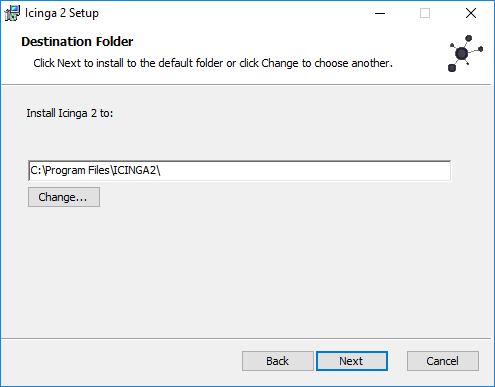
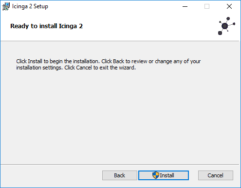
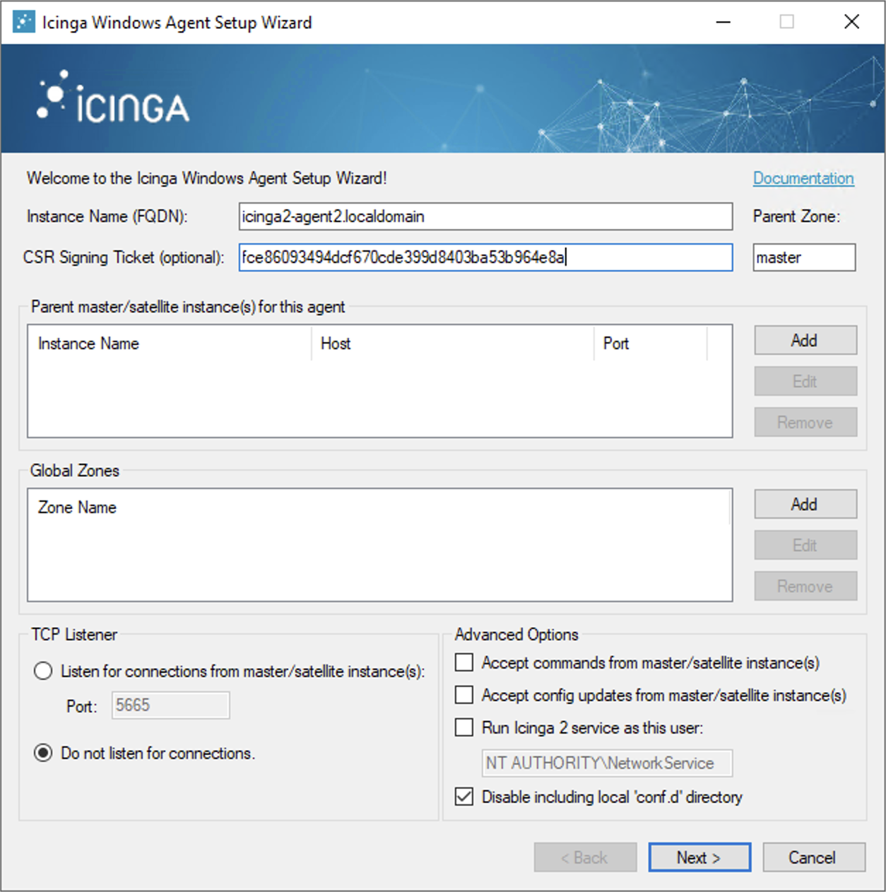
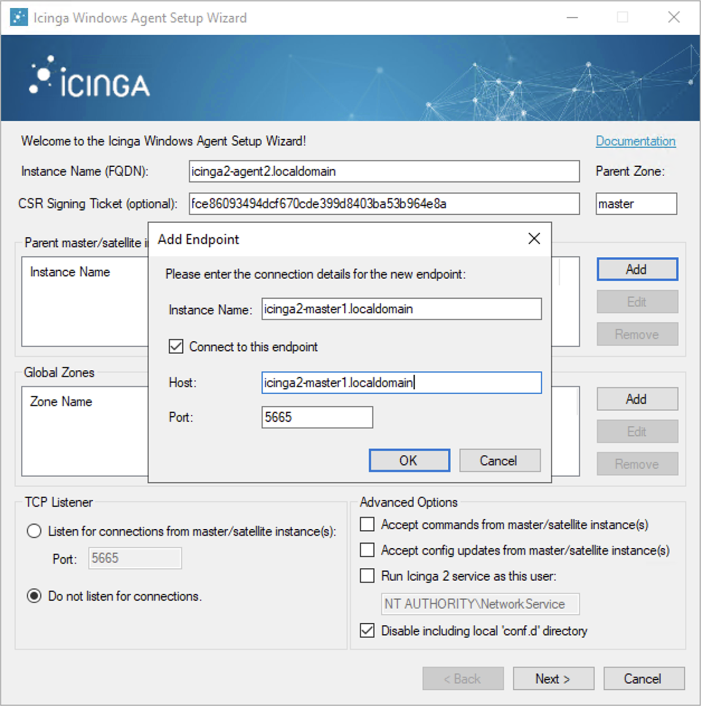
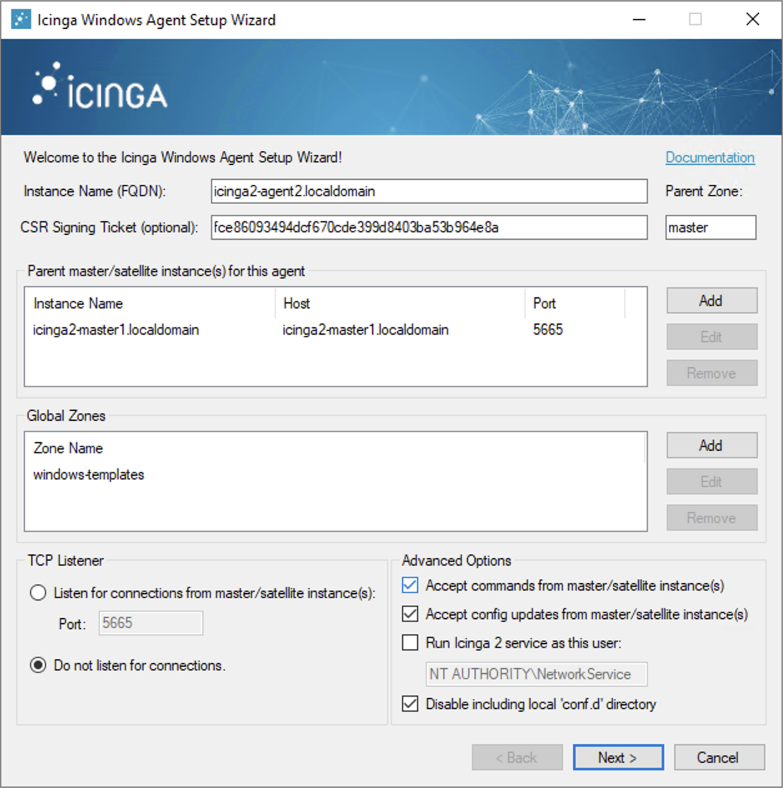
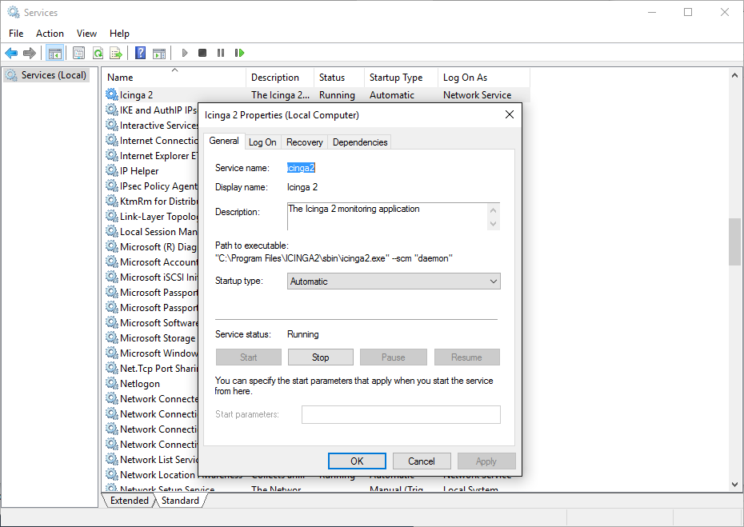
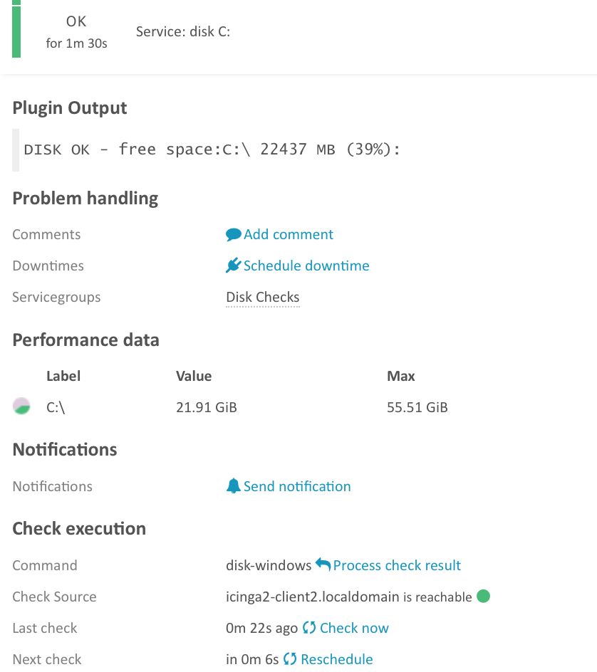

#  Distributed Monitoring with Master, Satellites, and Clients

This chapter will guide you through the setup of a distributed monitoring
environment, including high-availability clustering and setup details
for the Icinga 2 client.

##  Roles: Master, Satellites, and Clients

Icinga 2 nodes can be given names for easier understanding:

* A `master` node which is on top of the hierarchy.
* A `satellite` node which is a child of a `satellite` or `master` node.
* A `client` node which works as an `agent` connected to `master` and/or `satellite` nodes.

Rephrasing this picture into more details:

* A `master` node has no parent node.
  * A `master`node is where you usually install Icinga Web 2.
  * A `master` node can combine executed checks from child nodes into backends and notifications.
* A `satellite` node has a parent and a child node.
  * A `satellite` node may execute checks on its own or delegate check execution to child nodes.
  * A `satellite` node can receive configuration for hosts/services, etc. from the parent node.
  * A `satellite` node continues to run even if the master node is temporarily unavailable.
* A `client` node only has a parent node.
  * A `client` node will either run its own configured checks or receive command execution events from the parent node.

The following sections will refer to these roles and explain the
differences and the possibilities this kind of setup offers.

**Tip**: If you just want to install a single master node that monitors several hosts
(i.e. Icinga 2 clients), continue reading -- we'll start with
simple examples.
In case you are planning a huge cluster setup with multiple levels and
lots of clients, read on -- we'll deal with these cases later on.

The installation on each system is the same: You need to install the
[Icinga 2 package](2-getting-started.md#setting-up-icinga2) and the required [plugins](2-getting-started.md#setting-up-check-plugins).

The required configuration steps are mostly happening
on the command line. You can also [automate the setup](6-distributed-monitoring.md#distributed-monitoring-automation).

The first thing you need learn about a distributed setup is the hierarchy of the single components.

##  Zones

The Icinga 2 hierarchy consists of so-called [zone](9-object-types.md#objecttype-zone) objects.
Zones depend on a parent-child relationship in order to trust each other.

Have a look at this example for the `satellite` zones which have the `master` zone as a parent zone:

    object Zone "master" {
       //...
    }

    object Zone "satellite region 1" {
      parent = "master"
      //...
    }

    object Zone "satellite region 2" {
      parent = "master"
      //...
    }

There are certain limitations for child zones, e.g. their members are not allowed
to send configuration commands to the parent zone members. Vice versa, the
trust hierarchy allows for example the `master` zone to send
configuration files to the `satellite` zone. Read more about this
in the [security section](6-distributed-monitoring.md#distributed-monitoring-security).

`client` nodes also have their own unique zone. By convention you
can use the FQDN for the zone name.

##  Endpoints

Nodes which are a member of a zone are so-called [Endpoint](9-object-types.md#objecttype-endpoint) objects.

Here is an example configuration for two endpoints in different zones:

    object Endpoint "icinga2-master1.localdomain" {
      host = "192.168.56.101"
    }

    object Endpoint "icinga2-satellite1.localdomain" {
      host = "192.168.56.105"
    }

    object Zone "master" {
      endpoints = [ "icinga2-master1.localdomain" ]
    }

    object Zone "satellite" {
      endpoints = [ "icinga2-satellite1.localdomain" ]
      parent = "master"
    }

All endpoints in the same zone work as high-availability setup. For
example, if you have two nodes in the `master` zone, they will load-balance the check execution.

Endpoint objects are important for specifying the connection
information, e.g. if the master should actively try to connect to a client.

The zone membership is defined inside the `Zone` object definition using
the `endpoints` attribute with an array of `Endpoint` names.

If you want to check the availability (e.g. ping checks) of the node
you still need a [Host](9-object-types.md#objecttype-host) object.

##  ApiListener

In case you are using the CLI commands later, you don't have to write
this configuration from scratch in a text editor.
The [ApiListener](9-object-types.md#objecttype-apilistener)
object is used to load the SSL certificates and specify restrictions, e.g.
for accepting configuration commands.

It is also used for the [Icinga 2 REST API](12-icinga2-api.md#icinga2-api) which shares
the same host and port with the Icinga 2 Cluster protocol.

The object configuration is stored in the `/etc/icinga2/features-enabled/api.conf`
file. Depending on the configuration mode the attributes `accept_commands`
and `accept_config` can be configured here.

In order to use the `api` feature you need to enable it and restart Icinga 2.

    icinga2 feature enable api

##  Conventions

By convention all nodes should be configured using their FQDN.

Furthermore, you must ensure that the following names
are exactly the same in all configuration files:

* Host certificate common name (CN).
* Endpoint configuration object for the host.
* NodeName constant for the local host.

Setting this up on the command line will help you to minimize the effort.
Just keep in mind that you need to use the FQDN for endpoints and for
common names when asked.

##  Security

While there are certain mechanisms to ensure a secure communication between all
nodes (firewalls, policies, software hardening, etc.), Icinga 2 also provides
additional security:

* SSL certificates are mandatory for communication between nodes. The CLI commands
help you create those certs automatically.
* Child zones only receive updates (check results, commands, etc.) for their configured objects.
* Zones cannot interfere with other zones and influence each other. Each checkabke host or service object is assigned to **one zone** only.
* All nodes in a zone trust each other.
* [Config sync](6-distributed-monitoring.md#distributed-monitoring-top-down-config-sync) and [remote command endpoint execution](6-distributed-monitoring.md#distributed-monitoring-top-down-command-endpoint) is disabled by default.

The underlying protocol is using JSON-RPC events sent over TLS secured
connections. In case you are interested in specific details, please
check the source code.

##  Master Setup

This section explains how to install a central single master node using
the `node wizard` command. If you prefer to do an automated installation, please
refer to the [automated setup](6-distributed-monitoring.md#distributed-monitoring-automation) section.

Install the [Icinga 2 package](2-getting-started.md#setting-up-icinga2) and setup
the required [plugins](2-getting-started.md#setting-up-check-plugins) if you haven't done
so already.

**Note**: Windows is not supported for a master node setup.

The next step is to run the `node wizard` CLI command. Prior to that
ensure to collect the required information:

  Parameter           | Description
  --------------------|--------------------
  Common name (CN)    | **Required.** By convention this should be the host's FQDN. Defaults to the FQDN.
  API bind host       | **Optional.** Allows to specify the address the ApiListener is bound to. For advanced usage only.
  API bind port       | **Optional.** Allows to specify the port the ApiListener is bound to. For advanced usage only (requires changing the default port 5665 everywhere).

The setup wizard will ensure that the following steps are taken:

* Enable the `api` feature.
* Generate a new certificate authority (CA) in `/var/lib/icinga2/ca` if it doesn't exist.
* Create a certificate signing request (CSR) for the local node.
* Sign the CSR with the local CA and copy all files to the `/etc/icinga2/pki` directory.
* Update the `zones.conf` file with the new zone hierarchy.
* Update `/etc/icinga2/features-enabled/api.conf` and `constants.conf`.

Here is an example of a master setup for the `icinga2-master1.localdomain` node on CentOS 7:

    [root@icinga2-master1.localdomain /]# icinga2 node wizard
    Welcome to the Icinga 2 Setup Wizard!
    
    We'll guide you through all required configuration details.
    
    Please specify if this is a satellite setup ('n' installs a master setup) [Y/n]: n
    Starting the Master setup routine...
    Please specify the common name (CN) [icinga2-master1.localdomain]: icinga2-master1.localdomain
    Checking for existing certificates for common name 'icinga2-master1.localdomain'...
    Certificates not yet generated. Running 'api setup' now.
    information/cli: Generating new CA.
    information/base: Writing private key to '/var/lib/icinga2/ca/ca.key'.
    information/base: Writing X509 certificate to '/var/lib/icinga2/ca/ca.crt'.
    information/cli: Generating new CSR in '/etc/icinga2/pki/icinga2-master1.localdomain.csr'.
    information/base: Writing private key to '/etc/icinga2/pki/icinga2-master1.localdomain.key'.
    information/base: Writing certificate signing request to '/etc/icinga2/pki/icinga2-master1.localdomain.csr'.
    information/cli: Signing CSR with CA and writing certificate to '/etc/icinga2/pki/icinga2-master1.localdomain.crt'.
    information/cli: Copying CA certificate to '/etc/icinga2/pki/ca.crt'.
    Generating master configuration for Icinga 2.
    information/cli: Adding new ApiUser 'root' in '/etc/icinga2/conf.d/api-users.conf'.
    information/cli: Enabling the 'api' feature.
    Enabling feature api. Make sure to restart Icinga 2 for these changes to take effect.
    information/cli: Dumping config items to file '/etc/icinga2/zones.conf'.
    information/cli: Created backup file '/etc/icinga2/zones.conf.orig'.
    Please specify the API bind host/port (optional):
    Bind Host []:
    Bind Port []:
    information/cli: Created backup file '/etc/icinga2/features-available/api.conf.orig'.
    information/cli: Updating constants.conf.
    information/cli: Created backup file '/etc/icinga2/constants.conf.orig'.
    information/cli: Updating constants file '/etc/icinga2/constants.conf'.
    information/cli: Updating constants file '/etc/icinga2/constants.conf'.
    information/cli: Updating constants file '/etc/icinga2/constants.conf'.
    Done.
    
    Now restart your Icinga 2 daemon to finish the installation!

    [root@icinga2-master1.localdomain /]# systemctl restart icinga2

As you can see, the CA public and private key are stored in the `/var/lib/icinga2/ca` directory.
Keep this path secure and include it in your [backups](2-getting-started.md#install-backup).

In case you lose the CA private key you have to generate a new CA for signing new client
certificate requests. You then have to also re-create new signed certificates for all
existing nodes.

Once the master setup is complete, you can also use this node as primary [CSR auto-signing](6-distributed-monitoring.md#distributed-monitoring-setup-csr-auto-signing)
master. The following section will explain how to use the CLI commands in order to fetch their
signed certificate from this master node.

##  Client/Satellite Setup

This section describes the setup of a satellite and/or client connected to an
existing master node setup. If you haven't done so already, please [run the master setup](6-distributed-monitoring.md#distributed-monitoring-setup-master).

Icinga 2 on the master node must be running and accepting connections on port `5665`.

###  CSR Auto-Signing

The `node wizard` command will set up a satellite/client using CSR auto-signing. This
involves that the setup wizard sends a certificate signing request (CSR) to the
master node.
There is a security mechanism in place which requires the client to send in a valid
ticket for CSR auto-signing.

This ticket must be generated beforehand. The `ticket_salt` attribute for the [ApiListener](9-object-types.md#objecttype-apilistener)
must be configured in order to make this work.

There are two possible ways to retrieve the ticket:

* [CLI command](11-cli-commands.md#cli-command-pki) executed on the master node.
* [REST API](12-icinga2-api.md#icinga2-api) request against the master node.

Required information:

  Parameter           | Description
  --------------------|--------------------
  Common name (CN)    | **Required.** The common name for the satellite/client. By convention this should be the FQDN.

The following example shows how to generate a ticket on the master node `icinga2-master1.localdomain` for the client `icinga2-client1.localdomain`:

    [root@icinga2-master1.localdomain /]# icinga2 pki ticket --cn icinga2-client1.localdomain

Querying the [Icinga 2 API](12-icinga2-api.md#icinga2-api) on the master requires an [ApiUser](12-icinga2-api.md#icinga2-api-authentication)
object with at least the `actions/generate-ticket`.

    [root@icinga2-master1.localdomain /]# vim /etc/icinga2/conf.d/api-users.conf

    object ApiUser "client-pki-ticket" {
      password = "bea11beb7b810ea9ce6ea" //change this
      permissions = [ "actions/generate-ticket" ]
    }

    [root@icinga2-master1.localdomain /]# systemctl restart icinga2

Retrieve the ticket on the master node `icinga2-master1.localdomain` with `curl`, for example:

     [root@icinga2-master1.localdomain /]# curl -k -s -u client-pki-ticket:bea11beb7b810ea9ce6ea -H 'Accept: application/json' \
     -X POST 'https://icinga2-master1.localdomain:5665/v1/actions/generate-ticket' -d '{ "cn": "icinga2-client1.localdomain" }'

Store that ticket number for the satellite/client setup below.

**Note**: Never expose the ticket salt and/or ApiUser credentials to your client nodes.
Example: Retrieve the ticket on the Puppet master node and send the compiled catalog
to the authorized Puppet agent node which will invoke the
[automated setup steps](6-distributed-monitoring.md#distributed-monitoring-automation-cli-node-setup).

###  Client/Satellite Linux Setup

Please ensure that you've run all the steps mentioned in the [client/satellite section](6-distributed-monitoring.md#distributed-monitoring-setup-satellite-client).

Install the [Icinga 2 package](2-getting-started.md#setting-up-icinga2) and setup
the required [plugins](2-getting-started.md#setting-up-check-plugins) if you haven't done
so already.

The next step is to run the `node wizard` CLI command. Prior to that
ensure to collect the required information:

  Parameter           | Description
  --------------------|--------------------
  Common name (CN)    | **Required.** By convention this should be the host's FQDN. Defaults to the FQDN.
  Master common name  | **Required.** Use the common name you've specified for your master node before.
  Establish connection to the master | **Optional.** Whether the client should attempt to connect the to master or not. Defaults to `y`.
  Master endpoint host | **Required if the the client needs to connect to the master.** The master's IP address or FQDN. This information is included in the `Endpoint` object configuration in the `zones.conf` file.
  Master endpoint port | **Optional if the the client needs to connect to the master.** The master's listening port. This information is included in the `Endpoint` object configuration.
  Add more master endpoints | **Optional.** If you have multiple master nodes configured, add them here.
  Master connection for CSR auto-signing | **Required.** The master node's IP address or FQDN and port where the client should request a certificate from. Defaults to the master endpoint host.
  Certificate information | **Required.** Verify that the connecting host really is the requested master node.
  Request ticket      | **Required.** Paste the previously generated [ticket number](6-distributed-monitoring.md#distributed-monitoring-setup-csr-auto-signing).
  API bind host       | **Optional.** Allows to specify the address the ApiListener is bound to. For advanced usage only.
  API bind port       | **Optional.** Allows to specify the port the ApiListener is bound to. For advanced usage only (requires changing the default port 5665 everywhere).
  Accept config       | **Optional.** Whether this node accepts configuration sync from the master node (required for [config sync mode](6-distributed-monitoring.md#distributed-monitoring-top-down-config-sync)). For [security reasons](6-distributed-monitoring.md#distributed-monitoring-security) this defaults to `n`.
  Accept commands     | **Optional.** Whether this node accepts command execution messages from the master node (required for [command endpoint mode](6-distributed-monitoring.md#distributed-monitoring-top-down-command-endpoint)). For [security reasons](6-distributed-monitoring.md#distributed-monitoring-security) this defaults to `n`.

The setup wizard will ensure that the following steps are taken:

* Enable the `api` feature.
* Create a certificate signing request (CSR) for the local node.
* Request a signed certificate with the provided ticket number on the master node.
* Allow to verify the master's certificate.
* Store the signed client certificate and ca.crt in `/etc/icinga2/pki`.
* Update the `zones.conf` file with the new zone hierarchy.
* Update `/etc/icinga2/features-enabled/api.conf` (`accept_config`, `accept_commands`) and `constants.conf`.

In this example we're generating a ticket on the master node `icinga2-master1.localdomain` for the client `icinga2-client1.localdomain`:

    [root@icinga2-master1.localdomain /]# icinga2 pki ticket --cn icinga2-client1.localdomain
    4f75d2ecd253575fe9180938ebff7cbca262f96e

The following example shows a client setup for the `icinga2-client1.localdomain` node on CentOS 7. This client
is configured to accept configuration and commands from the master:

    [root@icinga2-client1.localdomain /]# icinga2 node wizard
    Welcome to the Icinga 2 Setup Wizard!
    
    We'll guide you through all required configuration details.
    
    Please specify if this is a satellite setup ('n' installs a master setup) [Y/n]:
    Starting the Node setup routine...
    Please specify the common name (CN) [icinga2-client1.localdomain]: icinga2-client1.localdomain
    Please specify the master endpoint(s) this node should connect to:
    Master Common Name (CN from your master setup): icinga2-master1.localdomain
    Do you want to establish a connection to the master from this node? [Y/n]:
    Please fill out the master connection information:
    Master endpoint host (Your master's IP address or FQDN): 192.168.56.101
    Master endpoint port [5665]:
    Add more master endpoints? [y/N]:
    Please specify the master connection for CSR auto-signing (defaults to master endpoint host):
    Host [192.168.56.101]: 192.168.2.101
    Port [5665]:
    information/base: Writing private key to '/etc/icinga2/pki/icinga2-client1.localdomain.key'.
    information/base: Writing X509 certificate to '/etc/icinga2/pki/icinga2-client1.localdomain.crt'.
    information/cli: Fetching public certificate from master (192.168.56.101, 5665):
    
    Certificate information:
    
     Subject:     CN = icinga2-master1.localdomain
     Issuer:      CN = Icinga CA
     Valid From:  Feb 23 14:45:32 2016 GMT
     Valid Until: Feb 19 14:45:32 2031 GMT
     Fingerprint: AC 99 8B 2B 3D B0 01 00 E5 21 FA 05 2E EC D5 A9 EF 9E AA E3
    
    Is this information correct? [y/N]: y
    information/cli: Received trusted master certificate.
    
    Please specify the request ticket generated on your Icinga 2 master.
     (Hint: # icinga2 pki ticket --cn 'icinga2-client1.localdomain'): 4f75d2ecd253575fe9180938ebff7cbca262f96e
    information/cli: Requesting certificate with ticket '4f75d2ecd253575fe9180938ebff7cbca262f96e'.
    
    information/cli: Created backup file '/etc/icinga2/pki/icinga2-client1.localdomain.crt.orig'.
    information/cli: Writing signed certificate to file '/etc/icinga2/pki/icinga2-client1.localdomain.crt'.
    information/cli: Writing CA certificate to file '/etc/icinga2/pki/ca.crt'.
    Please specify the API bind host/port (optional):
    Bind Host []:
    Bind Port []:
    Accept config from master? [y/N]: y
    Accept commands from master? [y/N]: y
    information/cli: Disabling the Notification feature.
    Disabling feature notification. Make sure to restart Icinga 2 for these changes to take effect.
    information/cli: Enabling the Apilistener feature.
    information/cli: Generating local zones.conf.
    information/cli: Dumping config items to file '/etc/icinga2/zones.conf'.
    information/cli: Updating constants.conf.
    information/cli: Updating constants file '/etc/icinga2/constants.conf'.
    information/cli: Updating constants file '/etc/icinga2/constants.conf'.
    Done.

    Now restart your Icinga 2 daemon to finish the installation!

    [root@icinga2-master1.localdomain /]# systemctl restart icinga2

As you can see, the certificate files are stored in the `/etc/icinga2/pki` directory.

Now that you've successfully installed a satellite/client, please proceed to
the [configuration modes](6-distributed-monitoring.md#distributed-monitoring-configuration-modes).

###  Client/Satellite Windows Setup

Download the MSI-Installer package from [http://packages.icinga.com/windows/](http://packages.icinga.com/windows/).

Requirements:

* Windows Vista/Server 2008 or higher
* [Microsoft .NET Framework 2.0](http://www.microsoft.com/de-de/download/details.aspx?id=1639)

The installer package includes the [NSClient++](http://www.nsclient.org/) package
so that Icinga 2 can use its built-in plugins. You can find more details in
[this chapter](6-distributed-monitoring.md#distributed-monitoring-windows-nscp).
The Windows package also installs native [monitoring plugin binaries](6-distributed-monitoring.md#distributed-monitoring-windows-plugins)
to get you started more easily.

####  Windows Client Setup Start

Run the MSI-Installer package and follow the instructions shown in the screenshots.

The graphical installer will offer to run the Icinga 2 setup wizard after the installation.
You can also manually run the Icinga 2 setup wizard from the Start menu.

On a fresh installation the setup wizard will guide you through the initial configuration and offer to use CSR auto-signing for generating the SSL certificate.
You'll need the following configuration details:

  Parameter           | Description
  --------------------|--------------------
  Common name (CN)    | **Required.** By convention this should be the host's FQDN. Defaults to the FQDN.
  Request ticket      | **Required.** Paste the previously generated [ticket number](6-distributed-monitoring.md#distributed-monitoring-setup-csr-auto-signing).

Fill in the required information and click `Add` to add a new master connection.

Add the following details:

  Parameter            | Description
  ---------------------|--------------------
  Instance name        | **Required.** The master endpoint name.
  Master endpoint host | **Required if the the client needs to connect to the master.** The master's IP address or FQDN. This information is included in the `Endpoint` object configuration in the `zones.conf` file.
  Master endpoint port | **Optional if the the client needs to connect to the master.** The master's listening port. This information is included in the `Endpoint` object configuration.

Optionally, you can enable the following settings:

  Parameter           | Description
  --------------------|--------------------
  Accept config       | **Optional.** Whether this node accepts configuration sync from the master node (required for [config sync mode](6-distributed-monitoring.md#distributed-monitoring-top-down-config-sync)). For [security reasons](6-distributed-monitoring.md#distributed-monitoring-security) this is disabled by default.
  Accept commands     | **Optional.** Whether this node accepts command execution messages from the master node (required for [command endpoint mode](6-distributed-monitoring.md#distributed-monitoring-top-down-command-endpoint)). For [security reasons](6-distributed-monitoring.md#distributed-monitoring-security) this is disabled by default.
  Install NSClient++  | **Optional.** The Windows installer bundles the NSClient++ installer for additional [plugin checks](6-distributed-monitoring.md#distributed-monitoring-windows-nscp).

The next step allows you to verify the CA presented by the master.

####  Bundled NSClient++ Setup

If you have chosen to install/update the NSClient++ package, the Icinga 2 setup wizard will ask
you to do so.

Choose the `Generic` setup.

Choose the `Custom` setup type.

NSClient++ does not install a sample configuration by default. Change this as shown in the screenshot.

Generate a secure password and enable the web server module. **Note**: The webserver module is
available starting with NSClient++ 0.5.0. Icinga 2 v2.6+ including this version is required.

Finish the installation.

Open a web browser and navigate to `https://localhost:8443`. Enter the password you've configured
during the setup. In case you lost it, look into the `C:\Program Files\NSClient++\nsclient.ini`
configuration file.

The NSClient++ REST API can be used to query metrics. Future Icinga 2 versions will add
more integrations. Additional details can be found in this [blog post](https://www.icinga.com/2016/09/16/nsclient-0-5-0-rest-api-and-icinga-2-integration/).

####  Finish Windows Client Setup

Finish the setup wizard.

After the installation and configuration Icinga 2 is automatically started as a Windows service.

The Icinga 2 configuration is stored inside the `C:\ProgramData\icinga2` directory.
If you click `Examine Config` in the setup wizard, it will open a new Explorer window.

The configuration files can be modified with your favorite editor.

In order to use the [top down](6-distributed-monitoring.md#distributed-monitoring-top-down) client
configuration prepare the following steps.

Add a [global zone](6-distributed-monitoring.md#distributed-monitoring-global-zone-config-sync)
for syncing check commands later. Navigate to `C:\ProgramData\icinga2\etc\icinga2` and open
the `zones.conf` file in your preferred editor. Add the following lines if not existing already:

    object Zone "global-templates" {
      global = true
    }

You don't need any local configuration on the client except for
CheckCommand definitions which can be synced using the global zone
above. Therefore disable the inclusion of the `conf.d` directory
in the `icinga2.conf` file.
Navigate to `C:\ProgramData\icinga2\etc\icinga2` and open
the `icinga2.conf` file in your preferred editor. Remove or comment (`//`)
the following line:

    // Commented out, not required on a client with top down mode
    //include_recursive "conf.d"

Validate the configuration on Windows open an administrator terminal
and run the following command:

    C:\WINDOWS\system32>cd "C:\Program Files\ICINGA2\sbin"
    C:\Program Files\ICINGA2\sbin>icinga2.exe daemon -C

**Note**: You have to run this command in a shell with `administrator` privileges.

Now you need to restart the Icinga 2 service. Run `services.msc` from the start menu
and restart the `icinga2` service. Alternatively, you can use the `net {start,stop}` CLI commands.

Now that you've successfully installed a satellite/client, please proceed to
the [detailed configuration modes](6-distributed-monitoring.md#distributed-monitoring-configuration-modes).

##  Configuration Modes

There are different ways to ensure that the Icinga 2 cluster nodes execute
checks, send notifications, etc.

Two different modes are available for synchronizing the host/service object's configuration between nodes and for executing checks:

The preferred mode is the [top down](6-distributed-monitoring.md#distributed-monitoring-top-down) approach.
This mode sends the configuration and commands from the master to the child zones.

The [bottom up](6-distributed-monitoring.md#distributed-monitoring-bottom-up) has been **deprecated in v2.6 and will be removed in future releases**.
This mode leaves the configuration files on the child nodes and requires an import on the parent nodes.

**Note**: Check results are always sent from the child nodes to the parent nodes.
This happens automatically and is ensured by the cluster protocol.

###  Top Down

According to feedback that we've received from the community, this is the most commonly used mode.

There are two different behaviors with check execution:

* Send a command execution event remotely: The scheduler still runs on the parent node.
* Sync the host/service objects directly to the child node: Checks are executed locally.

Again, technically it does not matter whether this is a `client` or a `satellite`
which is receiving configuration or command execution events.

###  Top Down Command Endpoint

This mode will force the Icinga 2 node to execute commands remotely on a specified endpoint.
The host/service object configuration is located on the master/satellite and the client only
needs the CheckCommand object definitions being used there.

Advantages:

* No local checks need to be defined on the child node (client).
* Light-weight remote check execution (asynchronous events).
* No [replay log](6-distributed-monitoring.md#distributed-monitoring-advanced-hints-command-endpoint-log-duration) is necessary for the child node.
* Pin checks to specific endpoints (if the child zone consists of 2 endpoints).

Disadvantages:

* If the child node is not connected, no more checks are executed.
* Requires additional configuration attribute specified in host/service objects.
* Requires local `CheckCommand` object configuration. Best practice is to use a [global config zone](6-distributed-monitoring.md#distributed-monitoring-global-zone-config-sync).

To make sure that all nodes involved will accept configuration and/or
commands, you need to configure the `Zone` and `Endpoint` hierarchy
on all nodes.

* `icinga2-master1.localdomain` is the configuration master in this scenario.
* `icinga2-client2.localdomain` acts as client which receives command execution messages via command endpoint from the master. In addition, it receives the global check command configuration from the master.

Include the endpoint and zone configuration on **both** nodes in the file `/etc/icinga2/zones.conf`.

The endpoint configuration could look like this, for example:

    [root@icinga2-client1.localdomain /]# vim /etc/icinga2/zones.conf

    object Endpoint "icinga2-master1.localdomain" {
      host = "192.168.56.101"
    }

    object Endpoint "icinga2-client2.localdomain" {
      host = "192.168.56.112"
    }

Next, you need to define two zones. There is no naming convention, best practice is to either use `master`, `satellite`/`client-fqdn` or to choose region names for example `Europe`, `USA` and `Asia`, though.

**Note**: Each client requires its own zone and endpoint configuration. Best practice
is to use the client's FQDN for all object names.

The `master` zone is a parent of the `icinga2-client2.localdomain` zone:

    [root@icinga2-client1.localdomain /]# vim /etc/icinga2/zones.conf

    object Zone "master" {
      endpoints = [ "icinga2-master1.localdomain" ] //array with endpoint names
    }

    object Zone "icinga2-client2.localdomain" {
      endpoints = [ "icinga2-client2.localdomain" ]

      parent = "master" //establish zone hierarchy
    }

In addition, add a [global zone](6-distributed-monitoring.md#distributed-monitoring-global-zone-config-sync)
for syncing check commands later:

    [root@icinga2-client1.localdomain /]# vim /etc/icinga2/zones.conf

    object Zone "global-templates" {
      global = true
    }

You don't need any local configuration on the client except for
CheckCommand definitions which can be synced using the global zone
above. Therefore disable the inclusion of the `conf.d` directory
in `/etc/icinga2/icinga2.conf`.

    [root@icinga2-client1.localdomain /]# vim /etc/icinga2/icinga2.conf

    // Commented out, not required on a client as command endpoint
    //include_recursive "conf.d"

Edit the `api` feature on the client `icinga2-client2.localdomain` in
the `/etc/icinga2/features-enabled/api.conf` file and make sure to set
`accept_commands` and `accept_config` to `true`:

    [root@icinga2-client1.localdomain /]# vim /etc/icinga2/features-enabled/api.conf

    object ApiListener "api" {
       //...
       accept_commands = true
       accept_config = true
    }

Now it is time to validate the configuration and to restart the Icinga 2 daemon
on both nodes.

Example on CentOS 7:

    [root@icinga2-client2.localdomain /]# icinga2 daemon -C
    [root@icinga2-client2.localdomain /]# systemctl restart icinga2

    [root@icinga2-master1.localdomain /]# icinga2 daemon -C
    [root@icinga2-master1.localdomain /]# systemctl restart icinga2

Once the clients have successfully connected, you are ready for the next step: **execute
a remote check on the client using the command endpoint**.

Include the host and service object configuration in the `master` zone
-- this will help adding a secondary master for high-availability later.

    [root@icinga2-master1.localdomain /]# mkdir -p /etc/icinga2/zones.d/master

Add the host and service objects you want to monitor. There is
no limitation for files and directories -- best practice is to
sort things by type.

By convention a master/satellite/client host object should use the same name as the endpoint object.
You can also add multiple hosts which execute checks against remote services/clients.

    [root@icinga2-master1.localdomain /]# cd /etc/icinga2/zones.d/master
    [root@icinga2-master1.localdomain /etc/icinga2/zones.d/master]# vim hosts.conf

    object Host "icinga2-client2.localdomain" {
      check_command = "hostalive" //check is executed on the master
      address = "192.168.56.112"

      vars.client_endpoint = name //follows the convention that host name == endpoint name
    }

Given that you are monitoring a Linux client, we'll add a remote [disk](10-icinga-template-library.md#plugin-check-command-disk)
check.

    [root@icinga2-master1.localdomain /etc/icinga2/zones.d/master]# vim services.conf

    apply Service "disk" {
      check_command = "disk"

      //specify where the check is executed
      command_endpoint = host.vars.client_endpoint

      assign where host.vars.client_endpoint
    }

If you have your own custom `CheckCommand` definition, add it to the global zone:

    [root@icinga2-master1.localdomain /]# mkdir -p /etc/icinga2/zones.d/global-templates
    [root@icinga2-master1.localdomain /]# vim /etc/icinga2/zones.d/global-templates/commands.conf

    object CheckCommand "my-cmd" {
      //...
    }

Save the changes and validate the configuration on the master node:

    [root@icinga2-master1.localdomain /]# icinga2 daemon -C

Restart the Icinga 2 daemon (example for CentOS 7):

    [root@icinga2-master1.localdomain /]# systemctl restart icinga2

The following steps will happen:

* Icinga 2 validates the configuration on `icinga2-master1.localdomain` and restarts.
* The `icinga2-master1.localdomain` node schedules and executes the checks.
* The `icinga2-client2.localdomain` node receives the execute command event with additional command parameters.
* The `icinga2-client2.localdomain` node maps the command parameters to the local check command, executes the check locally, and sends back the check result message.

As you can see, no interaction from your side is required on the client itself, and it's not necessary to reload the Icinga 2 service on the client.

You have learned the basics about command endpoint checks. Proceed with
the [scenarios](6-distributed-monitoring.md#distributed-monitoring-scenarios)
section where you can find detailed information on extending the setup.

###  Top Down Config Sync

This mode syncs the object configuration files within specified zones.
It comes in handy if you want to configure everything on the master node
and sync the satellite checks (disk, memory, etc.). The satellites run their
own local scheduler and will send the check result messages back to the master.

Advantages:

* Sync the configuration files from the parent zone to the child zones.
* No manual restart is required on the child nodes, as syncing, validation, and restarts happen automatically.
* Execute checks directly on the child node's scheduler.
* Replay log if the connection drops (important for keeping the check history in sync, e.g. for SLA reports).
* Use a global zone for syncing templates, groups, etc.

Disadvantages:

* Requires a config directory on the master node with the zone name underneath `/etc/icinga2/zones.d`.
* Additional zone and endpoint configuration needed.
* Replay log is replicated on reconnect after connection loss. This might increase the data transfer and create an overload on the connection.

To make sure that all involved nodes accept configuration and/or
commands, you need to configure the `Zone` and `Endpoint` hierarchy
on all nodes.

* `icinga2-master1.localdomain` is the configuration master in this scenario.
* `icinga2-client1.localdomain` acts as client which receives configuration from the master.

Include the endpoint and zone configuration on **both** nodes in the file `/etc/icinga2/zones.conf`.

The endpoint configuration could look like this:

    [root@icinga2-client1.localdomain /]# vim /etc/icinga2/zones.conf

    object Endpoint "icinga2-master1.localdomain" {
      host = "192.168.56.101"
    }

    object Endpoint "icinga2-client1.localdomain" {
      host = "192.168.56.111"
    }

Next, you need to define two zones. There is no naming convention, best practice is to either use `master`, `satellite`/`client-fqdn` or to choose region names for example `Europe`, `USA` and `Asia`, though.

**Note**: Each client requires its own zone and endpoint configuration. Best practice
is to use the client's FQDN for all object names.

The `master` zone is a parent of the `icinga2-client1.localdomain` zone:

    [root@icinga2-client1.localdomain /]# vim /etc/icinga2/zones.conf

    object Zone "master" {
      endpoints = [ "icinga2-master1.localdomain" ] //array with endpoint names
    }

    object Zone "icinga2-client1.localdomain" {
      endpoints = [ "icinga2-client1.localdomain" ]

      parent = "master" //establish zone hierarchy
    }

Edit the `api` feature on the client `icinga2-client1.localdomain` in
the `/etc/icinga2/features-enabled/api.conf` file and set
`accept_config` to `true`.

    [root@icinga2-client1.localdomain /]# vim /etc/icinga2/features-enabled/api.conf

    object ApiListener "api" {
       //...
       accept_config = true
    }

Now it is time to validate the configuration and to restart the Icinga 2 daemon
on both nodes.

Example on CentOS 7:

    [root@icinga2-client1.localdomain /]# icinga2 daemon -C
    [root@icinga2-client1.localdomain /]# systemctl restart icinga2

    [root@icinga2-master1.localdomain /]# icinga2 daemon -C
    [root@icinga2-master1.localdomain /]# systemctl restart icinga2

**Tip**: Best practice is to use a [global zone](6-distributed-monitoring.md#distributed-monitoring-global-zone-config-sync)
for common configuration items (check commands, templates, groups, etc.).

Once the clients have connected successfully, it's time for the next step: **execute
a local check on the client using the configuration sync**.

Navigate to `/etc/icinga2/zones.d` on your master node
`icinga2-master1.localdomain` and create a new directory with the same
name as your satellite/client zone name:

    [root@icinga2-master1.localdomain /]# mkdir -p /etc/icinga2/zones.d/icinga2-client1.localdomain

Add the host and service objects you want to monitor. There is
no limitation for files and directories -- best practice is to
sort things by type.

By convention a master/satellite/client host object should use the same name as the endpoint object.
You can also add multiple hosts which execute checks against remote services/clients.

    [root@icinga2-master1.localdomain /]# cd /etc/icinga2/zones.d/icinga2-client1.localdomain
    [root@icinga2-master1.localdomain /etc/icinga2/zones.d/icinga2-client1.localdomain]# vim hosts.conf

    object Host "icinga2-client1.localdomain" {
      check_command = "hostalive"
      address = "192.168.56.111"
      zone = "master" //optional trick: sync the required host object to the client, but enforce the "master" zone to execute the check
    }

Given that you are monitoring a Linux client we'll just add a local [disk](10-icinga-template-library.md#plugin-check-command-disk)
check.

    [root@icinga2-master1.localdomain /etc/icinga2/zones.d/icinga2-client1.localdomain]# vim services.conf

    object Service "disk" {
      host_name = "icinga2-client1.localdomain"

      check_command = "disk"
    }

Save the changes and validate the configuration on the master node:

    [root@icinga2-master1.localdomain /]# icinga2 daemon -C

Restart the Icinga 2 daemon (example for CentOS 7):

    [root@icinga2-master1.localdomain /]# systemctl restart icinga2

The following steps will happen:

* Icinga 2 validates the configuration on `icinga2-master1.localdomain`.
* Icinga 2 copies the configuration into its zone config store in `/var/lib/icinga2/api/zones`.
* The `icinga2-master1.localdomain` node sends a config update event to all endpoints in the same or direct child zones.
* The `icinga2-client1.localdomain` node accepts config and populates the local zone config store with the received config files.
* The `icinga2-client1.localdomain` node validates the configuration and automatically restarts.

Again, there is no interaction required on the client
itself.

You can also use the config sync inside a high-availability zone to
ensure that all config objects are synced among zone members.

**Note**: You can only have one so-called "config master" in a zone which stores
the configuration in the `zones.d` directory.
Multiple nodes with configuration files in the `zones.d` directory are
**not supported**.

Now that you've learned the basics about the configuration sync, proceed with
the [scenarios](6-distributed-monitoring.md#distributed-monitoring-scenarios)
section where you can find detailed information on extending the setup.

###  Bottom Up Import

> **Warning**
>
> This mode has been deprecated in v2.6. You are strongly advised to
> migrate your existing configuration files to the [top down mode](6-distributed-monitoring.md#distributed-monitoring-top-down).
>
> Make sure to follow the release announcements on the [Icinga website](https://www.icinga.com).

This mode requires that you manage the configuration on the client itself.
Edit the configuration files in `/etc/icinga2/conf.d` or any other
directory included in the `icinga2.conf` file.

The client will send information about the configured objects to
the parent zone members where they can generate configuration
objects.

Advantages:

* Each child node comes configured with the most common local checks in the `conf.d` directory.
* Central repository for zones, endpoints, hosts, and services with configuration repository import.

Disadvantages:

* No object attribute sync. Parent nodes cannot filter specific attributes in assign expressions.
* Does not reliably work with a HA parent zone (single master preferred).
* Configuration management of many client nodes is hard or impossible if you don't have access to them.

On the master node, you can list and import the configuration sent from all the clients.
This example shows all client services on the master node `icinga2-master1.localdomain`:

    [root@icinga2-master1.localdomain /]# icinga2 node list
    Warning: CLI command 'node list' is DEPRECATED! Please read the Changelog.

    Node 'icinga2-client1.localdomain' (last seen: Sun Aug 14 11:19:14 2016)
        * Host 'icinga2-client1.localdomain'
            * Service 'disk'
            * Service 'disk /'
            * Service 'http'
            * Service 'icinga'
            * Service 'load'
            * Service 'ping4'
            * Service 'ping6'
            * Service 'procs'
            * Service 'ssh'
            * Service 'swap'
            * Service 'users'
    
    Node 'icinga2-client2.localdomain' (last seen: Sun Aug 14 11:19:14 2016)
        * Host 'icinga2-client2.localdomain'
            * Service 'disk'
            * Service 'disk C:'
            * Service 'icinga'
            * Service 'load'
            * Service 'ping4'
            * Service 'ping6'
            * Service 'procs'
            * Service 'swap'
            * Service 'users'

The object configuration must exist on the master node as well
in order to receive check results from the clients. Therefore
you need to invoke the `node update-config` command:

    [root@icinga2-master1.localdomain /]# icinga2 node update-config
    Warning: CLI command 'node update-config' is DEPRECATED! Please read the Changelog.

    information/cli: Updating node configuration for
    ...

The generated configuration objects are located in `/etc/icinga2/repository.d`.
If you have accidentally added specific hosts or services, you can safely purge
them from this directory and restart Icinga 2.

The generated host object uses the `cluster-zone` check command as
[health check](6-distributed-monitoring.md#distributed-monitoring-health-checks).

**Tip**: In case you want to blacklist or whitelist certain hosts and/or services
on the master, use the `icinga2 node {black,white}list`
commands.

In this example we're first putting all `ping*` services on all hosts on the blacklist.
With the next command we allow the host `probe` to run the service `ping4`:

    # icinga2 node blacklist add --zone "*" --host "*" --service "ping*"
    # icinga2 node whitelist add --zone "*" --host "probe" --service "ping4"

You can `list` and `remove` existing blacklists:

    # icinga2 node blacklist list
    Listing all blacklist entries:
    blacklist filter for Node: '*' Host: '*' Service: 'ping*'.

    # icinga2 node whitelist list
    Listing all whitelist entries:
    whitelist filter for Node: '*' Host: 'probe' Service: 'ping4'.

There are certain limitations with this mode. Currently the repository
does not sync object attributes (custom attributes, group memberships)
from the client to the master.

You can manually edit the configuration in `/etc/icinga2/repository.d`
and fix it. This will help with additional notification apply rules
or group memberships required for Icinga Web 2 and addons.

####  Bottom Up Migration to Top Down

The bottom up mode has been deprecated and you should be prepared to migrate
your clients to the existing [top down mode](6-distributed-monitoring.md#distributed-monitoring-top-down).

The bottom up mode generates configuration files on the master node underneath
the `/etc/icinga2/repository.d` directory. This is achieved by running the
`node update-config` CLI command and depends on manual user interaction.

Unless you are changing something on the client which requires to run the
CLI command the configuration files in `repository.d` remain untouched.

The Icinga 2 client generates an object repository from local configuration
(usually included in `conf.d` by default) and syncs that to the master. The
`node update-config` CLI command parses these repository files from the `/var/lib/icinga2/api/repository`
directory and generates the `repository.d` configuration files. In addition to
that blacklist and whitelist settings are evaluated.

Those CLI commands also hide the fact that each client needs its own `Zone`
and `Endpoint` object as described [here](6-distributed-monitoring.md#distributed-monitoring-roles).

If you are certain that the master node has an up-to-date `repository.d`
ensure that all your clients **do not include conf.d in their icinga2.conf**
configuration file.

**Steps on each client**:

Add a [global zone](6-distributed-monitoring.md#distributed-monitoring-global-zone-config-sync)
for syncing check commands later:

    [root@icinga2-client1.localdomain /]# vim /etc/icinga2/zones.conf

    object Zone "global-templates" {
      global = true
    }

You don't need any local configuration on the client except for
CheckCommand definitions which can be synced using the global zone
above. Therefore disable the inclusion of the `conf.d` directory
in `/etc/icinga2/icinga2.conf`.

    [root@icinga2-client1.localdomain /]# vim /etc/icinga2/icinga2.conf

    // Commented out, not required on a client as command endpoint
    //include_recursive "conf.d"

Edit the `api` feature on the client `icinga2-client2.localdomain` in
the `/etc/icinga2/features-enabled/api.conf` file and make sure to set
`accept_commands` and `accept_config` to `true`:

    [root@icinga2-client1.localdomain /]# vim /etc/icinga2/features-enabled/api.conf

    object ApiListener "api" {
       //...
       accept_commands = true
       accept_config = true
    }

Now it is time to validate the configuration and to restart the Icinga 2 daemon
on the client host `icinga2-client1.localdomain`.

Example on CentOS 7:

    [root@icinga2-client1.localdomain /]# icinga2 daemon -C
    [root@icinga2-client1.localdomain /]# systemctl restart icinga2

**Steps on the configuration master node**:

The migration strategy will guide you to use the client(s) as
[top down command endpoint](6-distributed-monitoring.md#distributed-monitoring-top-down-command-endpoint).

The `repository.d` directory is organised as a tree of object type directories.

    [root@icinga2-master1.localdomain /]# tree /etc/icinga2/repository.d
    repository.d/
     README
     endpoints
      icinga2-client1.localdomain.conf
     hosts
      icinga2-client1.localdomain
       disk\ C%3A.conf
       disk.conf
       icinga.conf
       load.conf
       ping4.conf
       ping6.conf
       procs.conf
       swap.conf
       users.conf
      icinga2-client1.localdomain.conf
     zones
         icinga2-client1.localdomain.conf

The `endpoints` and `zones` directories contain the required connection
information for your client. Decide whether to add the configuration
objects to your `zones.conf` file or keep them as is.

The `hosts` directory contains a `.conf` file for the host object
and a directory with the same name as the host with service configuration
files, in this example `hosts/icinga2-client1.localdomain`.

The simplest migration path is to merge the Zone, Endpoint, Host and Service
object configuration into one new file called `<FQDN>.conf`, for example
`icinga2-client2.localdomain.conf`.

Therefore create a new file in your master's zone directory in `zones.d`.
In this example we assume that the zone is called `master`.

Use the information provided by the configuration files `/etc/icinga2/repository.d/zones/icinga2-client1.localdomain.conf`
and `/etc/icinga2/repository.d/endpoints/icinga2-client1.localdomain.conf`.

    [root@icinga2-master1.localdomain /]# vim /etc/icinga2/zones.d/master/icinga2-client1.localdomain.conf

    object Zone "icinga2-client2.localdomain" {
      endpoints = [ "icinga2-client2.localdomain" ]
      parent = "master" //defined in zones.conf
    }
    
    object Endpoint "icinga2-client2.localdomain" {
      //set the host attribute if the master should connect to the client endpoint
    }

Now fetch the Host object information located in the `/etc/icinga2/repository.d/hosts/icinga2-client1.localdomain.conf`
file and adopt it for your needs. One common disadvantage of the bottom up mode is that
the host object attributes are not synced from the client to the master. Log onto your client
and manually copy the required attributes into a new host object.

Change the `check_command` attribute to `hostalive` to just ping the host. If you want to keep the
client connection check `cluster-zone`, you need to add the `cluster_zone` custom attribute.

In addition to that add a new custom attribute called `client_endpoint` which stores
the command endpoint information. In case you need to learn more details please refer to
the [top down command endpoint](6-distributed-monitoring.md#distributed-monitoring-top-down-command-endpoint)
chapter.

    [root@icinga2-master1.localdomain /]# vim /etc/icinga2/zones.d/master/icinga2-client1.localdomain.conf

    object Host "icinga2-client1.localdomain.conf" {
      //check_command = "hostalive"
      check_command = "cluster-zone"
      vars.cluster_zone = name //host name must be the same as the client's zone name

      vars.client_endpoint = name //host name must be the same as the client's endpoint name
      vars.os = "Linux" //added for group membership
    }

Extract the service objects from the configuration files in the
`/etc/icinga2/repository.d/hosts/icinga2-client1.localdomain` directory
and add them into the `/etc/icinga2/zones.d/master/icinga2-client1.localdomain.conf`
file.

Best practice is to use a generic [service apply rule](3-monitoring-basics.md#using-apply)
for each service. Identify common services on your hosts and modify the apply rules for
your own needs.

Add the services to the generic `services.conf` file in `/etc/icinga2/zones.d/master`.

Change the `check_command` attribute to the actual `CheckCommand` object which should
be executed. This information is available on the client in the `conf.d` directory.
Make sure to also extract all required custom attributes from the client and add them
to the service object e.g. check command thresholds for [disk](10-icinga-template-library.md#plugin-check-command-disk).

Remove the `zone` attribute from all services. Specify the `command_endpoint` attribute
for all service checks which should be run locally on the client, for example `disk`.

    [root@icinga2-master1.localdomain /]# mkdir -p /etc/icinga2/zones.d/master
    [root@icinga2-master1.localdomain /]# vim /etc/icinga2/zones.d/master/services.conf

    apply Service "disk" {
      check_command = "disk" //modified
      vars.disk_wfree = "10%" //copied from client
      vars.disk_cfree = "5%"  //copied from client

      command_endpoint = host.vars.client_endpoint

      assign where host.vars.client_endpoint //create service objects for all clients with command endpoint
    }

The `ping4` service should be executed on the master node itself. That is why
you must not add the `command_endpoint` attribute here.

    [root@icinga2-master1.localdomain /]# vim /etc/icinga2/zones.d/master/services.conf

    apply Service "ping4" {
      check_command = "ping4" //modified
      vars.ping_wrta = 200 //copied from client
      vars.ping_crta = 500 //copied from client

      assign where host.address
    }

In case you have been using custom CheckCommand definitions on your client
you must sync them again using a global zone.

Ensure that the global zone definition is already there in your `zones.conf`
file.

    [root@icinga2-master1.localdomain /]# vim /etc/icinga2/zones.conf

    object Zone "global-templates" {
      global = true
    }

Put existing CheckCommand definitions into `/etc/icinga2/zones.d/global-templates/commands.conf`.

    [root@icinga2-master1.localdomain /]# mkdir -p /etc/icinga2/zones.d/global-templates
    [root@icinga2-master1.localdomain /]# vim /etc/icinga2/zones.d/global-templates/commands.conf

    object CheckCommand "my-check" {
      //...
    }

Now validate the configuration and restart Icinga 2.

    [root@icinga2-master1.localdomain /]# icinga2 daemon -C
    [root@icinga2-master1.localdomain /]# systemctl restart icinga2

In case you have additional apply rules in place and have trouble with duplicated objects please
adopt and merge them accordingly.

If you are eager to start fresh instead you might take a look into the
[Icinga Director](https://github.com/icinga/icingaweb2-module-director).

##  Scenarios

The following examples should give you an idea on how to build your own
distributed monitoring environment. We've seen them all in production
environments and received feedback from our [community](https://www.icinga.com/community/get-involved/)
and [partner support](https://www.icinga.com/services/support/) channels:

* Single master with clients.
* HA master with clients as command endpoint.
* Three level cluster with config HA masters, satellites receiving config sync, and clients checked using command endpoint.

###  Master with Clients

* `icinga2-master1.localdomain` is the primary master node.
* `icinga2-client1.localdomain` and `icinga2-client2.localdomain` are two child nodes as clients.

Setup requirements:

* Set up `icinga2-master1.localdomain` as [master](6-distributed-monitoring.md#distributed-monitoring-setup-master).
* Set up `icinga2-client1.localdomain` and `icinga2-client2.localdomain` as [client](6-distributed-monitoring.md#distributed-monitoring-setup-satellite-client).

Edit the `zones.conf` configuration file on the master:

    [root@icinga2-master1.localdomain /]# vim /etc/icinga2/zones.conf

    object Endpoint "icinga2-master1.localdomain" {
    }

    object Endpoint "icinga2-client1.localdomain" {
      host = "192.168.56.111" //the master actively tries to connect to the client
    }

    object Endpoint "icinga2-client2.localdomain" {
      host = "192.168.56.112" //the master actively tries to connect to the client
    }

    object Zone "master" {
      endpoints = [ "icinga2-master1.localdomain" ]
    }

    object Zone "icinga2-client1.localdomain" {
      endpoints = [ "icinga2-client1.localdomain" ]

      parent = "master"
    }

    object Zone "icinga2-client2.localdomain" {
      endpoints = [ "icinga2-client2.localdomain" ]

      parent = "master"
    }

    /* sync global commands */
    object Zone "global-templates" {
      global = true
    }

The two client nodes do not necessarily need to know about each other. The only important thing
is that they know about the parent zone and their endpoint members (and optionally the global zone).

If you specify the `host` attribute in the `icinga2-master1.localdomain` endpoint object,
the client will actively try to connect to the master node. Since we've specified the client
endpoint's attribute on the master node already, we don't want the clients to connect to the
master. Choose one connection direction.

    [root@icinga2-client1.localdomain /]# vim /etc/icinga2/zones.conf

    object Endpoint "icinga2-master1.localdomain" {
      //do not actively connect to the master by leaving out the 'host' attribute
    }

    object Endpoint "icinga2-client1.localdomain" {
    }

    object Zone "master" {
      endpoints = [ "icinga2-master1.localdomain" ]
    }

    object Zone "icinga2-client1.localdomain" {
      endpoints = [ "icinga2-client1.localdomain" ]

      parent = "master"
    }

    /* sync global commands */
    object Zone "global-templates" {
      global = true
    }

    [root@icinga2-client2.localdomain /]# vim /etc/icinga2/zones.conf

    object Endpoint "icinga2-master1.localdomain" {
      //do not actively connect to the master by leaving out the 'host' attribute
    }

    object Endpoint "icinga2-client2.localdomain" {
    }

    object Zone "master" {
      endpoints = [ "icinga2-master1.localdomain" ]
    }

    object Zone "icinga2-client2.localdomain" {
      endpoints = [ "icinga2-client2.localdomain" ]

      parent = "master"
    }

    /* sync global commands */
    object Zone "global-templates" {
      global = true
    }

Now it is time to define the two client hosts and apply service checks using
the command endpoint execution method on them. Note: You can also use the
config sync mode here.

Create a new configuration directory on the master node:

    [root@icinga2-master1.localdomain /]# mkdir -p /etc/icinga2/zones.d/master

Add the two client nodes as host objects:

    [root@icinga2-master1.localdomain /]# cd /etc/icinga2/zones.d/master
    [root@icinga2-master1.localdomain /etc/icinga2/zones.d/master]# vim hosts.conf

    object Host "icinga2-client1.localdomain" {
      check_command = "hostalive"
      address = "192.168.56.111"
      vars.client_endpoint = name //follows the convention that host name == endpoint name
    }

    object Host "icinga2-client2.localdomain" {
      check_command = "hostalive"
      address = "192.168.56.112"
      vars.client_endpoint = name //follows the convention that host name == endpoint name
    }

Add services using command endpoint checks:

    [root@icinga2-master1.localdomain /etc/icinga2/zones.d/master]# vim services.conf

    apply Service "ping4" {
      check_command = "ping4"
      //check is executed on the master node
      assign where host.address
    }

    apply Service "disk" {
      check_command = "disk"

      //specify where the check is executed
      command_endpoint = host.vars.client_endpoint

      assign where host.vars.client_endpoint
    }

Validate the configuration and restart Icinga 2 on the master node `icinga2-master1.localdomain`.

Open Icinga Web 2 and check the two newly created client hosts with two new services
-- one executed locally (`ping4`) and one using command endpoint (`disk`).

###  High-Availability Master with Clients

This scenario is similar to the one in the [previous section](6-distributed-monitoring.md#distributed-monitoring-master-clients). The only difference is that we will now set up two master nodes in a high-availablity setup.
These nodes must be configured as zone and endpoints objects.

The setup uses the capabilities of the Icinga 2 cluster. All zone members
replicate cluster events amongst each other. In addition to that, several Icinga 2
features can enable HA functionality.

**Note**: All nodes in the same zone require that you enable the same features for high-availability (HA).

Overview:

* `icinga2-master1.localdomain` is the config master master node.
* `icinga2-master2.localdomain` is the secondary master master node without config in `zones.d`.
* `icinga2-client1.localdomain` and `icinga2-client2.localdomain` are two child nodes as clients.

Setup requirements:

* Set up `icinga2-master1.localdomain` as [master](6-distributed-monitoring.md#distributed-monitoring-setup-master).
* Set up `icinga2-master2.localdomain` as [client](6-distributed-monitoring.md#distributed-monitoring-setup-satellite-client) (we will modify the generated configuration).
* Set up `icinga2-client1.localdomain` and `icinga2-client2.localdomain` as [clients](6-distributed-monitoring.md#distributed-monitoring-setup-satellite-client) (when asked for adding multiple masters, set to `y` and add the secondary master `icinga2-master2.localdomain`).

In case you don't want to use the CLI commands, you can also manually create and sync the
required SSL certificates. We will modify and discuss all the details of the automatically generated configuration here.

Since there are now two nodes in the same zone, we must consider the
[high-availability features](6-distributed-monitoring.md#distributed-monitoring-high-availability-features).

* Checks and notifiations are balanced between the two master nodes. That's fine, but it requires check plugins and notification scripts to exist on both nodes.
* The IDO feature will only be active on one node by default. Since all events are replicated between both nodes, it is easier to just have one central database.

One possibility is to use a dedicated MySQL cluster VIP (external application cluster)
and leave the IDO feature with enabled HA capabilities. Alternatively,
you can disable the HA feature and write to a local database on each node.
Both methods require that you configure Icinga Web 2 accordingly (monitoring
backend, IDO database, used transports, etc.).

The zone hierarchy could look like this. It involves putting the two master nodes
`icinga2-master1.localdomain` and `icinga2-master2.localdomain` into the `master` zone.

    [root@icinga2-master1.localdomain /]# vim /etc/icinga2/zones.conf

    object Endpoint "icinga2-master1.localdomain" {
      host = "192.168.56.101"
    }

    object Endpoint "icinga2-master2.localdomain" {
      host = "192.168.56.102"
    }

    object Endpoint "icinga2-client1.localdomain" {
      host = "192.168.56.111" //the master actively tries to connect to the client
    }

    object Endpoint "icinga2-client2.localdomain" {
      host = "192.168.56.112" //the master actively tries to connect to the client
    }

    object Zone "master" {
      endpoints = [ "icinga2-master1.localdomain", "icinga2-master2.localdomain" ]
    }

    object Zone "icinga2-client1.localdomain" {
      endpoints = [ "icinga2-client1.localdomain" ]

      parent = "master"
    }

    object Zone "icinga2-client2.localdomain" {
      endpoints = [ "icinga2-client2.localdomain" ]

      parent = "master"
    }

    /* sync global commands */
    object Zone "global-templates" {
      global = true
    }

The two client nodes do not necessarily need to know about each other. The only important thing
is that they know about the parent zone and their endpoint members (and optionally about the global zone).

If you specify the `host` attribute in the `icinga2-master1.localdomain` and `icinga2-master2.localdomain`
endpoint objects, the client will actively try to connect to the master node. Since we've specified the client
endpoint's attribute on the master node already, we don't want the clients to connect to the
master nodes. Choose one connection direction.

    [root@icinga2-client1.localdomain /]# vim /etc/icinga2/zones.conf

    object Endpoint "icinga2-master1.localdomain" {
      //do not actively connect to the master by leaving out the 'host' attribute
    }

    object Endpoint "icinga2-master2.localdomain" {
      //do not actively connect to the master by leaving out the 'host' attribute
    }

    object Endpoint "icinga2-client1.localdomain" {
    }

    object Zone "master" {
      endpoints = [ "icinga2-master1.localdomain", "icinga2-master2.localdomain" ]
    }

    object Zone "icinga2-client1.localdomain" {
      endpoints = [ "icinga2-client1.localdomain" ]

      parent = "master"
    }

    /* sync global commands */
    object Zone "global-templates" {
      global = true
    }

    [root@icinga2-client2.localdomain /]# vim /etc/icinga2/zones.conf

    object Endpoint "icinga2-master1.localdomain" {
      //do not actively connect to the master by leaving out the 'host' attribute
    }

    object Endpoint "icinga2-master2.localdomain" {
      //do not actively connect to the master by leaving out the 'host' attribute
    }

    object Endpoint "icinga2-client2.localdomain" {
    }

    object Zone "master" {
      endpoints = [ "icinga2-master1.localdomain", "icinga2-master2.localdomain" ]
    }

    object Zone "icinga2-client2.localdomain" {
      endpoints = [ "icinga2-client2.localdomain" ]

      parent = "master"
    }

    /* sync global commands */
    object Zone "global-templates" {
      global = true
    }

Now it is time to define the two client hosts and apply service checks using
the command endpoint execution method. Note: You can also use the
config sync mode here.

Create a new configuration directory on the master node `icinga2-master1.localdomain`.
**Note**: The secondary master node `icinga2-master2.localdomain` receives the
configuration using the [config sync mode](6-distributed-monitoring.md#distributed-monitoring-top-down-config-sync).

    [root@icinga2-master1.localdomain /]# mkdir -p /etc/icinga2/zones.d/master

Add the two client nodes as host objects:

    [root@icinga2-master1.localdomain /]# cd /etc/icinga2/zones.d/master
    [root@icinga2-master1.localdomain /etc/icinga2/zones.d/master]# vim hosts.conf

    object Host "icinga2-client1.localdomain" {
      check_command = "hostalive"
      address = "192.168.56.111"
      vars.client_endpoint = name //follows the convention that host name == endpoint name
    }

    object Host "icinga2-client2.localdomain" {
      check_command = "hostalive"
      address = "192.168.56.112"
      vars.client_endpoint = name //follows the convention that host name == endpoint name
    }

Add services using command endpoint checks:

    [root@icinga2-master1.localdomain /etc/icinga2/zones.d/master]# vim services.conf

    apply Service "ping4" {
      check_command = "ping4"
      //check is executed on the master node
      assign where host.address
    }

    apply Service "disk" {
      check_command = "disk"

      //specify where the check is executed
      command_endpoint = host.vars.client_endpoint

      assign where host.vars.client_endpoint
    }

Validate the configuration and restart Icinga 2 on the master node `icinga2-master1.localdomain`.

Open Icinga Web 2 and check the two newly created client hosts with two new services
-- one executed locally (`ping4`) and one using command endpoint (`disk`).

**Tip**: It's a good idea to add [health checks](6-distributed-monitoring.md#distributed-monitoring-health-checks)
to make sure that your cluster notifies you in case of failure.

###  Three Levels with Master, Satellites, and Clients

This scenario combines everything you've learned so far: High-availability masters,
satellites receiving their config from the master zone, and clients checked via command
endpoint from the satellite zones.

**Tip**: It can get complicated, so grab a pen and paper and bring your thoughts to life.
Play around with a test setup before using it in a production environment!

Overview:

* `icinga2-master1.localdomain` is the config master master node.
* `icinga2-master2.localdomain` is the secondary master master node without configuration in `zones.d`.
* `icinga2-satellite1.localdomain` and `icinga2-satellite2.localdomain` are satellite nodes in a `master` child zone.
* `icinga2-client1.localdomain` and `icinga2-client2.localdomain` are two child nodes as clients.

Setup requirements:

* Set up `icinga2-master1.localdomain` as [master](6-distributed-monitoring.md#distributed-monitoring-setup-master).
* Set up `icinga2-master2.localdomain`, `icinga2-satellite1.localdomain` and `icinga2-satellite2.localdomain` as [clients](6-distributed-monitoring.md#distributed-monitoring-setup-satellite-client) (we will modify the generated configuration).
* Set up `icinga2-client1.localdomain` and `icinga2-client2.localdomain` as [clients](6-distributed-monitoring.md#distributed-monitoring-setup-satellite-client).

When being asked for the master endpoint providing CSR auto-signing capabilities,
please add the master node which holds the CA and has the `ApiListener` feature configured and enabled.
The parent endpoint must still remain the satellite endpoint name.

Example for `icinga2-client1.localdomain`:

    Please specify the master endpoint(s) this node should connect to:

Master is the first satellite `icinga2-satellite1.localdomain`:

    Master Common Name (CN from your master setup): icinga2-satellite1.localdomain
    Do you want to establish a connection to the master from this node? [Y/n]: y
    Please fill out the master connection information:
    Master endpoint host (Your master's IP address or FQDN): 192.168.56.105
    Master endpoint port [5665]:

Add the second satellite `icinga2-satellite2.localdomain` as master:

    Add more master endpoints? [y/N]: y
    Master Common Name (CN from your master setup): icinga2-satellite2.localdomain
    Do you want to establish a connection to the master from this node? [Y/n]: y
    Please fill out the master connection information:
    Master endpoint host (Your master's IP address or FQDN): 192.168.56.106
    Master endpoint port [5665]:
    Add more master endpoints? [y/N]: n

Specify the master node `icinga2-master2.localdomain` with the CA private key and ticket salt:

    Please specify the master connection for CSR auto-signing (defaults to master endpoint host):
    Host [192.168.56.106]: icinga2-master1.localdomain
    Port [5665]:

In case you cannot connect to the master node from your clients, you'll manually need
to [generate the SSL certificates](6-distributed-monitoring.md#distributed-monitoring-advanced-hints-certificates)
and modify the configuration accordingly.

We'll discuss the details of the required configuration below.

The zone hierarchy can look like this. We'll define only the directly connected zones here.

You can safely deploy this configuration onto all master and satellite zone
members. You should keep in mind to control the endpoint connection direction
using the `host` attribute.

    [root@icinga2-master1.localdomain /]# vim /etc/icinga2/zones.conf

    object Endpoint "icinga2-master1.localdomain" {
      host = "192.168.56.101"
    }

    object Endpoint "icinga2-master2.localdomain" {
      host = "192.168.56.102"
    }

    object Endpoint "icinga2-satellite1.localdomain" {
      host = "192.168.56.105"
    }

    object Endpoint "icinga2-satellite2.localdomain" {
      host = "192.168.56.106"
    }

    object Zone "master" {
      endpoints = [ "icinga2-master1.localdomain", "icinga2-master2.localdomain" ]
    }

    object Zone "satellite" {
      endpoints = [ "icinga2-satellite1.localdomain", "icinga2-satellite2.localdomain" ]

      parent = "master"
    }

    /* sync global commands */
    object Zone "global-templates" {
      global = true
    }

**Note**: The master nodes do not need to know about the indirectly connected clients.
Since we want to use command endpoint check configuration,
we must configure the client endpoint and zone objects.
In order to minimize the effort, we'll sync the client zone and endpoint config to the
satellites where the connection information is needed as well.

    [root@icinga2-master1.localdomain /]# mkdir -p /etc/icinga2/zones.d/{master,satellite,global-templates}
    [root@icinga2-master1.localdomain /]# cd /etc/icinga2/zones.d/satellite

    [root@icinga2-master1.localdomain /etc/icinga2/zones.d/satellite]# vim icinga2-client1.localdomain.conf

    object Endpoint "icinga2-client1.localdomain" {
      host = "192.168.33.111" //the satellite actively tries to connect to the client
    }

    object Zone "icinga2-client1.localdomain" {
      endpoints = [ "icinga2-client1.localdomain" ]

      parent = "satellite"
    }

    [root@icinga2-master1.localdomain /etc/icinga2/zones.d/satellite]# vim icinga2-client2.localdomain.conf

    object Endpoint "icinga2-client2.localdomain" {
      host = "192.168.33.112" //the satellite actively tries to connect to the client
    }

    object Zone "icinga2-client2.localdomain" {
      endpoints = [ "icinga2-client2.localdomain" ]

      parent = "satellite"
    }

The two client nodes do not necessarily need to know about each other, either. The only important thing
is that they know about the parent zone and their endpoint members (and optionally the global zone).

If you specify the `host` attribute in the `icinga2-master1.localdomain` and `icinga2-master2.localdomain`
endpoint objects, the client will actively try to connect to the master node. Since we've specified the client
endpoint's attribute on the master node already, we don't want the clients to connect to the
master nodes. Choose one connection direction.

    [root@icinga2-client1.localdomain /]# vim /etc/icinga2/zones.conf

    object Endpoint "icinga2-satellite1.localdomain" {
      //do not actively connect to the satellite by leaving out the 'host' attribute
    }

    object Endpoint "icinga2-satellite2.localdomain" {
      //do not actively connect to the satellite by leaving out the 'host' attribute
    }

    object Endpoint "icinga2-client1.localdomain" {
    }

    object Zone "satellite" {
      endpoints = [ "icinga2-satellite1.localdomain", "icinga2-satellite2.localdomain" ]
    }

    object Zone "icinga2-client1.localdomain" {
      endpoints = [ "icinga2-client1.localdomain" ]

      parent = "satellite"
    }

    /* sync global commands */
    object Zone "global-templates" {
      global = true
    }

    [root@icinga2-client2.localdomain /]# vim /etc/icinga2/zones.conf

    object Endpoint "icinga2-satellite1.localdomain" {
      //do not actively connect to the satellite by leaving out the 'host' attribute
    }

    object Endpoint "icinga2-satellite2.localdomain" {
      //do not actively connect to the satellite by leaving out the 'host' attribute
    }

    object Endpoint "icinga2-client2.localdomain" {
    }

    object Zone "satellite" {
      endpoints = [ "icinga2-satellite1.localdomain", "icinga2-satellite2.localdomain" ]
    }

    object Zone "icinga2-client2.localdomain" {
      endpoints = [ "icinga2-client2.localdomain" ]

      parent = "satellite"
    }

    /* sync global commands */
    object Zone "global-templates" {
      global = true
    }

Now it is time to define the two client hosts on the master, sync them to the satellites
and apply service checks using the command endpoint execution method to them.
Add the two client nodes as host objects to the `satellite` zone.

We've already created the directories in `zones.d`, the files for the
zone and endpoint configuration for the clients.

    [root@icinga2-master1.localdomain /]# cd /etc/icinga2/zones.d/satellite
    [root@icinga2-master1.localdomain /etc/icinga2/zones.d/satellite]# vim icinga2-client1.localdomain.conf

    object Host "icinga2-client1.localdomain" {
      check_command = "hostalive"
      address = "192.168.56.111"
      vars.client_endpoint = name //follows the convention that host name == endpoint name
    }

    [root@icinga2-master1.localdomain /etc/icinga2/zones.d/satellite]# vim icinga2-client2.localdomain.conf

    object Host "icinga2-client2.localdomain" {
      check_command = "hostalive"
      address = "192.168.56.112"
      vars.client_endpoint = name //follows the convention that host name == endpoint name
    }

Add a service which is executed on the satellite nodes (e.g. `ping4`). Pin the apply rule to the `satellite` zone only.

    [root@icinga2-master1.localdomain /etc/icinga2/zones.d/satellite]# vim services.conf

    apply Service "ping4" {
      check_command = "ping4"
      //check is executed on the satellite node
      assign where host.zone == "satellite" && host.address
    }

Add services using command endpoint checks. Pin the apply rules to the `satellite` zone only.

    [root@icinga2-master1.localdomain /etc/icinga2/zones.d/satellite]# vim services.conf

    apply Service "disk" {
      check_command = "disk"

      //specify where the check is executed
      command_endpoint = host.vars.client_endpoint

      assign where host.zone == "satellite" && host.vars.client_endpoint
    }

Validate the configuration and restart Icinga 2 on the master node `icinga2-master1.localdomain`.

Open Icinga Web 2 and check the two newly created client hosts with two new services
-- one executed locally (`ping4`) and one using command endpoint (`disk`).

**Tip**: It's a good idea to add [health checks](6-distributed-monitoring.md#distributed-monitoring-health-checks)
to make sure that your cluster notifies you in case of failure.

##  Best Practice

We've put together a collection of configuration examples from community feedback.
If you like to share your tips and tricks with us, please join the [community channels](https://www.icinga.com/community/get-involved/)!

###  Global Zone for Config Sync

Global zones can be used to sync generic configuration objects
to all nodes depending on them. Common examples are:

* Templates which are imported into zone specific objects.
* Command objects referenced by Host, Service, Notification objects.
* Apply rules for services, notifications, dependencies and scheduled downtimes.
* User objects referenced in notifications.
* Group objects.
* TimePeriod objects.

Plugin scripts and binaries cannot be synced, this is for Icinga 2
configuration files only. Use your preferred package repository
and/or configuration management tool (Puppet, Ansible, Chef, etc.)
for that.

**Note**: Checkable objects (hosts and services) cannot be put into a global
zone. The configuration validation will terminate with an error.

The zone object configuration must be deployed on all nodes which should receive
the global configuration files:

    [root@icinga2-master1.localdomain /]# vim /etc/icinga2/zones.conf

    object Zone "global-templates" {
      global = true
    }

Similar to the zone configuration sync you'll need to create a new directory in
`/etc/icinga2/zones.d`:

    [root@icinga2-master1.localdomain /]# mkdir -p /etc/icinga2/zones.d/global-templates

Next, add a new check command, for example:

    [root@icinga2-master1.localdomain /]# vim /etc/icinga2/zones.d/global-templates/commands.conf

    object CheckCommand "my-cmd" {
      //...
    }

Restart the client(s) which should receive the global zone before
before restarting the parent master/satellite nodes.

Then validate the configuration on the master node and restart Icinga 2.

**Tip**: You can copy the example configuration files located in `/etc/icinga2/conf.d`
into your global zone.

Example:

    [root@icinga2-master1.localdomain /]# cd /etc/icinga2/conf.d
    [root@icinga2-master1.localdomain /etc/icinga2/conf.d]# cp {commands,downtimes,groups,notifications,templates,timeperiods,users}.conf /etc/icinga2/zones.d/global-templates

###  Health Checks

In case of network failures or other problems, your monitoring might
either have late check results or just send out mass alarms for unknown
checks.

In order to minimize the problems caused by this, you should configure
additional health checks.

The `cluster` check, for example, will check if all endpoints in the current zone and the directly
connected zones are working properly:

    [root@icinga2-master1.localdomain /]# mkdir -p /etc/icinga2/zones.d/master
    [root@icinga2-master1.localdomain /]# vim /etc/icinga2/zones.d/master/icinga2-master1.localdomain.conf

    object Host "icinga2-master1.localdomain" {
      check_command = "hostalive"
      address = "192.168.56.101"
    }

    [root@icinga2-master1.localdomain /]# vim /etc/icinga2/zones.d/master/cluster.conf

    object Service "cluster" {
      check_command = "cluster"
      check_interval = 5s
      retry_interval = 1s

      host_name = "icinga2-master1.localdomain"
    }

The `cluster-zone` check will test whether the configured target zone is currently
connected or not. This example adds a health check for the [ha master with clients scenario](6-distributed-monitoring.md#distributed-monitoring-scenarios-ha-master-clients).

    [root@icinga2-master1.localdomain /]# vim /etc/icinga2/zones.d/master/services.conf

    apply Service "cluster-health" {
      check_command = "cluster-zone"

      display_name = "cluster-health-" + host.name

      /* This follows the convention that the client zone name is the FQDN which is the same as the host object name. */
      vars.cluster_zone = host.name

      assign where host.vars.client_endpoint
    }

In case you cannot assign the `cluster_zone` attribute, add specific
checks to your cluster:

    [root@icinga2-master1.localdomain /]# vim /etc/icinga2/zones.d/master/cluster.conf

    object Service "cluster-zone-satellite" {
      check_command = "cluster-zone"
      check_interval = 5s
      retry_interval = 1s
      vars.cluster_zone = "satellite"

      host_name = "icinga2-master1.localdomain"
    }

If you are using top down checks with command endpoint configuration, you can
add a dependency which prevents notifications for all other failing services:

    [root@icinga2-master1.localdomain /]# vim /etc/icinga2/zones.d/master/dependencies.conf

    apply Dependency "health-check" to Service {
      parent_service_name = "child-health"

      states = [ OK ]
      disable_notifications = true

      assign where host.vars.client_endpoint
      ignore where service.name == "child-health"
   }

###  Pin Checks in a Zone

In case you want to pin specific checks to their endpoints in a given zone you'll need to use
the `command_endpoint` attribute. This is reasonable if you want to
execute a local disk check in the `master` on a specific endpoint then.

    [root@icinga2-master1.localdomain /]# mkdir -p /etc/icinga2/zones.d/master
    [root@icinga2-master1.localdomain /]# vim /etc/icinga2/zones.d/master/icinga2-master1.localdomain.conf

    object Host "icinga2-master1.localdomain" {
      check_command = "hostalive"
      address = "192.168.56.101"
    }

    [root@icinga2-master1.localdomain /]# vim /etc/icinga2/zones.d/master/services.conf

    apply Service "disk" {
      check_command = "disk"

      command_endpoint = host.name //requires a host object matching the endpoint object name e.g. icinga2-master1.localdomain

      assign where host.zone == "master" && match("icinga2-master*", host.name)
    }

The `host.zone` attribute check inside the expression ensures that
the service object is only created for host objects inside the `master`
zone. In addition to that the [match](18-library-reference.md#global-functions-match)
function ensures to only create services for the master nodes.

###  Windows Firewall

By default ICMP requests are disabled in the Windows firewall. You can
change that by [adding a new rule](https://support.microsoft.com/en-us/kb/947709).

    C:\WINDOWS\system32>netsh advfirewall firewall add rule name="ICMP Allow incoming V4 echo request" protocol=icmpv4:8,any dir=in action=allow

If your master/satellite nodes should actively connect to the Windows client
you'll also need to ensure that port `5665` is enabled.

    C:\WINDOWS\system32>netsh advfirewall firewall add rule name="Open port 5665 (Icinga 2)" dir=in action=allow protocol=TCP localport=5665

###  Windows Client and Plugins

The Icinga 2 package on Windows already provides several plugins.
Detailed [documentation](10-icinga-template-library.md#windows-plugins) is available for all check command definitions.

Add the following `include` statement on all your nodes (master, satellite, client):

    vim /etc/icinga2/icinga2.conf

    include <windows-plugins>

Based on the [master with clients](6-distributed-monitoring.md#distributed-monitoring-master-clients)
scenario we'll now add a local disk check.

First, add the client node as host object:

    [root@icinga2-master1.localdomain /]# cd /etc/icinga2/zones.d/master
    [root@icinga2-master1.localdomain /etc/icinga2/zones.d/master]# vim hosts.conf

    object Host "icinga2-client2.localdomain" {
      check_command = "hostalive"
      address = "192.168.56.112"
      vars.client_endpoint = name //follows the convention that host name == endpoint name
      vars.os_type = "windows"
    }

Next, add the disk check using command endpoint checks (details in the
[disk-windows](10-icinga-template-library.md#windows-plugins-disk-windows) documentation):

    [root@icinga2-master1.localdomain /etc/icinga2/zones.d/master]# vim services.conf

    apply Service "disk C:" {
      check_command = "disk-windows"

      vars.disk_win_path = "C:"

      //specify where the check is executed
      command_endpoint = host.vars.client_endpoint

      assign where host.vars.os_type == "windows" && host.vars.client_endpoint
    }

Validate the configuration and restart Icinga 2.

    [root@icinga2-master1.localdomain /]# icinga2 daemon -C
    [root@icinga2-master1.localdomain /]# systemctl restart icinga2

Open Icinga Web 2 and check your newly added Windows disk check :)

If you want to add your own plugins please check [this chapter](5-service-monitoring.md#service-monitoring-requirements)
for the requirements.

###  Windows Client and NSClient++

The [Windows setup](6-distributed-monitoring.md#distributed-monitoring-setup-client-windows) already allows
you to install the NSClient++ package. In addition to the Windows plugins you can
use the [nscp-local commands](10-icinga-template-library.md#nscp-plugin-check-commands)
provided by the Icinga Template Library (ITL).

Add the following `include` statement on all your nodes (master, satellite, client):

    vim /etc/icinga2/icinga2.conf

    include <nscp-local>

The CheckCommand definitions will automatically determine the installed path
to the `nscp.exe` binary.

Based on the [master with clients](6-distributed-monitoring.md#distributed-monitoring-master-clients)
scenario we'll now add a local nscp check querying a given performance counter.

First, add the client node as host object:

    [root@icinga2-master1.localdomain /]# cd /etc/icinga2/zones.d/master
    [root@icinga2-master1.localdomain /etc/icinga2/zones.d/master]# vim hosts.conf

    object Host "icinga2-client1.localdomain" {
      check_command = "hostalive"
      address = "192.168.56.111"
      vars.client_endpoint = name //follows the convention that host name == endpoint name
      vars.os_type = "windows"
    }

Next, add a performance counter check using command endpoint checks (details in the
[nscp-local-counter](10-icinga-template-library.md#nscp-check-local-counter) documentation):

    [root@icinga2-master1.localdomain /etc/icinga2/zones.d/master]# vim services.conf

    apply Service "nscp-local-counter-cpu" {
      check_command = "nscp-local-counter"
      command_endpoint = host.vars.client_endpoint

      vars.nscp_counter_name = "\\Processor(_total)\\% Processor Time"
      vars.nscp_counter_perfsyntax = "Total Processor Time"
      vars.nscp_counter_warning = 1
      vars.nscp_counter_critical = 5

      vars.nscp_counter_showall = true

      assign where host.vars.os_type == "windows" && host.vars.client_endpoint
    }

Validate the configuration and restart Icinga 2.

    [root@icinga2-master1.localdomain /]# icinga2 daemon -C
    [root@icinga2-master1.localdomain /]# systemctl restart icinga2

Open Icinga Web 2 and check your newly added Windows NSClient++ check :)

##  Advanced Hints

You can find additional hints in this section if you prefer to go your own route
with automating setups (setup, certificates, configuration).

###  High-Availability for Icinga 2 Features

All nodes in the same zone require that you enable the same features for high-availability (HA).

By default, the following features provide advanced HA functionality:

* [Checks](6-distributed-monitoring.md#distributed-monitoring-high-availability-checks) (load balanced, automated failover).
* [Notifications](6-distributed-monitoring.md#distributed-monitoring-high-availability-notifications) (load balanced, automated failover).
* [DB IDO](6-distributed-monitoring.md#distributed-monitoring-high-availability-db-ido) (Run-Once, automated failover).

####  High-Availability with Checks

All instances within the same zone (e.g. the `master` zone as HA cluster) must
have the `checker` feature enabled.

Example:

    # icinga2 feature enable checker

All nodes in the same zone load-balance the check execution. If one instance shuts down,
the other nodes will automatically take over the remaining checks.

####  High-Availability with Notifications

All instances within the same zone (e.g. the `master` zone as HA cluster) must
have the `notification` feature enabled.

Example:

    # icinga2 feature enable notification

Notifications are load-balanced amongst all nodes in a zone. By default this functionality
is enabled.
If your nodes should send out notifications independently from any other nodes (this will cause
duplicated notifications if not properly handled!), you can set `enable_ha = false`
in the [NotificationComponent](9-object-types.md#objecttype-notificationcomponent) feature.

####  High-Availability with DB IDO

All instances within the same zone (e.g. the `master` zone as HA cluster) must
have the DB IDO feature enabled.

Example DB IDO MySQL:

    # icinga2 feature enable ido-mysql

By default the DB IDO feature only runs on one node. All other nodes in the same zone disable
the active IDO database connection at runtime. The node with the active DB IDO connection is
not necessarily the zone master.

**Note**: The DB IDO HA feature can be disabled by setting the `enable_ha` attribute to `false`
for the [IdoMysqlConnection](9-object-types.md#objecttype-idomysqlconnection) or
[IdoPgsqlConnection](9-object-types.md#objecttype-idopgsqlconnection) object on **all** nodes in the
**same** zone.

All endpoints will enable the DB IDO feature and connect to the configured
database and dump configuration, status and historical data on their own.

If the instance with the active DB IDO connection dies, the HA functionality will
automatically elect a new DB IDO master.

The DB IDO feature will try to determine which cluster endpoint is currently writing
to the database and bail out if another endpoint is active. You can manually verify that
by running the following query command:

    icinga=> SELECT status_update_time, endpoint_name FROM icinga_programstatus;
       status_update_time   | endpoint_name
    ------------------------+---------------
     2016-08-15 15:52:26+02 | icinga2-master1.localdomain
    (1 Zeile)

This is useful when the cluster connection between endpoints breaks, and prevents
data duplication in split-brain-scenarios. The failover timeout can be set for the
`failover_timeout` attribute, but not lower than 60 seconds.

###  Endpoint Connection Direction

Nodes will attempt to connect to another node when its local [Endpoint](9-object-types.md#objecttype-endpoint) object
configuration specifies a valid `host` attribute (FQDN or IP address).

Example for the master node `icinga2-master1.localdomain` actively connecting
to the client node `icinga2-client1.localdomain`:

    [root@icinga2-master1.localdomain /]# vim /etc/icinga2/zones.conf

    //...

    object Endpoint "icinga2-client1.localdomain" {
      host = "192.168.56.111" //the master actively tries to connect to the client
      log_duration = 0
    }

Example for the client node `icinga2-client1.localdomain` not actively
connecting to the master node `icinga2-master1.localdomain`:

    [root@icinga2-client1.localdomain /]# vim /etc/icinga2/zones.conf

    //...

    object Endpoint "icinga2-master1.localdomain" {
      //do not actively connect to the master by leaving out the 'host' attribute
      log_duration = 0
    }

It is not necessary that both the master and the client node establish
two connections to each other. Icinga 2 will only use one connection
and close the second connection if established.

**Tip**: Choose either to let master/satellite nodes connect to client nodes
or vice versa.

###  Disable Log Duration for Command Endpoints

The replay log is a built-in mechanism to ensure that nodes in a distributed setup
keep the same history (check results, notifications, etc.) when nodes are temporarily
disconnected and then reconnect.

This functionality is not needed when a master/satellite node is sending check
execution events to a client which is purely configured for [command endpoint](distributed-monitoring-top-down-command-endpoint)
checks only.

The [Endpoint](9-object-types.md#objecttype-endpoint) object attribute `log_duration` can
be lower or set to 0 to fully disable any log replay updates when the
client is not connected.

Configuration on the master node `icinga2-master1.localdomain`:

    [root@icinga2-master1.localdomain /]# vim /etc/icinga2/zones.conf

    //...

    object Endpoint "icinga2-client1.localdomain" {
      host = "192.168.56.111" //the master actively tries to connect to the client
      log_duration = 0
    }

    object Endpoint "icinga2-client2.localdomain" {
      host = "192.168.33.112" //the master actively tries to connect to the client
      log_duration = 0
    }

Configuration on the client `icinga2-client1.localdomain`:

    [root@icinga2-client1.localdomain /]# vim /etc/icinga2/zones.conf

    //...

    object Endpoint "icinga2-master1.localdomain" {
      //do not actively connect to the master by leaving out the 'host' attribute
      log_duration = 0
    }

    object Endpoint "icinga2-master2.localdomain" {
      //do not actively connect to the master by leaving out the 'host' attribute
      log_duration = 0
    }

###  CSR auto-signing with HA and multiple Level Cluster

If you are using two masters in a High-Availability setup it can be necessary
to allow both to sign requested certificates. Ensure to safely sync the following
details in private:

* `TicketSalt` constant in `constants.conf`.
* `var/lib/icinga2/ca` directory.

This also helps if you are using a [three level cluster](6-distributed-monitoring.md#distributed-monitoring-scenarios-master-satellite-client)
and your client nodes are not able to reach the CSR auto-signing master node(s).
Make sure that the directory permissions for `/var/lib/icinga2/ca` are secure
(not world readable).

**Do not expose these private keys to anywhere else. This is a matter of security.**

###  Manual Certificate Creation

Choose the host which should store the certificate authority (one of the master nodes).

The first step is the creation of the certificate authority (CA) by running the following command
as root user:

    [root@icinga2-master1.localdomain /root]# icinga2 pki new-ca

Create a certificate signing request (CSR) for each node:

    [root@icinga2-master1.localdomain /root]# icinga2 pki new-cert --cn icinga2-master1.localdomain \
      --key icinga2-master1.localdomain.key \
      --csr icinga2-master1.localdomain.csr

Sign the CSR with the previously created CA:

    [root@icinga2-master1.localdomain /root]# icinga2 pki sign-csr --csr icinga2-master1.localdomain.csr --cert icinga2-master1.localdomain

Copy the host's certificate files and the public CA certificate to `/etc/icinga2/pki`:

    [root@icinga2-master1.localdomain /root]# mkdir -p /etc/icinga2/pki
    [root@icinga2-master1.localdomain /root]# cp icinga2-master1.localdomain.{crt,key} /etc/icinga2/pki
    [root@icinga2-master1.localdomain /root]# cp /var/lib/icinga2/ca/ca.crt /etc/icinga2/pki

Ensure that proper permissions are set (replace `icinga` with the Icinga 2 daemon user):

    [root@icinga2-master1.localdomain /root]# chown -R icinga:icinga /etc/icinga2/pki
    [root@icinga2-master1.localdomain /root]# chmod 600 /etc/icinga2/pki/*.key
    [root@icinga2-master1.localdomain /root]# chmod 644 /etc/icinga2/pki/*.crt

The CA public and private key are stored in the `/var/lib/icinga2/ca` directory. Keep this path secure and include
it in your backups.

Example for creating multiple certificates at once:

    [root@icinga2-master1.localdomain /etc/icinga2/pki]# for node in icinga2-master1.localdomain icinga2-master2.localdomain icinga2-satellite1.localdomain; do icinga2 pki new-cert --cn $node --csr $node.csr --key $node.key; done
    information/base: Writing private key to 'icinga2-master1.localdomain.key'.
    information/base: Writing certificate signing request to 'icinga2-master1.localdomain.csr'.
    information/base: Writing private key to 'icinga2-master2.localdomain.key'.
    information/base: Writing certificate signing request to 'icinga2-master2.localdomain.csr'.
    information/base: Writing private key to 'icinga2-satellite1.localdomain.key'.
    information/base: Writing certificate signing request to 'icinga2-satellite1.localdomain.csr'.

    [root@icinga2-master1.localdomain /etc/icinga2/pki]# for node in icinga2-master1.localdomain icinga2-master2.localdomain icinga2-satellite1.localdomain; do sudo icinga2 pki sign-csr --csr $node.csr --cert $node.crt; done
    information/pki: Writing certificate to file 'icinga2-master1.localdomain.crt'.
    information/pki: Writing certificate to file 'icinga2-master2.localdomain.crt'.
    information/pki: Writing certificate to file 'icinga2-satellite1.localdomain.crt'.

##  Automation

These hints should get you started with your own automation tools (Puppet, Ansible, Chef, Salt, etc.)
or custom scripts for automated setup.

These are collected best practices from various community channels.

* [Silent Windows setup](6-distributed-monitoring.md#distributed-monitoring-automation-windows-silent)
* [Node Setup CLI command](6-distributed-monitoring.md#distributed-monitoring-automation-cli-node-setup) with parameters

If you prefer an alternate method, we still recommend leaving all the Icinga 2 features intact (e.g. `icinga2 feature enable api`).
You should also use well known and documented default configuration file locations (e.g. `zones.conf`).
This will tremendously help when someone is trying to help in the [community channels](https://www.icinga.com/community/get-involved/).

###  Silent Windows Setup

If you want to install the client silently/unattended, use the `/qn` modifier. The
installation should not trigger a restart, but if you want to be completly sure, you can use the `/norestart` modifier.

    C:> msiexec /i C:\Icinga2-v2.5.0-x86.msi /qn /norestart

Once the setup is completed you can use the `node setup` cli command too.

###  Node Setup using CLI Parameters

Instead of using the `node wizard` CLI command, there is an alternative `node setup`
command available which has some prerequisites.

**Note**: The CLI command can be used on Linux/Unix and Windows operating systems.
The graphical Windows setup wizard actively uses these CLI commands.

####  Node Setup on the Master Node

In case you want to setup a master node you must add the `--master` parameter
to the `node setup` CLI command. In addition to that the `--cn` can optionally
be passed (defaults to the FQDN).

  Parameter           | Description
  --------------------|--------------------
  Common name (CN)    | **Optional.** Specified with the `--cn` parameter. By convention this should be the host's FQDN. Defaults to the FQDN.
  Listen on           | **Optional.** Specified with the `--listen` parameter. Syntax is `host,port`.

Example:

    [root@icinga2-master1.localdomain /]# icinga2 node setup --master

In case you want to bind the `ApiListener` object to a specific
host/port you can specify it like this:

    --listen 192.68.56.101,5665

####  Node Setup with Satellites/Clients

Make sure that the `/etc/icinga2/pki` exists and is owned by the `icinga`
user (or the user Icinga 2 is running as).

    [root@icinga2-client1.localdomain /]# mkdir -p /etc/icinga2/pki
    [root@icinga2-client1.localdomain /]# chown -R icinga:icinga /etc/icinga2/pki

First you'll need to generate a new local self-signed certificate.
Pass the following details to the `pki new-cert` CLI command:

  Parameter           | Description
  --------------------|--------------------
  Common name (CN)    | **Required.** By convention this should be the host's FQDN. Defaults to the FQDN.
  Client certificate files   | **Required.** These generated files will be put into the specified location (--key and --file). By convention this should be using `/etc/icinga2/pki` as directory.

Example:

    [root@icinga2-client1.localdomain /]# icinga2 pki new-cert --cn icinga2-client1.localdomain \
    --key /etc/icinga2/pki/icinga2-client1.localdomain.key \
    --cert /etc/icinga2/pki/icinga2-client1.localdomain.crt

Request the master certificate from the master host (`icinga2-master1.localdomain`)
and store it as `trusted-master.crt`. Review it and continue.

Pass the following details to the `pki save-cert` CLI command:

  Parameter           | Description
  --------------------|--------------------
  Client certificate files | **Required.** Pass the previously generated files using the `--key` and `--cert` parameters.
  Trusted master certicate | **Required.** Store the master's certificate file. Manually verify that you're trusting it.
  Master host         | **Required.** FQDN or IP address of the master host.

Example:

    [root@icinga2-client1.localdomain /]# icinga2 pki save-cert --key /etc/icinga2/pki/icinga2-client1.localdomain.key \
    --cert /etc/icinga2/pki/icinga2-client1.localdomain.crt \
    --trustedcert /etc/icinga2/pki/trusted-master.crt \
    --host icinga2-master1.localdomain

Continue with the additional node setup step. Specify a local endpoint and zone name (`icinga2-client1.localdomain`)
and set the master host (`icinga2-master1.localdomain`) as parent zone configuration. Specify the path to
the previously stored trusted master certificate.

Pass the following details to the `node setup` CLI command:

  Parameter           | Description
  --------------------|--------------------
  Request ticket      | **Required.** Add the previously generated [ticket number](6-distributed-monitoring.md#distributed-monitoring-setup-csr-auto-signing).
  Trusted master certicate | **Required.** Add the previously fetched trusted master certificate (this step means that you've verified its origin).
  Master endpoint     | **Required.** Specify the master's endpoint name.
  Client zone name    | **Required.** Specify the client's zone name.
  Master host         | **Required.** FQDN or IP address of the master host.
  Accept config       | **Optional.** Whether this node accepts configuration sync from the master node (required for [config sync mode](6-distributed-monitoring.md#distributed-monitoring-top-down-config-sync)).
  Accept commands     | **Optional.** Whether this node accepts command execution messages from the master node (required for [command endpoint mode](6-distributed-monitoring.md#distributed-monitoring-top-down-command-endpoint)).

Example:

    [root@icinga2-client1.localdomain /]# icinga2 node setup --ticket ead2d570e18c78abf285d6b85524970a0f69c22d \
    --endpoint icinga2-master1.localdomain \
    --zone icinga2-client1.localdomain \
    --master_host icinga2-master1.localdomain \
    --trustedcert /etc/icinga2/pki/trusted-master.crt \
    --accept-commands --accept-config

In case the client should connect to the master node, you'll
need to modify the `--endpoint` parameter using the format `cn,host,port`:

    --endpoint icinga2-master1.localdomain,192.168.56.101,5665

Restart Icinga 2 afterwards:

    # service icinga2 restart

**You can find additional best practices below.**

Add an additional global zone. Please note the `>>` append mode.

    [root@icinga2-client1.localdomain /]# cat <<EOF >>/etc/icinga2/zones.conf
    object Zone "global-templates" {
      global = true
    }
    EOF

If this client node is configured as [remote command endpoint execution](6-distributed-monitoring.md#distributed-monitoring-top-down-command-endpoint)
you can safely disable the `checker` feature. The `node setup` CLI command already disabled the `notification` feature.

    [root@icinga2-client1.localdomain /]# icinga2 feature disable checker

Disable "conf.d" inclusion if this is a [top down](6-distributed-monitoring.md#distributed-monitoring-top-down)
configured client.

    [root@icinga2-client1.localdomain /]# sed -i 's/include_recursive "conf.d"/\/\/include_recursive "conf.d"/g' /etc/icinga2/icinga2.conf

**Optional**: Add an ApiUser object configuration for remote troubleshooting.

    [root@icinga2-client1.localdomain /]# cat <<EOF >/etc/icinga2/conf.d/api-users.conf
    object ApiUser "root" {
      password = "clientsupersecretpassword"
      permissions = ["*"]
    }
    EOF

In case you've previously disabled the "conf.d" directory only
add the file file `conf.d/api-users.conf`:

    [root@icinga2-client1.localdomain /]# echo 'include "conf.d/api-users.conf"' >> /etc/icinga2/icinga2.conf

Finally restart Icinga 2.

    [root@icinga2-client1.localdomain /]# systemctl restart icinga2

Your automation tool must then configure master node in the meantime.
Add the global zone `global-templates` in case it did not exist.

    # cat <<EOF >>/etc/icinga2/zones.conf
    object Endpoint "icinga2-client1.localdomain" {
      //client connects itself
    }

    object Zone "icinga2-client1.localdomain" {
      endpoints = [ "icinga2-client1.localdomain" ]
      parent = "master"
    }

    object Zone "global-templates" {
      global = true
    }
    EOF
