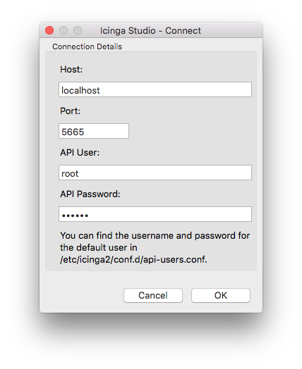
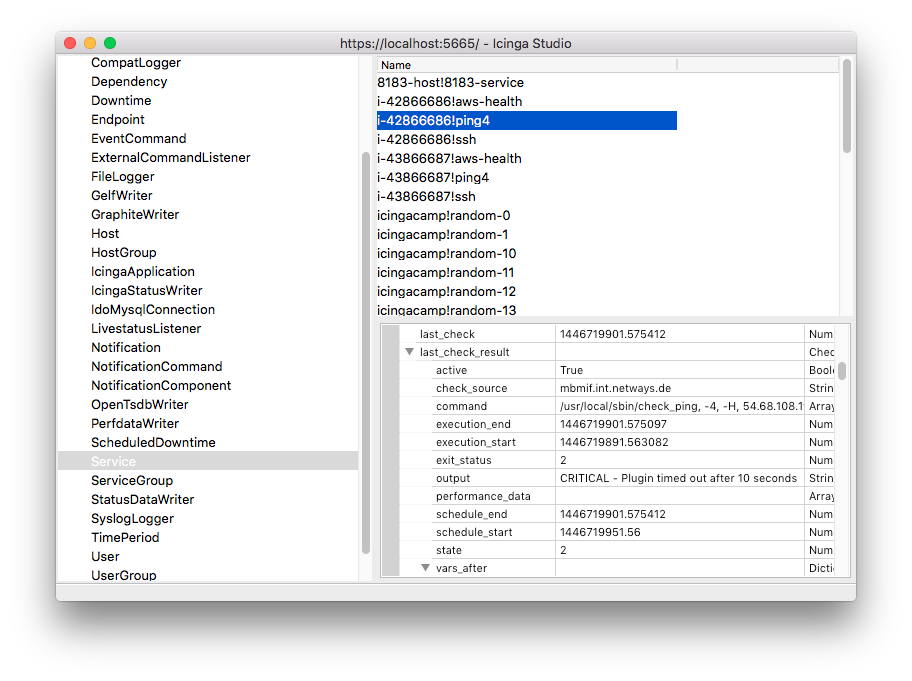

#  Icinga 2 API

##  Setting up the API

You can run the CLI command `icinga2 api setup` to set up certificates
and a new API user `root` with an auto-generated password in the
`/etc/icinga2/conf.d/api-users.conf` configuration file:

    # icinga2 api setup

Make sure to restart Icinga 2 to enable the changes you just made:

    # service icinga2 restart

The next chapter provides a quick overview of how you can use the API.

##  Introduction

The Icinga 2 API allows you to manage configuration objects
and resources in a simple, programmatic way using HTTP requests.

The URL endpoints are logically separated allowing you to easily
make calls to

* perform [actions](9-icinga2-api.md#icinga2-api-actions) (reschedule checks, etc.)
* query, create, modify and delete [config objects](9-icinga2-api.md#icinga2-api-config-objects)
* [manage configuration packages](9-icinga2-api.md#icinga2-api-config-management)
* subscribe to [event streams](9-icinga2-api.md#icinga2-api-event-streams)

###  Requests

Any tool capable of making HTTP requests can communicate with
the API, for example [curl](http://curl.haxx.se).

Requests are only allowed to use the HTTPS protocol so that
traffic remains encrypted.

By default the Icinga 2 API listens on port `5665` which is shared with
the cluster stack. The port can be changed by setting the `bind_port` attribute
in the [ApiListener](6-object-types.md#objecttype-apilistener)
configuration object in the `/etc/icinga2/features-available/api.conf`
file.

Supported request methods:

  Method | Usage
  -------|--------
  GET    | Retrieve information about configuration objects. Any request using the GET method is read-only and does not affect any objects.
  POST   | Update attributes of a specified configuration object.
  PUT    | Create a new object. The PUT request must include all attributes required to create a new object.
  DELETE | Remove an object created by the API. The DELETE method is idempotent and does not require any check if the object actually exists.

All requests apart from `GET` require that the following `Accept` header is set:

    Accept: application/json

Each URL is prefixed with the API version (currently "/v1").

###  HTTP Statuses

The API will return standard [HTTP statuses](https://www.ietf.org/rfc/rfc2616.txt)
including error codes.

When an error occurs, the response body will contain additional information
about the problem and its source.

A status code between 200 and 299 generally means that the request was
successful.

Return codes within the 400 range indicate that there was a problem with the
request. Either you did not authenticate correctly, you are missing the authorization
for your requested action, the requested object does not exist or the request
was malformed.

A status in the range of 500 generally means that there was a server-side problem
and Icinga 2 is unable to process your request.

###  Responses

Successful requests will send back a response body containing a `results`
list. Depending on the number of affected objects in your request, the
`results` list may contain more than one entry.

The output will be sent back as a JSON object:

    {
        "results": [
            {
                "code": 200.0,
                "status": "Object was created."
            }
        ]
    }

> **Note**
>
> Future versions of Icinga 2 might set additional fields. Your application
> should gracefully handle fields it is not familiar with, for example by
> ignoring them.

###  Request Method Override

`GET` requests do not allow to send a request body. In case you cannot pass everything as URL parameters (e.g. complex filters or JSON-encoded dictionaries) you can use the `X-HTTP-Method-Override` header. This comes in handy when you are using HTTP proxies disallowing `PUT` or `DELETE` requests too.

Query an existing object by sending a `POST` request with `X-HTTP-Method-Override: GET` as request header:

    $ curl -k -s -u 'root:icinga' -H 'X-HTTP-Method-Override: GET' -X POST 'https://localhost:5665/v1/objects/hosts'

Delete an existing object by sending a `POST` request with `X-HTTP-Method-Override: DELETE` as request header:

    $ curl -k -s -u 'root:icinga' -H 'X-HTTP-Method-Override: DELETE' -X POST 'https://localhost:5665/v1/objects/hosts/icinga.org'

###  Authentication

There are two different ways for authenticating against the Icinga 2 API:

* username and password using HTTP basic auth
* X.509 certificate

In order to configure a new API user you'll need to add a new [ApiUser](6-object-types.md#objecttype-apiuser)
configuration object. In this example `root` will be the basic auth username
and the `password` attribute contains the basic auth password.

    # vim /etc/icinga2/conf.d/api-users.conf

    object ApiUser "root" {
      password = "icinga"
    }

Alternatively you can use X.509 client certificates by specifying the `client_cn`
the API should trust. The X.509 certificate has to be signed by the CA certificate
that is configured in the [ApiListener](6-object-types.md#objecttype-apilistener) object.

    # vim /etc/icinga2/conf.d/api-users.conf

    object ApiUser "root" {
      client_cn = "CertificateCommonName"
    }

An `ApiUser` object can have both authentication methods configured.

You can test authentication by sending a GET request to the API:

    $ curl -k -s -u root:icinga 'https://localhost:5665/v1'

In case you get an error message make sure to check the API user credentials.

When using client certificates for authentication you'll need to pass your client certificate
and private key to the curl call:

    $ curl -k --cert icinga2-node1.localdomain.crt --key icinga2-node1.localdomain.key 'https://icinga2-node1.localdomain:5665/v1/status'

In case of an error make sure to verify the client certificate and CA.

The curl parameter `-k` disables certificate verification and should therefore
only be used for testing. In order to securely check each connection you'll need to
specify the trusted CA certificate using the curl parameter`--cacert`:

    $ curl -u root:icinga --cacert ca.crt 'icinga2.node1.localdomain:5665/v1'

Read the next chapter on [API permissions](9-icinga2-api.md#icinga2-api-permissions)
in order to configure authorization settings for your newly created API user.

###  Permissions

By default an API user does not have any permissions to perform
actions on the [URL endpoints](9-icinga2-api.md#icinga2-api-url-endpoints).

Permissions for API users must be specified in the `permissions` attribute
as array. The array items can be a list of permission strings with wildcard
matches.

Example for an API user with all permissions:

    permissions = [ "*" ]

Note that you can use wildcards. Here's another example that only allows the user
to perform read-only object queries for hosts and services:

    permissions = [ "objects/query/Host", "objects/query/Service" ]

You can also further restrict permissions by specifying a filter expression. The
filter expression has to be a [lambda function](18-language-reference.md#nullary-lambdas)
which must return a boolean value.

The following example allows the API user to query all hosts and services which have a
custom attribute `os` that matches the regular expression `^Linux`.

    permissions = [
      {
        permission = "objects/query/Host"
        filter = {{ regex("^Linux", host.vars.os) }}
      },
      {
        permission = "objects/query/Service"
        filter = {{ regex("^Linux", service.vars.os) }}
      }
    ]

More information about filters can be found in the [filters](#9-icinga2-api.md#icinga2-api-filters) chapter.

Available permissions for specific URL endpoints:

  Permissions                   | URL Endpoint  | Supports Filters
  ------------------------------|---------------|-----------------
  actions/&lt;action&gt;        | /v1/actions   | Yes
  config/query                  | /v1/config    | No
  config/modify                 | /v1/config    | No
  objects/query/&lt;type&gt;    | /v1/objects   | Yes
  objects/create/&lt;type&gt;   | /v1/objects   | No
  objects/modify/&lt;type&gt;   | /v1/objects   | Yes
  objects/delete/&lt;type&gt;   | /v1/objects   | Yes
  status/query/&lt;type&gt;     | /v1/status    | Yes
  events/&lt;type&gt;           | /v1/events    | No
  console/execute-script        | /v1/console   | No
  console/auto-complete-script  | /v1/console   | No

The required actions or types can be replaced by using a wildcard match ("*").

###  Parameters

Depending on the request method there are two ways of
passing parameters to the request:

* JSON object as request body (all request methods other than `GET`)
* Query string as URL parameter (all request methods)

Reserved characters by the HTTP protocol must be [URL-encoded](https://en.wikipedia.org/wiki/Percent-encoding)
as query string, e.g. a space character becomes `%20`.

Example for a URL-encoded query string:

    /v1/objects/hosts?filter=match(%22icinga2-node1.localdomain*%22,host.name)&attrs=host.name&attrs=host.state

Here are the exact same query parameters as a JSON object:

    { "filter": "match(\"icinga2-node1.localdomain*\",host.name)", "attrs": [ "host.name", "host.state" ] }

###  Filters

####  Simple Filters

By default actions and queries operate on all objects unless further restricted by the user. For
example, the following query returns all `Host` objects:

    https://localhost:5665/v1/objects/hosts

If you're only interested in a single object you can limit the output to that object by specifying its name:

    https://localhost:5665/v1/objects/hosts?host=localhost

The name of the URL parameter is the lower-case version of the type the query applies to. For
example, for `Host` objects the URL parameter therefore is `host`, for `Service` objects it is
`service` and so on.

You can also specify multiple objects:

    https://localhost:5665/v1/objects/hosts?hosts=first-host&hosts=second-host 

Again - like in the previous example - the name of the URL parameter is the lower-case version of the type. However, because we're specifying multiple objects here the **plural form** of the type is used.

When specifying names for objects which have composite names like for example services the
full name has to be used:

    https://localhost:5665/v1/objects/services?service=localhost!ping6

The full name of an object can be obtained by looking at the `__name` attribute.

####  Advanced Filters

Most of the information provided in this chapter applies to both permission filters (as used when
configuring `ApiUser` objects) and filters specified in queries.

Advanced filters allow users to filter objects using lambda expressions. The syntax for these filters is the same like for [apply rule expressions](3-monitoring-basics.md#using-apply-expressions).

> **Note**
>
> Filters used as URL parameter must be URL-encoded. The following examples
> are **not URL-encoded** for better readability.

Example matching all services in NOT-OK state:

    https://localhost:5665/v1/objects/services?filter=service.state!=ServiceOK

Example matching all hosts by name:

    https://localhost:5665/v1/objects/hosts?filter=match("icinga2-node1.localdomain*",host.name)

Example for all hosts which are in the host group `linux-servers`:

    https://localhost:5665/v1/objects/hosts?filter="linux-servers" in host.groups

User-specified filters are run in a sandbox environment which ensures that filters cannot
modify Icinga's state, for example object attributes or global variables.

When querying objects of a specific type the filter expression is evaluated for each object
of that type. The object is made available to the filter expression as a variable whose name
is the lower-case version of the object's type name.

For example when querying objects of type `Host` the variable in the filter expression is named
`host`. Additionally related objects such as the host's check command are also made available
(e.g., via the `check_command` variable).

The object is also made available via the `obj` variable. This makes it easier to build
filters which can be used for more than one object type (e.g., for permissions).

Some queries can be performed for more than just one object type. One example is the 'reschedule-check'
action which can be used for both hosts and services. When using advanced filters you will also have to specify the
type using the `type` parameter:

    $ curl -k -s -u root:icinga -H 'Accept: application/json' -X POST "https://localhost:5665/v1/actions/reschedule-check \
    -d '{ "type": "Service", "filter": "service.name==\"ping6\"" }' | python -m json.tool

When building filters you have to ensure that values such as
`"linux-servers"` are escaped properly according to the rules of the Icinga 2 configuration
language.

To make using the API in scripts easier you can use the `filter_vars` attribute to specify
variables which should be made available to your filter expression. This way you don't have
to worry about escaping values:

    $ curl -k -s -u 'root:icinga' -H 'X-HTTP-Method-Override: GET' -X POST 'https://localhost:5665/v1/objects/hosts' \
    -d '{ "filter": "host.vars.os == os", "filter_vars": { "os": "Linux" } }'

> **Note**
>
> We're using X-HTTP-Method-Override here because the HTTP specification does
> not allow message bodies for GET requests.

The `filters_vars` attribute can only be used inside the request body, but not as
a URL parameter because there is no way to specify a dictionary in a URL.

###  URL Endpoints

The Icinga 2 API provides multiple URL endpoints:

  URL Endpoints | Description
  --------------|--------------
  /v1/actions   | Endpoint for running specific [API actions](9-icinga2-api.md#icinga2-api-actions).
  /v1/events    | Endpoint for subscribing to [API events](9-icinga2-api.md#icinga2-api-actions).
  /v1/status    | Endpoint for receiving the global Icinga 2 [status and statistics](9-icinga2-api.md#icinga2-api-status).
  /v1/objects   | Endpoint for querying, creating, modifying and deleting [config objects](9-icinga2-api.md#icinga2-api-config-objects).
  /v1/config    | Endpoint for [managing configuration modules](9-icinga2-api.md#icinga2-api-config-management).
  /v1/types     | Endpoint for listing Icinga 2 configuration object types and their attributes.
  /v1/console   | Endpoint for evaluating arbitrary expressions. Used by the [Icinga 2 console](9-icinga2-api.md#icinga2-api-clients-cli-console).

Please check the respective sections for detailed URL information and parameters.

##  Actions

There are several actions available for Icinga 2 provided by the `/v1/actions`
URL endpoint. You can run actions by sending a `POST` request.

In case you have been using the [external commands](15-features.md#external-commands)
in the past, the API actions provide a similar interface with filter
capabilities for some of the more common targets which do not directly change
the configuration.

All actions return a 200 `OK` or an appropriate error code for each
action performed on each object matching the supplied filter.

Actions which affect the Icinga Application itself such as disabling
notification on a program-wide basis must be applied by updating the
[IcingaApplication object](9-icinga2-api.md#icinga2-api-config-objects)
called `app`.

    $ curl -k -s -u root:icinga -H 'Accept: application/json' -X POST 'https://localhost:5665/v1/objects/icingaapplications/app' -d '{ "attrs": { "enable_notifications": false } }'

###  process-check-result

Process a check result for a host or a service.

Send a `POST` request to the URL endpoint `/v1/actions/process-check-result`.

  Parameter         | Type         | Description
  ------------------|--------------|--------------
  exit\_status      | integer      | **Required.** For services: 0=OK, 1=WARNING, 2=CRITICAL, 3=UNKNOWN, for hosts: 0=OK, 1=CRITICAL.
  plugin\_output    | string       | **Required.** The plugins main output. Does **not** contain the performance data.
  performance\_data | string array | **Optional.** The performance data.
  check\_command    | string array | **Optional.** The first entry should be the check commands path, then one entry for each command line option followed by an entry for each of its argument.
  check\_source     | string       | **Optional.** Usually the name of the `command_endpoint`

In addition to these parameters a [filter](9-icinga2-api.md#icinga2-api-filters) must be provided. The valid types for this action are `Host` and `Service`.

Example:

    $ curl -k -s -u root:icinga -H 'Accept: application/json' -X POST 'https://localhost:5665/v1/actions/process-check-result?service=localhost!ping6' \
    -d '{ "exit_status": 2, "plugin_output": "PING CRITICAL - Packet loss = 100%", "performance_data": [ "rta=5000.000000ms;3000.000000;5000.000000;0.000000", "pl=100%;80;100;0" ], "check_source": "icinga2-node1.localdomain" }' | python -m json.tool

    {
        "results": [
            {
                "code": 200.0,
                "status": "Successfully processed check result for object 'localhost!ping6'."
            }
        ]
    }

###  reschedule-check

Reschedule a check for hosts and services. The check can be forced if required.

Send a `POST` request to the URL endpoint `/v1/actions/reschedule-check`.

  Parameter    | Type      | Description
  -------------|-----------|--------------
  next\_check  | timestamp | **Optional.** The next check will be run at this time. If omitted the current time is used.
  force\_check | boolean   | **Optional.** Defaults to `false`. If enabled the checks are executed regardless of time period restrictions and checks being disabled per object or on a global basis.

In addition to these parameters a [filter](9-icinga2-api.md#icinga2-api-filters) must be provided. The valid types for this action are `Host` and `Service`.

The example reschedules all services with the name "ping6" to immediately perform a check
(`next_check` default), ignoring any time periods or whether active checks are
allowed for the service (`force_check=true`).

    $ curl -k -s -u root:icinga -H 'Accept: application/json' -X POST "https://localhost:5665/v1/actions/reschedule-check \
    -d '{ "type": "Service", "filter": "service.name==\"ping6\"", "force_check": true }' | python -m json.tool

    {
        "results": [
            {
                "code": 200.0,
                "status": "Successfully rescheduled check for object 'localhost!ping6'."
            }
        ]
    }

###  send-custom-notification

Send a custom notification for hosts and services. This notification
type can be forced being sent to all users.

Send a `POST` request to the URL endpoint `/v1/actions/send-custom-notification`.

  Parameter | Type    | Description
  ----------|---------|--------------
  author    | string  | **Required.** Name of the author, may be empty.
  comment   | string  | **Required.** Comment text, may be empty.
  force     | boolean | **Optional.** Default: false. If true, the notification is sent regardless of downtimes or whether notifications are enabled or not.

In addition to these parameters a [filter](9-icinga2-api.md#icinga2-api-filters) must be provided. The valid types for this action are `Host` and `Service`.

Example for a custom host notification announcing a global maintenance to
host owners:

    $ curl -k -s -u root:icinga -H 'Accept: application/json' -X POST 'https://localhost:5665/v1/actions/send-custom-notification' \
    -d '{ "type": "Host", "author": "icingaadmin", "comment": "System is going down for maintenance", "force": true }' | python -m json.tool

    {
        "results": [
            {
                "code": 200.0,
                "status": "Successfully sent custom notification for object 'host0'."
            },
            {
                "code": 200.0,
                "status": "Successfully sent custom notification for object 'host1'."
            }
    }

###  delay-notification

Delay notifications for a host or a service.
Note that this will only have an effect if the service stays in the same problem
state that it is currently in. If the service changes to another state, a new
notification may go out before the time you specify in the `timestamp` argument.

Send a `POST` request to the URL endpoint `/v1/actions/delay-notification`.

  Parameter | Type      | Description
  ----------|-----------|--------------
  timestamp | timestamp | **Required.** Delay notifications until this timestamp.

In addition to these parameters a [filter](9-icinga2-api.md#icinga2-api-filters) must be provided. The valid types for this action are `Host` and `Service`.

Example:

    $ curl -k -s -u root:icinga -H 'Accept: application/json' -X POST 'https://localhost:5665/v1/actions/delay-notification' \
    -d '{ "type": "Service", "timestamp": 1446389894 }' | python -m json.tool

    {
        "results": [
            {
                "code": 200.0,
                "status": "Successfully delayed notifications for object 'host0!service0'."
            },
            {
                "code": 200.0,
                "status": "Successfully delayed notifications for object 'host1!service1'."
            }
    }

###  acknowledge-problem

Allows you to acknowledge the current problem for hosts or services. By
acknowledging the current problem, future notifications (for the same state if `sticky` is set to `false`)
are disabled.

Send a `POST` request to the URL endpoint `/v1/actions/acknowledge-problem`.

  Parameter | Type      | Description
  ----------|-----------|--------------
  author    | string    | **Required.** Name of the author, may be empty.
  comment   | string    | **Required.** Comment text, may be empty.
  expiry    | timestamp | **Optional.** If set the acknowledgement will vanish after this timestamp.
  sticky    | boolean   | **Optional.** If `true`, the default, the acknowledgement will remain until the service or host fully recovers.
  notify    | boolean   | **Optional.** If `true` a notification will be sent out to contacts to indicate this problem has been acknowledged. The default is false.

In addition to these parameters a [filter](9-icinga2-api.md#icinga2-api-filters) must be provided. The valid types for this action are `Host` and `Service`.

The following example acknowledges all services which are in a hard critical state and sends out
a notification for them:

    $ curl -k -s -u root:icinga -H 'Accept: application/json' -X POST 'https://localhost:566tions/acknowledge-problem?type=Service&filter=service.state==2&service.state_type=1' \
    -d '{ "author": "icingaadmin", "comment": "Global outage. Working on it.", "notify": true }' | python -m json.tool

    {
        "results": [
            {
                "code": 200.0,
                "status": "Successfully acknowledged problem for object 'i-42866686!ping4'."
            },
            {
                "code": 200.0,
                "status": "Successfully acknowledged problem for object 'i-43866687!ping4'."
            }
    }

###  remove-acknowledgement

Removes the acknowledgements for services or hosts. Once the acknowledgement has
been removed notifications will be sent out again.

Send a `POST` request to the URL endpoint `/v1/actions/remove-acknowledgement`.

A [filter](9-icinga2-api.md#icinga2-api-filters) must be provided. The valid types for this action are `Host` and `Service`.

The example removes all service acknowledgements:

    $ curl -k -s -u root:icinga -H 'Accept: application/json' -X POST 'https://localhost:5665/v1/actions/remove-acknowledgement?type=Service' | python -m json.tool

    {
        "results": [
            {
                "code": 200.0,
                "status": "Successfully removed acknowledgement for object 'host0!service0'."
            },
            {
                "code": 200.0,
                "status": "Successfully removed acknowledgement for object 'i-42866686!aws-health'."
            }
    }

###  add-comment

Adds a `comment` from an `author` to services or hosts.

Send a `POST` request to the URL endpoint `/v1/actions/add-comment`.

  Parameter | Type   | Description
  ----------|--------|--------------
  author    | string | **Required.** name of the author, may be empty.
  comment   | string | **Required.** Comment text, may be empty.

In addition to these parameters a [filter](9-icinga2-api.md#icinga2-api-filters) must be provided. The valid types for this action are `Host` and `Service`.

The following example adds a comment for all `ping4` services:

    $ curl -k -s -u root:icinga -H 'Accept: application/json' -X POST 'https://localhost:5665/v1/actions/add-comment?type=Service&filter=service.name==%22ping4%22' -d '{ "author": "icingaadmin", "comment": "Troubleticket #123456789 opened." }' | python -m json.tool
    {
        "results": [
            {
                "code": 200.0,
                "legacy_id": 26.0,
                "name": "i-43866687!ping4!mbmif.int.netways.de-1446824161-0",
                "status": "Successfully added comment 'i-43866687!ping4!mbmif.int.netways.de-1446824161-0' for object 'i-43866687!ping4'."
            },
            {
                "code": 200.0,
                "legacy_id": 27.0,
                "name": "i-42866686!ping4!mbmif.int.netways.de-1446824161-1",
                "status": "Successfully added comment 'i-42866686!ping4!mbmif.int.netways.de-1446824161-1' for object 'i-42866686!ping4'."
            }
        ]
    }

###  remove-all-comments

Removes all comments for services or hosts.

Send a `POST` request to the URL endpoint `/v1/actions/remove-all-comments`.

A [filter](9-icinga2-api.md#icinga2-api-filters) must be provided. The valid types for this action are `Host` and `Service`.

The following example removes all comments from all services:

    $ curl -k -s -u root:icinga -H 'Accept: application/json' -X POST 'https://localhost:5665/v1/actions/remove-all-comments?type=Service' | python -m json.tool

    {
        "results": [
            {
                "code": 200.0,
                "status": "Successfully removed comments for object 'i-42866686!aws-health'."
            },
            {
                "code": 200.0,
                "status": "Successfully removed comments for object 'i-43866687!aws-health'."
            }
    }

###  remove-comment

Remove the comment using its `name` attribute , returns `OK` if the
comment did not exist.
**Note**: This is **not** the legacy ID but the comment name returned by
Icinga 2 when [adding a comment](9-icinga2-api.md#icinga2-api-actions-add-comment).

Send a `POST` request to the URL endpoint `/v1/actions/remove-comment`.

  Parameter   | Type    | Description
  ------------|---------|--------------
  name        | string  | **Required.** Name of the comment to remove.

Does not support a target type or filters.

Example:

    $ curl -k -s -u root:icinga -H 'Accept: application/json' -X POST 'https://localhost:5665/v1/actions/remove-comment?name=i-43866687!ping4!mbmif.int.netways.de-1446824161-0' | python -m json.tool
    {
        "results": [
            {
                "code": 200.0,
                "status": "Successfully removed comment 'i-43866687!ping4!mbmif.int.netways.de-1446824161-0'."
            }
        ]
    }

###  schedule-downtime

Schedule a downtime for hosts and services.

Send a `POST` request to the URL endpoint `/v1/actions/schedule-downtime`.

  Parameter   | Type      | Description
  ------------|-----------|--------------
  start\_time | timestamp | **Required.** Timestamp marking the beginning of the downtime.
  end\_time   | timestamp | **Required.** Timestamp marking the end of the downtime.
  duration    | integer   | **Required.** Duration of the downtime in seconds if `fixed` is set to false.
  fixed       | boolean   | **Optional.** Defaults to `false`. If true the downtime is `fixed` otherwise `flexible`. See [downtimes](5-advanced-topics.md#downtimes) for more information.
  trigger\_name | string   | **Optional.** Sets the trigger for a triggered downtime. See [downtimes](5-advanced-topics.md#downtimes) for more information on triggered downtimes.

In addition to these parameters a [filter](9-icinga2-api.md#icinga2-api-filters) must be provided. The valid types for this action are `Host` and `Service`.

Example:

    $ curl -k -s -u root:icinga -H 'Accept: application/json' -X POST 'https://localhost:5665/v1/actions/schedule-downtime?type=Service&filter=service.name==%22ping4%22' -d '{ "start_time": 1446388806, "end_time": 1446389806, "duration": 1000, "author": "icingaadmin", "comment": "IPv4 network maintenance" }' | python -m json.tool
    {
        "results": [
            {
                "code": 200.0,
                "legacy_id": 2.0,
                "name": "i-42866686!ping4!mbmif.int.netways.de-1446822004-0",
                "status": "Successfully scheduled downtime 'i-42866686!ping4!mbmif.int.netways.de-1446822004-0' for object 'i-42866686!ping4'."
            },
            {
                "code": 200.0,
                "legacy_id": 3.0,
                "name": "i-43866687!ping4!mbmif.int.netways.de-1446822004-1",
                "status": "Successfully scheduled downtime 'i-43866687!ping4!mbmif.int.netways.de-1446822004-1' for object 'i-43866687!ping4'."
            }
        ]
    }

###  remove-all-downtimes

Removes all downtimes for services or hosts.

Send a `POST` request to the URL endpoint `/v1/actions/remove-all-downtimes`.

A [filter](9-icinga2-api.md#icinga2-api-filters) must be provided. The valid types for this action are `Host` and `Service`.

The following example removes all downtimes for all `ping4` services:

    $ curl -k -s -u root:icinga -H 'Accept: application/json' -X POST 'https://localhost:5665/v1/actions/remove-all-downtimes?type=Service&filter=service.name==%22ping4%22' | python -m json.tool

    {
        "results": [
            {
                "code": 200.0,
                "status": "Successfully removed downtimes for object 'i-42866686!ping4'."
            },
            {
                "code": 200.0,
                "status": "Successfully removed downtimes for object 'i-43866687!ping4'."
            }
        ]
    }

###  remove-downtime

Remove the downtime using its `name` attribute , returns `OK` if the
downtime did not exist.
**Note**: This is **not** the legacy ID but the downtime name returned by
Icinga 2 when [scheduling a downtime](9-icinga2-api.md#icinga2-api-actions-schedule-downtime).

Send a `POST` request to the URL endpoint `/v1/actions/remove-downtime`.

  Parameter    | Type    | Description
  -------------|---------|--------------
  name         | string  | **Required.** Name of the downtime to remove.

Does not support a target type or filter.

Example:

    $ curl -k -s -u root:icinga -H 'Accept: application/json' -X POST 'https://localhost:5665/v1/actions/remove-downtime?name=i-43866687!ping4!mbmif.int.netways.de-1446822004-1' | python -m json.tool
    {
        "results": [
            {
                "code": 200.0,
                "status": "Successfully removed downtime 'i-43866687!ping4!mbmif.int.netways.de-1446822004-1'."
            }
        ]
    }

###  shutdown-process

Shuts down Icinga2. May or may not return.

Send a `POST` request to the URL endpoint `/v1/actions/shutdown-process`.

This action does not support a target type or filter.

Example:

    $ curl -k -s -u root:icinga -H 'Accept: application/json' -X POST 'https://localhost:5665/v1/actions/shutdown-process' | python -m json.tool

    {
        "results": [
            {
                "code": 200.0,
                "status": "Shutting down Icinga 2."
            }
        ]
    }

###  restart-process

Restarts Icinga2. May or may not return.

Send a `POST` request to the URL endpoint `/v1/actions/restart-process`.

This action does not support a target type or filter.

Example:

    $ curl -k -s -u root:icinga -H 'Accept: application/json' -X POST 'https://localhost:5665/v1/actions/restart-process' | python -m json.tool

    {
        "results": [
            {
                "code": 200.0,
                "status": "Restarting Icinga 2."
            }
        ]
    }

##  Event Streams

You can subscribe to event streams by sending a `POST` request to the URL endpoint `/v1/events`.
The following parameters need to be specified (either as URL parameters or in a JSON-encoded message body):

  Parameter  | Type         | Description
  -----------|--------------|-------------
  types      | string array | **Required.** Event type(s). Multiple types as URL parameters are supported.
  queue      | string       | **Required.** Unique queue name. Multiple HTTP clients can use the same queue as long as they use the same event types and filter.
  filter     | string       | **Optional.** Filter for specific event attributes using [filter expressions](9-icinga2-api.md#icinga2-api-filters).

###  Event Stream Types

The following event stream types are available:

  Type                   | Description
  -----------------------|--------------
  CheckResult            | Check results for hosts and services.
  StateChange            | Host/service state changes.
  Notification           | Notification events including notified users for hosts and services.
  AcknowledgementSet     | Acknowledgement set on hosts and services.
  AcknowledgementCleared | Acknowledgement cleared on hosts and services.
  CommentAdded           | Comment added for hosts and services.
  CommentRemoved         | Comment removed for hosts and services.
  DowntimeAdded          | Downtime added for hosts and services.
  DowntimeRemoved        | Downtime removed for hosts and services.
  DowntimeTriggered      | Downtime triggered for hosts and services.

Note: Each type requires [api permissions](9-icinga2-api.md#icinga2-api-permissions)
being set.

Example for all downtime events:

    &types=DowntimeAdded&types=DowntimeRemoved&types=DowntimeTriggered

###  Event Stream Filter

Event streams can be filtered by attributes using the prefix `event.`.

Example for the `CheckResult` type with the `exit_code` set to `2`:

    &types=CheckResult&filter=event.check_result.exit_status==2

Example for the `CheckResult` type with the service matching the string "random":

    &types=CheckResult&filter=match%28%22random*%22,event.service%29

###  Event Stream Response

The event stream response is separated with new lines. The HTTP client
must support long-polling and HTTP/1.1. HTTP/1.0 is not supported.

Example:

    $ curl -k -s -u root:icinga -H 'Accept: application/json' -X POST 'https://localhost:5665/v1/events?queue=michi&types=CheckResult&filter=event.check_result.exit_status==2'

    {"check_result":{ ... },"host":"www.icinga.org","service":"ping4","timestamp":1445421319.7226390839,"type":"CheckResult"}
    {"check_result":{ ... },"host":"www.icinga.org","service":"ping4","timestamp":1445421324.7226390839,"type":"CheckResult"}
    {"check_result":{ ... },"host":"www.icinga.org","service":"ping4","timestamp":1445421329.7226390839,"type":"CheckResult"}

##  Status and Statistics

Send a `POST` request to the URL endpoint `/v1/status` for retrieving the
global status and statistics.

Contains a list of sub URL endpoints which provide the status and statistics
of available and enabled features. Any filters are ignored.

Example for the main URL endpoint `/v1/status`:

    $ curl -k -s -u root:icinga 'https://localhost:5665/v1/status' | python -m json.tool
    {
        "results": [
            {
                "name": "ApiListener",
                "perfdata": [ ... ],
                "status": [ ... ]
            },
            ...
            {
                "name": "IcingaAplication",
                "perfdata": [ ... ],
                "status": [ ... ]
            },
            ...
        ]
    }

`/v1/status` is always available as virtual status URL endpoint.
It provides all feature status information in a collected overview.

Example for the IcingaApplication URL endpoint `/v1/status/IcingaApplication`:

    $ curl -k -s -u root:icinga 'https://localhost:5665/v1/status/IcingaApplication' | python -m json.tool
    {
        "results": [
            {
                "perfdata": [],
                "status": {
                    "icingaapplication": {
                        "app": {
                            "enable_event_handlers": true,
                            "enable_flapping": true,
                            "enable_host_checks": true,
                            "enable_notifications": true,
                            "enable_perfdata": true,
                            "enable_service_checks": true,
                            "node_name": "icinga.org",
                            "pid": 59819.0,
                            "program_start": 1443019345.093372,
                            "version": "v2.3.0-573-g380a131"
                        }
                    }
                }
            }
        ]
    }

##  Config Objects

Provides methods to

* [create objects](9-icinga2-api.md#icinga2-api-config-objects-create)
* [query objects](9-icinga2-api.md#icinga2-api-config-objects-query)
* [modify objects](9-icinga2-api.md#icinga2-api-config-objects-modify)
* [delete objects](9-icinga2-api.md#icinga2-api-config-objects-delete)

available as [config object types](6-object-types.md#object-types):

  URL Endpoints                    | Description
  ---------------------------------|--------------
  /v1/objects/hosts                | Endpoint for [Host](6-object-types.md#objecttype-host) objects.
  /v1/objects/services             | Endpoint for [Service](6-object-types.md#objecttype-service) objects.
  /v1/objects/notifications        | Endpoint for [Notification](6-object-types.md#objecttype-notification) objects.
  /v1/objects/dependencies         | Endpoint for [Dependency](6-object-types.md#objecttype-dependency) objects.
  /v1/objects/users                | Endpoint for [User](6-object-types.md#objecttype-user) objects.
  /v1/objects/checkcommands        | Endpoint for [CheckCommand](6-object-types.md#objecttype-checkcommand) objects.
  /v1/objects/eventcommands        | Endpoint for [EventCommand](6-object-types.md#objecttype-eventcommand) objects.
  /v1/objects/notificationcommands | Endpoint for [NotificationCommand](6-object-types.md#objecttype-notificationcommand) objects.
  /v1/objects/hostgroups           | Endpoint for [HostGroup](6-object-types.md#objecttype-hostgroup) objects.
  /v1/objects/servicegroups        | Endpoint for [ServiceGroup](6-object-types.md#objecttype-servicegroup) objects.
  /v1/objects/usergroups           | Endpoint for [UserGroup](6-object-types.md#objecttype-usergroup) objects.
  /v1/objects/zones                | Endpoint for [Zone](6-object-types.md#objecttype-zone) objects.
  /v1/objects/endpoints            | Endpoint for [Endpoint](6-object-types.md#objecttype-endpoint) objects.
  /v1/objects/timeperiods          | Endpoint for [TimePeriod](6-object-types.md#objecttype-timeperiod) objects.
  /v1/objects/icingaapplications   | Endpoint for [IcingaApplication](6-object-types.md#objecttype-icingaapplication) objects.
  /v1/objects/comments             | Endpoint for [Comment](6-object-types.md#objecttype-comment) objects.
  /v1/objects/downtimes            | Endpoint for [Downtime](6-object-types.md#objecttype-downtime) objects.

###  API Objects and Cluster Config Sync

Newly created or updated objects can be synced throughout your
Icinga 2 cluster. Set the `zone` attribute to the zone this object
belongs to and let the API and cluster handle the rest.

Objects without a zone attribute are only synced in the same zone the Icinga instance belongs to.

> **Note**
>
> Cluster nodes must accept configuration for creating, modifying
> and deleting objects. Ensure that `accept_config` is set to `true`
> in the [ApiListener](6-object-types.md#objecttype-apilistener) object
> on each node.

If you add a new cluster instance, or reconnect an instance which has been offline
for a while, Icinga 2 takes care of the initial object sync for all objects
created by the API.

###  Querying Objects

Send a `GET` request to `/v1/objects/hosts` to list all host objects and
their attributes.

    $ curl -k -s -u root:icinga 'https://localhost:5665/v1/objects/hosts'

This works in a similar fashion for other [config objects](9-icinga2-api.md#icinga2-api-config-objects).

The following URL parameters can be added:

  Parameters | Description
  -----------|--------------
  attrs      | **Optional.** Query specific object attributes for this [object type](6-object-types.md#object-types).
  joins      | **Optional.** Join related object types and their attributes (`?joins=host` for the entire set, or selectively by `?joins=host.name`).
  meta       | **Optional.** Enable meta information using `?meta=used_by`. Defaults to disabled.

Example for the host `google.com` inside the URL:

    $ curl -k -s -u root:icinga 'https://localhost:5665/v1/objects/hosts/google.com'

You can select specific attributes by adding them as url parameters using `?attrs=...`. Multiple
attributes must be added one by one, e.g. `?attrs=address&attrs=name`.

    $ curl -k -s -u root:icinga 'https://localhost:5665/v1/objects/hosts/google.com?attrs=name&attrs=address' | python -m json.tool
    {
        "results": [
            {
                "attrs": {
                    "name": "google.com"
                    "address": "8.8.8.8"
                },
                "joins": {},
                "meta": {},
                "name": "google.com",
                "type": "Host"
            }
        ]
    }

####  Object Queries Result

Each response entry in the results array contains the following attributes:

  Attribute  | Type       | Description
  -----------|------------|--------------
  name       | string     | Full object name.
  type       | string     | Object type.
  attrs      | dictionary | Object attributes (can be filtered using the URL parameter `attrs`).
  joins      | dictionary | [Joined object types](9-icinga2-api.md#icinga2-api-config-objects-query-joins) as key, attributes as nested dictionary. Disabled by default.
  meta       | dictionary | Contains `used_by` object references. Disabled by default, enable it using `?meta=used_by` as URL parameter.

####  Object Queries and Joins

Icinga 2 knows about object relations, i.e. when querying service objects
the query handler will allow you to add the referenced host object and its
attributes to the result set inside the `joins` result attribute.

Add the following URL parameter to join all host attributes:

    ?joins=host

If you just want to join specific object attributes, selectively add them
as URL parameters:

    ?joins=host.name&joins=host.address

You can enable all default joins using

    ?all_joins=1

**Note**: Select your required attributes beforehand by passing them to your
request. The default result set might get huge.

Each joined object will use its own attribute name inside the `joins` response
attribute. There is an exception for multiple objects used in dependencies and zones.

  Object Type  | Object Relations (prefix name)
  -------------|---------------------------------
  Service      | host, notification, check\_command, event\_command
  Host         | notification, check\_command, event\_command
  Notification | host, service, command, period
  Dependency   | child\_host, child\_service, parent\_host, parent\_service, period
  User         | period
  Zones        | parent

In addition to these parameters a [filter](9-icinga2-api.md#icinga2-api-filters) may be provided.

Here's an example that retrieves all service objects for hosts which have had their `os` custom attribute set to `Linux`. The result set contains the `display_name` and `check_command` attributes for the service. The query also returns the host's `name` and `address` attribute via a join:

    $ curl -k -s -u root:icinga 'https://localhost:5665/v1/objects/services?attrs=display_name&attrs=check_command&joins=host.name&joins=host.address&filter=host.vars.os==%22Linux%22' | python -m json.tool

    {
        "results": [
            {
                "attrs": {
                    "check_command": "ping4",
                    "display_name": "ping4"
                },
                "joins": {
                    "host": {
                        "address": "54.149.27.119",
                        "name": "i-43866687"
                    }
                },
                "meta": {},
                "name": "i-43866687!ping4",
                "type": "Service"
            },
            {
                "attrs": {
                    "check_command": "ssh",
                    "display_name": "ssh"
                },
                "joins": {
                    "host": {
                        "address": "54.149.27.119",
                        "name": "i-43866687"
                    }
                },
                "meta": {},
                "name": "i-43866687!ssh",
                "type": "Service"
            }
        ]
    }

###  Creating Config Objects

New objects must be created by sending a PUT request. The following
parameters need to be passed inside the JSON body:

  Parameters | Description
  -----------|--------------
  name       | **Required.** Name of the newly created config object.
  templates  | **Optional.** Import existing configuration templates for this object type.
  attrs      | **Required.** Set specific object attributes for this [object type](6-object-types.md#object-types).

If attributes are of the Dictionary type, you can also use the indexer format. This might be necessary to only override specific custom variables and keep all other existing custom variables (e.g. from templates):

    "attrs": { "vars.os": "Linux" }

Example for creating the new host object `google.com`:

    $ curl -k -s -u root:icinga -H 'Accept: application/json' -X PUT 'https://localhost:5665/v1/objects/hosts/google.com' \
    -d '{ "templates": [ "generic-host" ], "attrs": { "address": "8.8.8.8", "check_command": "hostalive", "vars.os" : "Linux" } }' \
    | python -m json.tool
    {
        "results": [
            {
                "code": 200.0,
                "status": "Object was created."
            }
        ]
    }

If the configuration validation fails, the new object will not be created and the response body
contains a detailed error message. The following example is missing the `check_command` attribute
which is required for host objects:

    $ curl -k -s -u root:icinga -H 'Accept: application/json' -X PUT 'https://localhost:5665/v1/objects/hosts/google.com' \
    -d '{ "attrs": { "address": "8.8.8.8", "vars.os" : "Linux" } }' \
    | python -m json.tool
    {
        "results": [
            {
                "code": 500.0,
                "errors": [
                    "Error: Validation failed for object 'google.com' of type 'Host'; Attribute 'check_command': Attribute must not be empty."
                ],
                "status": "Object could not be created."
            }
        ]
    }

###  Modifying Objects

Existing objects must be modified by sending a `POST` request. The following
parameters need to be passed inside the JSON body:

  Parameters | Description
  -----------|--------------
  name       | **Optional.** If not specified inside the url, this is **Required.**.
  attrs      | **Required.** Set specific object attributes for this [object type](6-object-types.md#object-types).

If attributes are of the Dictionary type, you can also use the indexer format:

    "attrs": { "vars.os": "Linux" }

The following example updates the `address` attribute and the custom attribute `os` for the `google.com` host:

    $ curl -k -s -u root:icinga -H 'Accept: application/json' -X POST 'https://localhost:5665/v1/objects/hosts/google.com' \
    -d '{ "attrs": { "address": "8.8.4.4", "vars.os" : "Windows" } }' \
    | python -m json.tool
    {
        "results": [
            {
                "code": 200.0,
                "name": "google.com",
                "status": "Attributes updated.",
                "type": "Host"
            }
        ]
    }

###  Deleting Objects

You can delete objects created using the API by sending a `DELETE`
request.

  Parameters | Description
  -----------|--------------
  cascade    | **Optional.** Delete objects depending on the deleted objects (e.g. services on a host).

In addition to these parameters a [filter](9-icinga2-api.md#icinga2-api-filters) should be provided.

Example for deleting the host object `google.com`:

    $ curl -k -s -u root:icinga -H 'Accept: application/json' -X DELETE 'https://localhost:5665/v1/objects/hosts/google.com?cascade=1' | python -m json.tool
    {
        "results": [
            {
                "code": 200.0,
                "name": "google.com",
                "status": "Object was deleted.",
                "type": "Host"
            }
        ]
    }

##  Configuration Management

The main idea behind configuration management is to allow external applications
creating configuration packages and stages based on configuration files and
directory trees. This replaces any additional SSH connection and whatnot to
dump configuration files to Icinga 2 directly.
In case you are pushing a new configuration stage to a package, Icinga 2 will
validate the configuration asynchronously and populate a status log which
can be fetched in a separated request.

###  Create Config Package

Send a `POST` request to a new config package called `example-cmdb` in this example. This
will create a new empty configuration package.

    $ curl -k -s -u root:icinga -H 'Accept: application/json' -X POST https://localhost:5665/v1/config/packages/example-cmdb | python -m json.tool
    {
        "results": [
            {
                "code": 200.0,
                "package": "example-cmdb",
                "status": "Created package."
            }
        ]
    }

###  Create Configuration to Package Stage

Send a `POST` request to the URL endpoint `/v1/config/stages` including an existing
configuration package, e.g. `example-cmdb`.
The request body must contain the `files` attribute with the value being
a dictionary of file targets and their content.

The example below will create a new file called `test.conf` underneath the `conf.d`
directory populated by the sent configuration.
The Icinga 2 API returns the `package` name this stage was created for, and also
generates a unique name for the `package` attribute you'll need for later requests.

Note: This example contains an error (`chec_command`), do not blindly copy paste it.

    $ curl -k -s -u root:icinga -H 'Accept: application/json' -X POST -d '{ "files": { "conf.d/test.conf": "object Host \"cfg-mgmt\" { chec_command = \"dummy\" }" } }' https://localhost:5665/v1/config/stages/example-cmdb | python -m json.tool
    {
        "results": [
            {
                "code": 200.0,
                "package": "example-cmdb",
                "stage": "icinga2-node1.localdomain-1441625839-0",
                "status": "Created stage."
            }
        ]
    }

If the configuration fails, the old active stage will remain active.
If everything is successful, the new config stage is activated and live.
Older stages will still be available in order to have some sort of revision
system in place.

Icinga 2 automatically creates the following files in the main configuration package
stage:

  File        | Description
  ------------|--------------
  status      | Contains the [configuration validation](8-cli-commands.md#config-validation) exit code (everything else than 0 indicates an error).
  startup.log | Contains the [configuration validation](8-cli-commands.md#config-validation) output.

You can [fetch these files](9-icinga2-api.md#icinga2-api-config-management-fetch-config-package-stage-files) via API call
after creating a new stage.

###  List Configuration Packages and their Stages

List all config packages, their active stage and other stages.
That way you may iterate of all of them programmatically for
older revisions and their requests.

Sent a `GET` request to the URL endpoint `/v1/config/packages`.

The following example contains one configuration package `example-cmdb`.
The latter already has a stage created, but it is not active.

    $ curl -k -s -u root:icinga https://localhost:5665/v1/config/packages | python -m json.tool
    {
        "results": [
            {
                "active-stage": "",
                "name": "example-cmdb",
                "stages": [
                    "icinga2-node1.localdomain-1441625839-0"
                ]
            }
        ]
    }

###  List Configuration Packages and their Stages

Sent a `GET` request to the URL endpoint `/v1/config/stages` including the package
(`example-cmdb`) and stage (`icinga2-node1.localdomain-1441625839-0`) name.

    $ curl -k -s -u root:icinga https://localhost:5665/v1/config/stages/example-cmdb/icinga2-node1.localdomain-1441625839-0 | python -m json.tool
    {
        "results": [
    ...
            {
                "name": "startup.log",
                "type": "file"
            },
            {
                "name": "status",
                "type": "file"
            },
            {
                "name": "conf.d",
                "type": "directory"
            },
            {
                "name": "zones.d",
                "type": "directory"
            },
            {
                "name": "conf.d/test.conf",
                "type": "file"
            }
        ]
    }

###  Fetch Configuration Package Stage Files

Send a `GET` request to the URL endpoint `/v1/config/files` including
the package name, the stage name and the relative path to the file.
Note: You cannot use dots in paths.

You can fetch a [list of existing files](9-icinga2-api.md#icinga2-api-config-management-list-config-package-stage-files)
in a configuration stage and then specifically request their content.

The following example fetches the **erroneous** configuration inside `conf.d/test.conf`
for further analysis.

    $ curl -k -s -u root:icinga https://localhost:5665/v1/config/files/example-cmdb/icinga2-node1.localdomain-1441625839-0/conf.d/test.conf
    object Host "cfg-mgmt" { chec_command = "dummy" }

Note: The returned files are plain-text instead of JSON-encoded.

###  Configuration Package Stage Errors

Now that we don't have an active stage for `example-cmdb` yet seen [here](9-icinga2-api.md#icinga2-api-config-management-list-config-packages),
there must have been an error.

Fetch the `startup.log` file and check the config validation errors:

    $ curl -k -s -u root:icinga https://localhost:5665/v1/config/files/example-cmdb/imagine-1441133065-1/startup.log
    ...

    critical/config: Error: Attribute 'chec_command' does not exist.
    Location:
    /var/lib/icinga2/api/packages/example-cmdb/imagine-1441133065-1/conf.d/test.conf(1): object Host "cfg-mgmt" { chec_command = "dummy" }
                                                                                                           ^^^^^^^^^^^^^^^^^^^^^^

    critical/config: 1 error

The output is similar to the manual [configuration validation](8-cli-commands.md#config-validation).

##  API Clients

There are a couple of existing clients which can be used with the Icinga 2 API:

* [curl](http://curl.haxx.se)
* [console CLI command](9-icinga2-api.md#icinga2-api-clients-cli-console)
* [Icinga Studio](9-icinga2-api.md#icinga2-api-clients-icinga-studio)
* [Icinga Web 2 Director](https://dev.icinga.org/projects/icingaweb2-modules)

Demo cases:

* [Dashing](https://github.com/Icinga/dashing-icinga2)
* [AWS host creation/update/deletion](https://github.com/Icinga/aws-icinga2)

Additional [programmatic examples](9-icinga2-api.md#icinga2-api-clients-programmatic-examples)
will help you getting started using the Icinga 2 API in your environment.

###  Icinga Studio

Icinga Studio is a graphical application to query configuration objects provided by the API.

Please check the package repository of your distribution for available
packages.

> **Note**
> Icinga Studio does not currently support SSL certificate verification.

The Windows installer includes Icinga Studio already. You must additionally
install the [wxWidgets library](https://github.com/wxWidgets/wxWidgets/releases/download/v3.0.2/wxMSW-3.0.2-Setup.exe).

###  Console Command using the API

By default the [console CLI command](8-cli-commands.md#cli-command-console) evaluates expressions in a local interpreter, i.e. independently from your Icinga 2 daemon. Using the `--connect` parameter you can use the Icinga 2  console to evaluate expressions via the API.

> **Note**
> The console does not currently support SSL certificate verification.

Although the password can be specified in the URL process arguments on UNIX platforms are usually visible to other users (e.g. through `ps`). In order to securely specify the user credentials the console supports two environment variables:

  Environment variable | Description
  ---------------------|-------------
  ICINGA2_API_USERNAME | The API username.
  ICINGA2_API_PASSWORD | The API password.

Here's an example:

    $ ICINGA2_API_PASSWORD=icinga icinga2 console --connect 'https://root@localhost:5665/'
    Icinga 2 (version: v2.3.11-762-g1d327ac)
    <1> =>

Once connected you can inspect variables and execute other expressions by entering them at the prompt:

    <1> => var h = get_host("mbmif.int.netways.de")
    null
    <2> => h.last_check_result
    {
            active = true
            check_source = "mbmif.int.netways.de"
            command = [ "/usr/local/sbin/check_ping", "-H", "127.0.0.1", "-c", "5000,100%", "-w", "3000,80%" ]
            execution_end = 1446653527.174983
            execution_start = 1446653523.152673
            exit_status = 0.000000
            output = "PING OK - Packet loss = 0%, RTA = 0.11 ms"
            performance_data = [ "rta=0.114000ms;3000.000000;5000.000000;0.000000", "pl=0%;80;100;0" ]
            schedule_end = 1446653527.175133
            schedule_start = 1446653583.150000
            state = 0.000000
            type = "CheckResult"
            vars_after = {
                    attempt = 1.000000
                    reachable = true
                    state = 0.000000
                    state_type = 1.000000
            }
            vars_before = {
                    attempt = 1.000000
                    reachable = true
                    state = 0.000000
                    state_type = 1.000000
            }
    }
    <3> =>

You can use the `--eval` parameter to evaluate a single expression in batch mode. The output format for batch mode is JSON.

Here's an example that retrieves the command that was used by Icinga to check the `example-host` host:

    $ ICINGA2_API_PASSWORD=icinga icinga2 console --connect 'https://root@localhost:5665/' --eval 'get_host("example-host").last_check_result.command' | python -m json.tool
    [
        "/usr/local/sbin/check_ping",
        "-H",
        "127.0.0.1",
        "-c",
        "5000,100%",
        "-w",
        "3000,80%"
    ]

###  API Clients Programmatic Examples

####  Example API Client using Python

Example for **Python** using the `requests` and `json` module:

    # pip install requests
    # pip install json

    $ vim icinga2-api-example.py

    #!/usr/bin/env python

    import requests, json

    request_url = "https://localhost:5665/v1/status"
    headers = {"Accept": "application/json"}
    r = requests.get(request_url, headers=headers, auth=('root', 'icinga'), verify=False)

    print "Status code: " + str(r.status_code)
    print "Result: " + json.dumps(r.json())

    $ python icinga2-api-example.py

####  Example API Client using Ruby

Example for **Ruby** using the `rest_client` gem:

    # gem install rest_client

    $ vim icinga2-api-example.rb

    #!/usr/bin/ruby

    require 'rest_client'

    request_url = "https://localhost:5665/v1/status"
    options = { :user => "root", :password => "icinga", :verify_ssl => OpenSSL::SSL::VERIFY_NONE }
    headers = {"Accept" => "application/json"}
    r = RestClient::Resource.new(URI.encode(request_url), options)
    response = r.get(headers)

    puts "Status: " + response.code.to_s
    puts "Result: " + (JSON.pretty_generate JSON.parse(response.body))

    $ ruby icinga2-api-example.rb

A more detailed example can be found in the [Dashing demo](https://github.com/Icinga/dashing-icinga2).

####  Example API Client using PHP

Example for **PHP** using `curl`:

    $ vim icinga2-api-example.php

    #!/usr/bin/env php
    <?php
    $request_url = "https://localhost:5665/v1/status";
    $username = "root";
    $password = "icinga";
    $headers = array(
        'Accept: application/json'
    );

    $curl = curl_init();
    curl_setopt($curl, CURLOPT_URL, $request_url);
    curl_setopt($curl, CURLOPT_HTTPHEADER, $headers);
    curl_setopt($curl, CURLOPT_USERPWD, $username . ":" . $password);
    curl_setopt($curl, CURLOPT_RETURNTRANSFER, true);
    curl_setopt($curl, CURLOPT_SSL_VERIFYHOST, false);
    curl_setopt($curl, CURLOPT_SSL_VERIFYPEER, false);

    $response = curl_exec($curl);
    $code = curl_getinfo($curl, CURLINFO_HTTP_CODE);
    curl_close($curl);

    if ($code == 200) {
            $response = json_decode($response, true);
            print_r($response);
    } else {
            echo 'error ' . $code;
    }
    ?>

    $ php icinga2-api-example.php

####  Example API Client using Perl

Example for **Perl** using the `Rest::Client` module:

    # perl -MCPAN -e 'install REST::Client'
    # perl -MCPAN -e 'install JSON'
    # perl -MCPAN -e 'install MIME::Base64'

    $ vim icinga2-api-example.pl

    #!/usr/bin/env perl

    use REST::Client;
    use MIME::Base64;
    use JSON;

    $ENV{PERL_LWP_SSL_VERIFY_HOSTNAME}=0;

    $userpass = "root:icinga";
    my $client = REST::Client->new();
    $client->setHost("https://127.0.0.1:5665");
    $client->addHeader("Accept", "application/json");
    $client->addHeader("Authorization", "Basic ".encode_base64($userpass));
    $client->GET("/v1/status");

    print "Status: " . $client->responseCode() . "\n";
    print "Result: " . $client->responseContent() . "\n";

    $ perl icinga2-api-example.pl

